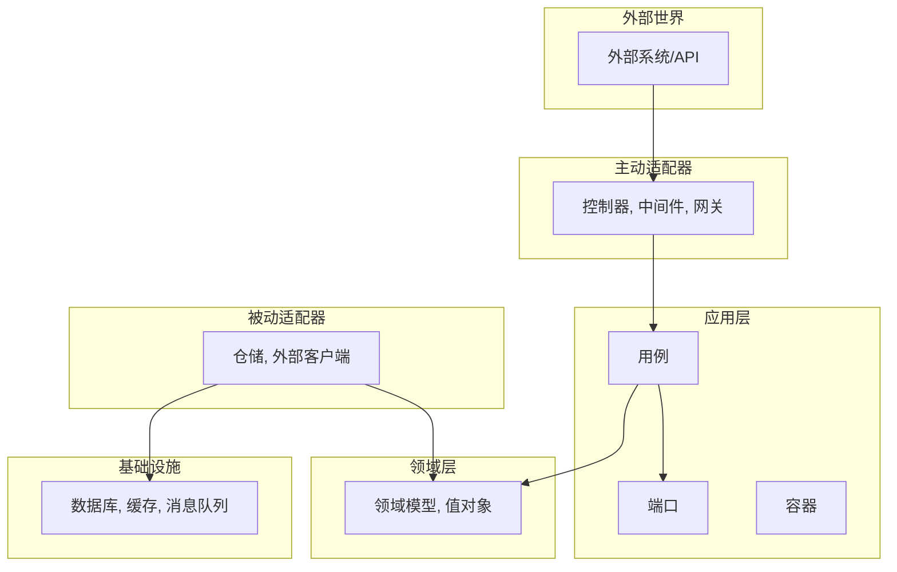
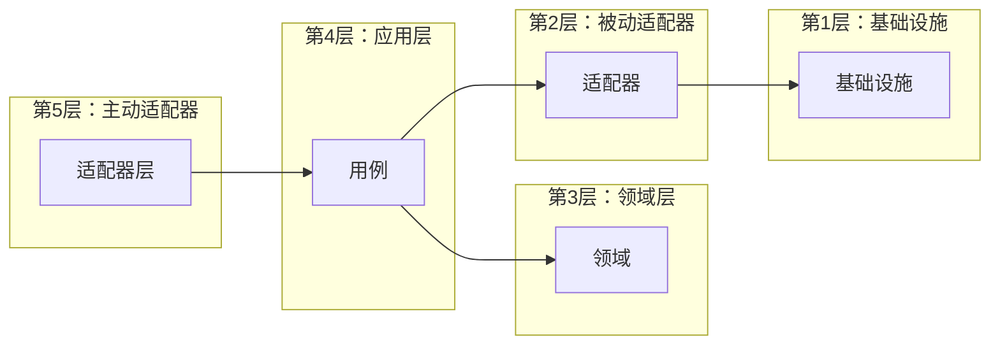
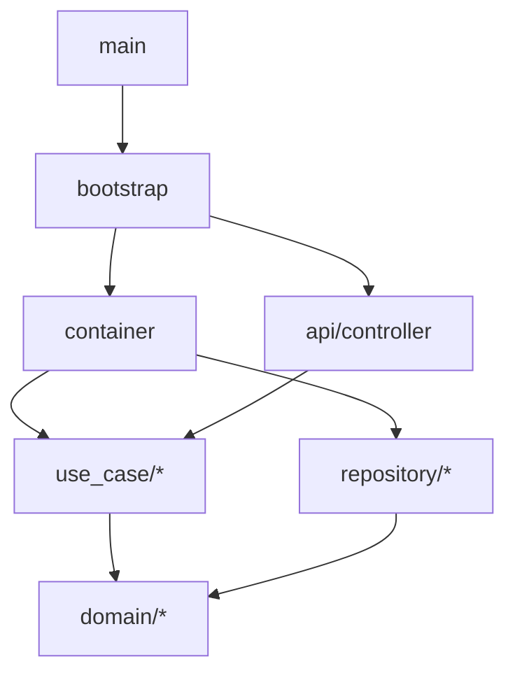

# 架构分析器

## 概述

此技能提供全面的软件架构分析框架，支持从多个维度对架构进行系统性评估。通过依赖可视化、架构合规性评估、设计模式评估和质量指标分析，实现对架构的深入理解。当用户请求架构审查、重构指导或需要理解系统结构和质量时使用此技能。

## 快速开始

执行完整的架构分析：

1. **探索代码库结构** - 使用 `search_file`、`search_content` 和 `list_files` 理解项目结构
2. **生成依赖图** - 创建多个粒度级别的 Mermaid 图表
3. **评估架构合规性** - 与 Explicit Architecture 原则进行对比
4. **评估设计模式** - 识别已使用/缺失的模式并评估实现质量
5. **分析代码质量** - 评估并发性、健壮性、扩展性、伸缩性
6. **生成建议** - 提供优先级的改进路线图

## 分析工作流

### 阶段 1：代码库探索

**目标**：理解项目结构和依赖关系

**步骤**：

1. **识别项目结构**
   - 使用适当深度的 `list_files` 列出所有包/模块
   - 使用模式 `^package\s+\w+` 搜索包声明
   - 识别层边界（应用层、领域层、基础设施层、表现层）

2. **映射依赖关系**
   - 使用模式 `^import\s+\(` 搜索导入语句
   - 使用模式 `^type\s+\w+\s+interface` 识别接口
   - 追踪层之间的数据流

3. **分析关键组件**
   - 定位领域模型、用例、仓储、适配器
   - 识别配置和启动逻辑
   - 查找依赖注入容器设置

**输出**：完整的包结构和依赖映射

---

### 阶段 2：依赖可视化

**目标**：生成展示包依赖关系的 Mermaid 图表

**需创建的图表**：

#### 2.1 整体架构视图



#### 2.2 分层依赖图



#### 2.3 模块依赖详情



**指导原则**：

- 整体视图使用 `graph TB`（自上而下）
- 分层视图使用 `graph LR`（自左而右）
- 将相关节点分组到 `subgraph` 部分
- 用箭头方向清晰标注依赖
- 包含所有主要包，不仅是导入

---

### 阶段 3：Explicit Architecture 合规性评估

**目标**：评估对 Explicit Architecture 原则的遵循程度

#### 3.1 核心原则评估

| 原则 | 定义 | 评估标准 |
| ---- | ---- | -------- |

| **依赖规则** | 依赖必须指向内部（从外层到内层） | 外层不依赖内层实现 |
| **领域独立性** | 领域层无外部依赖 | 领域层无框架/基础设施导入 |
| **用例驱动** | 应用层按业务意图组织 | 用例定义业务场景 |
| **接口隔离** | 端口/适配器分离业务与技术 | 存在清晰的接口边界 |

#### 3.2 合规性检查清单

**✅ 完全合规的指标**：

- 用例依赖接口而非实现
- 领域模型无基础设施依赖
- 适配器与核心逻辑清晰分离
- 一致应用依赖倒置

**⚠️ 部分合规的指标**：

- 部分用例直接依赖基础设施
- 手动依赖注入（可接受，但可改进）
- 领域层轻微污染（DTO 引用可接受）

**❌ 违规指标**：

- 领域层导入基础设施包
- 外层导入内层实现
- 应用逻辑直接依赖数据库/框架
- 无接口边界（直接具体依赖）

#### 3.3 常见违规与修复

##### 违规 1：领域层依赖基础设施**

```go
// ❌ 违规
package domain

import "myproject/infrastructure/database"

type User struct {
    db *gorm.DB  // 基础设施依赖
}
```

```go
// ✅ 修复
package domain

type User struct {
    ID   string
    Name string
}

// 应用层的仓储
package port

type UserRepository interface {
    Save(user *User) error
}
```

##### 违规 2：用例依赖具体实现**

```go
// ❌ 违规
package usecase

import "myproject/adapter/mysql"

type UserManager struct {
    userRepo *mysql.UserDAO  // 具体依赖
}
```

```go
// ✅ 修复
package usecase

import "myproject/port"

type UserManager struct {
    userRepo port.UserRepository  // 接口依赖
}
```

**输出**：合规性百分比及具体违规和修复方案

---

### 阶段 4：设计模式评估

**目标**：识别并评估架构设计模式

#### 4.1 模式检测矩阵

| 模式 | 检测标准 | 评估要点 |
| ---- | ---- | -------- |
| **六边形架构** | 清晰的端口/适配器分离 | 边界清晰度，依赖方向 |
| **依赖注入** | 存在容器/注入器 | 实现质量，可测试性 |
| **仓储模式** | 存在仓储接口 | 抽象层级，事务支持 |
| **工厂模式** | 存在工厂方法/模式 | 使用适当度 |
| **策略模式** | 存在策略接口 | 变体，可扩展性 |
| **观察者/发布订阅** | 存在事件/消息系统 | 解耦，异步处理 |
| **单例模式** | 存在全局实例模式 | 线程安全，可测试性 |

#### 4.2 模式评估评分

对于每个检测到的模式，提供：

**评分（1-5星）**：

- ⭐⭐⭐⭐⭐：优秀的实现
- ⭐⭐⭐⭐：良好但有小问题
- ⭐⭐⭐：可接受，有改进空间
- ⭐⭐：存在问题
- ⭐：实现较差

**评估标准**：

- 正确性：实现是否符合模式定义？
- 一致性：模式应用是否一致？
- 可测试性：模式是否支持测试？
- 可维护性：实现是否可维护？

**示例 - 单例模式评估**：

```go
// ⭐⭐ 评分：并发不安全
var instance *Client

func GetInstance() *Client {
    if instance == nil {  // 竞态条件！
        instance = NewClient()
    }
    return instance
}
```

```go
// ⭐⭐⭐⭐⭐ 评分：线程安全
var (
    instance *Client
    once     sync.Once
)

func GetInstance() *Client {
    once.Do(func() {
        instance = NewClient()
    })
    return instance
}
```

#### 4.3 缺失的模式

识别将改进架构的模式：

| 模式 | 推荐时机 | 收益 |
| ---- | ---- | ------ |
| **工厂模式** | 复杂的对象创建逻辑 | 集中创建，可测试性 |
| **建造者模式** | 有多个可选字段的对象 | 清晰的构造，可读性 |
| **装饰器模式** | 横切关注点（日志、缓存） | 关注点分离 |
| **CQRS** | 读写密集型工作负载 | 性能优化 |

**输出**：模式清单及评分和推荐

---

### 阶段 5：代码质量分析

**目标**：从四个维度评估代码质量

#### 5.1 并发性评估

**评估领域**：

| 领域 | 检查清单 | 良好实践 | 警示标志 |
| ---- | -------- | -------- | -------- |
| **并发模型** | Goroutine/线程，通道/队列 | 非阻塞 I/O，适当的同步 | 阻塞操作，全局可变状态 |
| **锁机制** | `sync.Mutex`，`sync.RWMutex`，原子操作 | 最小锁争用，无死锁 | 缺少锁，嵌套锁，长时间持锁 |
| **线程安全** | `sync.Once`，`sync.Map`，原子变量 | 不可变数据，适当隔离 | 竞态条件，不安全共享 |
| **异步处理** | 通道，futures，promises | 缓冲通道，优雅关闭 | Goroutine 泄漏，无界通道 |

**需检查的关键模式**：

1. **单例线程安全**：

```go
// ⚠️ 检查：单例是否线程安全？
var instance *Type
func GetInstance() *Type { ... }
```

1. **锁使用**：

```go
// ⚠️ 检查：正确的加锁/解锁，是否缺少 defer？
mu.Lock()
// ... 代码
mu.Unlock()
```

1. **Goroutine 泄漏**：

```go
// ⚠️ 检查：Goroutine 是否正常退出？
go func() {
    // 是否有退出通道？
}()
```

**评分指南**：

- ⭐⭐⭐⭐⭐：无竞态条件，适当的同步
- ⭐⭐⭐⭐：小问题，无严重错误
- ⭐⭐⭐：一些问题，可能在高负载下工作
- ⭐⭐：严重的竞态条件风险
- ⭐：不安全的并发代码

---

#### 5.2 健壮性评估

**评估领域**：

| 领域 | 检查清单 | 良好实践 | 警示标志 |
| ---- | -------- | -------- | -------- |

| **错误处理** | 错误传播，适当的包装 | 检查错误，哨兵值 | 静默失败，忽略错误 |
| **异常恢复** | `defer recover()`，优雅降级 | Panic 隔离，堆栈跟踪 | 未处理的 panic，崩溃 |
| **输入验证** | 参数检查，模式验证 | 早期验证，清晰消息 | 信任输入，缺少检查 |
| **资源管理** | `defer` 清理，连接池 | 正确关闭，超时 | 资源泄漏，无清理 |
| **事务管理** | ACID 事务，回滚 | 适当作用域，嵌套支持 | 状态不一致，数据丢失 |
| **日志记录** | 结构化日志，错误上下文 | 日志级别，关联 ID | 过度记录，敏感数据 |

**需检查的关键模式**：

1. **错误传播**：

```go
// ⚠️ 检查：错误是否正确传播？
func DoSomething() error {
    if err != nil {
        return fmt.Errorf("上下文: %w", err)  // 包装
    }
}
```

1. **Panic 恢复**：

```go
// ⚠️ 检查：是否有 panic 恢复？
func SafeHandler() {
    defer func() {
        if r := recover(); r != nil {
            log.Error("panic 已恢复", r)
        }
    }()
}
```

1. **资源清理**：

```go
// ⚠️ 检查：资源是否清理？
func Process() error {
    file, err := os.Open(path)
    if err != nil {
        return err
    }
    defer file.Close()  // ✅ 清理

    // ... 处理
}
```

1. **事务使用**：

```go
// ⚠️ 检查：多步操作是否使用事务？
err := db.Transaction(func(tx *gorm.DB) error {
    // 多个操作
    return nil
})
```

**评分指南**：

- ⭐⭐⭐⭐⭐：全面的错误处理，无崩溃
- ⭐⭐⭐⭐：良好的处理，小缺口
- ⭐⭐⭐：基本处理，一些边缘情况
- ⭐⭐：处理差，可能崩溃
- ⭐：无错误处理

---

#### 5.3 扩展性评估

**评估领域**：

| 领域 | 检查清单 | 良好实践 | 警示标志 |
| ---- | -------- | -------- | -------- |

| **接口设计** | 清晰的契约，最小耦合 | 小接口，可组合 | God 接口，紧耦合 |
| **开闭原则** | 通过接口/插件扩展 | 新功能无需修改 | 扩展需要修改核心代码 |
| **依赖注入** | 可测试，可替换组件 | 构造函数注入，可 mock | 硬编码依赖，全局变量 |
| **配置管理** | 外部化，灵活 | 配置文件，环境变量 | 硬编码值，魔法数字 |
| **插件架构** | 动态加载，热交换 | 清晰的扩展点 | 无扩展机制 |

**需检查的关键模式**：

1. **接口隔离**：

```go
// ⚠️ 检查：接口是否聚焦？
type UserRepository interface {
    GetUser(id string) (*User, error)
    Save(user *User) error
    // 不是有 20 个方法的 "God 接口"
}
```

1. **依赖注入**：

```go
// ⚠️ 检查：依赖是否可替换？
type Service struct {
    repo Repository  // ✅ 接口
    // 不是具体实现：*MySQLRepo
}
```

1. **配置**：

```go
// ⚠️ 检查：配置是否外部化？
type Config struct {
    DBHost string `env:"DB_HOST"`
    DBPort int    `env:"DB_PORT"`
}
// 而不是：host := "localhost"
```

**评分指南**：

- ⭐⭐⭐⭐⭐：高度可扩展，插件容易
- ⭐⭐⭐⭐：良好的扩展点
- ⭐⭐⭐：适度的可扩展性
- ⭐⭐：有限的扩展性
- ⭐：难以扩展

---

#### 5.4 伸缩性评估

**评估领域**：

| 领域 | 检查清单 | 良好实践 | 警示标志 |
| ---- | -------- | -------- | -------- |

| **水平扩展** | 无状态设计 | 可水平扩展组件 | 内存状态，粘性会话 |
| **垂直扩展** | 资源利用 | CPU/内存优化 | 资源浪费，瓶颈 |
| **缓存策略** | 多级缓存 | 缓存穿透保护 | 无缓存，缓存雪崩 |
| **数据库扩展** | 读写分离，分片 | 连接池优化 | 单点故障，连接泄漏 |
| **批量处理** | 批量操作 | 分页，流式处理 | N+1 查询，全量加载 |
| **异步处理** | 消息队列 | 背压处理 | 同步阻塞，消息丢失 |

**需检查的关键模式**：

1. **状态存储**：

```go
// ⚠️ 检查：状态是否可共享？
type Server struct {
    sessions sync.Map  // 内存中，无法水平扩展
}
```

1. **缓存使用**：

```go
// ⚠️ 检查：是否有缓存？
func GetUser(id string) (*User, error) {
    // 直接查询数据库？
    db.Find(&user, id)
}
```

1. **连接池**：

```go
// ⚠️ 检查：连接池配置？
db.SetMaxIdleConns(10)
db.SetMaxOpenConns(100)
```

1. **批量操作**：

```go
// ⚠️ 检查：是否批量处理？
for _, item := range items {
    db.Create(item)  // N 次查询
}
// 应该：db.Create(&items)  // 1 次查询
```

**评分指南**：

- ⭐⭐⭐⭐⭐：高度可伸缩
- ⭐⭐⭐⭐：良好的伸缩性
- ⭐⭐⭐：适度的伸缩性
- ⭐⭐：有限的伸缩性
- ⭐：无法伸缩

---

### 阶段 6：生成改进建议

**目标**：提供优先级排序的改进路线图

#### 6.1 建议优先级框架

##### P0 - 立即实施（1-2周）**

- 影响架构纯净度的违规
- 并发安全问题
- 健壮性严重缺陷

##### P1 - 短期实施（2-4周）**

- 依赖注入改进
- 接口完善
- 事务支持

##### P2 - 中期规划（1-2月）**

- 缓存层
- 消息队列
- 读写分离

##### P3 - 长期规划（持续）**

- 微服务拆分
- 监控和可观测性
- 性能优化

#### 6.2 建议模板

每个改进建议包含：

**问题描述**：清晰说明当前问题

**影响分析**：

| 影响类型 | 说明 |
| -------- | ---- |
| 架构影响 | 违反架构原则 |
| 维护影响 | 增加维护成本 |
| 性能影响 | 可能的性能问题 |

**解决方案**：详细的实施步骤和代码示例

**预期收益**：改进后的效果

**实施优先级**：P0-P3

**示例**：

```text
### 建议 1：修复领域层依赖违规

**问题描述**：`domain/chat_robot` 包依赖 `dependency/llm`

**影响分析**：
- 架构影响：违反领域层纯粹性原则
- 维护影响：领域逻辑与 LLM 实现耦合
- 性能影响：无

**解决方案**：
1. 在 `domain/chat_robot` 中定义纯业务概念
2. 在 `application/port/driven` 中定义 LLM 端口
3. 在 `adapter/driven` 中实现 LLM 适配器
4. 使用 DTO 在各层间传递数据

**代码示例**：
[提供具体代码]

**预期收益**：
- 提升架构纯净度
- 便于领域逻辑测试
- 支持替换 LLM 实现

**实施优先级**：P0
```

#### 6.3 输出格式

完整的架构分析文档应包含：

1. **执行摘要**
   - 项目概述
   - 综合评分
   - 关键发现

2. **依赖关系图**
   - 整体架构视图
   - 分层依赖图
   - 模块依赖详情

3. **架构合规性分析**
   - Explicit Architecture 合规度
   - 违规问题与修复

4. **设计模式评估**
   - 已使用模式清单
   - 模式实现评分
   - 缺失模式推荐

5. **代码质量评估**
   - 并发性评估
   - 健壮性评估
   - 扩展性评估
   - 伸缩性评估

6. **改进建议**
   - 按优先级排序
   - 详细实施方案
   - 预期收益

7. **附录**
   - 术语表
   - 评分汇总表
   - 参考资源

---

## 报告生成指南

### 报告模板

```text
# [项目名称] 架构分析报告

**项目名称**: [项目名]
**分析日期**: [YYYY-MM-DD]
**架构风格**: [六边形架构/洋葱架构/整洁架构]

---

## 执行摘要

[简要概述项目架构、关键发现和综合评分]

---

## 1. 包依赖图

[插入 Mermaid 图表]

---

## 2. Explicit Architecture 合规性分析

[评估结果和违规分析]

---

## 3. 架构设计模式评估

[模式清单和评分]

---

## 4. 代码质量评估

### 4.1 并发性
[并发性评估]

### 4.2 健壮性
[健壮性评估]

### 4.3 扩展性
[扩展性评估]

### 4.4 伸缩性
[伸缩性评估]

---

## 5. 改进建议

[按优先级排序的改进建议]

---

## 附录

[术语表、评分汇总、参考资源]

---

**文档版本**: v1.0
**最后更新**: [YYYY-MM-DD]
```

### 报告保存位置

将生成的分析报告保存到项目的 `doc/` 目录：

```shell
project-root/
└── doc/
    └── architecture_analysis.md
```

---

## 工具使用指南

### 搜索工具

**1. list_files** - 列出目录结构

```text
参数：
- target_directory: 绝对路径
- depth: 递归深度
- offset: 起始偏移
- limit: 最大文件数
```

**2. search_file** - 搜索文件模式

```text
参数：
- target_directory: 绝对路径
- pattern: 文件模式（*.go）
- recursive: 递归搜索
- caseSensitive: 大小写敏感
```

**3. search_content** - 搜索文件内容

```text
参数：
- directory: 搜索目录
- pattern: 搜索模式（正则）
- fileTypes: 文件类型过滤（.go,.java）
- outputMode: 输出模式
```

**4. read_file** - 读取文件内容

```text
参数：
- filePath: 文件绝对路径
- offset: 起始行号（可选）
- limit: 读取行数（可选）
```

### 使用策略

**高效并行搜索**：

```shell
// 一次性发起多个搜索
[
  search_content("package", "^package\\s+\\w+"),
  search_content("import", "^import\\s+\\("),
  search_content("interface", "^type\\s+\\w+\\s+interface")
]
```

**分批读取文件**：

```shell
// 一次性读取多个文件
[
  read_file("path/to/file1.go"),
  read_file("path/to/file2.go"),
  read_file("path/to/file3.go")
]
```

**递归探索**：

```go
// 从根目录开始深度探索
list_files("/project/root", 3, 0, 200)
```

---

## 注意事项

1. **完整性**：分析前确保理解完整的项目结构
2. **准确性**：基于实际代码而非假设生成评估
3. **可操作性**：提供具体可执行的改进建议
4. **优先级**：明确建议的实施优先级
5. **语境适应**：根据项目规模和复杂度调整分析深度

---

## 术语表

| 术语 | 中文 | 解释 |
| ---- | ---- | ---- |

| Explicit Architecture | 显式架构 | 一种强调清晰边界和依赖规则的架构风格 |
| Hexagonal Architecture | 六边形架构 | 通过端口和适配器实现内外隔离的架构模式 |
| Port | 端口 | 定义与外部世界交互的接口 |
| Adapter | 适配器 | 连接应用与外部世界的组件 |
| Dependency Inversion | 依赖倒置 | 高层模块不应依赖低层模块，都应依赖抽象 |
| Repository | 仓储 | 封装数据访问的抽象 |
| Use Case | 用例 | 描述用户与系统交互的业务场景 |
| Domain Model | 领域模型 | 业务领域中的核心概念和规则 |

---

**版本**: 1.0
**最后更新**: 2026-01-07
