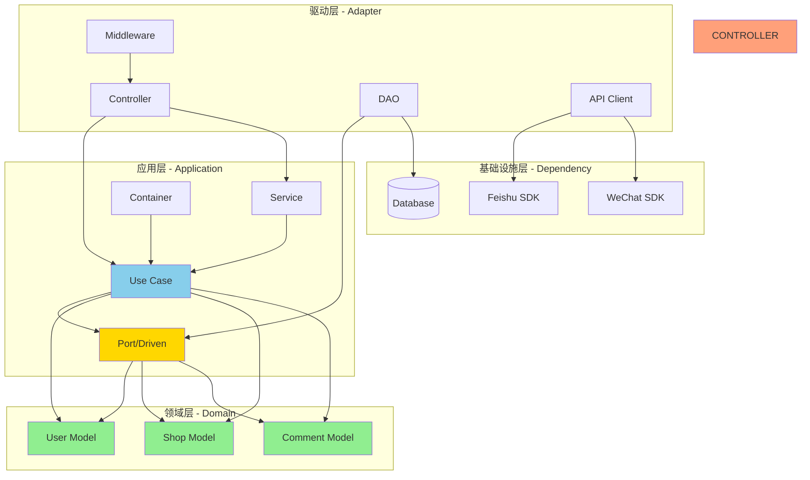

# Explicit Architecture 代码结构指南

## 概述

本技能基于 mammoth_wxs 项目的 Explicit Architecture（六边形架构）实现，
指导开发人员按照该架构规范组织业务代码。本架构遵循端口和适配器模式，
实现清晰的分层和依赖倒置。

### 架构风格

- **六边形架构 (Hexagonal Architecture)**
- **端口和适配器模式 (Ports and Adapters)**
- **依赖倒置原则 (Dependency Inversion)**

### 核心原则

1. **依赖规则**: 内层不依赖外层，依赖始终指向内层
2. **领域独立**: 领域层不依赖任何外部基础设施
3. **接口隔离**: 使用端口接口解耦各层
4. **用例驱动**: 业务逻辑封装在用例层

---

## 项目目录结构

```text
src/
├── adapter/                    # 适配器层（最外层）
│   ├── driven/                # 被动适配器（依赖基础设施）
│   │   ├── dao/              # 数据访问对象实现
│   │   │   ├── user.go       # 用户数据访问实现
│   │   │   ├── student.go    # 学生数据访问实现
│   │   │   └── order.go      # 订单数据访问实现
│   │   └── api/              # 外部 API 客户端实现
│   │       └── haoyueke.go   # 好约课 API 客户端
│   │
│   └── driving/              # 主动适配器（处理外部请求）
│       └── api/              # HTTP API 控制器
│           ├── controller/    # 控制器实现
│           │   ├── shop/      # 商城模块控制器
│           │   │   ├── order.go    # 订单相关控制器
│           │   │   ├── item.go     # 商品相关控制器
│           │   │   └── pay.go      # 支付相关控制器
│           │   ├── user/       # 用户模块控制器
│           │   ├── regular_class/  # 固定课模块控制器
│           │   └── ai_teacher/     # AI 教师模块控制器
│           └── middleware/    # 中间件
│               ├── auth.go         # 认证中间件
│               ├── cors.go         # 跨域中间件
│               └── session.go      # 会话中间件
│
├── application/             # 应用层（业务逻辑）
│   ├── port/               # 端口接口定义（内外层的契约）
│   │   ├── driven/        # 被动端口（对外部服务的依赖抽象）
│   │   │   └── persent_interface.go  # 仓储接口定义
│   │   └── driving/       # 主动端口（对外提供的服务接口）
│   │       └── (可选)     # 预留给事件处理、消息订阅等
│   │
│   ├── use_case/          # 用例实现（核心业务逻辑）
│   │   ├── user/         # 用户模块用例
│   │   │   └── user.go   # 用户管理用例
│   │   ├── shop/         # 商城模块用例
│   │   │   ├── order.go  # 订单管理用例
│   │   │   └── item.go   # 商品管理用例
│   │   ├── regular_class/ # 固定课模块用例
│   │   │   └── regular_class.go
│   │   └── chat_robot/    # 聊天机器人用例
│   │       └── chat_robot.go
│   │
│   ├── service/           # 应用服务（编排用例）
│   │   ├── chat_robot_service.go
│   │   └── (其他应用服务)
│   │
│   ├── container/         # 依赖注入容器
│   │   └── container.go  # 容器定义和依赖装配
│   │
│   └── dto/              # 数据传输对象
│       └── (可选)
│
├── domain/              # 领域层（最内层，业务核心）
│   ├── user/           # 用户领域
│   │   ├── model/      # 领域模型
│   │   │   ├── user.go      # 用户实体
│   │   │   └── student.go   # 学生实体
│   │   └── (可选) value_object.go  # 值对象
│   ├── shop/           # 商城领域
│   │   └── model/      # 领域模型
│   │       └── model.go     # 订单实体、枚举类型
│   ├── regular_class/  # 固定课领域
│   │   └── model/      # 领域模型
│   │       ├── arranged_regular_class.go
│   │       └── regular_class_application.go
│   └── chat_robot/     # 聊天机器人领域
│       └── model.go    # 领域模型
│
├── dependency/          # 基础设施层（外部服务封装）
│   ├── database/        # 数据库相关
│   ├── wechat/          # 微信 SDK 封装
│   ├── wechat_pay/      # 微信支付封装
│   ├── feishu/          # 飞书 SDK 封装
│   ├── haoyueke/        # 好约课 API 封装
│   └── llm/             # LLM 服务封装
│
├── common/             # 通用工具
│   ├── channel/         # 消息通道
│   ├── util/           # 工具函数
│   └── xerror/          # 错误处理
│
├── bootstrap/          # 启动引导
│   ├── container/       # 容器初始化
│   └── run_model/       # 运行模型
│
└── config/             # 配置
    └── config.go
```

---

## 各层职责与编码规范

### 1. 领域层 (Domain Layer)

**职责**：包含核心业务逻辑和领域模型，不依赖任何外部设施。

**特点**：

- 纯净的业务逻辑
- 无外部依赖（无数据库、无 HTTP、无 SDK）
- 定义实体、值对象、领域事件

**目录结构**：

```text
domain/
├── {业务模块}/
│   ├── model/           # 必需：领域模型
│   │   ├── {entity}.go   # 实体定义
│   │   └── (可选) enums.go # 枚举类型
│   ├── value_object/    # 可选：值对象
│   └── service/        # 可选：领域服务
```

**编码规范**：

#### 1.1 实体定义 (domain/{module}/model/{entity}.go)

```go
package model

import (
    "database/sql/driver"
    "encoding/json"
)

// Order 订单实体
// 业务规则：
// 1. 订单创建后状态为 INIT
// 2. 支付完成后状态变更为 PAID
// 3. 订单一旦支付不可退款（除非特殊业务场景）
type Order struct {
    OrderId         *string
    UserId          *string
    UserName        *string
    ItemId          *string
    OrderStatus     OrderStatus
    PayStatus       PayStatus
    // ... 其他字段
 // 可以添加更多字段
}

// TableName 指定数据库表名（GORM 约定）
func (Order) TableName() string {
    return "order"
}

// 领域枚举类型
type OrderStatus string

const (
    ORDER_STATUS_INIT     OrderStatus = "INIT"
    ORDER_STATUS_WAIT_PAY OrderStatus = "WAIT_PAY"
    ORDER_STATUS_PAID     OrderStatus = "PAID"
    ORDER_STATUS_CANCEL   OrderStatus = "CANCEL"
)
```

#### 1.2 自定义类型处理（如需复杂数据类型）

```go
// Privilege 用户特权（字符串数组自定义类型）
type Privilege []string

// Value 实现数据库序列化接口
func (p Privilege) Value() (driver.Value, error) {
    if p == nil || len(p) == 0 {
        return nil, nil
    }
    return json.Marshal(p)
}

// Scan 实现数据库反序列化接口
func (p *Privilege) Scan(value interface{}) error {
    if value == nil {
        return nil
    }
    bytesValue, _ := value.([]byte)
    return json.Unmarshal(bytesValue, p)
}
```

#### 1.3 领域服务（跨多个实体的业务逻辑）

```go
// domain/shop/service/order_domain_service.go
package service

type OrderDomainService struct {
    // 不依赖任何外部接口
}

// ValidateOrder 验证订单合法性（纯业务规则）
func (s *OrderDomainService) ValidateOrder(order *model.Order) error {
    if order.OrderStatus != model.ORDER_STATUS_INIT {
        return errors.New("订单状态不合法")
    }
    return nil
}
```

**⚠️ 严格禁止**：

- ❌ 导入 `adapter/`、`application/`、`dependency/` 包
- ❌ 直接调用数据库、HTTP、SDK
- ❌ 包含业务逻辑之外的技术实现

---

### 2. 应用层 (Application Layer)

**职责**：编排业务用例，协调领域模型和外部资源。

**特点**：

- 定义端口接口（Port）
- 实现用例（Use Case）
- 通过依赖注入连接各层

#### 2.1 端口定义 (application/port/)

**被动端口** (application/port/driven/)：

```go
package driven

import (
    shop_model "mammoth_wxs/src/domain/shop/model"
    user_model "mammoth_wxs/src/domain/user/model"
)

// UserRepository 用户仓储接口
type UserRepository interface {
    GetUserByOpenId(openId string) (*user_model.User, error)
    GetUserByUserId(userId string) (*user_model.User, error)
    AddUser(user *user_model.User) error
    UpdateUserWXInfo(user *user_model.User) error
    // ... 其他方法
}

// OrderRepository 订单仓储接口
type OrderRepository interface {
    AddOrder(order *shop_model.Order) error
    GetOrderByOrderId(orderId string) (*shop_model.Order, error)
    UpdateOrderStatus(orderId string, status shop_model.OrderStatus) error
    // ... 其他方法
}
```

**主动端口** (application/port/driving/)：

```go
package driving

// PaymentCompletedPort 支付完成端口（可选，用于事件驱动）
type PaymentCompletedPort interface {
    OnPaymentCompleted(orderId string) error
}
```

#### 2.2 用例实现 (application/use_case/)

**用例管理器模式**：

```go
package shop

import (
    "mammoth_wxs/src/application/port/driven"
    "mammoth_wxs/src/common/util/id_util"
    "mammoth_wxs/src/common/util/log_util"
    "mammoth_wxs/src/domain/shop/model"
)

// OrderManager 订单用例管理器
type OrderManager struct {
    UserRepo  driven.UserRepository  // 依赖接口，不依赖实现
    OrderRepo driven.OrderRepository
}

// CreateOrder 创建订单用例
func (m *OrderManager) CreateOrder(userId string, itemId string, mobile string) (string, error) {
    // 1. 业务逻辑
    orderId, err := m.createOrderId()
    if err != nil {
        return "", err
    }

    // 2. 调用领域层
    order := model.Order{
        OrderId:     &orderId,
        UserId:      &userId,
        ItemId:      &itemId,
        OrderStatus: model.ORDER_STATUS_INIT,
        PayStatus:   model.PAY_STATUS_WAIT_PREPAY,
    }

    // 3. 调用端口（仓储）
    err = m.OrderRepo.AddOrder(&order)
    if err != nil {
        return "", err
    }

    return orderId, nil
}

// SaveOrderPaidInfo 保存订单支付信息
func (m *OrderManager) SaveOrderPaidInfo(orderId string, payOrderId string, payTime string) error {
    // 业务逻辑 + 仓储调用
    return m.OrderRepo.UpdatePayInfo(orderId, payOrderId, payTime)
}

// createOrderId 私有辅助方法
func (m *OrderManager) createOrderId() (string, error) {
    id, err := id_util.GenerateSnowFlakeId()
    if err != nil {
        log_util.Logger.Errorf(
            "generate snow flake id failed!error:%+v", 
            err,
        )
        return "", err
    }
    return fmt.Sprintf("%d", id), nil
}
```

**⚠️ 注意事项**：

- ✅ 用例依赖 `port/driven` 定义的接口
- ✅ 使用领域模型 `domain/{module}/model`
- ✅ 业务逻辑封装在用例中
- ⚠️ 避免直接依赖外部服务（如 feishu、haoyueke）
- ⚠️ 如需外部服务，应在 `dependency` 层封装并通过接口访问

#### 2.3 应用服务 (application/service/)

应用服务用于编排多个用例：

```go
package service

import (
    "mammoth_wxs/src/application/use_case/shop"
)

// ChatRobotService 聊天机器人应用服务
type ChatRobotService struct {
    OrderManager *shop.OrderManager
    UserManager *user.UserManager
}

// Chat 聊天服务（编排多个用例）
func (s *ChatRobotService) Chat(userId string, message string) (*ChatResponse, error) {
    // 1. 获取用户信息
    user, err := s.UserManager.GetUser(userId)
    // ...

    // 2. 处理订单相关逻辑
    order, err := s.OrderManager.GetOrder(orderId)
    // ...

    // 3. 返回响应
    return &ChatResponse{}, nil
}
```

#### 2.4 依赖注入容器 (application/container/)

```go
package container

import (
    "mammoth_wxs/src/adapter/driven/dao"
    "mammoth_wxs/src/application/port/driven"
    "mammoth_wxs/src/application/use_case/shop"
    "mammoth_wxs/src/application/use_case/user"
)

// AppContainer 应用容器
type AppContainer struct {
    // 端口接口
    UserRepository driven.UserRepository
    OrderRepository driven.OrderRepository

    // 用例
    OrderManager *shop.OrderManager
    UserManager *user.UserManager
}

// NewAppContainer 创建应用容器
func NewAppContainer() *AppContainer {
    // 1. 创建被动适配器实现
    userDAO := &dao.UserDAO{}
    orderDAO := &dao.OrderDAO{}

    // 2. 创建用例，注入接口
    container := &AppContainer{
        UserRepository:  userDAO,
        OrderRepository: orderDAO,
    }

    // 3. 装配用例
    container.OrderManager = &shop.OrderManager{
        UserRepo:  container.UserRepository,
        OrderRepo: container.OrderRepository,
    }

    container.UserManager = &user.UserManager{
        UserRepo: container.UserRepository,
    }

    return container
}
```

**🔧 改进建议**：使用 Wire 自动生成依赖注入代码

```go
//go:build wireinject
// +build wireinject

package container

import "github.com/google/wire"

// InitializeAppContainer Wire 提供的初始化函数
func InitializeAppContainer() *AppContainer {
    wire.Build(
        // 提供者
        NewUserDAO,
        NewOrderDAO,

        // 接口实现绑定
        wire.Bind(
            new(driven.UserRepository), 
            new(*dao.UserDAO),
        ),
        wire.Bind(
            new(driven.OrderRepository), 
            new(*dao.OrderDAO),
        ),

        // 用例
        shop.NewOrderManager,
        user.NewUserManager,

        // 容器
        NewAppContainer,
    )
    return &AppContainer{}
}
```

---

### 3. 适配器层 (Adapter Layer)

#### 3.1 被动适配器 (adapter/driven/)

**职责**：实现端口接口，连接外部设施（数据库、外部 API）。

**数据访问适配器** (adapter/driven/dao/)：

```go
package dao

import (
    "mammoth_wxs/src/application/port/driven"
    user_model "mammoth_wxs/src/domain/user/model"
)

// UserDAO 用户数据访问对象
type UserDAO struct {
    db *gorm.DB
}

// NewUserDAO 创建 UserDAO
func NewUserDAO(db *gorm.DB) *UserDAO {
    return &UserDAO{db: db}
}

// GetUserByUserId 实现 UserRepository 接口
func (dao *UserDAO) GetUserByUserId(
    userId string,
) (*user_model.User, error) {
    var user user_model.User
    result := dao.db.Where("user_id = ?", userId).First(&user)
    if result.Error != nil {
        return nil, result.Error
    }
    return &user, nil
}

// AddUser 实现 UserRepository 接口
func (dao *UserDAO) AddUser(
    user *user_model.User,
) error {
    result := dao.db.Create(user)
    return result.Error
}

// ... 其他接口实现
```

**API 客户端适配器** (adapter/driven/api/)：

```go
package api

import (
    "mammoth_wxs/src/config"
)

// HaoyuekeClient 好约课 API 客户端
type HaoyuekeClient struct {
    baseURL    string
    httpClient *http.Client
}

// NewHaoyuekeClient 创建好约课客户端
func NewHaoyuekeClient() *HaoyuekeClient {
    cfg := config.GetConfig()
    return &HaoyuekeClient{
        baseURL: cfg.HaoyuekeAPI.URL,
        httpClient: &http.Client{
            Timeout: time.Second * 30,
        },
    }
}

// GetClassInfo 获取课程信息
func (c *HaoyuekeClient) GetClassInfo(classId string) (*ClassInfo, error) {
    // HTTP 调用实现
    return nil, nil
}
```

#### 3.2 主动适配器 (adapter/driving/)

**职责**：处理外部请求（HTTP、WebSocket、消息队列），调用应用层用例。

**控制器实现** (adapter/driving/api/controller/)：

```go
package shop

import (
    "mammoth_wxs/src/application/container"
    "mammoth_wxs/src/common/util/log_util"
    "github.com/gin-gonic/gin"
)

// OrderController 订单控制器
type OrderController struct {
    container *container.AppContainer
}

// NewOrderController 创建订单控制器
func NewOrderController(container *container.AppContainer) *OrderController {
    return &OrderController{container: container}
}

// CreateOrder 创建订单
// POST /shop/order/create
func (ctrl *OrderController) CreateOrder(c *gin.Context) {
    // 1. 解析请求参数
    var req struct {
        UserId string `json:"user_id" binding:"required"`
        ItemId string `json:"item_id" binding:"required"`
        Mobile string `json:"mobile"`
    }
    if err := c.ShouldBindJSON(&req); err != nil {
        c.JSON(400, gin.H{"error": err.Error()})
        return
    }

    // 2. 调用应用层用例
    orderManager := ctrl.container.OrderManager
    orderId, err := orderManager.CreateOrder(
        req.UserId, 
        req.ItemId, 
        req.Mobile,
    )
    if err != nil {
        log_util.Logger.Errorf(
            "create order failed!error:%+v", 
            err,
        )
        c.JSON(500, gin.H{"error": err.Error()})
        return
    }

    // 3. 返回响应
    c.JSON(200, gin.H{
        "order_id": orderId,
    })
}

// GetOrder 获取订单信息
// GET /shop/order/:orderId
func (ctrl *OrderController) GetOrder(c *gin.Context) {
    orderId := c.Param("orderId")

    orderManager := ctrl.container.OrderManager
    order, err := orderManager.GetOrderByOrderId(orderId)
    if err != nil {
        log_util.Logger.Errorf(
            "get order failed!error:%+v", 
            err,
        )
        c.JSON(500, gin.H{"error": err.Error()})
        return
    }

    c.JSON(200, gin.H{"data": order})
}
```

**中间件实现** (adapter/driving/api/middleware/)：

```go
package middleware

import (
    "mammoth_wxs/src/common/util/log_util"
    "github.com/gin-gonic/gin"
)

// AuthMiddleware 认证中间件
func AuthMiddleware() gin.HandlerFunc {
    return func(c *gin.Context) {
        // 认证逻辑
        token := c.GetHeader("Authorization")
        if token == "" {
            c.JSON(401, gin.H{"error": "未授权"})
            c.Abort()
            return
        }

        // 验证 token，获取用户信息
        user := verifyToken(token)
        c.Set(USER_CONTEXT_KEY, user)

        c.Next()
    }
}

// CORSMiddleware 跨域中间件
func CORSMiddleware() gin.HandlerFunc {
    return func(c *gin.Context) {
        c.Writer.Header().Set(
            "Access-Control-Allow-Origin", 
            "*",
        )
        c.Writer.Header().Set(
            "Access-Control-Allow-Methods", 
            "GET, POST, PUT, DELETE, OPTIONS",
        )
        c.Writer.Header().Set(
            "Access-Control-Allow-Headers", 
            "Content-Type, Authorization",
        )

        if c.Request.Method == "OPTIONS" {
            c.AbortWithStatus(204)
            return
        }

        c.Next()
    }
}
```

---

### 4. 基础设施层 (Dependency Layer)

**职责**：封装外部服务和技术组件。

**目录结构**：

```text
dependency/
├── database/        # 数据库相关
├── wechat/          # 微信 SDK 封装
├── wechat_pay/      # 微信支付封装
├── feishu/          # 飞书 SDK 封装
├── haoyueke/        # 好约课 API 封装
└── llm/             # LLM 服务封装
```

**示例** (dependency/feishu/)：

```go
package feishu

import "github.com/larksuite/oapi-sdk-go/v3"

// FeishuClient 飞书客户端
type FeishuClient struct {
    client *lark.Client
}

// NewFeishuClient 创建飞书客户端
func NewFeishuClient(appID string, appSecret string) *FeishuClient {
    client := lark.NewClient(appID, appSecret)
    return &FeishuClient{client: client}
}

// SendMessage 发送消息
func (c *FeishuClient) SendMessage(chatId string, content string) error {
    // 实现
    return nil
}
```

---

## 添加新业务模块的步骤

### 场景：添加"课程评论"模块

#### 步骤 1: 创建领域层

```bash
mkdir -p src/domain/comment/model
```

创建 `src/domain/comment/model/comment.go`：

```go
package model

type Comment struct {
    CommentId   *string
    CourseId    *string
    UserId      *string
    Content     *string
    Rating      int
    CreateTime  *string
}

func (Comment) TableName() string {
    return "comment"
}
```

#### 步骤 2: 定义端口接口

创建 `src/application/port/driven/comment_interface.go`：

```go
package driven

import comment_model "mammoth_wxs/src/domain/comment/model"

type CommentRepository interface {
    AddComment(
        comment *comment_model.Comment,
    ) error
    GetCommentsByCourseId(
        courseId string,
    ) ([]comment_model.Comment, error)
}
```

#### 步骤 3: 实现用例

```bash
mkdir -p src/application/use_case/comment
```

创建 `src/application/use_case/comment/comment.go`：

```go
package comment

import (
    "mammoth_wxs/src/application/port/driven"
    "mammoth_wxs/src/common/util/id_util"
    comment_model "mammoth_wxs/src/domain/comment/model"
)

type CommentManager struct {
    CommentRepo driven.CommentRepository
}

func (m *CommentManager) CreateComment(
    userId string, 
    courseId string, 
    content string, 
    rating int,
) (string, error) {
    // 生成评论 ID
    commentId, err := id_util.GenerateSnowFlakeId()
    if err != nil {
        return "", err
    }

    // 创建评论实体
    comment := comment_model.Comment{
        CommentId: stringPtr(fmt.Sprintf("%d", commentId)),
        CourseId:  &courseId,
        UserId:    &userId,
        Content:   &content,
        Rating:    rating,
    }

    // 保存到仓储
    err = m.CommentRepo.AddComment(&comment)
    if err != nil {
        return "", err
    }

    return *comment.CommentId, nil
}

func (m *CommentManager) GetCourseComments(courseId string) ([]comment_model.Comment, error) {
    return m.CommentRepo.GetCommentsByCourseId(courseId)
}
```

#### 步骤 4: 实现被动适配器

```bash
mkdir -p src/adapter/driven/dao
```

创建 `src/adapter/driven/dao/comment.go`：

```go
package dao

import (
    "mammoth_wxs/src/application/port/driven"
    comment_model "mammoth_wxs/src/domain/comment/model"
)

type CommentDAO struct {
    db *gorm.DB
}

func NewCommentDAO(db *gorm.DB) *CommentDAO {
    return &CommentDAO{db: db}
}

func (dao *CommentDAO) AddComment(comment *comment_model.Comment) error {
    return dao.db.Create(comment).Error
}

func (dao *CommentDAO) GetCommentsByCourseId(courseId string) ([]comment_model.Comment, error) {
    var comments []comment_model.Comment
    err := dao.db.Where("course_id = ?", courseId).Find(&comments).Error
    return comments, err
}
```

#### 步骤 5: 实现主动适配器（控制器）

```bash
mkdir -p src/adapter/driving/api/controller/comment
```

创建 `src/adapter/driving/api/controller/comment/comment.go`：

```go
package comment

import (
    "mammoth_wxs/src/application/container"
    "github.com/gin-gonic/gin"
)

type CommentController struct {
    container *container.AppContainer
}

func NewCommentController(container *container.AppContainer) *CommentController {
    return &CommentController{container: container}
}

// CreateComment 创建评论
// POST /comment
func (ctrl *CommentController) CreateComment(c *gin.Context) {
    var req struct {
        CourseId string `json:"course_id" binding:"required"`
        Content  string `json:"content" binding:"required"`
        Rating   int    `json:"rating" binding:"required,min=1,max=5"`
    }

    if err := c.ShouldBindJSON(&req); err != nil {
        c.JSON(400, gin.H{"error": err.Error()})
        return
    }

    userId := c.GetString("user_id")
    commentManager := ctrl.container.CommentManager
    commentId, err := commentManager.CreateComment(userId, req.CourseId, req.Content, req.Rating)
    if err != nil {
        c.JSON(500, gin.H{"error": err.Error()})
        return
    }

    c.JSON(200, gin.H{"comment_id": commentId})
}
```

#### 步骤 6: 更新依赖注入容器

在 `src/application/container/container.go` 中添加：

```go
type AppContainer struct {
    // 现有字段...

    // 新增评论相关
    CommentRepository driven.CommentRepository
    CommentManager     *comment.CommentManager
}

func NewAppContainer() *AppContainer {
    // 现有代码...

    // 新增评论相关
    commentDAO := dao.NewCommentDAO(db)

    container.CommentRepository = commentDAO
    container.CommentManager = &comment.CommentManager{
        CommentRepo: container.CommentRepository,
    }

    return container
}
```

#### 步骤 7: 注册路由

在路由注册代码中添加：

```go
commentController := controller.NewCommentController(container)
commentGroup := router.Group("/comment")
{
    commentGroup.POST("", commentController.CreateComment)
    commentGroup.GET("/:courseId", commentController.GetCourseComments)
}
```

---

## 依赖关系图



**依赖方向**：外层 → 内层，箭头表示依赖关系

---

## 编码检查清单

### 添加新代码时，请确认

#### 领域层

- [ ] 不导入 `adapter/`、`application/`、`dependency/` 包
- [ ] 只包含业务实体和领域逻辑
- [ ] 不依赖数据库、HTTP、SDK
- [ ] 如需外部服务，定义接口在应用层

#### 应用层

- [ ] 用例依赖 `port/driven` 定义的接口
- [ ] 使用领域模型 `domain/{module}/model`
- [ ] 业务逻辑封装在用例中
- [ ] 避免直接调用外部服务（通过 dependency 层）

#### 适配器层

- [ ] 被动适配器实现端口接口
- [ ] 主动适配器调用应用层用例
- [ ] 不包含业务逻辑
- [ ] 处理请求/响应转换

#### 依赖注入

- [ ] 容器装配所有依赖
- [ ] 接口与实现分离
- [ ] 考虑使用 Wire 自动装配

---

## 常见错误与解决方案

### 错误 1: 领域层依赖外部服务

**错误代码**：

```go
// domain/chat_robot/chat.go
import "mammoth_wxs/src/dependency/llm" // ❌ 违反架构原则

type ChatRobot struct {
    llmClient *llm.Client
}
```

**正确做法**：

```go
// domain/chat_robot/model.go
type ChatRobot struct {
    // 领域模型不依赖外部
}

// application/port/driven/llm_interface.go
package driven

type LLMClient interface {
    Chat(prompt string) (*LLMResponse, error)
}

// application/use_case/chat_robot/chat_robot.go
type ChatRobotManager struct {
    LLMClient driven.LLMClient  // 依赖接口
}
```

---

### 错误 2: 用例直接调用外部 API

**错误代码**：

```go
// application/use_case/shop/order.go
import "mammoth_wxs/src/dependency/feishu" // ❌ 直接依赖

func (m *OrderManager) SaveOrderPaidInfo(...) {
    feishu.SendNotification(...)  // ❌ 直接调用
}
```

**正确做法**：

```go
// application/port/driven/notification_interface.go
type NotificationPort interface {
    SendOrderPaidNotification(orderId string) error
}

// dependency/feishu/notification.go
type FeishuNotificationService struct {
    client *FeishuClient
}

func (s *FeishuNotificationService) SendOrderPaidNotification(orderId string) error {
    // 实现飞书通知
}

// 在容器中绑定
wire.Bind(new(driven.NotificationPort), new(*feishu.FeishuNotificationService))
```

---

### 错误 3: 控制器包含业务逻辑

**错误代码**：

```go
// adapter/driving/api/controller/shop/order.go
func (ctrl *OrderController) CreateOrder(c *gin.Context) {
    // ❌ 业务逻辑不应该在控制器
    if order.ItemPrice > 1000 {
        return errors.New("价格过高")
    }
    // ...
}
```

**正确做法**：

```go
// 业务逻辑移到用例
// adapter/driving/api/controller/shop/order.go
func (ctrl *OrderController) CreateOrder(c *gin.Context) {
    // 只处理请求解析和响应
    orderId, err := ctrl.container.OrderManager.CreateOrder(...)
    c.JSON(200, gin.H{"order_id": orderId})
}
```

---

## 工具与资源

### 推荐工具

- **Wire**: Google 提供的依赖注入代码生成工具

  ```bash
  go install github.com/google/wire/cmd/wire@latest
  ```

- **golangci-lint**: Go 代码静态检查

  ```bash
  golangci-lint run
  ```

### 参考资料

- [Explicit Architecture - Herberto Graça](https://herbertograca.com/2017/09/14/explicit-architecture-01-ddd-hexagonal-onion-clean/)
- [六边形架构 - Alistair Cockburn](https://alistair.cockburn.us/hexagonal-architecture/)
- [Clean Architecture - Robert C. Martin](https://blog.cleancoder.com/uncle-bob/2012/08/13/the-clean-architecture.html)

---

## 快速参考

### 目录对应关系

| 目录 | 层级 | 职责 |
| ---- | ---- | ---- |
| `domain/` | 领域层 | 业务实体、值对象、领域逻辑 |
| `application/port/` | 应用层 | 端口接口定义 |
| `application/use_case/` | 应用层 | 用例实现 |
| `application/service/` | 应用层 | 应用服务编排 |
| `application/container/` | 应用层 | 依赖注入容器 |
| `adapter/driven/` | 适配器层 | 被动适配器（数据访问、外部 API） |
| `adapter/driving/` | 适配器层 | 主动适配器（控制器、中间件） |
| `dependency/` | 基础设施层 | 外部服务封装 |

### 依赖规则总结

```text
adapter/driving → application/use_case → domain
adapter/driven → application/port → domain
dependency → (通过端口接口连接)
```

**关键原则**：

- ✅ 依赖方向始终指向内层
- ✅ 接口在应用层，实现在适配器层
- ✅ 领域层完全独立
- ❌ 领域层不依赖任何外层

---

**最后更新**: 2026-01-08
**版本**: 1.0
