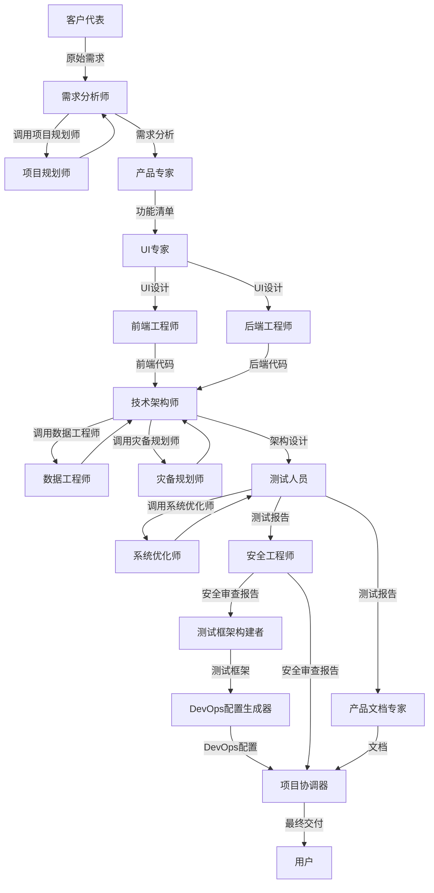

# Skills 体系总览

本目录包含18个专业技能，用于构建完整的AI虚拟团队，实现软件产品的全流程自动化开发。

## 📚 References和Scripts结构

每个skill可以包含以下资源：

- *`references/`*：技能特有的参考资料和模板
  - 架构设计模板（technical-architect）
  - 数据建模指南（data-engineer）
  - DevOps配置模板（devops-generator）
  - 测试用例模板（tester）
  - 安全检查清单（security-engineer）
  - 测试框架配置（test-framework-builder）
  - API设计模板（backend-engineer）
  - 组件模板（frontend-engineer）

- *`scripts/`*：技能特有的脚本和工具
  - 代码生成脚本
  - 验证脚本
  - 辅助工具

**全局资源**（在`.codebuddy/references/`和`.codebuddy/scripts/`）：

- `references/best-practices/coding.md`：编码最佳实践
- `scripts/utils/logger.ts`：统一日志工具

## 📊 技能分类

### 🎯 核心开发流程（12个阶段）

| 阶段 | Skill                        | 职责           |
| ---- | ---------------------------- | -------------- |
| 1    | customer-representative      | 需求提出       |
| 2    | requirements-analyst         | 需求分析       |
| 3    | product-expert               | 产品化设计     |
| 4    | ui-expert                    | 界面设计       |
| 5    | frontend-engineer            | 前端开发       |
| 6    | backend-engineer             | 后端开发       |
| 7    | technical-architect          | 架构保障       |
| 8    | tester                       | 测试验证       |
| 9    | product-documentation-expert | 文档交付       |
| 10   | security-engineer            | 安全审查       |
| 11   | test-framework-builder       | 测试框架搭建   |
| 12   | devops-generator             | DevOps配置生成 |

### 🤖 协调与交付（1个阶段）

| 阶段 | Skill               | 职责           |
| ---- | ------------------- | -------------- |
| 13   | project-coordinator | 项目协调与交付 |

### 🔧 嵌入式支撑技能（4个）

| Skill                     | 嵌入阶段       | 职责                                       |
| ------------------------- | -------------- | ------------------------------------------ |
| project-planner           | 阶段2-需求分析 | 项目规划、任务分解、里程碑管理、风险管理   |
| data-engineer             | 阶段7-架构保障 | 数据建模、数据库设计、数据迁移、ETL        |
| system-optimizer          | 阶段8-测试验证 | 性能优化、系统优化、监控配置               |
| disaster-recovery-planner | 阶段7-架构保障 | 灾备需求分析、备份策略、容灾架构、演练计划 |

## 📋 技能清单

### 1. customer-representative（客户代表）

**职责**：从客户视角提出需求，描述业务场景和痛点，提出改进方案。

**输入**：

- 客户痛点
- 市场需求
- 业务目标

**输出**：

- 原始需求描述
- 业务场景说明

---

### 2. requirements-analyst（需求分析师）

**职责**：将原始需求扩展为系统化的需求。

**输入**：

- 原始需求描述
- 业务场景说明

**输出**：

- 详细需求规格说明书
- 用例图
- 业务流程图

**关联技能**：调用project-planner生成项目计划

---

### 3. product-expert（产品专家）

**职责**：将需求转化为功能点，设计产品原型。

**输入**：

- 详细需求规格说明书
- 业务流程图

**输出**：

- 功能清单
- 功能规格说明
- 产品原型

---

### 4. ui-expert（UI专家）

**职责**：设计符合用户体验的交互界面和视觉效果。

**输入**：

- 功能规格说明
- 产品原型

**输出**：

- UI设计稿
- 交互流程图
- UI规范

---

### 5. frontend-engineer（前端工程师）

**职责**：实现前端页面、用户交互、对接API。

**输入**：

- UI设计稿
- UI规范
- API文档

**输出**：

- 前端代码
- 组件库
- 前端文档

---

### 6. backend-engineer（后端工程师）

**职责**：实现后端服务、业务逻辑、数据处理。

**输入**：

- 功能规格说明
- 数据模型

**输出**：

- 后端代码
- API文档
- 数据库Schema

---

### 7. technical-architect（技术架构师）

**职责**：设计系统架构，确保健壮性、扩展性、并发性、伸缩性。

**输入**：

- 业务领域模型
- 功能规格说明
- 性能要求

**输出**：

- 系统架构设计
- 架构规范
- 代码审查报告

**关联技能**：

- 调用data-engineer进行数据建模和数据库设计
- 调用disaster-recovery-planner制定灾备方案

---

### 8. tester（测试人员）

**职责**：根据产品和用户需求测试系统，确保代码功能正确性。

**输入**：

- 功能规格说明
- 代码实现

**输出**：

- 测试用例
- 测试报告
- 缺陷报告
- 测试工具

**关联技能**：调用system-optimizer进行性能分析和优化

---

### 9. product-documentation-expert（产品文档专家）

**职责**：系统化整理产品功能，形成专业易懂的文档。

**输入**：

- 功能清单
- UI设计稿
- API文档

**输出**：

- 产品介绍
- 使用方法
- API文档
- 常见问题文档

---

### 10. security-engineer（安全工程师）

**职责**：全面审查系统安全性，检测漏洞，确保系统安全合规。

**输入**：

- 业务领域模型
- 代码实现
- 系统架构设计

**输出**：

- 安全需求清单
- 安全风险评估报告
- 安全漏洞报告
- 安全修复建议

---

### 11. test-framework-builder（测试框架构建者）

**职责**：搭建完整的自动化测试框架，生成测试配置和工具链。

**输入**：

- 项目技术栈
- 测试需求

**输出**：

- 单元测试配置和示例
- 集成测试配置和工具
- E2E测试配置和脚本
- 测试工具链配置
- 测试数据管理工具

---

### 12. devops-generator（DevOps配置生成器）

**职责**：生成DevOps相关的配置文件和脚本，为部署和运维提供支持。

**输入**：

- 项目技术栈
- 部署目标
- CI/CD平台

**输出**：

- 容器化配置（Dockerfile, docker-compose）
- CI/CD配置（GitHub Actions, GitLab CI）
- Kubernetes配置
- 监控配置（Prometheus, Grafana）
- 环境配置（.env, ConfigMap, Secret）

---

### 13. project-coordinator（项目协调器）

**职责**：协调虚拟AI团队的skill调用顺序、上下文传递、状态管理和错误处理。

**输入**：

- 用户需求
- 所有阶段的产出

**输出**：

- 完整的项目代码
- 配置文件和脚本
- 文档
- 交付清单
- 部署指南

---

### 14. project-planner（项目规划师）- 嵌入式

**职责**：项目任务分解、排期、里程碑管理和风险识别。

**嵌入阶段**：阶段2-需求分析

**输入**：

- 产品需求
- 技术栈
- 团队规模
- 时间约束

**输出**：

- 任务分解结构（WBS）
- 项目排期表
- 里程碑定义
- 风险管理计划
- 资源需求评估

---

### 15. data-engineer（数据工程师）- 嵌入式

**职责**：数据建模、数据库设计、数据迁移和数据同步。

**嵌入阶段**：阶段7-架构保障

**输入**：

- 业务需求
- 系统架构
- 技术栈
- 数据规模

**输出**：

- 数据建模文档（ER图、数据字典）
- 数据库Schema
- 数据迁移脚本
- 数据同步方案
- ETL流程
- 性能优化方案

---

### 16. system-optimizer（系统优化师）- 嵌入式

**职责**：系统性能调优、系统优化和性能分析。

**嵌入阶段**：阶段8-测试验证

**输入**：

- 系统架构
- 性能指标
- 业务场景
- 性能目标

**输出**：

- 性能分析报告
- 应用性能优化方案
- 数据库性能优化方案
- 系统架构优化方案
- 网络和传输优化方案
- 监控和告警配置

---

### 17. disaster-recovery-planner（灾备规划师）- 嵌入式

**职责**：制定灾备和容灾方案，确保系统在灾难发生时能够快速恢复。

**嵌入阶段**：阶段7-架构保障

**输入**：

- 系统架构
- 业务需求
- 数据规模
- 资源预算

**输出**：

- 灾备需求分析报告
- 备份策略文档
- 容灾架构设计
- 故障切换方案
- 灾备演练计划
- 灾备文档（灾备计划、应急响应流程）

---

## 🔄 协作流程



## 📊 完整的6个问题覆盖情况

### 1. ✅ DevOps能力（已完成）

- ✅ 持续集成/持续部署(CI/CD)技能 - devops-generator
- ✅ 自动化构建和部署能力 - devops-generator
- ✅ 容器化和编排能力 - devops-generator
- ✅ 监控和告警设置 - system-optimizer, devops-generator

### 2. ✅ 项目管理能力（已完成）

- ✅ 任务分解和排期能力 - project-planner
- ✅ 进度跟踪和风险管理 - project-planner, project-coordinator
- ✅ 里程碑管理和交付计划 - project-planner
- ⚠️ 资源分配和团队协调 - AI虚拟团队不需要

### 3. ✅ 数据工程能力（已完成）

- ✅ 数据建模和数据库设计专项技能 - data-engineer
- ✅ 数据迁移和数据同步能力 - data-engineer
- ✅ 大数据处理和分析能力 - data-engineer（ETL）

### 4. ✅ 运维能力（已完成）

- ✅ 灾备和容灾方案设计 - disaster-recovery-planner
- ✅ 性能调优和系统优化 - system-optimizer
- ⚠️ 系统运维和故障排查技能 - 通过监控和告警配置实现

### 5. ✅ 自动化能力（已完成）

- ✅ 自动化测试框架搭建 - test-framework-builder
- ✅ 自动化部署脚本编写 - devops-generator
- ✅ 监控自动化和告警自动化 - system-optimizer, devops-generator

### 6. ✅ 协作机制（已完成）

- ✅ 各技能间自动触发机制 - project-coordinator
- ✅ 上下文自动传递机制 - project-coordinator
- ✅ 进度同步和状态管理 - project-coordinator

## 🎯 技能使用指南

### 何时使用本技能体系

当用户表达开发软件产品、功能或系统的意图时使用，例如：

- "我想要开发一个做X的产品"
- "我需要一个处理Y的功能"
- "帮我设计并构建一个Z系统"

### 如何启动技能体系

1. *`调用product-development-flow skill``2.`*自动按阶段调用各专业技能*`3.`*Project Coordinator自动协调流程*`4.`*最终生成交付物**

### 技能调用示例

```typescript
// 启动完整的产品开发流程
const productDevelopmentFlow = await useSkill("product-development-flow");

const result = await productDevelopmentFlow.execute({
  userRequirement: "我要开发一个电商平台",
});

// 流程会自动调用所有相关的skills
// - customer-representative
// - requirements-analyst + project-planner
// - product-expert
// - ui-expert
// - frontend-engineer
// - backend-engineer
// - technical-architect + data-engineer + disaster-recovery-planner
// - tester + system-optimizer
// - product-documentation-expert
// - security-engineer
// - test-framework-builder
// - devops-generator
// - project-coordinator

```

## 📈 技能体系优势

1. **完整性**：覆盖软件开发全流程

2. **专业性**：每个skill专注于特定领域

3. **自动化**：Project Coordinator自动编排流程

4. **质量保障**：每个阶段都有校对机制

5. **可扩展**：易于添加新的skill

6. **灵活性**：支持自定义流程

## 🚀 未来扩展方向

1. **AI辅助决策**：自动选择技术栈、自动评估风险

2. **智能错误恢复**：自动诊断和修复常见问题

3. **自动化验收测试**：自动验证所有交付物

4. **持续优化**：基于历史数据优化流程

5. **跨项目复用**：知识库和组件复用

## 📝 文档说明

- 每个skill都有详细的SKILL.md文档
- SKILL.md包含职责、输入输出、工作流程、质量标准等
- 所有skills都遵循统一的格式和规范
- 使用Mermaid图表展示流程

## 📚 SKILL.md 规范

每个SKILL.md文档应包含以下标准章节：

```markdown
# [Skill Name] SKILL

## 何时使用本Skill

（说明何时使用这个skill）

## 核心职责

（skill的主要职责和目标）

## 输入

（所需的输入参数和数据）

## 输出

（生成的输出和产物）

## 关键活动

（详细的执行步骤和活动）

## 审查重点

（需要重点审查的内容）

## 质量标准

（产出的质量检查标准）

## 校对机制

（校对次数、内容、方式和通过标准）

## 📚 参考资料

（引用的全局references和skill特有的references）

## 🛠️ 工具脚本

（引用的全局scripts和skill特有的scripts）

## 最佳实践

（使用本skill时的最佳实践）

## 常见问题

（常见问题和解决方案）

```

### References 和 Scripts 的引用规范

**全局资源**（放在`.codebuddy/references/`和`.codebuddy/scripts/`）：

- 供所有skills共享使用
- 在SKILL.md的"参考资料"和"工具脚本"章节中引用
- 示例：

  ```markdown
  ## 📚 参考资料

  - 编码最佳实践：`references/best-practices/coding.md`
  - 设计模式：`references/design-patterns/creational.md`

  ## 🛠️ 工具脚本

  - Logger工具：`scripts/utils/logger.ts`
  - 验证工具：`scripts/validators/code-validator.ts`

  ```

**Skill特有资源**（放在`skills/[skill-name]/references/`和`scripts/`）：

- 仅该skill使用
- 如果内容较少，可以合并到SKILL.md中
- 示例：

  ```markdown
  ## 📚 参考资料

  ### 全局参考资料

  - 编码最佳实践：`references/best-practices/coding.md`

  ### 本skill特有参考资料

  - [测试模板](references/test-templates.md)

  ## 🛠️ 工具脚本

  ### 全局工具脚本

  - Logger工具：`scripts/utils/logger.ts`

  ### 本skill特有脚本

  - [测试用例生成器](scripts/test-generator.ts)

  ```

---

**最后更新**：2026-01-22
**技能总数**：18
**阶段数量**：13
**覆盖问题**：6/6 (100%)
