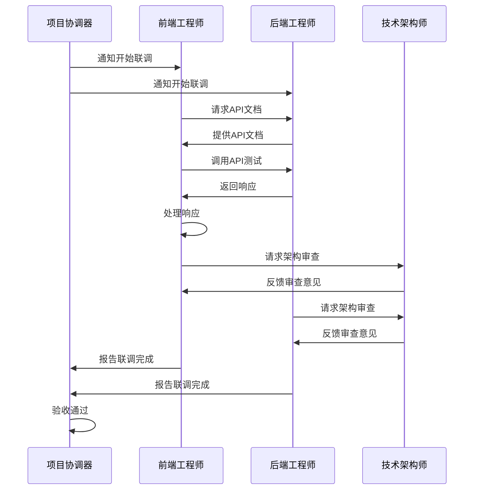
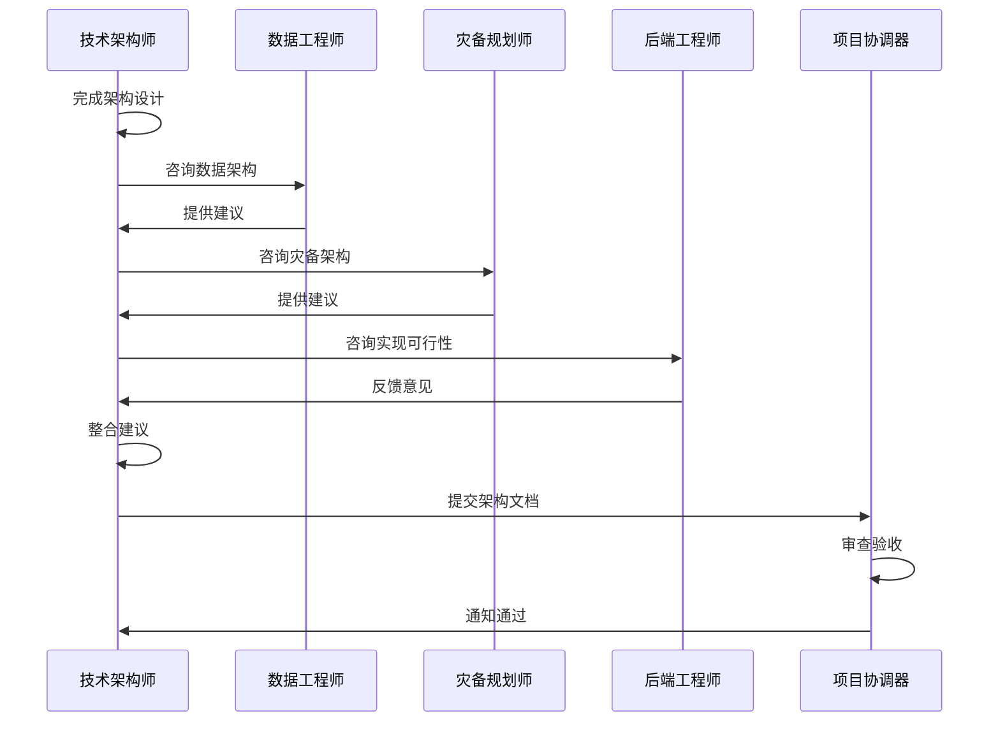

# 技能协作关系与RACI矩阵

本文档定义了.codebuddy虚拟AI团队中各技能之间的协作关系、责任分配和互动机制。

## RACI模型说明

RACI是一种责任分配模型，用于明确项目中的角色和职责：

- **R (Responsible)** - 负责人：实际执行任务的角色
- **A (Accountable)** - 拥有人：对任务结果负最终责任的角色（每项任务只有一个A）
- **C (Consulted)** - 咨询人：在执行过程中需要咨询的角色
- **I (Informed)** - 知情人：需要被告知进展和结果的角色

## 核心开发阶段RACI矩阵

### 阶段1: 需求提出

| 任务 | 客户代表 | 需求分析师 | 产品专家 | 项目协调器 |
|------|----------|------------|----------|------------|
| 收集原始需求 | R/A | I | I | C |
| 描述业务场景 | R/A | C | I | I |
| 提出改进方案 | R/A | C | I | I |
| 验证需求完整性 | R/A | C | - | I |

**说明**：

- 客户代表（R/A）：负责收集和提出需求，对需求质量负最终责任
- 需求分析师（C）：在需求收集过程中提供咨询，帮助明确需求
- 产品专家（I）：需要了解需求，但暂不参与
- 项目协调器（C）：协调需求收集过程，确保流程顺畅

---

### 阶段2: 需求分析

| 任务 | 需求分析师 | 项目规划师 | 客户代表 | 产品专家 | 项目协调器 |
|------|------------|------------|----------|----------|------------|
| 需求分析 | R/A | C | C | C | I |
| 生成需求文档 | R/A | I | C | C | I |
| 用例图绘制 | R/A | I | C | C | I |
| 业务流程图设计 | R/A | I | C | C | I |
| 项目计划生成 | I | R/A | C | I | C |
| 里程碑定义 | I | R/A | C | I | I |

**说明**：

- 需求分析师（R/A）：负责需求分析工作，对分析结果负最终责任
- 项目规划师（R/A）：负责项目计划和里程碑定义，对计划质量负责
- 客户代表（C）：咨询需求分析过程，确认需求理解正确
- 产品专家（C）：咨询需求分析，了解功能需求
- 项目协调器（C）：协调分析过程，管理进度

---

### 阶段3: 产品化设计

| 任务 | 产品专家 | 需求分析师 | UI专家 | 项目协调器 |
|------|----------|------------|--------|------------|
| 功能清单生成 | R/A | C | I | I |
| 功能规格说明 | R/A | C | C | I |
| 产品原型设计 | R/A | I | C | I |
| 设计评审 | R/A | C | C | I |
| 功能验收标准 | R/A | C | I | C |

**说明**：

- 产品专家（R/A）：负责产品化设计，对设计质量负最终责任
- 需求分析师（C）：咨询设计过程，确保满足需求
- UI专家（C）：咨询设计过程，了解功能规划
- 项目协调器（I）：了解设计进展

---

### 阶段4: 界面设计

| 任务 | UI专家 | 产品专家 | 前端工程师 | 项目协调器 |
|------|--------|----------|------------|------------|
| UI设计稿 | R/A | C | C | I |
| 交互流程图 | R/A | C | C | I |
| UI规范制定 | R/A | I | C | I |
| 设计评审 | R/A | C | C | I |
| 设计交付 | R/A | C | C | C |

**说明**：

- UI专家（R/A）：负责界面设计，对设计质量负最终责任
- 产品专家（C）：咨询设计过程，确保符合产品规范
- 前端工程师（C）：咨询设计过程，了解实现需求
- 项目协调器（C）：协调设计交付

---

### 阶段5-6: 业务实现（前端+后端）

| 任务 | 前端工程师 | 后端工程师 | 技术架构师 | 数据工程师 | 项目协调器 |
|------|------------|------------|------------|------------|------------|
| 前端页面实现 | R/A | I | C | I | C |
| 后端服务实现 | I | R/A | C | C | C |
| API接口设计 | I | R/A | C | C | I |
| 数据模型设计 | I | C | C | R/A | I |
| 前后端联调 | C | C | A | I | C |
| 代码审查 | R | R | A | C | I |

**说明**：

- 前端工程师（R/A）：负责前端实现，对前端代码质量负责
- 后端工程师（R/A）：负责后端实现，对后端代码质量负责
- 技术架构师（A）：对整体技术实现质量负最终责任，审查代码
- 数据工程师（R/A）：负责数据模型设计
- 项目协调器（C）：协调实现过程，管理进度

---

### 阶段7: 架构保障

| 任务 | 技术架构师 | 数据工程师 | 灾备规划师 | 后端工程师 | 项目协调器 |
|------|------------|------------|------------|------------|------------|
| 系统架构设计 | R/A | C | C | C | C |
| 架构规范制定 | R/A | I | I | C | I |
| 代码架构审查 | R/A | C | I | C | I |
| 数据库设计审查 | C | R/A | I | C | I |
| 灾备方案设计 | C | C | R/A | I | I |
| 架构文档编写 | R/A | C | C | I | I |

**说明**：

- 技术架构师（R/A）：负责系统架构设计，对架构质量负最终责任
- 数据工程师（R/A）：负责数据库设计审查
- 灾备规划师（R/A）：负责灾备方案设计
- 后端工程师（C）：咨询架构设计，了解实现需求
- 项目协调器（C）：协调架构保障过程

---

### 阶段8: 测试验证

| 任务 | 测试人员 | 前端工程师 | 后端工程师 | 系统优化师 | 测试框架构建者 | 项目协调器 |
|------|----------|------------|------------|------------|----------------|------------|
| 测试用例设计 | R/A | C | C | I | C | I |
| 单元测试执行 | C | R | R | I | I | C |
| 集成测试执行 | R/A | C | C | I | I | C |
| 测试报告生成 | R/A | I | I | C | I | C |
| 性能测试 | I | C | C | R/A | I | I |
| 测试框架搭建 | I | I | I | I | R/A | C |

**说明**：

- 测试人员（R/A）：负责测试执行和报告，对测试质量负责
- 前端/后端工程师（R）：负责执行单元测试
- 系统优化师（R/A）：负责性能测试
- 测试框架构建者（R/A）：负责搭建测试框架
- 项目协调器（C）：协调测试过程

---

### 阶段9: 文档交付

| 任务 | 文档专家 | 产品专家 | 前端工程师 | 后端工程师 | 项目协调器 |
|------|----------|----------|------------|------------|------------|
| API文档编写 | R/A | C | C | C | I |
| 产品文档编写 | R/A | C | I | I | I |
| 使用手册编写 | R/A | I | I | I | I |
| 文档审查 | R/A | C | C | C | I |
| 文档交付 | R/A | C | I | I | C |

**说明**：

- 文档专家（R/A）：负责文档编写，对文档质量负最终责任
- 产品/前端/后端工程师（C）：咨询文档编写，提供技术细节
- 项目协调器（C）：协调文档交付

---

### 阶段10: 安全审查

| 任务 | 安全工程师 | 后端工程师 | 技术架构师 | 项目协调器 |
|------|------------|------------|------------|------------|
| 安全需求分析 | R/A | C | C | I |
| 安全漏洞检测 | R/A | C | C | I |
| 安全报告编写 | R/A | C | I | C |
| 安全修复建议 | R/A | R | C | I |
| 安全验证 | R/A | R | C | C |

**说明**：

- 安全工程师（R/A）：负责安全审查，对安全质量负责
- 后端工程师（R）：负责安全修复
- 技术架构师（C）：咨询安全审查
- 项目协调器（C）：协调安全审查过程

---

### 阶段11: DevOps配置生成

| 任务 | DevOps工程师 | 后端工程师 | 测试框架构建者 | 项目协调器 |
|------|------------|------------|----------------|------------|
| CI/CD配置 | R/A | C | C | I |
| 容器化配置 | R/A | C | I | I |
| 部署配置 | R/A | C | I | C |
| 监控配置 | R/A | I | I | I |
| 部署验证 | R/A | C | C | C |

**说明**：

- DevOps工程师（R/A）：负责DevOps配置，对配置质量负责
- 后端工程师（C）：咨询配置过程，了解部署需求
- 测试框架构建者（C）：咨询CI/CD配置
- 项目协调器（C）：协调配置交付和部署

---

### 阶段12: 项目协调与交付

| 任务 | 项目协调器 | 所有技能 | 客户代表 |
|------|------------|----------|----------|
| 项目进度跟踪 | R/A | I | I |
| 上下文管理 | R/A | I | I |
| 错误处理 | R/A | C | I |
| 交付物整理 | R/A | C | C |
| 最终交付 | R/A | I | I |
| 项目总结 | R/A | C | C |

**说明**：

- 项目协调器（R/A）：负责项目协调和交付，对交付质量负最终责任
- 所有技能（I）：了解项目进展，配合协调
- 客户代表（C）：咨询交付过程，确认交付物

---

## 嵌入式技能协作RACI

### 项目规划师（嵌入阶段2）

| 任务 | 项目规划师 | 需求分析师 | 客户代表 | 产品专家 |
|------|------------|------------|----------|----------|
| WBS生成 | R/A | C | C | I |
| 项目排期 | R/A | C | C | I |
| 里程碑定义 | R/A | C | C | I |
| 风险识别 | R/A | C | C | I |

---

### 数据工程师（嵌入阶段6-7）

| 任务 | 数据工程师 | 后端工程师 | 技术架构师 | 项目协调器 |
|------|------------|------------|------------|------------|
| 数据建模 | R/A | C | C | I |
| 数据库设计 | R/A | C | C | I |
| 数据迁移 | R/A | R | C | C |
| 数据同步 | R/A | R | C | I |

---

### 系统优化师（嵌入阶段8）

| 任务 | 系统优化师 | 测试人员 | 后端工程师 | 项目协调器 |
|------|------------|----------|------------|------------|
| 性能分析 | R/A | C | C | I |
| 性能优化 | R/A | C | R | C |
| 监控配置 | R/A | I | C | I |
| 优化报告 | R/A | C | I | C |

---

### 灾备规划师（嵌入阶段7）

| 任务 | 灾备规划师 | 技术架构师 | DevOps工程师 | 项目协调器 |
|------|------------|------------|--------------|------------|
| 灾备需求分析 | R/A | C | C | I |
| 备份策略制定 | R/A | C | C | I |
| 容灾架构设计 | R/A | C | C | I |
| 灾备演练 | R/A | C | R | C |

---

## 协作原则

### 1. 单一责任人原则

每项任务只有一个A（Accountable），避免责任不清。

### 2. 咨询与知情

- C（Consulted）需要在决策前被咨询
- I（Informed）在决策后被告知结果

### 3. 上下文传递

R和C之间必须有充分的上下文传递，确保信息对称。

### 4. 质量保证

每项任务完成后，必须进行质量检查和验收。

### 5. 并行协作

对于可以并行的任务（如前端和后端开发），允许同时进行R角色。

---

## 协作场景示例

### 场景1: 前后端联调



---

### 场景2: 架构设计评审



---

## 协作沟通机制

### 1. 标准输出格式

技能之间的信息传递使用标准格式：

```json
{
  "from": "frontend-engineer",
  "to": "backend-engineer",
  "timestamp": "2026-01-25T10:30:00Z",
  "type": "request",
  "data": {
    "action": "api-request",
    "api": "getUser",
    "params": { "id": "123" }
  }
}
```

### 2. 上下文传递

上下文通过Project Context进行传递：

```typescript
interface ProjectContext {
  currentStage: number;
  stageOutputs: {
    stage1: CustomerRequirement;
    stage2: RequirementsAnalysis;
    // ...
  };
  sharedData: {
    apis: API[];
    models: DataModel[];
    // ...
  };
}
```

### 3. 状态通知

关键事件需要通知相关技能：

```typescript
interface EventNotification {
  eventType: "stage-start" | "stage-complete" | "error";
  stage: number;
  skillName: string;
  data: any;
  timestamp: Date;
}
```

---

## 冲突预防

### 1. 明确职责边界

在RACI矩阵中明确每个技能的职责范围，避免重叠。

### 2. 建立沟通渠道

为每对协作技能建立固定的沟通渠道。

### 3. 定期同步

项目协调器定期组织同步会议，确保信息一致。

### 4. 版本控制

所有协作产物使用版本控制，记录变更历史。

---

**最后更新**：2026-01-25
**维护者**：.codebuddy团队
