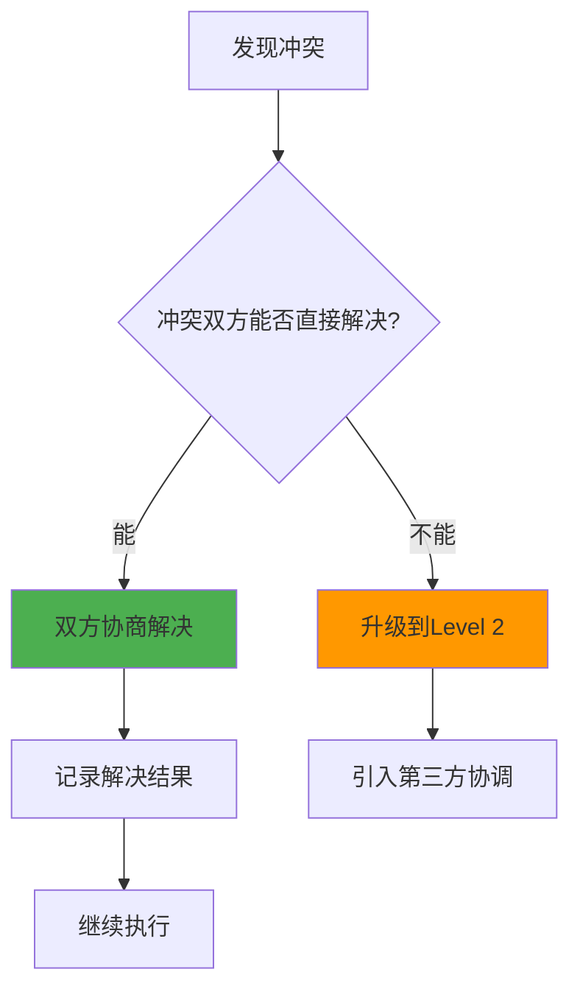
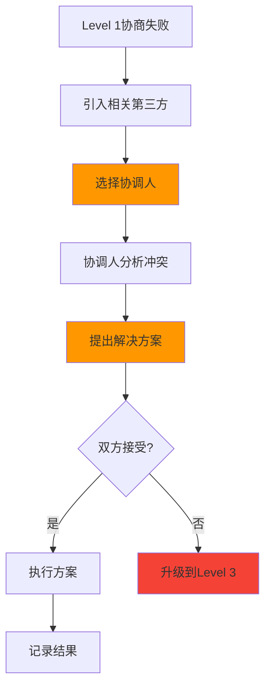
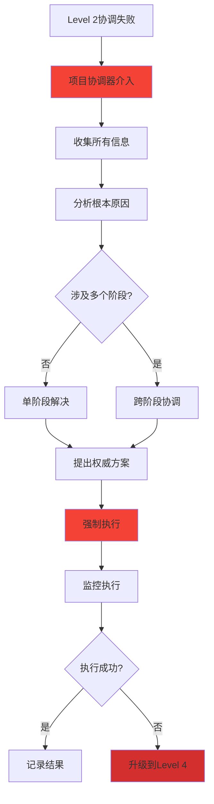
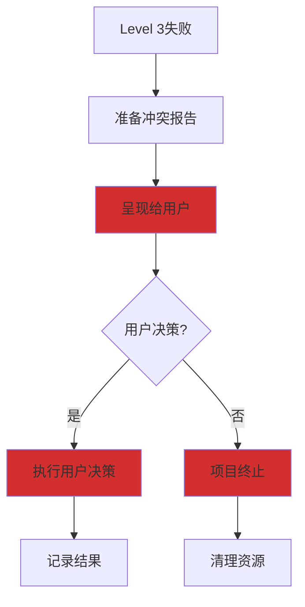

# 冲突升级路径文档

本文档定义了.codebuddy虚拟AI团队中各技能之间发生冲突时的升级路径和解决机制。

## 冲突分类

### 1. 技术冲突

技术冲突是指由于技术方案、架构设计、实现方法等技术问题产生的冲突。

**示例**：

- 前端和后端对API接口设计意见不一致
- 技术架构师和后端工程师对数据库设计方案有分歧
- DevOps工程师和开发团队对部署方案有不同意见

**严重程度**：中等

---

### 2. 资源冲突

资源冲突是指由于资源分配、时间安排、优先级等问题产生的冲突。

**示例**：

- 多个技能同时需要访问同一个资源
- 任务优先级不一致导致资源竞争
- 时间安排冲突

**严重程度**：中等

---

### 3. 质量冲突

质量冲突是指由于质量标准、验收标准、测试结果等问题产生的冲突。

**示例**：

- 测试人员和开发人员对Bug优先级有分歧
- 不同技能对质量标准理解不一致
- 安全审查结果与开发进度冲突

**严重程度**：高

---

### 4. 流程冲突

流程冲突是指由于流程执行、上下文传递、状态管理等问题产生的冲突。

**示例**：

- 上下文传递失败导致数据不一致
- 流程执行顺序产生冲突
- 状态管理混乱

**严重程度**：高

---

## 冲突升级路径

### Level 1: 直接协商（技能级别）

**适用场景**：

- 技术冲突
- 资源冲突
- 严重程度：低-中

**处理流程**：



**步骤**：

1. **识别冲突**：
   - 发现冲突的技能识别出问题
   - 分析冲突类型和严重程度

2. **启动协商**：
   - 冲突双方直接沟通
   - 提供各自的观点和依据
   - 寻找共同点

3. **协商解决**：
   - 基于RACI矩阵明确责任
   - 参考全局参考资料
   - 寻找双赢方案

4. **记录结果**：
   - 记录冲突描述
   - 记录解决方案
   - 通知相关技能

**示例**：

```typescript
// 前端工程师和后端工程师协商API设计
const conflict = {
  type: "technical",
  skills: ["frontend-engineer", "backend-engineer"],
  issue: "API字段命名不一致",
  severity: "medium"
};

// 尝试协商
const solution = await negotiate(conflict);

if (solution.resolved) {
  // 记录解决结果
  logger.info("冲突已解决", { conflict, solution });
} else {
  // 升级到Level 2
  await escalate(conflict, 2);
}
```

---

### Level 2: 第三方协调（相关技能协调）

**适用场景**：

- 技术冲突（无法直接解决）
- 资源冲突
- 严重程度：中

**处理流程**：



**步骤**：

1. **选择协调人**：
   - 根据冲突类型选择合适的协调人
   - 技术冲突：技术架构师
   - 质量冲突：测试人员
   - 流程冲突：项目协调器

2. **协调人分析**：
   - 收集冲突双方的证据
   - 分析冲突的根本原因
   - 查阅相关参考资料

3. **提出方案**：
   - 协调人提出解决方案
   - 说明方案的理由和依据
   - 提供多种备选方案

4. **双方确认**：
   - 冲突双方评估方案
   - 确认是否接受
   - 提出修改意见

**协调人选择表**：

| 冲突类型 | 推荐协调人 | 备选协调人 |
|----------|------------|------------|
| API设计冲突 | 技术架构师 | 后端工程师 |
| 架构设计冲突 | 技术架构师 | 项目规划师 |
| 数据库设计冲突 | 数据工程师 | 技术架构师 |
| 前端后端冲突 | 技术架构师 | 项目协调器 |
| 质量标准冲突 | 测试人员 | 项目协调器 |
| 部署方案冲突 | DevOps工程师 | 技术架构师 |
| 时间安排冲突 | 项目协调器 | 项目规划师 |
| 优先级冲突 | 项目协调器 | 产品专家 |

**示例**：

```typescript
// 技术架构师协调前端后端API冲突
const conflict = {
  type: "technical",
  skills: ["frontend-engineer", "backend-engineer"],
  issue: "API响应格式不一致",
  severity: "medium",
  level: 2
};

// 选择技术架构师作为协调人
const coordinator = "technical-architect";

// 请求协调
const solution = await requestCoordination({
  conflict,
  coordinator,
  deadline: "2026-01-26T10:00:00Z"
});

if (solution.accepted) {
  // 执行方案
  await executeSolution(solution);
} else {
  // 升级到Level 3
  await escalate(conflict, 3);
}
```

---

### Level 3: 项目协调器介入

**适用场景**：

- 质量冲突（无法在Level 2解决）
- 流程冲突
- 严重程度：高

**处理流程**：



**步骤**：

1. **全面收集**：
   - 收集冲突双方的所有信息
   - 收集Level 2的协调记录
   - 收集相关的RACI矩阵

2. **深度分析**：
   - 分析冲突的根本原因
   - 评估各种解决方案
   - 考虑对整体项目的影响

3. **权威决策**：
   - 项目协调器做出最终决定
   - 提供明确的执行方案
   - 设定执行期限

4. **强制执行**：
   - 所有相关技能必须执行
   - 提供必要的支持
   - 监控执行进度

**项目协调器权限**：

- 可以暂停相关技能的执行
- 可以重新分配资源
- 可以修改项目计划
- 可以要求技能重新执行

**示例**：

```typescript
// 项目协调器介入质量冲突
const conflict = {
  type: "quality",
  skills: ["tester", "backend-engineer"],
  issue: "测试发现严重安全漏洞，但后端工程师认为不影响上线",
  severity: "high",
  level: 3
};

// 项目协调器介入
const decision = await projectCoordinator.resolve({
  conflict,
  action: "require-fix",
  reason: "安全漏洞必须在上线前修复",
  deadline: "2026-01-26T18:00:00Z",
  priority: "critical"
});

// 通知相关技能
await notifySkill("backend-engineer", {
  type: "decision",
  decision: "必须修复安全漏洞",
  deadline: decision.deadline
});

// 暂停其他相关任务
await pauseSkill("devops-generator");
```

---

### Level 4: 用户介入（最后手段）

**适用场景**：

- Level 3无法解决的冲突
- 涉及核心业务决策
- 需要用户做出最终选择
- 严重程度：极高

**处理流程**：



**步骤**：

1. **准备报告**：
   - 详细描述冲突情况
   - 说明已经尝试的解决方案
   - 分析各方案的影响
   - 提供用户的可选方案

2. **呈现用户**：
   - 以清晰的方式呈现冲突
   - 说明影响和风险
   - 推荐方案并说明理由

3. **执行决策**：
   - 严格执行用户的决策
   - 调整项目计划
   - 更新RACI矩阵

4. **记录学习**：
   - 记录冲突原因
   - 记录解决过程
   - 更新知识库

**用户决策选项**：

```markdown
# 冲突解决请求

## 冲突描述

前端工程师和后端工程师对API设计存在分歧，Level 3协调未达成一致。

## 冲突双方观点

### 前端工程师观点
- API响应应该包含完整的嵌套数据
- 减少前端需要发出的请求数量
- 提高用户体验

### 后端工程师观点
- API响应应该只包含必要字段
- 避免过度查询导致性能问题
- 遵循RESTful最佳实践

## 已尝试的解决方案

1. Level 1: 直接协商 - 失败
2. Level 2: 技术架构师协调 - 失败
3. Level 3: 项目协调器决策 - 无法达成一致

## 可选方案

### 方案A: 前端方案
- **优点**: 前端实现简单，用户体验好
- **缺点**: 后端性能可能受影响
- **推荐**: 适合小型项目

### 方案B: 后端方案
- **优点**: 后端性能好，符合最佳实践
- **缺点**: 前端需要多次请求
- **推荐**: 适合大型项目

### 方案C: 混合方案
- **优点**: 平衡前后端需求
- **缺点**: 实现复杂度较高
- **推荐**: 适合中型项目

## 请选择方案

[ ] 方案A
[ ] 方案B
[ ] 方案C
[ ] 我有其他想法：____________________
```

**示例**：

```typescript
// Level 4: 用户介入
const conflict = {
  type: "technical",
  skills: ["frontend-engineer", "backend-engineer"],
  issue: "API设计根本分歧",
  severity: "critical",
  level: 4,
  history: [
    { level: 1, result: "failed", reason: "无法达成一致" },
    { level: 2, result: "failed", reason: "技术架构师协调失败" },
    { level: 3, result: "failed", reason: "项目协调器无法决策" }
  ]
};

// 准备用户报告
const report = await generateConflictReport(conflict);

// 呈现给用户
await presentToUser(report);

// 等待用户决策
const userDecision = await waitForUserDecision();

if (userDecision) {
  // 执行用户决策
  await executeUserDecision(userDecision);
  logger.info("冲突已解决", { decision: userDecision });
} else {
  // 项目终止
  await terminateProject(conflict);
  logger.error("项目因冲突无法解决而终止", { conflict });
}
```

---

## 冲突记录与跟踪

### 冲突记录格式

```typescript
interface ConflictRecord {
  id: string;
  type: ConflictType;
  skills: string[];
  issue: string;
  severity: "low" | "medium" | "high" | "critical";
  level: number;
  status: "open" | "resolved" | "escalated" | "user-decision";
  timeline: ConflictEvent[];
  resolution?: ConflictResolution;
  metadata: Record<string, any>;
}

interface ConflictEvent {
  timestamp: Date;
  action: string;
  actor: string;
  details: string;
}

interface ConflictResolution {
  level: number;
  decision: string;
  executor: string;
  timestamp: Date;
  outcome: string;
}
```

### 冲突跟踪

```typescript
class ConflictTracker {
  private conflicts: Map<string, ConflictRecord> = new Map();

  // 记录冲突
  record(conflict: Conflict): string {
    const id = generateConflictId();
    this.conflicts.set(id, {
      id,
      ...conflict,
      status: "open",
      timeline: [{
        timestamp: new Date(),
        action: "conflict-created",
        actor: "system",
        details: conflict.issue
      }]
    });
    return id;
  }

  // 更新冲突状态
  update(id: string, update: Partial<ConflictRecord>): void {
    const conflict = this.conflicts.get(id);
    if (conflict) {
      this.conflicts.set(id, {
        ...conflict,
        ...update,
        timeline: [
          ...conflict.timeline,
          {
            timestamp: new Date(),
            action: "conflict-updated",
            actor: "system",
            details: JSON.stringify(update)
          }
        ]
      });
    }
  }

  // 升级冲突
  escalate(id: string, toLevel: number): void {
    const conflict = this.conflicts.get(id);
    if (conflict) {
      this.update(id, {
        level: toLevel,
        status: toLevel === 4 ? "user-decision" : "escalated"
      });
    }
  }

  // 解决冲突
  resolve(id: string, resolution: ConflictResolution): void {
    const conflict = this.conflicts.get(id);
    if (conflict) {
      this.update(id, {
        status: "resolved",
        resolution
      });
    }
  }
}
```

---

## 冲突预防

### 1. 明确的RACI矩阵

确保每个任务都有明确的R和A，避免责任不清。

### 2. 定期沟通

项目协调器定期组织技能间的沟通会议，及时发现潜在冲突。

### 3. 质量标准统一

确保所有技能使用统一的质量标准和验收标准。

### 4. 上下文透明

确保所有技能都能访问完整的上下文信息，减少信息不对称。

### 5. 早期干预

在冲突升级到高级别之前尽早介入解决。

---

## 最佳实践

### 1. 记录所有冲突

即使冲突已解决，也要记录在案，作为经验积累。

### 2. 分析冲突模式

定期分析冲突记录，识别高频冲突类型和原因。

### 3. 持续改进

根据冲突分析结果，持续改进流程和协作机制。

### 4. 知识共享

将冲突解决方案和经验分享到知识库，避免重复冲突。

---

## 示例场景

### 场景1: 前后端API冲突

```mermaid
sequenceDiagram
    participant FE as 前端工程师
    participant BE as 后端工程师
    participant TA as 技术架构师
    participant PC as 项目协调器
    participant User as 用户

    FE->>BE: 请求API设计
    BE->>FE: 提供API文档
    FE->>BE: 提出异议
    Note over FE,BE: Level 1: 直接协商失败

    TA->>TA: 接到协调请求
    TA->>FE: 了解需求
    TA->>BE: 了解约束
    TA->>TA: 提出方案
    TA->>FE: 征求意见
    TA->>BE: 征求意见
    Note over FE,BE,TA: Level 2: 协调失败

    PC->>PC: 接到升级请求
    PC->>FE: 收集信息
    PC->>BE: 收集信息
    PC->>TA: 收集信息
    PC->>PC: 做出决策
    PC->>FE: 通知方案
    PC->>BE: 通知方案
    Note over FE,BE,PC: Level 3: 解决成功
```

---

### 场景2: 质量冲突（用户介入）

```mermaid
sequenceDiagram
    participant T as 测试人员
    participant BE as 后端工程师
    participant PC as 项目协调器
    participant User as 用户

    T->>BE: 发现安全漏洞
    BE->>T: 认为不影响上线
    Note over T,BE: Level 1: 协商失败

    PC->>PC: 接到协调请求
    PC->>T: 了解漏洞详情
    PC->>BE: 了解影响评估
    PC->>PC: 无法决策（风险太高）
    Note over T,BE,PC: Level 3: 升级

    PC->>User: 呈现冲突报告
    User->>PC: 选择方案
    PC->>BE: 执行用户决策
    PC->>T: 验证修复
    Note over T,BE,PC,User: Level 4: 解决成功
```

---

**最后更新**：2026-01-25
**维护者**：.codebuddy团队
