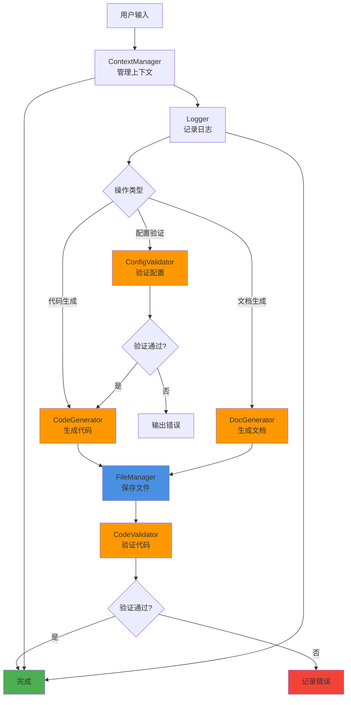

# 脚本集成示例

本文档展示如何组合使用 scripts 目录下的 6 个脚本项目来构建完整的功能模块。

## 概述

scripts 目录包含以下 6 个核心模块：

1. **generators** - 代码和文档生成器（code-generator.ts, doc-generator.ts）
2. **utils** - 工具类（logger.ts, file-manager.ts, context-manager.ts）
3. **validators** - 验证器（code-validator.ts, config-validator.ts）

## 完整集成示例

### 场景 1：代码生成 + 验证 + 日志记录

这个场景展示如何生成代码、验证质量、并记录日志。

```typescript
import { Logger } from "./utils/logger";
import { FileManager } from "./utils/file-manager";
import { CodeValidator } from "./validators/code-validator";
import { CodeGenerator } from "./generators/code-generator";

/**
 * 组件代码生成器
 * 集成：CodeGenerator + CodeValidator + Logger + FileManager
 */
class ComponentCodeGenerator {
    private logger: Logger;
    private fileManager: FileManager;
    private codeGenerator: CodeGenerator;
    private codeValidator: CodeValidator;

    constructor() {
        this.logger = new Logger("ComponentGenerator", {
            level: "info",
            console: true,
            file: true,
            filePath: "./logs/generator.log"
        });

        this.fileManager = new FileManager();
        this.codeGenerator = new CodeGenerator();
        this.codeValidator = new CodeValidator();
    }

    /**
     * 生成并验证组件代码
     */
    async generateAndValidateComponent(componentSpec: ComponentSpec): Promise<void> {
        this.logger.info(`开始生成组件: ${componentSpec.name}`);

        try {
            // 1. 使用 CodeGenerator 生成代码
            const code = await this.codeGenerator.generateComponent({
                name: componentSpec.name,
                type: componentSpec.type,
                props: componentSpec.props
            });

            this.logger.debug(`代码生成完成: ${code.length} 字符`);

            // 2. 使用 FileManager 保存代码
            const outputPath = `./src/components/${componentSpec.name}.tsx`;
            await this.fileManager.writeFile(outputPath, code);

            this.logger.debug(`代码已保存到: ${outputPath}`);

            // 3. 使用 CodeValidator 验证代码
            const validation = await this.codeValidator.validateCode(code, {
                language: "typescript",
                rules: {
                    eslint: true,
                    security: true,
                    typescript: true
                }
            });

            // 4. 记录验证结果
            if (validation.isValid) {
                this.logger.info(`组件验证通过: ${componentSpec.name}`, {
                    score: validation.score
                });
            } else {
                this.logger.warn(`组件验证失败: ${componentSpec.name}`, {
                    errors: validation.errors.length,
                    warnings: validation.warnings.length
                });

                // 输出详细错误
                validation.errors.forEach((error, index) => {
                    this.logger.error(`错误 ${index + 1}`, {
                        file: outputPath,
                        line: error.line,
                        rule: error.rule,
                        message: error.message
                    });
                });
            }

            // 5. 如果验证失败，可以选择是否修复
            if (!validation.isValid && validation.autoFixAvailable) {
                this.logger.info("尝试自动修复问题");
                const fixedCode = await this.codeValidator.fix(code, validation.errors);
                await this.fileManager.writeFile(outputPath, fixedCode);
                this.logger.info("自动修复完成");
            }

        } catch (error) {
            this.logger.error("组件生成失败", { error: error.message, componentSpec });
            throw error;
        }
    }
}

// 使用示例
const generator = new ComponentCodeGenerator();

await generator.generateAndValidateComponent({
    name: "UserCard",
    type: "react",
    props: [
        { name: "name", type: "string", required: true },
        { name: "age", type: "number", required: false }
    ]
});
```

### 场景 2：文档生成 + 文件管理 + 上下文传递

这个场景展示如何生成文档、管理文件、并在技能间传递上下文。

```typescript
import { Logger } from "./utils/logger";
import { FileManager } from "./utils/file-manager";
import { ContextManager } from "./utils/context-manager";
import { DocGenerator } from "./generators/doc-generator";

/**
 * 文档生成器
 * 集成：DocGenerator + FileManager + ContextManager + Logger
 */
class DocumentGenerator {
    private logger: Logger;
    private fileManager: FileManager;
    private contextManager: ContextManager;
    private docGenerator: DocGenerator;

    constructor() {
        this.logger = new Logger("DocGenerator", {
            level: "info",
            format: "text"
        });

        this.fileManager = new FileManager();
        this.contextManager = new ContextManager();
        this.docGenerator = new DocGenerator();
    }

    /**
     * 生成项目文档
     */
    async generateProjectDocs(projectContext: ProjectContext): Promise<void> {
        this.logger.info("开始生成项目文档");

        try {
            // 1. 保存项目上下文，供后续技能使用
            this.contextManager.set("project", projectContext);
            this.contextManager.set("timestamp", new Date().toISOString());

            // 2. 创建输出目录
            const outputDir = "./docs";
            await this.fileManager.createDirectory(outputDir, true);

            this.logger.debug(`输出目录已创建: ${outputDir}`);

            // 3. 生成 README
            const readmeContent = await this.docGenerator.generateREADME({
                title: projectContext.name,
                description: projectContext.description,
                installation: projectContext.installation,
                usage: projectContext.usage
            });

            await this.fileManager.writeFile(
                `${outputDir}/README.md`,
                readmeContent
            );

            this.logger.debug("README.md 已生成");

            // 4. 生成 API 文档
            if (projectContext.apiSpecs && projectContext.apiSpecs.length > 0) {
                const apiDocContent = await this.docGenerator.generateAPIDocumentation({
                    basePath: "/api",
                    endpoints: projectContext.apiSpecs
                });

                await this.fileManager.writeFile(
                    `${outputDir}/API.md`,
                    apiDocContent
                );

                this.logger.debug("API.md 已生成");
            }

            // 5. 生成项目文档
            const projectDocContent = await this.docGenerator.generateProjectDocumentation({
                sections: [
                    "architecture",
                    "development",
                    "deployment",
                    "troubleshooting"
                ]
            });

            await this.fileManager.writeFile(
                `${outputDir}/PROJECT.md`,
                projectDocContent
            );

            this.logger.debug("PROJECT.md 已生成");

            // 6. 记录文档生成结果
            this.logger.info("项目文档生成完成", {
                outputDir,
                files: ["README.md", "API.md", "PROJECT.md"],
                context: this.contextManager.serialize()
            });

        } catch (error) {
            this.logger.error("文档生成失败", { error: error.message });
            throw error;
        }
    }

    /**
     * 获取上下文供其他技能使用
     */
    getContext(): ContextManager {
        return this.contextManager;
    }
}

// 使用示例
const docGen = new DocumentGenerator();

await docGen.generateProjectDocs({
    name: "Shell Formatter",
    description: "智能Shell脚本格式化和错误检查工具",
    installation: "npm install shell-formatter",
    usage: "在VSCode中安装扩展即可使用",
    apiSpecs: [
        {
            method: "GET",
            path: "/format",
            description: "格式化Shell脚本",
            response: "FormattedScript"
        }
    ]
});

// 其他技能可以获取上下文
const context = docGen.getContext();
const projectName = context.get<Project>("project").name;
```

### 场景 3：批量生成 + 验证 + 报告

这个场景展示如何批量生成多个文件、统一验证、并生成报告。

```typescript
import { Logger } from "./utils/logger";
import { FileManager } from "./utils/file-manager";
import { CodeValidator } from "./validators/code-validator";
import { CodeGenerator } from "./generators/code-generator";

/**
 * 批量代码生成器
 * 集成：CodeGenerator + CodeValidator + FileManager + Logger
 */
class BatchCodeGenerator {
    private logger: Logger;
    private fileManager: FileManager;
    private codeValidator: CodeValidator;
    private codeGenerator: CodeGenerator;

    constructor() {
        this.logger = new Logger("BatchGenerator", {
            level: "info"
        });

        this.fileManager = new FileManager();
        this.codeValidator = new CodeValidator();
        this.codeGenerator = new CodeGenerator();
    }

    /**
     * 批量生成组件
     */
    async generateBatch(components: ComponentSpec[]): Promise<BatchResult> {
        this.logger.info(`开始批量生成 ${components.length} 个组件`);

        // 开始性能计时
        this.logger.startTimer("batch-generation");

        const results: BatchResult = {
            total: components.length,
            success: 0,
            failed: 0,
            errors: [],
            warnings: []
        };

        try {
            // 1. 创建输出目录
            await this.fileManager.createDirectory("./src/components", true);

            // 2. 批量生成代码
            const codes = await Promise.all(
                components.map(spec =>
                    this.codeGenerator.generateComponent(spec)
                )
            );

            this.logger.debug(`代码批量生成完成`);

            // 3. 批量保存文件
            await Promise.all(
                codes.map((code, index) =>
                    this.fileManager.writeFile(
                        `./src/components/${components[index].name}.tsx`,
                        code
                    )
                )
            );

            this.logger.debug(`文件批量保存完成`);

            // 4. 批量验证代码
            const validations = await Promise.all(
                codes.map(code =>
                    this.codeValidator.validateCode(code, {
                        language: "typescript",
                        rules: { eslint: true }
                    })
                )
            );

            // 5. 汇总验证结果
            validations.forEach((validation, index) => {
                if (validation.isValid) {
                    results.success++;
                    this.logger.info(`组件验证通过: ${components[index].name}`, {
                        score: validation.score
                    });
                } else {
                    results.failed++;
                    this.logger.warn(`组件验证失败: ${components[index].name}`, {
                        errors: validation.errors.length
                    });

                    // 收集错误和警告
                    results.errors.push(...validation.errors);
                    results.warnings.push(...validation.warnings);
                }
            });

            // 6. 生成验证报告
            const report = this.generateValidationReport(results, components);
            await this.fileManager.writeFile(
                "./validation-report.md",
                report
            );

            this.logger.info("验证报告已生成");

        } catch (error) {
            this.logger.error("批量生成失败", { error: error.message });
            throw error;
        } finally {
            // 结束性能计时
            this.logger.endTimer("batch-generation");
        }

        return results;
    }

    /**
     * 生成验证报告
     */
    private generateValidationReport(results: BatchResult, components: ComponentSpec[]): string {
        return `
# 代码生成验证报告

生成时间: ${new Date().toISOString()}
组件总数: ${results.total}
成功: ${results.success}
失败: ${results.failed}

## 错误摘要

${results.errors.length > 0 ? `共发现 ${results.errors.length} 个错误` : '无错误'}

${results.errors.length > 0 ? results.errors.map((e, i) => `
### 错误 ${i + 1}
- 文件: ${e.file}
- 行号: ${e.line}
- 规则: ${e.rule}
- 消息: ${e.message}
- 建议: ${e.suggestion || '无'}
`).join('\n') : ''}

## 警告摘要

${results.warnings.length > 0 ? `共发现 ${results.warnings.length} 个警告` : '无警告'}

${results.warnings.length > 0 ? results.warnings.map((w, i) => `
### 警告 ${i + 1}
- 文件: ${w.file}
- 行号: ${w.line}
- 规则: ${w.rule}
- 消息: ${w.message}
`).join('\n') : ''}
`;
    }
}

// 使用示例
const batchGen = new BatchCodeGenerator();

const components = [
    { name: "UserCard", type: "react", props: [{ name: "name", type: "string" }] },
    { name: "PostCard", type: "react", props: [{ name: "title", type: "string" }] },
    { name: "CommentCard", type: "react", props: [{ name: "content", type: "string" }] }
];

const result = await batchGen.generateBatch(components);

console.log(`生成完成: ${result.success}/${result.total}`);
console.log(`验证报告: ./validation-report.md`);
```

### 场景 4：配置验证 + 生成 + 上下文管理

这个场景展示如何验证配置、根据配置生成代码、管理上下文。

```typescript
import { Logger } from "./utils/logger";
import { FileManager } from "./utils/file-manager";
import { ContextManager } from "./utils/context-manager";
import { ConfigValidator } from "./validators/config-validator";
import { CodeGenerator } from "./generators/code-generator";

/**
 * 配置驱动代码生成器
 * 集成：ConfigValidator + CodeGenerator + ContextManager + FileManager + Logger
 */
class ConfigDrivenGenerator {
    private logger: Logger;
    private fileManager: FileManager;
    private contextManager: ContextManager;
    private configValidator: ConfigValidator;
    private codeGenerator: CodeGenerator;

    constructor() {
        this.logger = new Logger("ConfigDrivenGenerator", {
            level: "info"
        });

        this.fileManager = new FileManager();
        this.contextManager = new ContextManager();
        this.configValidator = new ConfigValidator();
        this.codeGenerator = new CodeGenerator();
    }

    /**
     * 根据配置生成代码
     */
    async generateFromConfig(configPath: string): Promise<void> {
        this.logger.info(`开始处理配置: ${configPath}`);

        try {
            // 1. 验证配置文件
            const configValidation = await this.configValidator.validate(configPath, {
                schema: "project"
            });

            if (!configValidation.isValid) {
                this.logger.error("配置验证失败", {
                    errors: configValidation.errors
                });

                // 输出配置错误
                configValidation.errors.forEach(error => {
                    this.logger.error(`配置错误`, {
                        path: error.path,
                        message: error.message
                    });
                });

                throw new Error("配置文件无效，无法继续生成");
            }

            this.logger.info("配置验证通过");

            // 2. 读取并保存配置到上下文
            const config = await this.fileManager.readFile(configPath);
            const configObj = JSON.parse(config);

            this.contextManager.set("config", configObj);
            this.contextManager.set("configPath", configPath);

            // 3. 根据配置生成代码
            if (configObj.components) {
                for (const componentSpec of configObj.components) {
                    this.logger.info(`生成组件: ${componentSpec.name}`);

                    const code = await this.codeGenerator.generateComponent({
                        name: componentSpec.name,
                        type: configObj.framework || "react",
                        props: componentSpec.props || []
                    });

                    // 4. 保存生成的代码
                    const outputPath = `./src/components/${componentSpec.name}.tsx`;
                    await this.fileManager.writeFile(outputPath, code);

                    this.logger.debug(`组件已保存: ${outputPath}`);
                }
            }

            // 5. 生成配置文件
            if (configObj.generateConfigs) {
                const eslintConfig = await this.codeGenerator.generateConfig({
                    type: "eslint",
                    framework: configObj.framework,
                    features: configObj.features || []
                });

                await this.fileManager.writeFile(
                    "./.eslintrc.json",
                    eslintConfig
                );

                this.logger.debug("ESLint配置已生成");
            }

            // 6. 生成项目文档
            const docContent = await this.docGenerator.generateREADME({
                title: configObj.name,
                description: configObj.description
            });

            await this.fileManager.writeFile("./README.md", docContent);

            this.logger.info("代码生成完成", {
                components: configObj.components?.length || 0,
                configPath,
                context: this.contextManager.serialize()
            });

        } catch (error) {
            this.logger.error("代码生成失败", { error: error.message });
            throw error;
        }
    }
}

// 使用示例
const configGen = new ConfigDrivenGenerator();

await configGen.generateFromConfig("./project.config.json");
```

## 完整的数据流图



## 最佳实践

### 1. 日志记录

始终使用 Logger 记录关键操作：

```typescript
// ✅ 推荐
this.logger.info("操作开始");
this.logger.debug("调试信息", { data });
this.logger.error("错误信息", { error });

// ❌ 不推荐
console.log("操作开始");
```

### 2. 错误处理

使用 try-catch 包裹可能失败的操作：

```typescript
try {
    const result = await generator.generate(options);
} catch (error) {
    this.logger.error("操作失败", { error });
    // 根据错误类型决定是否继续
    if (error.isFatal) {
        throw error;
    }
}
```

### 3. 上下文管理

使用 ContextManager 在技能间传递数据：

```typescript
// 设置上下文
this.contextManager.set("userId", "123");
this.contextManager.set("project", { name: "My Project" });

// 获取上下文
const project = this.contextManager.get<Project>("project");

// 序列化保存
const serialized = this.contextManager.serialize();
```

### 4. 批量操作

使用 Promise.all 提高性能：

```typescript
// ✅ 推荐：并行批量操作
const results = await Promise.all(
    files.map(file => this.fileManager.readFile(file))
);

// ❌ 不推荐：串行操作
for (const file of files) {
    const result = await this.fileManager.readFile(file);
}
```

### 5. 验证优先

先验证再执行后续操作：

```typescript
// 1. 验证配置
const configValid = await configValidator.validate("./config.json");
if (!configValid.isValid) {
    throw new Error("配置无效");
}

// 2. 再进行生成
const code = await codeGenerator.generate(config);
```

## 测试示例

### 单元测试

```typescript
describe('ComponentCodeGenerator', () => {
    let generator: ComponentCodeGenerator;

    beforeEach(() => {
        generator = new ComponentCodeGenerator();
    });

    it('should generate and validate component', async () => {
        const spec = {
            name: "TestComponent",
            type: "react",
            props: [{ name: "title", type: "string" }]
        };

        await generator.generateAndValidateComponent(spec);

        // 验证文件已创建
        const exists = await fileManager.fileExists("./src/components/TestComponent.tsx");
        expect(exists).toBe(true);
    });

    it('should log generation process', async () => {
        const loggerSpy = jest.spyOn(generator['logger'], 'info');

        await generator.generateAndValidateComponent({
            name: "TestComponent",
            type: "react",
            props: []
        });

        expect(loggerSpy).toHaveBeenCalledWith(
            expect.stringContaining("开始生成组件")
        );
    });
});
```

### 集成测试

```typescript
describe('BatchCodeGenerator', () => {
    it('should generate batch with validation', async () => {
        const batchGen = new BatchCodeGenerator();
        const components = [
            { name: "Comp1", type: "react", props: [] },
            { name: "Comp2", type: "react", props: [] }
        ];

        const result = await batchGen.generateBatch(components);

        expect(result.total).toBe(2);
        expect(result.success + result.failed).toBe(2);

        // 验证报告文件
        const reportExists = await fileManager.fileExists("./validation-report.md");
        expect(reportExists).toBe(true);
    });
});
```

## 常见问题

### Q1: 如何选择合适的 Generator？

A: 根据需求选择：

- 代码生成：使用 CodeGenerator
- 文档生成：使用 DocGenerator
- 自定义生成：继承并扩展相应的 Generator

### Q2: 验证失败后是否继续？

A: 可以根据策略选择：

- 严格模式：验证失败则停止
- 宽松模式：记录警告但继续
- 自动修复：尝试自动修复问题

### Q3: 如何处理批量操作中的错误？

A: 使用 Promise.allSettled 而不是 Promise.all：

```typescript
const results = await Promise.allSettled(
    items.map(item => processItem(item))
);

const failed = results.filter(r => r.status === 'rejected');
const succeeded = results.filter(r => r.status === 'fulfilled');
```

### Q4: 上下文数据会丢失吗？

A: ContextManager 默认在内存中，如需持久化：

- 使用 serialize() 保存到文件
- 使用 deserialize() 从文件加载
- 定期保存上下文快照

## 更多信息

- [generators/README.md](./generators/README.md) - 生成器详细文档
- [utils/README.md](./utils/README.md) - 工具类详细文档
- [validators/README.md](./validators/README.md) - 验证器详细文档
- [../test/README.md](../test/README.md) - 测试指南
