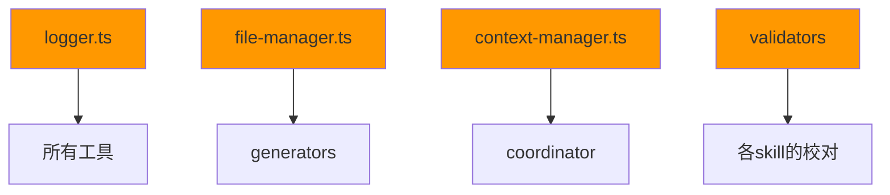

# 全局工具脚本文档

本目录包含所有技能共用的工具脚本，提供代码生成、文件管理、上下文管理、日志记录、验证等通用功能。

## 目录结构

```tree
scripts/
├── generators/          # 代码和文档生成器
│   ├── code-generator.ts
│   ├── doc-generator.ts
│   └── README.md
├── utils/               # 工具类
│   ├── context-manager.ts
│   ├── file-manager.ts
│   ├── logger.ts
│   └── README.md
└── validators/          # 验证器
    ├── code-validator.ts
    ├── config-validator.ts
    └── README.md
```

## 设计原则

### 1. 通用性

所有脚本都是通用的，不依赖于特定的skill或业务逻辑，可以在任何skill中复用。

### 2. 可配置性

脚本支持灵活的配置选项，可以根据不同场景进行调整。

### 3. 可扩展性

使用面向对象设计，支持继承和扩展。

### 4. 类型安全

使用TypeScript编写，提供完整的类型定义和类型检查。

### 5. 错误处理

统一的错误处理机制，提供清晰的错误信息和日志记录。

## 使用方式

### 在Skill中使用

```typescript
import { Logger } from "@codebuddy/scripts/utils/logger";
import { FileManager } from "@codebuddy/scripts/utils/file-manager";
import { ContextManager } from "@codebuddy/scripts/utils/context-manager";
import { CodeValidator } from "@codebuddy/scripts/validators/code-validator";

const logger = new Logger("MySkill");
const fileManager = new FileManager();
const contextManager = new ContextManager();
const validator = new CodeValidator();

// 使用工具
logger.info("开始执行");
await fileManager.writeFile("./output.txt", "Hello");
contextManager.set("status", "running");
const result = await validator.validate("./src");
```

## 依赖关系

### 核心依赖

- `logger.ts`：被所有其他工具使用
- `file-manager.ts`：被generators使用
- `context-manager.ts`：被coordinator使用
- `validators`：被各skill的校对机制使用

### 依赖图



## 最佳实践

### 1. 日志使用

始终使用Logger工具进行日志记录，避免直接使用`console.log`：

```typescript
// ✅ 推荐
import { Logger } from "@codebuddy/scripts/utils/logger";
const logger = new Logger("MySkill");
logger.info("开始执行任务");
logger.error("任务失败", { error: err });

// ❌ 不推荐
console.log("开始执行任务");
console.error("任务失败");
```

### 2. 文件操作

使用FileManager进行文件操作，自动处理路径和错误：

```typescript
// ✅ 推荐
import { FileManager } from "@codebuddy/scripts/utils/file-manager";
const fm = new FileManager();
await fm.writeFile("./output.txt", content);

// ❌ 不推荐
import * as fs from "fs";
fs.writeFileSync("./output.txt", content);
```

### 3. 配置管理

使用统一的配置接口，确保配置的一致性：

```typescript
interface SkillConfig {
  logger?: Partial<LoggerConfig>;
  validator?: ValidatorConfig;
}

const config: SkillConfig = {
  logger: {
    level: LogLevel.DEBUG,
    file: true
  }
};
```

### 4. 错误处理

始终捕获和处理工具抛出的错误：

```typescript
try {
  const result = await validator.validate("./src");
} catch (error) {
  logger.error("验证失败", { error });
  throw error;
}
```

## 扩展指南

### 添加新工具

1. 确定工具类别（generators/utils/validators）

2. 创建TypeScript文件，实现工具功能

3. 编写单元测试

4. 更新本README文档

5. 在skill中引用并使用

### 示例：添加新的Generator

```typescript
// scripts/generators/test-generator.ts
export class TestGenerator {
  async generate(options: GenerateOptions): Promise<string> {
    // 实现生成逻辑
    return "";
  }
}
```

## 质量保证

### 测试覆盖

- 所有工具必须有单元测试
- 测试覆盖率 >= 80%
- 包含边界情况和错误处理测试

### 代码规范

- 遵循TypeScript严格模式
- 使用ESLint进行代码检查
- 添加完整的类型定义和注释

### 文档要求

- 每个导出的类和函数必须有JSDoc注释
- 说明参数、返回值、使用示例
- 更新README文档

## 维护指南

### 版本管理

- 重大变更时更新版本号
- 保持向后兼容性
- 记录变更日志

### Bug修复

- 及时修复发现的bug
- 添加回归测试
- 更新文档

### 性能优化

- 定期进行性能分析
- 优化热点代码
- 避免不必要的资源消耗

## 参考资源

- **编码规范**：`references/best-practices/coding.md`
- **设计模式**：`references/design-patterns/`
- **架构原则**：`references/architecture/`

---

**最后更新**：2026-01-25
**维护者**：.codebuddy团队
