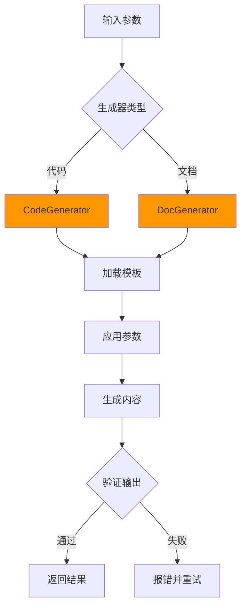

# Generators 生成器

本目录包含代码和文档生成器，用于自动化生成代码、配置文件、文档等内容。

## 生成器列表

### 1. CodeGenerator (code-generator.ts)

代码生成器，用于自动生成各种代码文件和组件。

**功能**：

- 组件代码生成
- API代码生成
- 配置文件生成
- 模板代码生成
- 测试代码生成

**使用示例**：

```typescript
import { CodeGenerator } from "@codebuddy/scripts/generators/code-generator";

const generator = new CodeGenerator();

// 生成React组件
const component = await generator.generateComponent({
  name: "UserCard",
  type: "react",
  props: [
    { name: "name", type: "string", required: true },
    { name: "age", type: "number", required: false }
  ]
});

// 生成API接口
const api = await generator.generateAPI({
  name: "getUser",
  method: "GET",
  path: "/api/users/:id",
  response: "User"
});

// 生成配置文件
const config = await generator.generateConfig({
  type: "eslint",
  framework: "react",
  features: ["typescript", "prettier"]
});
```

**配置选项**：

```typescript
interface CodeGeneratorOptions {
  language: 'typescript' | 'javascript' | 'python';
  framework?: 'react' | 'vue' | 'express' | 'fastapi';
  style?: 'functional' | 'class';
  features?: string[];
}
```

---

### 2. DocGenerator (doc-generator.ts)

文档生成器，用于自动生成各种文档。

**功能**：

- API文档生成
- README生成
- 项目文档生成
- 技术文档生成
- 用户手册生成

**使用示例**：

```typescript
import { DocGenerator } from "@codebuddy/scripts/generators/doc-generator";

const generator = new DocGenerator();

// 生成README
const readme = await generator.generateREADME({
  title: "My Project",
  description: "项目描述",
  installation: "npm install",
  usage: "npm start"
});

// 生成API文档
const apiDoc = await generator.generateAPIDocumentation({
  basePath: "/api",
  endpoints: [
    {
      method: "GET",
      path: "/users",
      description: "获取用户列表",
      response: "User[]"
    }
  ]
});

// 生成项目文档
const projectDoc = await generator.generateProjectDocumentation({
  sections: [
    "architecture",
    "development",
    "deployment",
    "troubleshooting"
  ]
});
```

---

## 生成器工作流程



## 模板系统

### 1. 内置模板

生成器提供丰富的内置模板：

```typescript
// React组件模板
const reactComponentTemplate = `
import React from 'react';

interface {{ComponentName}}Props {
  {{props}}
}

export const {{ComponentName}}: React.FC<{{ComponentName}}Props> = (props) => {
  return (
    <div>
      {{content}}
    </div>
  );
};
`;
```

### 2. 自定义模板

用户可以提供自定义模板：

```typescript
const customTemplate = `
// My custom template
{{placeholder}}
`;

const result = await generator.generateWithTemplate(customTemplate, {
  placeholder: "replacement value"
});
```

### 3. 模板变量

支持的模板变量：

| 变量 | 说明 | 示例 |
|------|------|------|
| `{{ComponentName}}` | 组件名称 | `UserCard` |
| `{{props}}` | Props定义 | `name: string; age: number` |
| `{{imports}}` | 导入语句 | `import React from 'react'` |
| `{{content}}` | 内容占位符 | 组件内容 |

## 代码生成规范

### 1. 命名规范

```typescript
// 组件名称：PascalCase
const componentName = "UserCard";

// 文件名称：kebab-case
const fileName = "user-card.tsx";

// 函数名称：camelCase
const functionName = "getUserData";
```

### 2. 代码风格

```typescript
// 使用TypeScript严格模式
const result: ResultType = await fetch();

// 使用箭头函数
const handleClick = () => {
  // ...
};

// 使用解构赋值
const { name, age } = user;
```

### 3. 注释规范

```typescript
/**
 * 获取用户信息
 * @param id - 用户ID
 * @returns 用户信息
 */
async function getUser(id: string): Promise<User> {
  // 实现
}
```

## 文档生成规范

### 1. Markdown格式

所有生成的文档使用Markdown格式：

```markdown
# {{Title}}

## {{Section}}

{{Content}}
```

### 2. 文档结构

标准文档结构：

```markdown
1. 标题
2. 简介
3. 安装/配置
4. 使用方法
5. API文档
6. 示例
7. FAQ
8. 贡献指南
```

### 3. 代码块

代码块必须指定语言：

```typescript
const x = 1;
```

## 扩展指南

### 添加新的生成器

```typescript
// scripts/generators/test-generator.ts
export class TestGenerator {
  async generate(options: GenerateOptions): Promise<string> {
    // 1. 加载模板
    const template = this.loadTemplate("test");

    // 2. 应用参数
    const content = template.replace(/\{\{(\w+)\}\}/g, (match, key) => {
      return options[key as keyof GenerateOptions] || "";
    });

    // 3. 返回结果
    return content;
  }

  private loadTemplate(name: string): string {
    // 加载模板逻辑
  }
}
```

### 添加自定义模板

```typescript
class CustomCodeGenerator extends CodeGenerator {
  protected getCustomTemplates(): Record<string, string> {
    return {
      "custom-component": `
        // Custom component template
        {{content}}
      `
    };
  }
}
```

## 集成到Skill

### 在SKILL.md中引用

## 🛠️ 工具脚本

### 全局工具脚本

本skill使用以下全局工具脚本：

- **CodeGenerator**：`scripts/generators/code-generator.ts`

  ```typescript
  import { CodeGenerator } from "@codebuddy/scripts/generators/code-generator";
  const generator = new CodeGenerator();
  const component = await generator.generateComponent(options);
  ```

### 使用示例

```typescript
async function generateComponentCode(componentSpec: ComponentSpec): Promise<string> {
  const generator = new CodeGenerator();

  const code = await generator.generateComponent({
    name: componentSpec.name,
    type: "react",
    props: componentSpec.props
  });

  // 写入文件
  await fileManager.writeFile(`./src/components/${componentSpec.name}.tsx`, code);

  return code;
}
```

## 最佳实践

### 1. 模板管理

- 使用版本控制管理模板
- 提供多种风格的模板
- 支持模板继承和组合

### 2. 参数验证

```typescript
function validateOptions(options: GenerateOptions): void {
  if (!options.name) {
    throw new Error("Component name is required");
  }

  if (!options.type) {
    options.type = "react"; // 默认值
  }
}
```

### 3. 错误处理

```typescript
try {
  const result = await generator.generate(options);
} catch (error) {
  logger.error("代码生成失败", { error, options });
  throw new Error(`代码生成失败: ${error.message}`);
}
```

### 4. 结果验证

```typescript
const result = await generator.generate(options);

// 验证生成的代码
const validator = new CodeValidator();
const validation = await validator.validateCode(result, {
  language: "typescript"
});

if (!validation.isValid) {
  throw new Error("生成的代码验证失败");
}
```

## 性能优化

### 1. 模板缓存

```typescript
class TemplateCache {
  private cache = new Map<string, string>();

  get(name: string): string {
    if (!this.cache.has(name)) {
      this.cache.set(name, this.loadTemplate(name));
    }
    return this.cache.get(name)!;
  }
}
```

### 2. 批量生成

```typescript
const results = await generator.generateBatch([
  { name: "UserCard", type: "react" },
  { name: "PostCard", type: "react" },
  { name: "CommentCard", type: "react" }
]);
```

### 3. 增量生成

```typescript
// 只生成变更的文件
const changedFiles = await getChangedFiles();
for (const file of changedFiles) {
  await generator.generate(file);
}
```

## 测试

```typescript
describe('CodeGenerator', () => {
  it('should generate React component', async () => {
    const generator = new CodeGenerator();
    const result = await generator.generateComponent({
      name: "UserCard",
      type: "react"
    });

    expect(result).toContain("UserCard");
    expect(result).toContain("React.FC");
  });
});
```

---

**最后更新**：2026-01-25
**维护者**：.codebuddy团队
