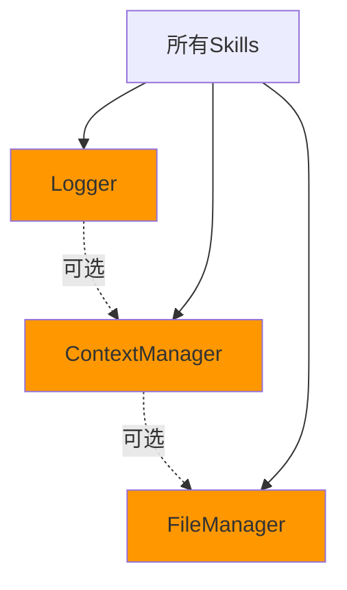

# Utils 工具类

本目录包含通用的工具类，提供日志记录、文件管理、上下文管理等基础功能。

## 工具列表

### 1. Logger (logger.ts)

统一的日志工具，支持多种日志级别、格式化输出、文件记录和远程日志服务。

**功能**：

- 多级别日志（DEBUG、INFO、WARN、ERROR）
- 支持文本和JSON格式
- 可输出到控制台、文件和远程服务
- 结构化日志（带metadata）
- 性能计时功能

**使用示例**：

```typescript
import { Logger, LogLevel } from "@codebuddy/scripts/utils/logger";

const logger = new Logger("MySkill", {
  level: LogLevel.INFO,
  format: "text",
  console: true,
  file: true,
  filePath: "./logs/skill.log"
});

logger.info("开始执行任务");
logger.debug("调试信息", { data: "value" });
logger.warn("警告信息");
logger.error("错误信息", { error: err });

// 性能计时
logger.startTimer("operation");
// ... 执行操作
logger.endTimer("operation"); // 输出: operation 耗时: 123ms

// Skill完成记录
logger.skillComplete("MySkill", 10000); // 记录技能执行完成
```

**配置选项**：

```typescript
interface LoggerConfig {
  level: LogLevel;           // 日志级别
  format: 'json' | 'text';   // 输出格式
  console: boolean;           // 是否输出到控制台
  file?: boolean;            // 是否写入文件
  filePath?: string;          // 日志文件路径
  remote?: boolean;           // 是否发送到远程服务
  remoteUrl?: string;         // 远程服务URL
}
```

**最佳实践**：

- 在skill开始时创建Logger实例
- 使用合适的日志级别（INFO用于正常流程，DEBUG用于调试，WARN用于警告，ERROR用于错误）
- 使用metadata记录额外的上下文信息
- 使用性能计时功能监控关键操作

---

### 2. FileManager (file-manager.ts)

文件管理工具，提供文件和目录操作的统一接口。

**功能**：

- 创建和删除目录
- 读写文件
- 文件存在性检查
- 递归文件操作
- 错误处理和重试

**使用示例**：

```typescript
import { FileManager } from "@codebuddy/scripts/utils/file-manager";

const fm = new FileManager();

// 目录操作
await fm.createDirectory("./output");
await fm.deleteDirectory("./output", true); // 递归删除

// 文件操作
await fm.writeFile("./output/test.txt", "Hello World");
const content = await fm.readFile("./output/test.txt");
const exists = await fm.fileExists("./output/test.txt");
await fm.deleteFile("./output/test.txt");

// 批量操作
await fm.copyFile("./src", "./dest");
await fm.moveFile("./old/path", "./new/path");
```

**最佳实践**：

- 使用FileManager而不是直接使用fs模块
- 检查文件存在性再进行操作
- 捕获并处理可能的错误
- 使用绝对路径避免路径混乱

---

### 3. ContextManager (context-manager.ts)

上下文管理工具，用于在skill调用之间传递和管理上下文数据。

**功能**：

- 键值对存储
- 类型安全的get/set
- 上下文序列化和反序列化
- 上下文版本管理

**使用示例**：

```typescript
import { ContextManager } from "@codebuddy/scripts/utils/context-manager";

const ctx = new ContextManager();

// 设置上下文
ctx.set("userId", "12345");
ctx.set("userName", "Alice");
ctx.set("project", {
  id: "proj_001",
  name: "My Project"
});

// 获取上下文
const userId = ctx.get("userId");
const project = ctx.get<Project>("project");

// 检查存在性
if (ctx.has("userId")) {
  // ...
}

// 删除上下文
ctx.delete("userId");

// 清空所有上下文
ctx.clear();

// 序列化/反序列化
const serialized = ctx.serialize();
const newCtx = ContextManager.deserialize(serialized);
```

**最佳实践**：

- 使用有意义的键名（如"userId"而不是"u"）
- 使用泛型确保类型安全
- 及时清理不再需要的上下文
- 定期序列化保存上下文状态

## 依赖关系



## 通用设计模式

### 1. 单例模式

某些工具可能需要单例实现，确保全局唯一：

```typescript
class SingletonLogger {
  private static instance: Logger;
  
  static getInstance(context: string): Logger {
    if (!SingletonLogger.instance) {
      SingletonLogger.instance = new Logger(context);
    }
    return SingletonLogger.instance;
  }
}
```

### 2. 工厂模式

根据配置创建不同的工具实例：

```typescript
class LoggerFactory {
  static create(config: LoggerConfig): Logger {
    return new Logger("default", config);
  }
}
```

### 3. 策略模式

支持不同的文件操作策略：

```typescript
interface FileStrategy {
  read(path: string): Promise<string>;
  write(path: string, content: string): Promise<void>;
}

class LocalFileStrategy implements FileStrategy {
  // 本地文件实现
}

class S3FileStrategy implements FileStrategy {
  // S3文件实现
}
```

## 错误处理

所有工具都遵循统一的错误处理模式：

```typescript
try {
  const result = await fm.readFile("./test.txt");
} catch (error) {
  // 1. 记录错误
  logger.error("文件读取失败", { error, path: "./test.txt" });
  
  // 2. 判断错误类型
  if (error.code === 'ENOENT') {
    // 文件不存在
  } else if (error.code === 'EACCES') {
    // 权限不足
  }
  
  // 3. 抛出或处理
  throw new Error(`无法读取文件: ${error.message}`);
}
```

## 性能考虑

### 1. 批量操作

对于大量文件操作，使用批量接口：

```typescript
// ❌ 不推荐：多次调用
for (const file of files) {
  await fm.writeFile(file.path, file.content);
}

// ✅ 推荐：批量操作
await fm.writeFiles(files);
```

### 2. 缓存

频繁访问的数据应该缓存：

```typescript
class CachedFileManager {
  private cache = new Map<string, string>();
  
  async readFile(path: string): Promise<string> {
    if (this.cache.has(path)) {
      return this.cache.get(path)!;
    }
    const content = await fm.readFile(path);
    this.cache.set(path, content);
    return content;
  }
}
```

### 3. 流式处理

大文件使用流式处理：

```typescript
await fm.writeStream("./large.txt", stream);
const stream = await fm.readStream("./large.txt");
```

## 测试

每个工具都应该有完整的单元测试：

```typescript
describe('FileManager', () => {
  it('should write and read file', async () => {
    const fm = new FileManager();
    await fm.writeFile("./test.txt", "Hello");
    const content = await fm.readFile("./test.txt");
    expect(content).toBe("Hello");
  });
  
  it('should handle non-existent file', async () => {
    const fm = new FileManager();
    await expect(fm.readFile("./non-existent.txt"))
      .rejects.toThrow();
  });
});
```

---

**最后更新**：2026-01-25
**维护者**：.codebuddy团队
