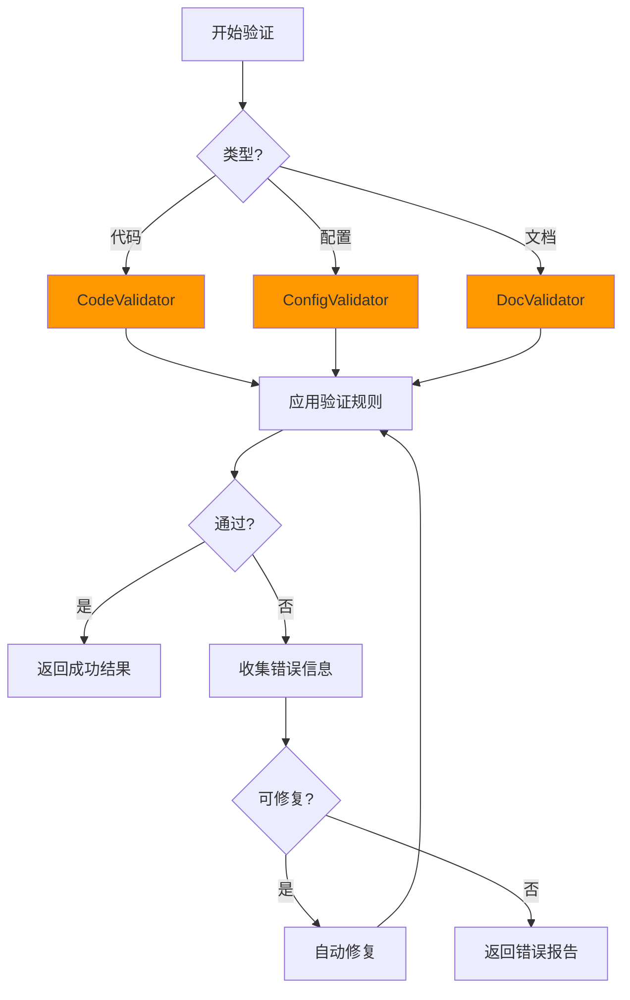

# Validators 验证器

本目录包含各种验证器，用于代码质量检查、配置验证、文档合规性检查等。

## 验证器列表

### 1. CodeValidator (code-validator.ts)

代码验证器，用于检查代码质量、规范性和安全性。

**功能**：

- 代码规范检查
- 类型检查
- 安全漏洞检测
- 性能分析
- 依赖检查

**使用示例**：

```typescript
import { CodeValidator } from "@codebuddy/scripts/validators/code-validator";

const validator = new CodeValidator();

const result = await validator.validate("./src", {
  language: "typescript",
  rules: {
    eslint: true,
    security: true,
    performance: true
  }
});

if (result.hasErrors) {
  console.log("验证失败:");
  result.errors.forEach(error => {
    console.log(`  ${error.file}:${error.line} - ${error.message}`);
  });
} else {
  console.log("验证通过!");
  console.log(`评分: ${result.score}/100`);
}
```

**配置选项**：

```typescript
interface CodeValidationOptions {
  language: 'typescript' | 'javascript' | 'python' | 'java';
  rules?: {
    eslint?: boolean;
    security?: boolean;
    performance?: boolean;
    typescript?: boolean;
  };
  exclude?: string[];  // 排除的文件/目录
  include?: string[];  // 包含的文件/目录
}
```

**验证项目**：

- **规范检查**：命名规范、代码风格、注释完整性
- **类型检查**：类型安全、接口一致性、泛型使用
- **安全检查**：SQL注入、XSS、CSRF、敏感信息泄露
- **性能检查**：循环优化、内存泄漏、异步操作
- **依赖检查**：依赖版本、漏洞、过期包

---

### 2. ConfigValidator (config-validator.ts)

配置验证器，用于验证配置文件的正确性和完整性。

**功能**：

- JSON/YAML格式验证
- Schema验证
- 配置完整性检查
- 配置依赖检查
- 环境变量验证

**使用示例**：

```typescript
import { ConfigValidator } from "@codebuddy/scripts/validators/config-validator";

const validator = new ConfigValidator();

// 验证配置文件
const result = await validator.validate("./config.json", {
  schema: "project"
});

if (result.isValid) {
  console.log("配置验证通过!");
} else {
  console.log("配置验证失败:");
  result.errors.forEach(error => {
    console.log(`  ${error.path}: ${error.message}`);
  });
}

// 验证环境变量
const envResult = await validator.validateEnv(process.env, {
  required: ["NODE_ENV", "API_KEY"],
  optional: ["PORT", "DEBUG"]
});
```

**配置Schema示例**：

```typescript
const projectConfigSchema = {
  type: "object",
  properties: {
    name: { type: "string", required: true },
    version: { type: "string", pattern: /^\d+\.\d+\.\d+$/ },
    dependencies: {
      type: "object",
      properties: {
        name: { type: "string" },
        version: { type: "string" }
      }
    }
  }
};
```

---

## 通用验证流程



## 验证规则体系

### 1. 强制规则

必须满足的规则，不满足则验证失败：

```typescript
const mandatoryRules = {
  // 代码必须有类型注释
  "no-any": true,
  // 必须有错误处理
  "error-handling": true,
  // 敏感信息不能硬编码
  "no-secrets": true
};
```

### 2. 推荐规则

建议遵守的规则，不满足则发出警告：

```typescript
const recommendedRules = {
  // 建议使用const而不是let
  "prefer-const": "warn",
  // 建议使用箭头函数
  "prefer-arrow": "warn"
};
```

### 3. 自定义规则

用户可以定义自己的验证规则：

```typescript
interface CustomRule {
  name: string;
  description: string;
  severity: 'error' | 'warn' | 'info';
  validate: (context: ValidationContext) => ValidationResult;
}

const customRule: CustomRule = {
  name: "no-console-log",
  description: "不允许使用console.log",
  severity: "warn",
  validate: (context) => {
    if (context.code.includes("console.log")) {
      return {
        valid: false,
        message: "请使用Logger替代console.log"
      };
    }
    return { valid: true };
  }
};
```

## 集成到Skill

### 在SKILL.md中引用

```markdown
## 🛠️ 工具脚本

### 全局工具脚本

本skill使用以下全局工具脚本：

- **CodeValidator**：`scripts/validators/code-validator.ts`

  ```typescript
  import { CodeValidator } from "@codebuddy/scripts/validators/code-validator";
  const validator = new CodeValidator();
  const result = await validator.validate("./src", {
    language: "typescript",
    rules: { eslint: true, security: true }
  });
  ```

### 在校对机制中使用

```typescript
async function validateOutput(output: string): Promise<boolean> {
  const validator = new CodeValidator();
  const result = await validator.validateCode(output, {
    language: "typescript"
  });
  
  return result.isValid;
}
```

## 错误报告格式

### 标准错误格式

```typescript
interface ValidationError {
  file: string;           // 文件路径
  line: number;           // 行号
  column: number;         // 列号
  rule: string;           // 规则名称
  severity: 'error' | 'warn' | 'info';
  message: string;        // 错误信息
  suggestion?: string;    // 修复建议
  code?: string;          // 相关代码片段
}
```

### 错误报告示例

```json
{
  "summary": {
    "total": 5,
    "errors": 2,
    "warnings": 2,
    "infos": 1,
    "score": 75
  },
  "errors": [
    {
      "file": "src/index.ts",
      "line": 10,
      "column": 5,
      "rule": "no-any",
      "severity": "error",
      "message": "禁止使用any类型",
      "suggestion": "请使用具体的类型定义",
      "code": "const data: any = {}"
    }
  ]
}
```

## 自动修复

某些错误可以自动修复：

```typescript
const result = await validator.validate("./src", {
  language: "typescript",
  autoFix: true  // 启用自动修复
});

if (result.fixedCount > 0) {
  console.log(`已自动修复 ${result.fixedCount} 个问题`);
}
```

## 性能优化

### 1. 增量验证

只验证变更的文件：

```typescript
const result = await validator.validateIncremental({
  base: "./src",
  changedFiles: ["src/index.ts", "src/utils.ts"]
});
```

### 2. 缓存验证结果

```typescript
const validator = new CodeValidator({
  cache: true,
  cacheDir: "./.cache/validation"
});
```

### 3. 并行验证

多个文件并行验证：

```typescript
const result = await validator.validateParallel(files, {
  concurrency: 4
});
```

## 扩展指南

### 添加新的验证器

```typescript
// scripts/validators/doc-validator.ts
export class DocValidator {
  async validate(path: string, options: DocValidationOptions): Promise<DocValidationResult> {
    // 实现文档验证逻辑
    return {
      isValid: true,
      errors: [],
      warnings: []
    };
  }
}
```

### 添加自定义规则

```typescript
class CustomValidator extends CodeValidator {
  protected async validateCustomRules(context: ValidationContext): Promise<ValidationError[]> {
    const errors: ValidationError[] = [];
    
    // 自定义验证逻辑
    if (context.code.includes("TODO")) {
      errors.push({
        file: context.file,
        line: 1,
        rule: "no-todo",
        severity: "warn",
        message: "代码中包含TODO注释"
      });
    }
    
    return errors;
  }
}
```

## 测试

```typescript
describe('CodeValidator', () => {
  it('should detect any types', async () => {
    const validator = new CodeValidator();
    const result = await validator.validateCode("const x: any = 1;", {
      language: "typescript"
    });
    expect(result.errors).toContainEqual(
      expect.objectContaining({ rule: "no-any" })
    );
  });
});
```

---

**最后更新**：2026-01-25
**维护者**：.codebuddy团队
