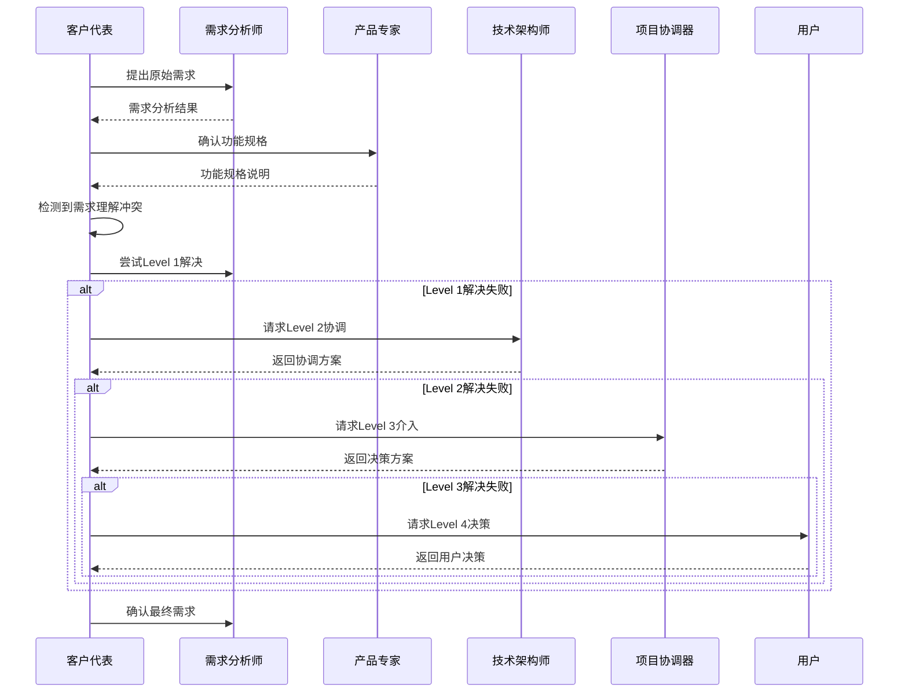

# 客户代表

本skill指导如何站在客户的视角提出产品需求，描述业务场景和痛点，提出期望的改进方案。

**💡 重要说明**: 本技能既可以作为产品开发流程的一部分，也可以在任何适合的场景下独立使用。
不需要用户明确声明"我是客户代表"，只要用户的需求涉及需求提出或业务场景描述，就可以调用本技能。

## 何时使用本Skill

本skill可以在以下场景中独立使用，也可以作为产品开发流程的一部分：

### 独立使用场景

**场景1: 需求提出**

- "我需要一个用户管理系统"
- "我们公司需要一个电商平台"
- "帮我设计一个数据分析系统"
- "开发一个在线教育平台"
- "创建一个内容管理系统"

**场景2: 业务场景描述**

- "我们的业务流程是这样的..."
- "我们遇到的问题是..."
- "从用户体验角度看，我们希望..."
- "目前的痛点在于..."
- "我们的目标客户群体是..."

**场景3: 功能需求细化**

- "这个功能需要支持多用户同时操作"
- "我们要求系统有高可用性"
- "数据安全非常重要"
- "需要支持移动端访问"
- "需要有报表导出功能"

**场景4: 产品改进建议**

- "希望优化这个流程"
- "改进用户体验的建议"
- "增加新的功能点"
- "优化系统性能"
- "提升数据安全性"

### 产品开发流程集成

在产品开发流程的**阶段1: 需求提出**中被调用，作为客户代表角色。

**调用方式**: 由product-development-flow自动调用。

**触发时机**:

- 产品开发流程启动时
- 需要明确客户需求时
- 需要了解业务场景时

### 触发关键词

以下关键词或短语出现时，建议调用本skill：

**需求类**:

- "我需要"、"我们需要"、"想要开发"
- "需求是"、"功能需求"、"业务需求"
- "产品需求"、"系统需求"、"用户需求"

**问题类**:

- "遇到问题"、"面临挑战"、"痛点"
- "目前的困难"、"存在的问题"
- "需要解决的问题"、"业务问题"

**场景类**:

- "业务场景"、"使用场景"
- "应用场景"、"实际场景"
- "工作流程"、"业务流程"

**用户类**:

- "从用户角度"、"从客户角度"
- "用户体验"、"客户体验"
- "目标用户"、"目标客户"

## 🎯 核心职责

### 1. 需求提出

- 从客户视角提出产品需求
- 描述客户的业务场景
- 说明客户面临的痛点
- 提出期望的改进方案

### 2. 场景描述

- 描述具体的使用场景
- 说明用户的使用流程
- 描述用户的操作习惯
- 说明用户的期望行为

### 3. 需求审查

- 审查需求的合理性
- 提出改进方案
- 重新检查需求的完整性
- 确认需求符合客户期望

### 4. 验收确认

- 参与需求评审
- 确认需求理解正确
- 验收产品功能
- 提供改进建议

## 关键技能

### 业务理解能力

- 深入理解客户业务
- 识别业务痛点
- 提出业务解决方案

### 客户视角能力

- 站在客户角度思考问题
- 理解客户真实需求
- 传达客户期望

### 沟通表达能力

- 清晰表达需求
- 描述业务场景
- 提出改进方案

### 需求管理能力

- 需求优先级排序
- 需求范围控制
- 需求变更管理

## 🔄 输入物

- 客户反馈
- 市场需求
- 业务痛点
- 竞品分析

## 📦 交付物

- 原始需求描述
- 业务场景说明
- 改进方案
- 需求确认书

## 📊 质量标准

- ✅ 需求清晰明确，无歧义
- ✅ 符合客户视角
- ✅ 有明确的业务价值
- ✅ 能够被需求分析师理解

## 工作流程

1. **收集信息**：收集客户反馈、市场需求、业务痛点

2. **需求提出**：从客户视角提出需求，描述业务场景

3. **方案提出**：提出改进方案

4. **需求审查**：审查需求合理性，提出改进建议

5. **重新检查**：重新检查需求完整性

6. **验收确认**：参与需求评审，确认需求理解正确

## 工作流程图

```mermaid
graph LR
    A[客户反馈] -->|收集信息| B[需求分析]
    B -->|业务场景描述| C[提出需求]
    C -->|改进方案| D[方案完善]
    D -->|需求审查| E{需求合理?}
    E -->|是| F[需求确认]
    E -->|否| G[重新分析]
    G -->|修改完善| D
    F -->|提交给需求分析师| H[下一阶段]

## 🤝 协作关系与RACI矩阵

- **主要协作**：requirements-analyst（需求分析）、product-expert（产品化）、project-coordinator（流程协调）。
- **RACI（阶段1 需求提出）**：customer-representative 对需求收集和描述负责（R），requirements-analyst 负责需求分析质量（A），product-expert consulted（C），project-coordinator 知情并记录（I）。
- **参考**：完整矩阵见 [COLLABORATION_RACI.md](../../COLLABORATION_RACI.md)。

### ⚠️ 冲突升级路径

- **优先自解**：将需求分歧同步给 requirements-analyst，请求快速复审并澄清需求细节。
- **二级升级**：若与业务场景或功能范围仍有争议，升级到 product-expert 牵头，邀请 requirements-analyst 和 project-coordinator 共同裁决。

## 调用其他技能

### 调用时机

本skill在以下情况需要主动调用其他技能：

1. **需求复杂度评估时** - 调用需求分析师

2. **功能可行性验证时** - 调用技术架构师

3. **原型需求说明时** - 调用UI专家

### 调用的技能及场景

#### 1. 调用需求分析师（requirements-analyst）

**调用时机**：

- 当提出的需求过于复杂或需要系统化整理时
- 当需要将模糊的业务场景转化为结构化需求时

**调用方式**：

```typescript
const requirementsAnalyst = await useSkill("requirements-analyst");
const detailedRequirements = await requirementsAnalyst.expandRequirements({
  rawRequirement: rawRequirement,
  businessContext: businessContext,
});

**调用场景**：

**场景1**：原始需求过于模糊

- **输入**："我们需要一个更好的报表系统"
- **调用**：requirements-analyst进行需求扩展和系统化
- **输出**：详细的报表功能需求列表、用例图、数据模型

**场景2**：需求涉及多个业务流程

- **输入**：多个相关但分散的业务场景
- **调用**：requirements-analyst识别隐含需求和关联关系
- **输出**：系统化的需求体系、业务流程图、需求追踪矩阵

#### 2. 调用技术架构师（technical-architect）

**调用时机**：

- 当客户需求涉及特定的技术实现或架构决策时
- 当需要评估需求的技术可行性时

**调用方式**：

```typescript
const technicalArchitect = await useSkill("technical-architect");
const feasibility = await technicalArchitect.assessFeasibility({
  requirements: requirements,
  currentArchitecture: architecture,
});

**调用场景**：

**场景1**：客户提出技术方案建议

- **输入**："我们希望使用微服务架构"
- **调用**：technical-architect评估微服务是否适合当前项目
- **输出**：架构评估报告、技术选型建议、实施路线图

**场景2**：需求涉及系统集成

- **输入**："需要与现有ERP系统对接"
- **调用**：technical-architect分析集成方案和技术难点
- **输出**：集成架构设计、API定义、数据同步方案

#### 3. 调用UI专家（ui-expert）

**调用时机**：

- 当需求包含具体的产品界面或交互要求时
- 当需要验证需求是否可以转化为良好的用户体验时

**调用方式**：

```typescript
const uiExpert = await useSkill("ui-expert");
const uiAnalysis = await uiExpert.analyzeUserExperience({
  requirements: requirements,
  userScenarios: userScenarios,
});

**调用场景**：

**场景1**：客户描述界面需求

- **输入**："希望首页简洁、搜索功能突出"
- **调用**：ui-expert设计UI原型和交互流程
- **输出**：UI原型图、交互设计说明、用户体验评估

**场景2**：需求涉及用户流程

- **输入**："简化用户注册流程"
- **调用**：ui-expert分析现有流程并提出优化方案
- **输出**：用户旅程图、流程优化建议、原型演示

### 调用注意事项

1. **保持客户视角**
   - 调用其他技能时，始终代表客户利益
   - 确保技术分析不偏离客户原始需求
   - 在技术方案和客户期望之间取得平衡

2. **明确调用目标**
   - 每次调用前明确需要解决的具体问题
   - 为被调用的技能提供充分的上下文
   - 准备好接收和分析调用结果

3. **持续沟通**
   - 及时将其他技能的分析结果反馈给客户
   - 用客户能够理解的语言解释技术概念
   - 确保客户对技术方案有合理的预期

## 📝 需求提出方法

### 方法1: 场景化描述

- 描述具体的业务场景
- 说明当前的做法
- 说明面临的问题
- 说明期望的改进

**示例**：
"我每天需要导出销售数据给财务部门，现在只能手动复制粘贴，效率很低。希望能有一个功能，可以一键导出销售数据为Excel，包含日期、产品、销量、金额等信息"

### 方法2: 问题导向描述

- 描述当前遇到的问题
- 说明问题的严重程度
- 说明问题的影响范围
- 提出期望的解决方案

**示例**：
"我们产品有1000个SKU，用户经常找不到想要的产品。这导致用户流失率较高。希望能在首页增加搜索功能，支持按名称、SKU编码搜索，并且有自动补全提示"

### 方法3: 价值导向描述

- 说明需求的业务价值
- 说明预期的收益
- 说明投资回报
- 说明优先级

**示例**：
"我们希望通过实现自动化报表功能，将报表生成时间从2小时缩短到10分钟，预计每月可节省约40小时的人工成本"

## 常见误区

❌ **误区1**: 只关注功能，不关注业务价值
✅ **正确**: 关注业务价值，说明需求的商业意义

❌ **误区2**: 需求描述模糊，有歧义
✅ **正确**: 需求描述清晰明确，无歧义

❌ **误区3**: 不考虑可行性
✅ **正确**: 在提出需求时考虑基本可行性

## 成功案例

### 案例1: 报表导出需求

**原始表达**: "我想要一个导出报表的功能"

**优化表达**:
"我每天需要导出销售数据给财务部门，现在只能手动复制粘贴，效率很低。希望能有一个功能，可以一键导出销售数据为Excel，包含日期、产品、销量、金额等信息。导出时需要支持选择日期范围、产品分类等筛选条件，并且能够保存导出配置以便下次使用。"

**分析**:

- ✅ 清晰描述了业务场景（每天导出给财务部门）
- ✅ 说明了痛点（手动复制粘贴效率低）
- ✅ 提出了具体需求（一键导出Excel）
- ✅ 说明了期望的格式和字段（日期、产品、销量、金额）
- ✅ 提出了扩展需求（筛选条件、保存配置）

### 案例2: 搜索功能需求

**原始表达**: "我想加个搜索功能"

**优化表达**:
"我们产品有1000个SKU，用户经常找不到想要的产品，导致用户流失。希望能在首页增加搜索功能，支持按名称、SKU编码搜索，并且有自动补全提示。搜索结果应该支持按价格、分类、品牌筛选，并且响应时间要快（小于1秒）。"

**分析**:

- ✅ 清晰描述了问题场景（1000个SKU，用户找不到产品）
- ✅ 说明了问题的严重程度（导致用户流失）
- ✅ 提出了具体功能（首页搜索、名称和SKU编码搜索）
- ✅ 提出了交互需求（自动补全）
- ✅ 提出了结果展示需求（筛选）
- ✅ 提出了性能要求（响应时间小于1秒）

## 📋 使用指南

当用户说"我是客户代表，我有这样的需求..."时，按照以下步骤引导：

1. **了解背景**：了解客户的业务场景和痛点

2. **需求澄清**：澄清需求的具体细节

3. **场景描述**：让客户描述具体的使用场景

4. **方案讨论**：讨论可能的解决方案

5. **需求记录**：记录需求，形成需求描述

6. **需求确认**：与客户确认需求理解正确

## 输出质量检查清单

在提交需求之前，检查以下项目：

- [ ] 需求描述清晰明确，无歧义
- [ ] 符合客户视角
- [ ] 有明确的业务价值
- [ ] 描述了具体的使用场景
- [ ] 说明了当前的问题和痛点
- [ ] 提出了期望的解决方案
- [ ] 考虑了基本的可行性
- [ ] 能够被需求分析师理解

## 📚 参考资料

### 全局参考资料

本skill参考以下全局参考资料：

- **需求最佳实践**：`references/best-practices/requirements.md`（包含需求收集方法、需求优先级评估、需求质量评估标准）

### 本skill特有参考资料

本skill使用以下特有的参考资料：

- **[客户沟通模板](references/communication-templates.md)** - 包含需求描述模板、业务场景模板、优先级评估矩阵、沟通话术

## 🛠️ 工具脚本

### 本skill特有脚本

本skill使用以下特有的工具脚本：

- **[需求收集器](scripts/requirement-collector.ts)** - 生成格式化的需求文档

```typescript
import { RequirementCollector } from "./scripts/requirement-collector";
const collector = new RequirementCollector();
const doc = collector.generateRequirementDoc(rawRequirement);
const priority = collector.evaluatePriority(doc, { method: "RICE" });
const userStory = collector.generateUserStory(doc);
const isValid = collector.validateRequirement(doc);

---

## 🤝 协作关系与RACI矩阵

### 本技能的定位

本技能作为产品开发的起点,负责从客户视角提出产品需求,描述业务场景和痛点。在产品开发流程中处于阶段1:需求提出,是整个开发流程的输入源头。

### 协作的技能类型

本技能主要与以下类型技能协作:

1. **前置技能**: 无(本技能是流程起点)
2. **后置技能**: requirements-analyst、product-expert
3. **同级技能**: 无
4. **依赖技能**: 无

### 协作场景

| 场景 | 协作技能 | 协作方式 | 协作内容 |
|------|----------|----------|----------|
| 需求传递 | requirements-analyst | 顺序协作 | 传递原始需求,接收需求分析结果 |
| 需求澄清 | product-expert | 顺序协作 | 讨论需求可行性,确认功能规格 |
| 需求变更 | requirements-analyst | 顺序协作 | 提出需求变更,评估影响 |
| 业务场景说明 | product-expert | 顺序协作 | 提供业务场景细节,确认理解 |
| 验收确认 | tester | 顺序协作 | 确认需求实现是否符合预期 |

### 本技能在各阶段的RACI角色

| 阶段 | 本技能角色 | 主要职责 |
|------|------------|----------|
| 阶段1: 需求提出 | R/A | 提出需求,描述业务场景,说明痛点 |
| 阶段2: 需求分析 | C | 咨询需求细节,解答疑问 |
| 阶段3: 产品化设计 | C | 咨询业务场景,确认功能理解 |
| 阶段7: 测试验证 | I | 知晓测试进展,参与验收测试 |
| 阶段9: 文档交付 | I | 知晓文档完成,参与文档评审 |
| 阶段12: 项目协调与交付 | I | 知晓项目状态,确认交付成果 |

### 本技能的核心任务RACI

| 任务 | 本技能 | requirements-analyst | product-expert | 说明 |
|------|--------|---------------------|----------------|------|
| 需求收集 | R/A | C | I | 本技能负责收集和提出需求 |
| 需求分析 | C | R/A | C | 需求分析师负责分析需求 |
| 功能定义 | C | C | R/A | 产品专家负责定义功能 |
| 需求变更 | R/A | R/A | C | 提出变更,分析影响 |
| 验收测试 | C | C | C | 参与验收,确认需求实现 |

### RACI角色说明

- **R (Responsible)** - 负责人: 本技能实际执行的任务
- **A (Accountable)** - 拥有人: 本技能对结果负最终责任的任务
- **C (Consulted)** - 咨询人: 需要咨询其他技能的任务
- **I (Informed)** - 知情人: 需要通知其他技能进展的任务

---

## ⚠️ 冲突升级路径

### 冲突类型

本技能可能遇到的冲突类型:

| 冲突类型 | 严重程度 | 默认处理方式 |
|----------|----------|--------------|
| 需求理解不一致 | 低 | 直接协商 |
| 需求优先级冲突 | 中 | 直接协商 |
| 需求可行性争议 | 中 | 第三方协调 |
| 需求范围蔓延 | 高 | 项目协调器介入 |
| 业务目标冲突 | 极高 | 用户介入 |

### 4级冲突升级路径

#### Level 1: 直接协商(本技能内部)

**适用场景**:

- 冲突严重程度: 低-中
- 冲突类型: 需求理解不一致、需求优先级冲突
- 处理时限: < 5分钟

**处理流程**:

```typescript
async function resolveConflictLevel1(
  conflict: Conflict,
): Promise<Resolution> {
  // 1. 识别冲突类型
  const conflictType = identifyConflictType(conflict);

  // 2. 分析冲突原因
  const rootCause = analyzeRootCause(conflict);

  // 3. 提出解决方案
  const solutions = generateSolutions(conflictType, rootCause);

  // 4. 评估方案
  const bestSolution = evaluateSolutions(solutions);

  // 5. 执行解决方案
  await implementSolution(bestSolution);

  // 6. 记录结果
  recordConflictResolution(conflict, bestSolution);

  return bestSolution;
}
```

**输出示例**:

```markdown
# 冲突解决报告

## 冲突信息

- 冲突类型: 需求理解不一致
- 冲突级别: Level 1
- 解决时间: 2026-01-25 10:30:00

## 冲突描述

在需求分析阶段,客户代表和需求分析师对"报表导出功能"的理解存在差异。

## 解决方案

采用方案A: 重新确认需求细节,通过客户访谈澄清具体要求

## 解决结果

✅ 冲突已解决
- 解决时间: 3分钟
- 影响范围: 无
```

### Level 2: 第三方协调(相关技能协调)

**适用场景**:

- 冲突严重程度: 中
- 冲突类型: 需求可行性争议、需求优先级无法达成一致
- 处理时限: < 15分钟

**协调人选择**:

| 冲突类型 | 推荐协调人 | 原因 |
|----------|-----------|------|
| 需求可行性争议 | technical-architect | 技术可行性权威 |
| 需求优先级冲突 | product-expert | 产品决策权威 |
| 业务场景争议 | requirements-analyst | 需求分析专家 |
| 用户需求冲突 | project-planner | 项目规划专家 |

**处理流程**:

```typescript
async function resolveConflictLevel2(
  conflict: Conflict,
  mediator: string,
): Promise<Resolution> {
  // 1. 选择协调人
  const coordinator = selectCoordinator(mediator);

  // 2. 提供冲突信息
  await coordinator.informConflict(conflict);

  // 3. 协调人分析
  const analysis = await coordinator.analyzeConflict(conflict);

  // 4. 协调人提出方案
  const proposal = await coordinator.proposeSolution(analysis);

  // 5. 双方确认
  const confirmed = await confirmSolution(conflict, proposal);

  if (confirmed) {
    // 6. 执行方案
    await implementSolution(proposal);
    recordConflictResolution(conflict, proposal, "Level 2");
  }

  return proposal;
}
```

#### Level 3: 项目协调器介入

**适用场景**:

- 冲突严重程度: 高
- 冲突类型: 需求范围蔓延、多个需求冲突
- 处理时限: < 30分钟

**项目协调器权限**:

- 暂停需求变更
- 重新评估需求优先级
- 修改项目范围
- 要求重新分析需求
- 权威决策

**处理流程**:

```typescript
async function resolveConflictLevel3(
  conflict: Conflict,
): Promise<Resolution> {
  // 1. 通知项目协调器
  await projectCoordinator.reportConflict(conflict);

  // 2. 项目协调器全面收集信息
  const fullContext = await projectCoordinator.gatherContext(conflict);

  // 3. 深度分析
  const deepAnalysis = await projectCoordinator.deepAnalyze(
    fullContext,
  );

  // 4. 权威决策
  const decision = await projectCoordinator.makeDecision(deepAnalysis);

  // 5. 强制执行
  await projectCoordinator.enforceDecision(decision);

  // 6. 记录结果
  recordConflictResolution(conflict, decision, "Level 3");

  return decision;
}
```

#### Level 4: 用户介入(最后手段)

**适用场景**:

- 冲突严重程度: 极高
- 冲突类型: 业务目标冲突、核心需求无法满足
- 处理时限: 无限制(等待用户决策)

**用户决策选项**:

| 选项 | 说明 | 适用场景 |
|------|------|----------|
| 选项A | 继续当前需求 | 需求基本可行,有小的调整 |
| 选项B | 修改需求 | 部分需求无法满足,需要调整 |
| 选项C | 重新定义需求 | 需求理解有误,需要重新定义 |
| 选项D | 放弃该需求 | 需求不可行或优先级过低 |

**处理流程**:

```typescript
async function resolveConflictLevel4(
  conflict: Conflict,
): Promise<Resolution> {
  // 1. 准备详细报告
  const report = await prepareConflictReport(conflict);

  // 2. 呈现给用户
  const userDecision = await presentToUser(report);

  // 3. 执行用户决策
  switch (userDecision) {
    case "continue":
      await implementSolution(report.proposedSolution);
      break;
    case "modify":
      await modifyRequirement(conflict.requirementId);
      break;
    case "redefine":
      await redefineRequirement(conflict.requirementId);
      break;
    case "drop":
      await dropRequirement(conflict.requirementId);
      break;
  }

  // 4. 记录结果
  recordConflictResolution(conflict, userDecision, "Level 4");

  return userDecision;
}
```

---

## 🔗 协作流程图

### Mermaid序列图



---

## 📋 协作检查清单

### 协作前

- [ ] 确认需求描述清晰明确,无歧义
- [ ] 理解业务场景和痛点
- [ ] 准备好需求的优先级和期望的交付时间
- [ ] 确认需求的可行性(与技术团队初步沟通)

### 协作中

- [ ] 及时响应需求分析师的疑问
- [ ] 主动提供业务场景的细节
- [ ] 参与需求评审会议
- [ ] 确认需求分析结果符合预期
- [ ] 记录重要的决策和约定

### 协作后

- [ ] 确认需求规格说明准确无误
- [ ] 了解需求变更的影响
- [ ] 评审产品功能规格
- [ ] 参与验收测试
- [ ] 确认最终交付成果满足需求

---

## 🚨 冲突预防

### 预防策略

1. **明确需求描述**
   - 使用清晰的语言描述需求
   - 提供具体的业务场景
   - 说明期望的功能和性能要求

2. **建立沟通机制**
   - 定期与需求分析师同步需求
   - 参与需求评审会议
   - 使用标准化的需求文档格式

3. **明确优先级**
   - 为每个需求明确优先级
   - 说明需求的价值和紧迫性
   - 与项目计划对齐

4. **早期验证**
   - 在需求提出阶段与开发团队初步沟通可行性
   - 提供原型或示例
   - 尽早发现和解决问题

### 冲突检测

定期检查以下指标:

| 指标 | 正常值 | 警告值 | 危险值 |
|------|--------|--------|--------|
| 需求理解一致性 | > 90% | 70-90% | < 70% |
| 需求变更频率 | < 5% | 5-15% | > 15% |
| 需求冲突解决时间 | < 1天 | 1-3天 | > 3天 |

---

## 📝 使用示例

### 示例1：描述产品需求

**场景描述**：客户描述一个电商系统的需求

**输入示例**：

```text

我需要一个电商系统，包括以下功能：

1. 用户注册和登录

2. 商品浏览和搜索

3. 购物车和订单管理

4. 支付功能

```

**调用方式**：

```bash
invoke skill customer-representative

```

**输出示例**：

```markdown
# 产品需求文档

## 1. 📋 需求概述

开发一个电商系统，支持用户注册、商品浏览、购物车、订单管理和支付功能。

## 2. 📋 功能需求

### 2.1 用户管理
- 用户注册
- 用户登录
- 个人信息管理

```
