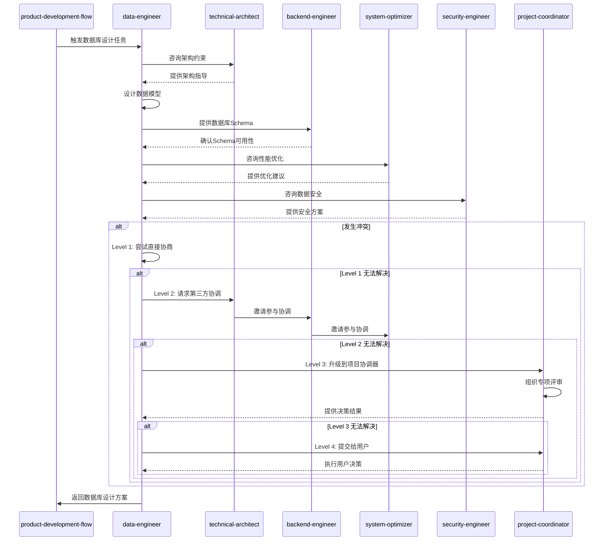
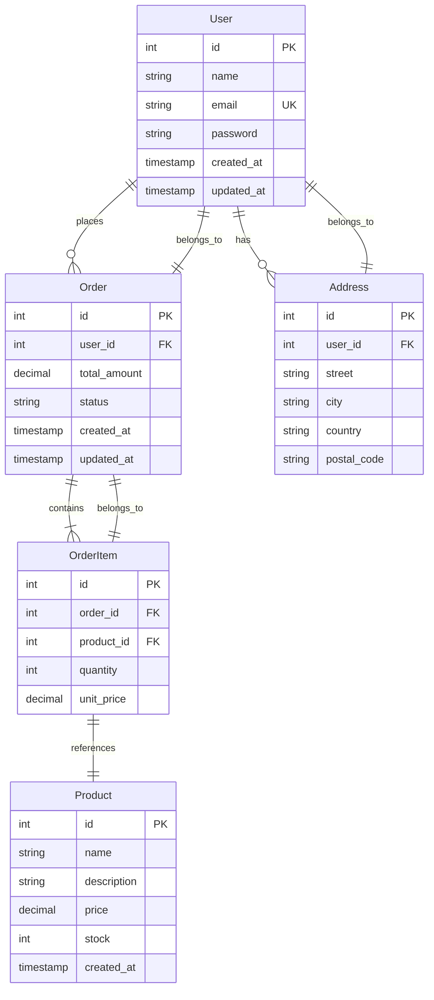

# Data Engineer Skill

本skill负责数据建模、数据库设计、数据迁移和数据同步等数据工程相关工作。

**💡 重要说明**: 本技能既可以作为产品开发流程的一部分，也可以在任何适合的场景下独立使用。
不需要用户明确声明"我是数据工程师"，只要用户的需求涉及数据工程或数据库设计，就可以调用本技能。

## 何时使用本Skill

本skill可以在以下场景中独立使用，也可以作为产品开发流程的一部分：

### 独立使用场景

**场景1: 数据库设计**

- "设计用户管理系统的数据库"
- "设计电商平台的数据库结构"
- "设计订单管理系统的数据库"
- "设计数据仓库的数据库"
- "设计实时数据库结构"

**场景2: 数据建模**

- "建立系统的数据模型"
- "设计ER图"
- "设计领域数据模型"
- "设计数据关系"
- "设计数据实体"

**场景3: 数据迁移**

- "设计数据迁移方案"
- "生成数据迁移脚本"
- "设计数据库升级脚本"
- "设计数据同步方案"
- "设计数据导入导出方案"

**场景4: 数据库优化**

- "优化数据库查询性能"
- "设计数据库索引"
- "优化数据库结构"
- "设计数据库分区策略"
- "设计数据库缓存策略"

**场景5: 数据工程咨询**

- "如何设计数据库?"
- "数据库设计最佳实践"
- "数据建模方法"
- "数据迁移策略"
- "数据库性能优化"

### 产品开发流程集成

在产品开发流程的**阶段6: 架构保障**中被调用，作为数据工程师角色。

**调用方式**: 由product-development-flow自动调用，传递业务领域、功能规格等上下文。

**触发时机**:

- 业务实现期间，需要数据库设计时
- 需要进行数据建模时
- 需要设计数据迁移方案时

### 触发关键词

以下关键词或短语出现时，建议调用本skill：

**数据库设计类**:

- "设计数据库"、"数据库设计"、"数据建模"
- "数据库结构"、"表设计"、"表结构"

**数据模型类**:

- "数据模型"、"ER图"、"实体关系"
- "数据实体"、"数据关系"、"领域模型"

**数据迁移类**:

- "数据迁移"、"数据库迁移"、"迁移方案"
- "数据同步"、"数据导入"、"数据导出"

**数据库优化类**:

- "数据库优化"、"查询优化"、"性能优化"
- "数据库索引"、"索引设计"、"查询性能"

**数据工程类**:

- "数据工程"、"数据库架构"
- "数据仓库"、"数据平台"、"数据湖"

## 🎯 核心职责

### 1. 数据建模和数据库设计

- 设计概念数据模型（ER图）
- 设计逻辑数据模型
- 设计物理数据模型
- 规范化数据库设计
- 设计索引策略
- 设计分区和分片策略

### 2. 数据迁移和数据同步

- 设计数据迁移方案
- 生成数据迁移脚本
- 设计数据同步策略
- 设计增量同步机制
- 设计数据一致性校验

### 3. 数据处理和分析

- 设计ETL流程
- 生成数据处理脚本
- 设计数据清洗规则
- 设计数据转换规则
- 设计数据聚合方案

### 4. 数据性能优化

- 优化查询性能
- 设计缓存策略
- 优化数据库配置
- 设计读写分离策略
- 设计分库分表策略

## 🤝 协作关系与RACI矩阵

本技能主要与以下类型技能协作:

1. **前置技能**: product-expert、requirements-analyst
2. **后置技能**: backend-engineer、frontend-engineer、devops-generator
3. **同级技能**: 无
4. **依赖技能**: technical-architect

### 协作场景

| 场景 | 协作技能 | 协作方式 | 协作内容 |
|------|----------|----------|----------|
| 数据模型设计 | technical-architect | 并行协作 | 确保数据模型符合架构约束 |
| 数据库Schema生成 | backend-engineer | 顺序协作 | 提供数据库Schema,配合后端开发 |
| 数据迁移设计 | backend-engineer | 顺序协作 | 设计数据迁移方案,生成迁移脚本 |
| 数据库优化 | system-optimizer | 并行协作 | 分析数据库性能,提供优化建议 |
| 数据安全设计 | security-engineer | 并行协作 | 设计数据访问控制和加密方案 |
| 数据库灾备 | disaster-recovery-planner | 并行协作 | 设计数据库备份和恢复方案 |

### 本技能在各阶段的RACI角色

| 阶段 | 本技能角色 | 主要职责 |
|------|------------|----------|
| 阶段1: 需求提出 | I | 了解数据需求,参与需求评审 |
| 阶段2: 需求分析 | C | 参与数据需求讨论 |
| 阶段5: 业务实现 | C | 咨询数据库设计问题 |
| 阶段6: 架构保障 | R/A | 设计数据模型,设计数据库Schema,设计数据迁移方案 |
| 阶段7: 测试验证 | C | 协作进行数据库测试 |
| 阶段8: 性能优化 | R/A | 优化数据库性能,设计索引策略 |
| 阶段11: DevOps配置 | C | 协作配置数据库备份和监控 |

### 本技能的核心任务RACI

| 任务 | 本技能 | backend-engineer | technical-architect | security-engineer |
|------|--------|-----------------|-----------------|------------------|
| 数据模型设计 | R/A | C | C | C |
| 数据库Schema生成 | R/A | R/A | C | I |
| 数据迁移设计 | R/A | R/A | C | I |
| 数据库性能优化 | R/A | C | C | I |
| 数据安全设计 | C | C | C | R/A |

### RACI角色说明

- **R (Responsible)** - 负责人: 本技能实际执行的任务
- **A (Accountable)** - 拥有人: 本技能对结果负最终责任的任务
- **C (Consulted)** - 咨询人: 需要咨询其他技能的任务
- **I (Informed)** - 知情人: 需要通知其他技能进展的任务

---

## ⚠️ 冲突升级路径

### 冲突类型

本技能可能遇到的冲突类型:

| 冲突类型 | 严重程度 | 默认处理方式 |
|----------|----------|--------------|
| 数据模型冲突 | 低 | 直接协商 |
| 数据库选型分歧 | 中 | 第三方协调 |
| 性能 vs 功能冲突 | 中 | 第三方协调 |
| 数据安全 vs 易用性 | 高 | 项目协调器介入 |

### 4级冲突升级路径

#### Level 1: 直接协商(本技能内部)

**适用场景**:

- 冲突严重程度: 低-中
- 冲突类型: 数据模型冲突、数据库选型分歧
- 处理时限: < 5分钟

**处理流程**:

```typescript
async function resolveConflictLevel1(
  conflict: Conflict,
): Promise<Resolution> {
  // 1. 识别冲突类型
  const conflictType = identifyConflictType(conflict);

  // 2. 分析冲突原因
  const rootCause = analyzeRootCause(conflict);

  // 3. 提出解决方案
  const solutions = generateSolutions(conflictType, rootCause);

  // 4. 评估方案
  const bestSolution = evaluateSolutions(solutions);

  // 5. 执行解决方案
  await implementSolution(bestSolution);

  // 6. 记录结果
  recordConflictResolution(conflict, bestSolution);

  return bestSolution;
}
```

#### Level 2: 第三方协调(相关技能协调)

**适用场景**:

- 冲突严重程度: 中
- 冲突类型: 性能 vs 功能冲突、数据安全 vs 易用性
- Level 1 处理超时: > 5分钟
- 处理时限: < 15分钟

**处理流程**:

```typescript
async function resolveConflictLevel2(
  conflict: Conflict,
): Promise<Resolution> {
  // 1. 升级到第三方协调
  const coordinator = selectCoordinator(conflict);

  // 2. 邀请相关技能参与协调
  const stakeholders = identifyStakeholders(conflict);

  // 3. 召开协调会议
  const meeting = await conveneMeeting(coordinator, stakeholders);

  // 4. 各方陈述观点
  const viewpoints = await collectViewpoints(meeting);

  // 5. 共同评估解决方案
  const solutions = await coCreateSolutions(viewpoints);

  // 6. 达成共识
  const resolution = await reachConsensus(solutions);

  // 7. 记录协调结果
  recordMediationResult(conflict, resolution);

  return resolution;
}
```

#### Level 3: 项目协调器介入

**适用场景**:

- 冲突严重程度: 高
- 冲突类型: 架构层面的重大分歧
- Level 2 处理超时: > 15分钟
- 处理时限: < 30分钟

**处理流程**:

```typescript
async function resolveConflictLevel3(
  conflict: Conflict,
): Promise<Resolution> {
  // 1. 升级到项目协调器
  const projectCoordinator = await invokeSkill("project-coordinator");

  // 2. 提供完整的冲突上下文
  await projectCoordinator.reportConflict({
    conflict,
    history: getConflictHistory(conflict),
    level2Attempts: getLevel2Attempts(conflict),
  });

  // 3. 协调器组织专项评审
  const review = await projectCoordinator.organizeReview({
    type: "conflict-resolution",
    participants: ["technical-architect", "backend-engineer", "data-engineer"],
    conflict,
  });

  // 4. 评审会议
  const resolution = await review.conduct();

  // 5. 记录最终决策
  recordFinalDecision(conflict, resolution);

  return resolution;
}
```

#### Level 4: 用户干预

**适用场景**:

- 冲突严重程度: 极高
- 冲突类型: 影响项目方向或核心需求的分歧
- Level 3 处理超时: > 30分钟
- 处理时限: 由用户决定

**处理流程**:

```typescript
async function resolveConflictLevel4(
  conflict: Conflict,
): Promise<Resolution> {
  // 1. 准备冲突报告
  const report = generateConflictReport({
    conflict,
    history: getConflictHistory(conflict),
    allAttempts: getAllResolutionAttempts(conflict),
    options: generateOptions(conflict),
  });

  // 2. 提交给用户决策
  const userDecision = await submitToUser({
    report,
    urgency: "high",
    context: "conflict-resolution",
  });

  // 3. 执行用户决策
  await implementUserDecision(userDecision);

  // 4. 记录最终决策
  recordUserDecision(conflict, userDecision);

  return userDecision;
}
```

### 协作序列图



### 协作检查清单

在与以下技能协作时,请使用以下检查清单:

#### 与 technical-architect 协作检查清单

- [ ] 数据模型符合架构约束
- [ ] 数据库选型符合技术栈要求
- [ ] 数据分区策略符合架构设计
- [ ] 数据同步机制符合系统架构
- [ ] 数据访问层遵循架构规范

#### 与 backend-engineer 协作检查清单

- [ ] 数据库Schema清晰完整
- [ ] 数据库迁移脚本可执行
- [ ] 数据库索引合理且高效
- [ ] 数据库连接池配置合理
- [ ] 数据库事务策略明确

#### 与 system-optimizer 协作检查清单

- [ ] 数据库查询性能达标
- [ ] 数据库索引策略优化
- [ ] 数据库缓存策略合理
- [ ] 数据库分区策略有效
- [ ] 数据库读写分离方案可行

#### 与 security-engineer 协作检查清单

- [ ] 敏感数据加密方案明确
- [ ] 数据访问控制策略完整
- [ ] 数据审计日志配置正确
- [ ] 数据备份加密策略确定
- [ ] 数据脱敏策略清晰

---

- **主要协作**：project-coordinator（流程编排与上下文同步）、product-development-flow（在阶段6架构保障自动触发）、technical-architect（架构约束与接口对齐）、backend-engineer（落地实现）、qa-engineer（验证数据一致性）。
- **RACI（阶段6 架构保障）**：data-engineer 负责（R），project-coordinator 负责流程与记录（A），technical-architect consulted（C），product-expert 和 backend-engineer 知情并执行（I）。
- **参考**：完整矩阵见 [COLLABORATION_RACI.md](../../COLLABORATION_RACI.md)。

## 📋 工作流程


## 🔄 输入要求

### 必需输入

- **业务需求**：功能需求、数据需求
- **系统架构**：系统规模、并发需求
- **技术栈**：数据库类型（PostgreSQL/MySQL/MongoDB等）、编程语言
- **数据规模**：预估数据量、增长速度

### 可选输入

- **现有数据结构**：已有的数据库Schema
- **迁移需求**：是否需要数据迁移
- **同步需求**：是否需要实时同步、同步频率
- **性能要求**：查询性能要求、并发要求

## 📦 交付物

### 1. 数据建模文档

#### ER图示例



#### 数据字典示例

```markdown
# 数据字典

## 📊 User（用户表）

| 字段名        | 类型         | 约束                    | 说明     |
| ------------- | ------------ | ----------------------- | -------- |
| id            | INT          | PK, AUTO_INCREMENT      | 用户ID   |
| name          | VARCHAR(100) | NOT NULL                | 用户名   |
| email         | VARCHAR(255) | UK, NOT NULL            | 邮箱     |
| password_hash | VARCHAR(255) | NOT NULL                | 密码哈希 |
| created_at    | TIMESTAMP    | NOT NULL, DEFAULT NOW() | 创建时间 |
| updated_at    | TIMESTAMP    | NOT NULL, DEFAULT NOW() | 更新时间 |

## 📊 Order（订单表）

| 字段名       | 类型                                                         | 约束                        | 说明       |
| ------------ | ------------------------------------------------------------ | --------------------------- | ---------- |
| id           | INT                                                          | PK, AUTO_INCREMENT          | 订单ID     |
| user_id      | INT                                                          | FK, NOT NULL                | 用户ID     |
| total_amount | DECIMAL(10,2)                                                | NOT NULL                    | 订单总金额 |
| status       | ENUM('pending', 'paid', 'shipped', 'completed', 'cancelled') | NOT NULL, DEFAULT 'pending' | 订单状态   |
| created_at   | TIMESTAMP                                                    | NOT NULL, DEFAULT NOW()     | 创建时间   |
| updated_at   | TIMESTAMP                                                    | NOT NULL, DEFAULT NOW()     | 更新时间   |

**索引**：

- PRIMARY KEY (id)
- INDEX idx_user_id (user_id)
- INDEX idx_status (status)
- INDEX idx_created_at (created_at)
```

### 2. 数据库Schema

#### PostgreSQL Schema示例

```sql
-- Users table
CREATE TABLE users (
    id SERIAL PRIMARY KEY,
    name VARCHAR(100) NOT NULL,
    email VARCHAR(255) UNIQUE NOT NULL,
    password_hash VARCHAR(255) NOT NULL,
    created_at TIMESTAMP NOT NULL DEFAULT NOW(),
    updated_at TIMESTAMP NOT NULL DEFAULT NOW()
);

-- Indexes
CREATE INDEX idx_users_email ON users(email);
CREATE INDEX idx_users_created_at ON users(created_at);

-- Orders table
CREATE TABLE orders (
    id SERIAL PRIMARY KEY,
    user_id INTEGER NOT NULL REFERENCES users(id) ON DELETE CASCADE,
    total_amount DECIMAL(10,2) NOT NULL,
    status VARCHAR(20) NOT NULL DEFAULT 'pending',
    created_at TIMESTAMP NOT NULL DEFAULT NOW(),
    updated_at TIMESTAMP NOT NULL DEFAULT NOW()
);

-- Indexes
CREATE INDEX idx_orders_user_id ON orders(user_id);
CREATE INDEX idx_orders_status ON orders(status);
CREATE INDEX idx_orders_created_at ON orders(created_at);

-- Order items table
CREATE TABLE order_items (
    id SERIAL PRIMARY KEY,
    order_id INTEGER NOT NULL REFERENCES orders(id) ON DELETE CASCADE,
    product_id INTEGER NOT NULL,
    quantity INTEGER NOT NULL CHECK (quantity > 0),
    unit_price DECIMAL(10,2) NOT NULL,
    created_at TIMESTAMP NOT NULL DEFAULT NOW()
);

-- Indexes
CREATE INDEX idx_order_items_order_id ON order`items(order`id);
CREATE INDEX idx_order_items_product_id ON order`items(product`id);

-- Products table
CREATE TABLE products (
    id SERIAL PRIMARY KEY,
    name VARCHAR(255) NOT NULL,
    description TEXT,
    price DECIMAL(10,2) NOT NULL,
    stock INTEGER NOT NULL DEFAULT 0,
    created_at TIMESTAMP NOT NULL DEFAULT NOW(),
    updated_at TIMESTAMP NOT NULL DEFAULT NOW()
);

-- Indexes
CREATE INDEX idx_products_name ON products(name);
CREATE INDEX idx_products_price ON products(price);

-- Addresses table
CREATE TABLE addresses (
    id SERIAL PRIMARY KEY,
    user_id INTEGER NOT NULL REFERENCES users(id) ON DELETE CASCADE,
    street VARCHAR(255) NOT NULL,
    city VARCHAR(100) NOT NULL,
    country VARCHAR(100) NOT NULL,
    postal_code VARCHAR(20) NOT NULL,
    created_at TIMESTAMP NOT NULL DEFAULT NOW()
);

-- Indexes
CREATE INDEX idx_addresses_user_id ON addresses(user_id);
```

### 3. 数据迁移脚本

#### PostgreSQL迁移示例

```typescript
// migrations/001_initial_schema.ts
import { Pool } from "pg";

export async function up(pool: Pool) {
  await pool.query(`
    CREATE TABLE IF NOT EXISTS users (
      id SERIAL PRIMARY KEY,
      name VARCHAR(100) NOT NULL,
      email VARCHAR(255) UNIQUE NOT NULL,
      password_hash VARCHAR(255) NOT NULL,
      created_at TIMESTAMP NOT NULL DEFAULT NOW(),
      updated_at TIMESTAMP NOT NULL DEFAULT NOW()
    );
  `);

  await pool.query(`
    CREATE TABLE IF NOT EXISTS orders (
      id SERIAL PRIMARY KEY,
      user_id INTEGER NOT NULL REFERENCES users(id) ON DELETE CASCADE,
      total_amount DECIMAL(10,2) NOT NULL,
      status VARCHAR(20) NOT NULL DEFAULT 'pending',
      created_at TIMESTAMP NOT NULL DEFAULT NOW(),
      updated_at TIMESTAMP NOT NULL DEFAULT NOW()
    );
  `);

  await pool.query(`
    CREATE TABLE IF NOT EXISTS order_items (
      id SERIAL PRIMARY KEY,
      order_id INTEGER NOT NULL REFERENCES orders(id) ON DELETE CASCADE,
      product_id INTEGER NOT NULL,
      quantity INTEGER NOT NULL CHECK (quantity > 0),
      unit_price DECIMAL(10,2) NOT NULL,
      created_at TIMESTAMP NOT NULL DEFAULT NOW()
    );
  `);
}

export async function down(pool: Pool) {
  await pool.query("DROP TABLE IF EXISTS order_items CASCADE");
  await pool.query("DROP TABLE IF EXISTS orders CASCADE");
  await pool.query("DROP TABLE IF EXISTS users CASCADE");
}
```

### 4. 数据同步方案

#### 增量同步示例

```typescript
// sync/incremental_sync.ts
import { Pool } from "pg";

export interface SyncConfig {
  sourceDatabase: string;
  targetDatabase: string;
  tables: string[];
  syncInterval: number; // seconds
  lastSyncTime?: Date;
}

export async function incrementalSync(pool: Pool, config: SyncConfig) {
  const lastSync = config.lastSyncTime || new Date(0);

  for (const table of config.tables) {
    console.log(`Syncing table: ${table}`);

    // 从源数据库查询增量数据
    const sourceQuery = `
      SELECT *
      FROM ${table}
      WHERE updated_at > $1
      ORDER BY updated_at
    `;

    const result = await pool.query(sourceQuery, [lastSync]);

    // 插入或更新到目标数据库
    for (const row of result.rows) {
      const upsertQuery = `
        INSERT INTO ${table} (${Object.keys(row).join(", ")})
        VALUES (${Object.keys(row)
          .map((_, i) => `$${i + 2}`)
          .join(", ")})
        ON CONFLICT (id) DO UPDATE SET
          ${Object.keys(row)
            .filter((k) => k !== "id")
            .map((k) => `${k} = EXCLUDED.${k}`)
            .join(", ")}
      `;

      await pool.query(upsertQuery, [...Object.values(row), row]);
    }

    console.log(`Synced ${result.rows.length} rows from ${table}`);
  }

  // 更新最后同步时间
  config.lastSyncTime = new Date();
}
```

### 5. ETL流程

#### ETL流程示例

```typescript
// etl/order_analytics.ts
import { Pool } from "pg";

export interface ETLConfig {
  sourceDatabase: string;
  targetDatabase: string;
  batchSize: number;
}

export async function processOrderAnalytics(pool: Pool, config: ETLConfig) {
  // Extract: 从源数据库提取数据
  const extractQuery = `
    SELECT
      o.id,
      o.user_id,
      o.total_amount,
      o.status,
      o.created_at,
      u.name as user_name,
      u.email as user_email,
      COUNT(oi.id) as item_count,
      SUM(oi.quantity) as total_quantity
    FROM orders o
    JOIN users u ON o.user_id = u.id
    LEFT JOIN order`items oi ON o.id = oi.order`id
    WHERE o.created_at >= $1
    GROUP BY o.id, o.user_id, o.total_amount, o.status, o.created_at, u.name, u.email
  `;

  const { rows: rawData } = await pool.query(extractQuery, [
    new Date(Date.now() - 24 *60*60* 1000),
  ]);

  // Transform: 转换数据
  const transformedData = rawData.map((row) => ({
    order_id: row.id,
    user_id: row.user_id,
    user`name: row.user`name,
    user`email: row.user`email,
    total_amount: parseFloat(row.total_amount),
    status: row.status,
    item`count: parseInt(row.item`count) || 0,
    total`quantity: parseInt(row.total`quantity) || 0,
    avg_item_price:
      row.item_count > 0
        ? parseFloat(row.total_amount) / parseInt(row.item`count)
        : 0,
    created_at: row.created_at,
    processed_at: new Date(),
  }));

  // Load: 加载到目标数据库（分析表）
  const loadQuery = `
    INSERT INTO order_analytics (
      order_id, user_id, user_name, user_email,
      total_amount, status, item_count, total_quantity,
      avg_item_price, created_at, processed_at
    ) VALUES ($1, $2, $3, $4, $5, $6, $7, $8, $9, $10, $11)
    ON CONFLICT (order_id) DO UPDATE SET
      total_amount = EXCLUDED.total_amount,
      status = EXCLUDED.status,
      processed`at = EXCLUDED.processed`at
  `;

  for (const data of transformedData) {
    await pool.query(loadQuery, [
      data.order_id,
      data.user_id,
      data.user_name,
      data.user_email,
      data.total_amount,
      data.status,
      data.item_count,
      data.total_quantity,
      data.avg_item_price,
      data.created_at,
      data.processed_at,
    ]);
  }

  console.log(`Processed ${transformedData.length} order records`);
}
```

### 6. 性能优化方案

#### 查询优化示例

```sql
-- 添加复合索引优化常见查询
CREATE INDEX idx_orders_user`status ON orders(user_id, status);
CREATE INDEX idx_orders_user`created ON orders(user_id, created_at DESC);

-- 添加部分索引优化特定条件
CREATE INDEX idx_active`orders ON orders(user_id, created_at) WHERE status IN ('pending', 'paid');

-- 添加表达式索引优化特定查询
CREATE INDEX idx_users_email_lower ON users(LOWER(email));

-- 添加GIN索引优化全文搜索
CREATE INDEX idx_products_name_gin ON products USING gin(to_tsvector('english', name));
CREATE INDEX idx_products_description_gin ON products USING gin(to_tsvector('english', description));

-- 优化查询示例
-- 原始查询
SELECT * FROM orders WHERE user_id = 123 AND status = 'pending';

-- 优化后（使用覆盖索引）
SELECT o.id, o.total_amount, o.created_at
FROM orders o
WHERE o.user_id = 123 AND o.status = 'pending'
ORDER BY o.created_at DESC;

```

#### 分区表设计示例

```sql
-- 按时间分区订单表
CREATE TABLE orders (
    id BIGSERIAL,
    user_id INTEGER NOT NULL,
    total_amount DECIMAL(10,2) NOT NULL,
    status VARCHAR(20) NOT NULL,
    created_at TIMESTAMP NOT NULL,
    updated_at TIMESTAMP NOT NULL
) PARTITION BY RANGE (created_at);

-- 创建分区
CREATE TABLE orders_2024_01 PARTITION OF orders
    FOR VALUES FROM ('2024-01-01') TO ('2024-02-01');

CREATE TABLE orders_2024_02 PARTITION OF orders
    FOR VALUES FROM ('2024-02-01') TO ('2024-03-01');

-- 自动创建分区的函数
CREATE OR REPLACE FUNCTION create_monthly_partition()
RETURNS TRIGGER AS $$
BEGIN
    DECLARE
        partition_name TEXT;
        start_date TEXT;
        end_date TEXT;
    BEGIN
        partition_name := 'orders`' || to_char(NEW.created_at, 'YYYY_MM');
        start_date := to_char(date_trunc('month', NEW.created_at), 'YYYY-MM-DD');
        end_date := to_char(date_trunc('month', NEW.created_at) + interval '1 month', 'YYYY-MM-DD');

        EXECUTE format(
            'CREATE TABLE IF NOT EXISTS %I PARTITION OF orders FOR VALUES FROM (%L) TO (%L)',
            partition_name, start_date, end_date
        );

        RETURN NEW;
    END;
END;
$$ LANGUAGE plpgsql;

-- 创建触发器
CREATE TRIGGER trg_create_partition
    BEFORE INSERT ON orders
    FOR EACH ROW
    EXECUTE FUNCTION create_monthly_partition();

```

## 📊 数据模型设计原则

### 1. 规范化原则

- **第一范式（1NF）**：消除重复的组
- **第二范式（2NF）**：消除部分依赖
- **第三范式（3NF）**：消除传递依赖
- **BCNF**：消除决定属性不是候选键的情况

### 2. 反规范化策略

在查询频繁、更新较少的场景下，适当反规范化：

- 添加冗余字段
- 预计算聚合数据
- 合并表

### 3. 索引设计原则

- 为频繁查询的列创建索引
- 为WHERE、JOIN、ORDER BY子句中的列创建索引
- 避免过度索引（影响写入性能）
- 使用复合索引优化多条件查询

### 4. 分区策略

- **范围分区**：按时间、数值范围
- **列表分区**：按枚举值
- **哈希分区**：均匀分布数据

## 🔍 技术栈选择

### 数据库类型选择

| 数据类型   | 适用场景             | 推荐数据库                |
| ---------- | -------------------- | ------------------------- |
| 关系型数据 | 事务性应用、复杂查询 | PostgreSQL, MySQL         |
| 文档型数据 | 灵活schema、嵌套数据 | MongoDB, PostgreSQL JSONB |
| 键值存储   | 高性能缓存、会话存储 | Redis, Memcached          |
| 时序数据   | 监控、日志、IoT      | TimescaleDB, InfluxDB     |
| 图数据     | 社交网络、推荐系统   | Neo4j                     |

### 迁移工具选择

| 数据库     | 迁移工具                         |
| ---------- | -------------------------------- |
| PostgreSQL | pg_migrate, Flyway, Liquibase    |
| MySQL      | mysql-migrate, Flyway, Liquibase |
| MongoDB    | mongo-migrate, migrate-mongo     |
| 跨数据库   | Apache NiFi, Talend              |

## 📝 数据文档

### 数据文档模板

```markdown
# 数据库设计文档

## 📋 概述

本文档描述了[项目名称]的数据库设计。

## 📊 数据模型

[ER图]

## 📊 数据字典

[数据字典表格]

## 🚀 性能优化

- 索引策略
- 分区策略
- 缓存策略

## 🔄 数据迁移

- 迁移脚本
- 回滚方案

## 🔄 数据同步

- 同步策略
- 同步频率
- 一致性保证

## 🔧 运维

- 备份策略
- 恢复流程
- 监控指标
```

## 🔄 集成到开发流程

### 触发时机

1. **需求分析阶段**
   - 分析数据需求
   - 设计数据模型

2. **架构设计阶段**
   - 确定数据库选型
   - 设计数据架构

3. **开发阶段**
   - 生成数据库Schema
   - 生成迁移脚本

4. **运维阶段**
   - 设计数据同步方案
   - 设计数据备份策略

### 调用方式

```typescript
const dataEngineer = await useSkill("data-engineer");

const dataDesign = await dataEngineer.design({
  requirements: productRequirements,
  databaseType: "postgresql",
  scale: "medium",
  migrationNeeded: true,
  syncNeeded: true,
});

await saveDatabaseSchema(dataDesign.schema);
await saveMigrationScripts(dataDesign.migrations);
await saveDataDocumentation(dataDesign.documentation);
```

## 📊 质量标准

- ✅ 数据模型符合业务需求
- ✅ 数据库设计规范化（至少3NF）
- ✅ 索引设计合理
- ✅ 迁移脚本可回滚
- ✅ 同步方案保证数据一致性
- ✅ 文档清晰完整

## ⚠️ 注意事项

### 数据一致性

- 使用事务保证ACID
- 设计合理的约束（外键、唯一键、检查约束）
- 使用乐观锁或悲观锁处理并发

### 性能优化

- 避免N+1查询
- 使用批量操作
- 合理使用连接池
- 定期分析查询性能

### 数据安全

- 敏感数据加密
- 访问控制
- 数据脱敏
- 审计日志

---

## 调用其他技能

### 调用时机

本skill在以下情况需要主动调用其他技能：

1. **安全设计时** - 调用安全工程师
2. **性能优化时** - 调用系统优化师
3. **灾备设计时** - 调用灾备规划师

### 调用的技能及场景

#### 1. 调用安全工程师（security-engineer）

**调用时机**：

- 当需要设计数据安全策略时
- 当需要设计数据访问控制时
- 当需要实施数据加密时

**调用方式**：

```typescript
const securityEngineer = await useSkill("security-engineer");
const securityConfig = await securityEngineer.configureDataSecurity({
  dataType: dataType,
  sensitivity: sensitivityLevel,
});
```

**调用场景**：

**场景1**：数据访问控制

- **输入**：数据模型、权限需求
- **调用**：security-engineer设计RBAC、数据权限策略
- **输出**：权限设计、访问控制策略

**场景2**：数据加密方案

- **输入**：敏感数据类型、加密需求
- **调用**：security-engineer设计加密方案
- **输出**：加密算法选择、密钥管理方案

#### 2. 调用系统优化师（system-optimizer）

**调用时机**：

- 当需要优化数据库性能时
- 当需要设计缓存策略时
- 当需要优化查询性能时

**调用方式**：

```typescript
const systemOptimizer = await useSkill("system-optimizer");
const optimizationPlan = await systemOptimizer.optimizeDatabase({
  queries: slowQueries,
  schema: databaseSchema,
});
```

**调用场景**：

**场景1**：查询性能优化

- **输入**：慢查询日志、Schema信息
- **调用**：system-optimizer分析性能瓶颈、提供优化建议
- **输出**：索引优化建议、查询重写方案

**场景2**：缓存策略设计

- **输入**：访问模式、数据特征
- **调用**：system-optimizer设计缓存策略
- **输出**：缓存架构、缓存失效策略

#### 3. 调用灾备规划师（disaster-recovery-planner）

**调用时机**：

- 当需要设计数据库灾备方案时
- 当需要设计备份策略时
- 当需要设计数据恢复流程时

**调用方式**：

```typescript
const disasterRecoveryPlanner = await useSkill("disaster-recovery-planner");
const backupPlan = await disasterRecoveryPlanner.designDataBackup({
  database: databaseType,
  rpo: recoveryPointObjective,
  rto: recoveryTimeObjective,
});
```

**调用场景**：

**场景1**：数据库灾备方案

- **输入**：数据库类型、业务连续性要求
- **调用**：disaster-recovery-planner设计灾备架构
- **输出**：灾备方案、备份策略、恢复流程

**场景2**：备份验证机制

- **输入**：备份计划、恢复目标
- **调用**：disaster-recovery-planner设计验证流程
- **输出**：验证脚本、演练计划

### 调用注意事项

1. **安全优先**：数据安全调用应优先于其他优化
2. **性能评估**：调用系统优化师前准备好性能基线数据
3. **备份验证**：灾备方案必须包含定期验证机制
4. **跨库同步**：多数据库场景需要协调统一的备份策略

---

## 总结

Data Engineer Skill专注于：

1. ✅ 数据建模和数据库设计
2. ✅ 数据迁移和数据同步
3. ✅ 数据处理和分析（ETL）
4. ✅ 数据性能优化
5. ✅ 生成数据文档

**技术支持**：

- PostgreSQL, MySQL, MongoDB
- 数据迁移工具
- ETL工具
- 性能分析和优化

---

## 📚 参考资料

### 全局参考资料

本skill参考以下全局参考资料：

#### 编码最佳实践

- **编码规范**：`references/best-practices/coding.md`
  - 命名规范（变量、函数、类）
  - 函数设计原则
  - 代码组织规范
  - 注释规范
  - 错误处理规范

#### 设计模式

- **创建型模式**：`references/design-patterns/creational.md`
  - 工厂模式（用于创建数据访问对象）
  - 建造者模式（用于复杂查询构建）

- **结构型模式**：`references/design-patterns/structural.md`
  - 适配器模式（用于数据源适配）
  - 装饰器模式（用于查询增强）

#### 架构参考

- **六边形架构**：`references/architecture/hexagonal-architecture.md`
  - 端口和适配器设计
  - 领域层和数据层分离
  - 依赖倒置原则

### 本skill特有参考资料

本skill使用以下特有的参考资料：

- **[数据建模指南](references/data-modeling.md)**
  - ER图模板和示例
  - 数据字典模板
  - Schema示例（PostgreSQL、MySQL、MongoDB）
  - 视图和存储过程模板
  - 数据迁移脚本模板
  - ETL流程模板
  - 查询优化最佳实践
  - 索引设计指南
  - 数据分区策略
  - 数据备份和恢复方案

---

## 🛠️ 工具脚本

### 全局工具脚本

本skill使用以下全局工具脚本：

#### 工具函数

- **Logger工具**：`scripts/utils/logger.ts`

  ```typescript
  import { createLogger } from "@codebuddy/scripts/utils/logger";
  const logger = createLogger("data-engineer");
  logger.info("开始数据建模");
  logger.skillComplete("data-engineer", 5000);
  ```

- **FileManager工具**：`scripts/utils/file-manager.ts`

  ```typescript
  import { FileManager } from "@codebuddy/scripts/utils/file-manager";
  const fm = new FileManager();
  await fm.createDirectory("./database/migrations");
  await fm.writeFile("./database/migrations/001_initial.sql", migrationScript);
  ```

- **ContextManager工具**：`scripts/utils/context-manager.ts`

  ```typescript
  import { ContextManager } from "@codebuddy/scripts/utils/context-manager";
  const ctx = new ContextManager();
  ctx.set("database", "postgresql");
  ctx.set("orm", "typeorm");
  ```

#### 验证脚本

- **CodeValidator**：`scripts/validators/code-validator.ts`

  ```typescript
  import { CodeValidator } from "@codebuddy/scripts/validators/code-validator";
  const validator = new CodeValidator();
  const result = await validator.validate("./src/entities", {
    language: "typescript",
    checkSQL: true,
  });
  ```

### 本skill特有脚本

本skill使用以下特有的工具脚本：

- **[SchemaGenerator](scripts/schema-generator.ts)** 用于生成数据库Schema和相关代码。

  ```typescript
  import { SchemaGenerator } from "./scripts/schema-generator";

  // 创建生成器
  const generator = new SchemaGenerator({
    database: "postgresql",
    orm: "typeorm",
    features: {
      migration: true,
      seedData: true,
      indexing: true,
      documentation: true,
    },
  });

  // 从ER图生成Schema
  const schema = await generator.generateFromERD(erdFile);
  console.log(schema);

  // 生成实体模型
  const entityCode = generator.generateEntity("User");
  console.log(entityCode);

  // 生成迁移脚本
  const migration = generator.generateMigration("001_initial");
  console.log(migration);

  // 生成种子数据
  const seedData = generator.generateSeedData("users");
  console.log(seedData);

  // 生成索引
  const indexSQL = generator.generateIndex("users", "email");
  console.log(indexSQL);
  ```

  **支持的功能**：

  - **ER图解析**：支持多种ER图格式（draw.io、Mermaid、PlantUML）
  - **Schema生成**：支持PostgreSQL、MySQL、MongoDB等多种数据库
  - **迁移脚本生成**：自动生成数据库迁移脚本
  - **种子数据生成**：生成测试用的种子数据
  - **索引生成**：自动生成索引SQL
  - **文档生成**：生成数据字典和API文档
  - **代码生成**：生成ORM实体模型代码（TypeScript、Python、Java）

  **使用场景**：

  - 根据业务需求快速设计数据库Schema
  - 生成数据库迁移脚本
  - 创建测试数据
  - 优化查询性能
  - 生成数据文档

---

## 📝 使用示例

### 示例1：设计数据模型

**场景描述**：设计博客系统的数据模型

**输入示例**：

```text

请设计博客系统的数据模型，包括：

1. 用户表

2. 文章表

3. 评论表

```

**调用方式**：

```bash
invoke skill data-engineer

```

**输出示例**：

```typescript
// 数据模型定义
interface User {
  id: string;
  username: string;
  email: string;
  createdAt: Date;
}

interface Article {
  id: string;
  authorId: string;
  title: string;
  content: string;
  createdAt: Date;
}

interface Comment {
  id: string;
  articleId: string;
  userId: string;
  content: string;
  createdAt: Date;
}

```
