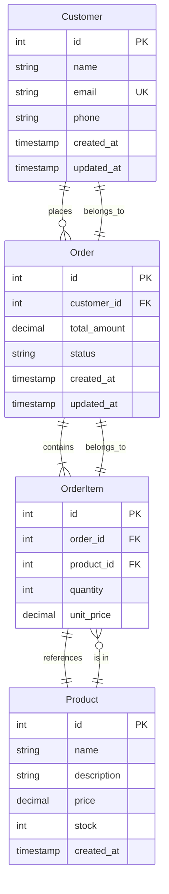
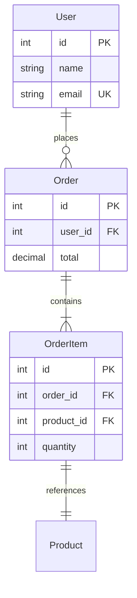

# 数据建模参考指南

本文档提供数据建模、数据库设计和数据处理的最佳实践和模板。

## 📊 数据模型设计

### 1. 实体关系图（ER图）模板



### 2. 数据字典模板

```markdown
# 数据字典

## 表：users（用户表）

| 字段名        | 类型                                 | 约束                       | 说明     |
| ------------- | ------------------------------------ | -------------------------- | -------- |
| id            | BIGINT                               | PK, AUTO_INCREMENT         | 用户ID   |
| username      | VARCHAR(50)                          | NOT NULL, UNIQUE           | 用户名   |
| email         | VARCHAR(255)                         | NOT NULL, UNIQUE           | 邮箱     |
| password_hash | VARCHAR(255)                         | NOT NULL                   | 密码哈希 |
| status        | ENUM('active', 'inactive', 'banned') | NOT NULL, DEFAULT 'active' | 状态     |
| created_at    | TIMESTAMP                            | NOT NULL, DEFAULT NOW()    | 创建时间 |
| updated_at    | TIMESTAMP                            | NOT NULL, DEFAULT NOW()    | 更新时间 |

**索引**：

- PRIMARY KEY (id)
- UNIQUE INDEX idx_username (username)
- UNIQUE INDEX idx_email (email)
- INDEX idx_status (status)
- INDEX idx_created_at (created_at)

**外键**：无

```

## 🗄️ 数据库Schema设计

### 1. PostgreSQL完整Schema示例

```sql
-- 用户表
CREATE TABLE users (
    id BIGSERIAL PRIMARY KEY,
    username VARCHAR(50) NOT NULL UNIQUE,
    email VARCHAR(255) NOT NULL UNIQUE,
    password_hash VARCHAR(255) NOT NULL,
    status VARCHAR(20) NOT NULL DEFAULT 'active' CHECK (status IN ('active', 'inactive', 'banned')),
    metadata JSONB DEFAULT '{}',
    created_at TIMESTAMP NOT NULL DEFAULT NOW(),
    updated_at TIMESTAMP NOT NULL DEFAULT NOW()
);

-- 用户表索引
CREATE INDEX idx_users_status ON users(status);
CREATE INDEX idx_users_created_at ON users(created_at);
CREATE INDEX idx_users_metadata ON users USING GIN(metadata);

-- 订单表
CREATE TABLE orders (
    id BIGSERIAL PRIMARY KEY,
    user_id BIGINT NOT NULL REFERENCES users(id) ON DELETE CASCADE,
    order_number VARCHAR(50) NOT NULL UNIQUE,
    total_amount DECIMAL(10,2) NOT NULL DEFAULT 0,
    status VARCHAR(20) NOT NULL DEFAULT 'pending' CHECK (status IN ('pending', 'paid', 'shipped', 'completed', 'cancelled')),
    shipping_address JSONB NOT NULL DEFAULT '{}',
    payment_info JSONB,
    notes TEXT,
    created_at TIMESTAMP NOT NULL DEFAULT NOW(),
    updated_at TIMESTAMP NOT NULL DEFAULT NOW(),
    completed_at TIMESTAMP
);

-- 订单表索引
CREATE INDEX idx_orders_user_id ON orders(user_id);
CREATE INDEX idx_orders_status ON orders(status);
CREATE INDEX idx_orders_created_at ON orders(created_at DESC);
CREATE INDEX idx_orders`number ON orders(order_number);
CREATE INDEX idx_orders_shipping`address ON orders USING GIN(shipping`address);

-- 订单商品表
CREATE TABLE order_items (
    id BIGSERIAL PRIMARY KEY,
    order_id BIGINT NOT NULL REFERENCES orders(id) ON DELETE CASCADE,
    product_id BIGINT NOT NULL,
    product_name VARCHAR(255) NOT NULL,
    product_sku VARCHAR(100),
    quantity INTEGER NOT NULL CHECK (quantity > 0),
    unit_price DECIMAL(10,2) NOT NULL,
    discount_amount DECIMAL(10,2) DEFAULT 0,
    total_price DECIMAL(10,2) GENERATED ALWAYS AS ((quantity * unit`price) - discount`amount) STORED,
    created_at TIMESTAMP NOT NULL DEFAULT NOW()
);

-- 订单商品表索引
CREATE INDEX idx_order_items_order_id ON order`items(order`id);
CREATE INDEX idx_order_items_product_id ON order`items(product`id);

-- 商品表
CREATE TABLE products (
    id BIGSERIAL PRIMARY KEY,
    name VARCHAR(255) NOT NULL,
    slug VARCHAR(255) NOT NULL UNIQUE,
    description TEXT,
    price DECIMAL(10,2) NOT NULL,
    compare_at_price DECIMAL(10,2),
    sku VARCHAR(100),
    barcode VARCHAR(100),
    stock INTEGER NOT NULL DEFAULT 0,
    status VARCHAR(20) NOT NULL DEFAULT 'active' CHECK (status IN ('active', 'inactive', 'out_of_stock')),
    category_id BIGINT,
    brand_id BIGINT,
    metadata JSONB DEFAULT '{}',
    images JSONB DEFAULT '[]',
    seo_title VARCHAR(255),
    seo_description TEXT,
    weight DECIMAL(10,2),
    created_at TIMESTAMP NOT NULL DEFAULT NOW(),
    updated_at TIMESTAMP NOT NULL DEFAULT NOW()
);

-- 商品表索引
CREATE INDEX idx_products_slug ON products(slug);
CREATE INDEX idx_products_category`id ON products(category`id);
CREATE INDEX idx_products_brand`id ON products(brand`id);
CREATE INDEX idx_products_status ON products(status);
CREATE INDEX idx_products_price ON products(price);
CREATE INDEX idx_products_metadata ON products USING GIN(metadata);
CREATE INDEX idx_products_search ON products USING GIN(to_tsvector('english', name || ' ' || COALESCE(description, '')));

-- 更新时间戳触发器
CREATE OR REPLACE FUNCTION update_updated_at_column()
RETURNS TRIGGER AS $$
BEGIN
    NEW.updated_at = NOW();
    RETURN NEW;
END;
$$ LANGUAGE plpgsql;

-- 为所有需要更新时间戳的表创建触发器
CREATE TRIGGER update_users_updated_at BEFORE UPDATE ON users
    FOR EACH ROW EXECUTE FUNCTION update_updated_at_column();

CREATE TRIGGER update_orders_updated_at BEFORE UPDATE ON orders
    FOR EACH ROW EXECUTE FUNCTION update_updated_at_column();

CREATE TRIGGER update_products_updated_at BEFORE UPDATE ON products
    FOR EACH ROW EXECUTE FUNCTION update_updated_at_column();

```

### 2. 数据库视图（Views）

```sql
-- 订单汇总视图
CREATE VIEW order_summary AS
SELECT
    o.id,
    o.order_number,
    o.user_id,
    u.username,
    o.total_amount,
    o.status,
    o.created_at,
    COUNT(oi.id) as item_count,
    SUM(oi.quantity) as total_quantity
FROM orders o
LEFT JOIN users u ON o.user_id = u.id
LEFT JOIN order`items oi ON o.id = oi.order`id
GROUP BY o.id, o.order_number, o.user_id, u.username, o.total_amount, o.status, o.created_at;

-- 商品销售统计视图
CREATE VIEW product_sales_stats AS
SELECT
    p.id,
    p.name,
    p.price,
    p.stock,
    COUNT(DISTINCT o.id) as order_count,
    SUM(oi.quantity) as total_sold,
    SUM(oi.total`price) as total`revenue,
    AVG(oi.unit`price) as avg`selling_price
FROM products p
LEFT JOIN order`items oi ON p.id = oi.product`id
LEFT JOIN orders o ON oi.order_id = o.id AND o.status != 'cancelled'
GROUP BY p.id, p.name, p.price, p.stock;

```

### 3. 存储过程（Stored Procedures）

```sql
-- 创建订单存储过程
CREATE OR REPLACE FUNCTION create_order(
    p_user_id BIGINT,
    p_items JSONB,
    p_shipping_address JSONB,
    p_notes TEXT DEFAULT NULL
)
RETURNS BIGINT AS $$
DECLARE
    v_order_id BIGINT;
    v_order_number VARCHAR(50);
    v_total_amount DECIMAL(10,2) := 0;
    v_product_record RECORD;
BEGIN
    -- 生成订单号
    v_order_number := 'ORD' || to_char(NOW(), 'YYYYMMDD') || LPAD(nextval('order_number_seq')::TEXT, 6, '0');

    -- 计算总金额
    FOR v_product_record IN SELECT * FROM jsonb_to`recordset(p`items)
        AS x(product_id BIGINT, quantity INTEGER)
    LOOP
        SELECT price INTO v_total_amount
        FROM products
        WHERE id = v_product`record.product`id;
        v_total_amount := v`total_amount + (v`total_amount * v_product_record.quantity);
    END LOOP;

    -- 创建订单
    INSERT INTO orders (
        user_id,
        order_number,
        total_amount,
        shipping_address,
        notes
    ) VALUES (
        p_user_id,
        v_order_number,
        v_total_amount,
        p_shipping_address,
        p_notes
    ) RETURNING id INTO v_order_id;

    -- 创建订单商品
    FOR v_product_record IN SELECT * FROM jsonb_to`recordset(p`items)
        AS x(product_id BIGINT, quantity INTEGER)
    LOOP
        INSERT INTO order_items (
            order_id,
            product_id,
            product_name,
            quantity,
            unit_price
        )
        SELECT
            v_order_id,
            v_product`record.product`id,
            p.name,
            v_product_record.quantity,
            p.price
        FROM products p
        WHERE p.id = v_product`record.product`id;
    END LOOP;

    RETURN v_order_id;
END;
$$ LANGUAGE plpgsql;

```

## 📋 数据迁移脚本模板

### 1. 基础迁移模板

```typescript
// migrations/001_create_initial_schema.ts
import { Pool } from "pg";

export async function up(pool: Pool): Promise<void> {
  const client = await pool.connect();
  try {
    await client.query("BEGIN");

    // 创建用户表
    await client.query(`
      CREATE TABLE IF NOT EXISTS users (
        id BIGSERIAL PRIMARY KEY,
        username VARCHAR(50) NOT NULL UNIQUE,
        email VARCHAR(255) NOT NULL UNIQUE,
        password_hash VARCHAR(255) NOT NULL,
        created_at TIMESTAMP NOT NULL DEFAULT NOW(),
        updated_at TIMESTAMP NOT NULL DEFAULT NOW()
      );
    `);

    // 创建订单表
    await client.query(`
      CREATE TABLE IF NOT EXISTS orders (
        id BIGSERIAL PRIMARY KEY,
        user_id BIGINT NOT NULL REFERENCES users(id) ON DELETE CASCADE,
        total_amount DECIMAL(10,2) NOT NULL,
        status VARCHAR(20) NOT NULL DEFAULT 'pending',
        created_at TIMESTAMP NOT NULL DEFAULT NOW(),
        updated_at TIMESTAMP NOT NULL DEFAULT NOW()
      );
    `);

    // 创建索引
    await client.query("CREATE INDEX idx_users_email ON users(email);");
    await client.query("CREATE INDEX idx_orders_user_id ON orders(user_id);");

    await client.query("COMMIT");
    console.log("Migration 001 completed successfully");
  } catch (error) {
    await client.query("ROLLBACK");
    throw error;
  } finally {
    client.release();
  }
}

export async function down(pool: Pool): Promise<void> {
  const client = await pool.connect();
  try {
    await client.query("BEGIN");

    await client.query("DROP TABLE IF EXISTS orders CASCADE;");
    await client.query("DROP TABLE IF EXISTS users CASCADE;");

    await client.query("COMMIT");
    console.log("Rollback 001 completed successfully");
  } catch (error) {
    await client.query("ROLLBACK");
    throw error;
  } finally {
    client.release();
  }
}

```

### 2. 数据迁移模板（添加字段）

```typescript
// migrations/002_add_user_status.ts
import { Pool } from "pg";

export async function up(pool: Pool): Promise<void> {
  const client = await pool.connect();
  try {
    await client.query("BEGIN");

    // 添加状态字段
    await client.query(`
      ALTER TABLE users
      ADD COLUMN IF NOT EXISTS status VARCHAR(20)
      NOT NULL DEFAULT 'active'
      CHECK (status IN ('active', 'inactive', 'banned'));
    `);

    // 更新现有用户数据
    await client.query(`
      UPDATE users SET status = 'active' WHERE status IS NULL;
    `);

    // 添加索引
    await client.query(`
      CREATE INDEX IF NOT EXISTS idx_users_status ON users(status);
    `);

    await client.query("COMMIT");
    console.log("Migration 002 completed successfully");
  } catch (error) {
    await client.query("ROLLBACK");
    throw error;
  } finally {
    client.release();
  }
}

export async function down(pool: Pool): Promise<void> {
  const client = await pool.connect();
  try {
    await client.query("BEGIN");

    await client.query("DROP INDEX IF EXISTS idx_users_status;");
    await client.query("ALTER TABLE users DROP COLUMN IF EXISTS status;");

    await client.query("COMMIT");
    console.log("Rollback 002 completed successfully");
  } catch (error) {
    await client.query("ROLLBACK");
    throw error;
  } finally {
    client.release();
  }
}

```

### 3. 数据迁移模板（数据转换）

```typescript
// migrations/003_normalize_phone_numbers.ts
import { Pool } from "pg";

export async function up(pool: Pool): Promise<void> {
  const client = await pool.connect();
  try {
    await client.query("BEGIN");

    // 添加标准化后的电话号码字段
    await client.query(`
      ALTER TABLE users
      ADD COLUMN IF NOT EXISTS phone_normalized VARCHAR(20);
    `);

    // 标准化电话号码（移除所有非数字字符）
    await client.query(`
      UPDATE users
      SET phone`normalized = REGEXP`REPLACE(phone, '[^0-9]', '', 'g')
      WHERE phone IS NOT NULL;
    `);

    // 设置NOT NULL约束（如果没有NULL值）
    await client.query(`
      ALTER TABLE users
      ALTER COLUMN phone_normalized SET NOT NULL;
    `);

    await client.query("COMMIT");
    console.log("Migration 003 completed successfully");
  } catch (error) {
    await client.query("ROLLBACK");
    throw error;
  } finally {
    client.release();
  }
}

export async function down(pool: Pool): Promise<void> {
  const client = await pool.connect();
  try {
    await client.query("BEGIN");

    await client.query(
      "ALTER TABLE users DROP COLUMN IF EXISTS phone_normalized;",
    );

    await client.query("COMMIT");
    console.log("Rollback 003 completed successfully");
  } catch (error) {
    await client.query("ROLLBACK");
    throw error;
  } finally {
    client.release();
  }
}

```

## 🔄 数据同步方案

### 1. 增量同步脚本

```typescript
// sync/incremental_sync.ts
import { Pool } from "pg";

export interface SyncConfig {
  sourcePool: Pool;
  targetPool: Pool;
  tables: string[];
  batchSize: number;
  syncInterval: number; // seconds
}

export class IncrementalSync {
  private config: SyncConfig;
  private syncTimes: Map<string, Date> = new Map();

  constructor(config: SyncConfig) {
    this.config = config;
  }

  async syncTable(tableName: string): Promise<number> {
    const lastSyncTime = this.syncTimes.get(tableName) || new Date(0);

    const sourceQuery = `
      SELECT *
      FROM ${tableName}
      WHERE updated_at > $1
      ORDER BY updated_at
      LIMIT $2
    `;

    let syncedCount = 0;
    let hasMore = true;
    let offset = 0;

    while (hasMore) {
      const result = await this.config.sourcePool.query(sourceQuery, [
        lastSyncTime,
        this.config.batchSize,
      ]);

      if (result.rows.length === 0) {
        hasMore = false;
        break;
      }

      // 批量插入或更新
      for (const row of result.rows) {
        await this.upsertRecord(tableName, row);
        syncedCount++;
      }

      // 更新最后同步时间
      if (result.rows.length > 0) {
        const latestRecord = result.rows[result.rows.length - 1];
        this.syncTimes.set(tableName, latestRecord.updated_at);
      }
    }

    return syncedCount;
  }

  private async upsertRecord(tableName: string, record: any): Promise<void> {
    const columns = Object.keys(record);
    const values = Object.values(record);

    const query = `
      INSERT INTO ${tableName} (${columns.join(", ")})
      VALUES (${values.map((_, i) => `$${i + 1}`).join(", ")})
      ON CONFLICT (id) DO UPDATE SET
        ${columns
          .filter((col) => col !== "id")
          .map((col) => `${col} = EXCLUDED.${col}`)
          .join(", ")}
    `;

    await this.config.targetPool.query(query, values);
  }

  async syncAllTables(): Promise<Map<string, number>> {
    const results = new Map<string, number>();

    for (const table of this.config.tables) {
      const count = await this.syncTable(table);
      results.set(table, count);
      console.log(`Synced ${count} records from ${table}`);
    }

    return results;
  }

  async startContinuousSync(): Promise<void> {
    console.log("Starting continuous sync...");

    while (true) {
      try {
        const results = await this.syncAllTables();
        console.log("Sync completed:", results);
      } catch (error) {
        console.error("Sync error:", error);
      }

      await new Promise((resolve) =>
        setTimeout(resolve, this.config.syncInterval * 1000),
      );
    }
  }
}

```

## 🔍 查询优化示例

### 1. 索引优化

```sql
-- 复合索引（用于多条件查询）
CREATE INDEX idx_orders_user_status_created
ON orders(user_id, status, created_at DESC);

-- 部分索引（只索引符合条件的行）
CREATE INDEX idx_active_orders
ON orders(user_id, created_at)
WHERE status IN ('pending', 'paid');

-- 表达式索引（用于函数查询）
CREATE INDEX idx_users_email_lower
ON users(LOWER(email));

-- 全文搜索索引
CREATE INDEX idx_products_search
ON products USING GIN(to_tsvector('english', name || ' ' || COALESCE(description, '')));

```

### 2. 查询优化

```sql
-- 优化前（N+1查询问题）
SELECT * FROM orders WHERE user_id = 123;
-- 然后为每个订单查询商品
SELECT * FROM order_items WHERE order_id = 1;
SELECT * FROM order_items WHERE order_id = 2;
-- ...

-- 优化后（使用JOIN）
SELECT
    o.*,
    oi.id as item_id,
    oi.product_id,
    oi.quantity,
    oi.unit_price
FROM orders o
LEFT JOIN order`items oi ON o.id = oi.order`id
WHERE o.user_id = 123
ORDER BY o.created_at DESC;

```

### 3. 分区表设计

```sql
-- 按时间分区
CREATE TABLE orders (
    id BIGSERIAL,
    user_id BIGINT NOT NULL,
    total_amount DECIMAL(10,2) NOT NULL,
    status VARCHAR(20) NOT NULL,
    created_at TIMESTAMP NOT NULL,
    updated_at TIMESTAMP NOT NULL
) PARTITION BY RANGE (created_at);

-- 创建分区
CREATE TABLE orders_2024_q1 PARTITION OF orders
    FOR VALUES FROM ('2024-01-01') TO ('2024-04-01');

CREATE TABLE orders_2024_q2 PARTITION OF orders
    FOR VALUES FROM ('2024-04-01') TO ('2024-07-01');

CREATE TABLE orders_2024_q3 PARTITION OF orders
    FOR VALUES FROM ('2024-07-01') TO ('2024-10-01');

CREATE TABLE orders_2024_q4 PARTITION OF orders
    FOR VALUES FROM ('2024-10-01') TO ('2025-01-01');

-- 自动创建分区的函数
CREATE OR REPLACE FUNCTION create_quarterly_partition()
RETURNS TRIGGER AS $$
BEGIN
    DECLARE
        partition_name TEXT;
        start_date TEXT;
        end_date TEXT;
    BEGIN
        -- 计算季度
        partition_name := 'orders`' || to_char(NEW.created_at, 'YYYY_q') ||
                          CEIL(EXTRACT(MONTH FROM NEW.created_at) / 3.0);
        start_date := date_trunc('quarter', NEW.created_at);
        end_date := start_date + INTERVAL '3 months';

        -- 创建分区（如果不存在）
        EXECUTE format(
            'CREATE TABLE IF NOT EXISTS %I PARTITION OF orders FOR VALUES FROM (%L) TO (%L)',
            partition_name, start_date, end_date
        );

        RETURN NEW;
    END;
END;
$$ LANGUAGE plpgsql;

-- 创建触发器
CREATE TRIGGER trg_create_partition
    BEFORE INSERT ON orders
    FOR EACH ROW
    EXECUTE FUNCTION create_quarterly_partition();

```

## 📊 数据文档模板

```markdown
# 数据库设计文档

## 1. 概述

本文档描述了[项目名称]的数据库设计，包括数据模型、表结构、索引策略等。

## 2. 数据模型

### ER图



## 3. 数据字典

### 表：users

| 字段名        | 类型         | 约束               | 默认值 | 说明     |
| ------------- | ------------ | ------------------ | ------ | -------- |
| id            | BIGINT       | PK, AUTO_INCREMENT | -      | 用户ID   |
| username      | VARCHAR(50)  | NOT NULL, UNIQUE   | -      | 用户名   |
| email         | VARCHAR(255) | NOT NULL, UNIQUE   | -      | 邮箱     |
| password_hash | VARCHAR(255) | NOT NULL           | -      | 密码哈希 |
| created_at    | TIMESTAMP    | NOT NULL           | NOW()  | 创建时间 |
| updated_at    | TIMESTAMP    | NOT NULL           | NOW()  | 更新时间 |

**索引**：

- PRIMARY KEY (id)
- UNIQUE INDEX idx_username (username)
- UNIQUE INDEX idx_email (email)

## 4. 性能优化

### 索引策略

- 用户表：username, email（用于登录查询）
- 订单表：user_id, status, created_at（用于查询用户订单）
- 商品表：slug, category_id（用于商品浏览）

### 分区策略

- 订单表：按季度分区，提高历史数据查询性能
- 日志表：按月分区，便于数据归档

### 缓存策略

- 热点数据：Redis缓存用户信息、商品信息
- 查询结果：缓存复杂查询结果，TTL为5分钟

## 5. 数据迁移

### 迁移脚本

- 001_create_initial_schema.ts
- 002_add_user_status.ts
- 003_normalize_phone_numbers.ts

### 回滚策略

所有迁移脚本都提供down()方法，支持回滚。

## 6. 数据同步

### 同步策略

- 增量同步：每5分钟同步一次增量数据
- 全量同步：每天凌晨2点进行全量校验

### 一致性保证

- 使用事务保证数据一致性
- 同步失败时自动重试3次
- 记录同步日志，便于排查问题

## 7. 运维

### 备份策略

- 每日全量备份：凌晨3点
- 每小时增量备份
- 保留30天备份数据

### 恢复流程

1. 停止应用服务

2. 恢复最近的备份

3. 应用增量日志

4. 验证数据完整性

5. 启动应用服务

### 监控指标

- 慢查询（超过1秒）
- 连接池使用率
- 索引命中率
- 表空间使用率
