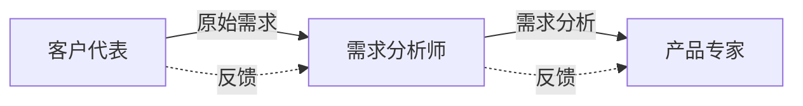
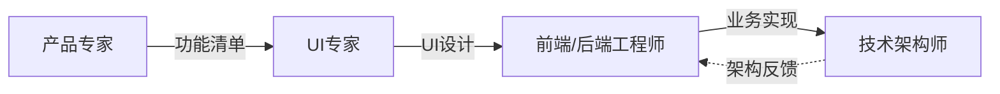
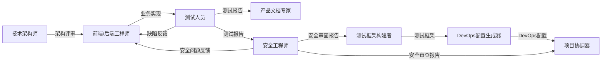
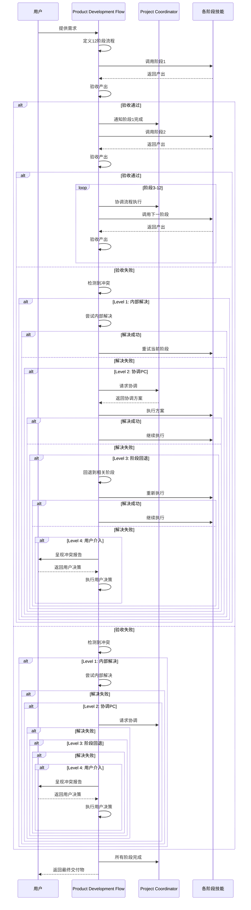

# 产品研发流程

本skill指导将简单产品需求转化为完整、可交付的软件产品的12阶段标准开发流程，包含多次校对机制确保质量。

## 技能体系概览

本流程集成了以下15个专业技能：

### 核心开发流程（12阶段）

1. 客户代表（Customer Representative） - 需求提出

2. 需求分析师（Requirements Analyst） - 需求分析

3. 产品专家（Product Expert） - 产品化设计

4. UI专家（UI Expert） - 界面设计

5. 前端工程师（Frontend Engineer） - 前端开发

6. 后端工程师（Backend Engineer） - 后端开发

7. 技术架构师（Technical Architect） - 架构保障

8. 测试人员（Tester） - 测试验证

9. 产品文档专家（Product Documentation Expert） - 文档交付

10. 安全工程师（Security Engineer） - 安全审查

11. 测试框架构建者（Test Framework Builder） - 测试框架搭建

12. DevOps配置生成器（DevOps Generator） - DevOps配置生成

### 协调与交付流程（1阶段）

1. 项目协调器（Project Coordinator） - 项目协调与交付

### 支撑技能（嵌入式）

以下技能嵌入到相应的阶段中，不作为独立阶段：

- **项目规划师（Project Planner）** - 嵌入到"需求分析"阶段
- **数据工程师（Data Engineer）** - 嵌入到"架构保障"阶段
- **系统优化师（System Optimizer）** - 嵌入到"测试验证"阶段
- **灾备规划师（Disaster Recovery Planner）** - 嵌入到"架构保障"阶段

## 何时使用本Skill

当用户表达开发软件产品、功能或系统的意图时使用，例如：

- "我想要开发一个做X的产品"
- "我需要一个处理Y的功能"
- "帮我设计并构建一个Z系统"

## 12阶段开发流程

### 流程可视化

```mermaid
graph LR
    A[阶段1: 需求提出<br/>客户代表] --> B[阶段2: 需求分析<br/>需求分析师]
    B --> C[阶段3: 产品化设计<br/>产品专家]
    C --> D[阶段4: UI设计<br/>UI专家]
    D --> E[阶段5: 前端开发<br/>前端工程师]
    E --> F[阶段6: 后端开发<br/>后端工程师]
    F --> G[阶段7: 架构保障<br/>技术架构师]
    G --> H[阶段8: 测试验证<br/>测试人员]
    H --> I[阶段9: 文档交付<br/>产品文档专家]
    I --> J[阶段10: 安全审查<br/>安全工程师]
    J --> K[阶段11: 测试框架<br/>测试框架构建者]
    K --> L[阶段12: 发布运维<br/>DevOps配置生成器]
    L --> M[阶段13: 项目协调<br/>项目协调器]

    style A fill:#e1f5ff
    style B fill:#fff4e1
    style C fill:#ffe1e1
    style D fill:#e1ffe1
    style E fill:#f5e1ff
    style F fill:#ffe1f5
    style G fill:#e1ffea
    style H fill:#eae1ff
    style I fill:#ffeaea
    style J fill:#e1f5ff
    style K fill:#f5ffe1
    style L fill:#fff5e1
    style M fill:#e1f5ff

    linkStyle 0 stroke:#2196F3,stroke-width:2px
    linkStyle 1 stroke:#FF9800,stroke-width:2px
    linkStyle 2 stroke:#F44336,stroke-width:2px
    linkStyle 3 stroke:#4CAF50,stroke-width:2px
    linkStyle 4 stroke:#9C27B0,stroke-width:2px
    linkStyle 5 stroke:#E91E63,stroke-width:2px
    linkStyle 6 stroke:#00BCD4,stroke-width:2px
    linkStyle 7 stroke:#3F51B5,stroke-width:2px
    linkStyle 8 stroke:#FF5722,stroke-width:2px
    linkStyle 9 stroke:#2196F3,stroke-width:2px
    linkStyle 10 stroke:#CDDC39,stroke-width:2px
    linkStyle 11 stroke:#FFC107,stroke-width:2px
    linkStyle 12 stroke:#00BCD4,stroke-width:2px
```

### 阶段1：需求提出

**角色**：客户代表

**目标**：从客户视角提出产品需求

**输入**：

- 客户痛点
- 市场需求
- 业务目标

**输出**：

- 原始需求描述
- 业务场景说明

**关键活动**：

1. 从客户视角提出需求

2. 描述业务场景和痛点

3. 提出改进方案

4. 定义验收标准

**质量标准**：

- ✅ 需求清晰明确
- ✅ 符合客户视角
- ✅ 有明确的业务价值

**校对机制**：

- **校对次数**：最多3次校对
- **校对内容**：

  1. 检查需求是否完整准确表达客户意图

  2. 确认业务场景描述是否清晰

  3. 验证改进方案是否合理可行
- **校对方式**：
  - 第1次校对：客户代表自审
  - 第2次校对：如有问题，重新收集需求
  - 第3次校对：最终确认，确认无误后进入下一阶段
- **校对通过标准**：需求描述清晰、业务价值明确、客户认可

**触发Skill**：当用户说"我有需求"或"我想开发..."时，调用客户代表角色skill。

---

### 阶段2：需求分析

**角色**：需求分析师

**目标**：将原始需求扩展为系统化的需求

**输入**：

- 原始需求描述
- 业务场景说明

**输出**：

- 详细需求规格说明书
- 用例图
- 业务流程图

**关键活动**：

1. 分析和扩展原始需求

2. 识别需求之间的依赖关系

3. 分析业务流程和数据流

4. 从客户角度思考产品

5. 编写需求规格说明书

6. **调用项目规划师**：生成项目计划、任务分解、里程碑定义、风险管理计划

**质量标准**：

- ✅ 需求完整、系统化
- ✅ 无歧义、可验证
- ✅ 符合客户期望

**校对机制**：

- **校对次数**：最多3次校对
- **校对内容**：

  1. 检查需求规格说明书的完整性

  2. 验证用例和业务流程的准确性

  3. 确认需求之间的依赖关系
- **校对方式**：
  - 第1次校对：需求分析师自审
  - 第2次校对：与客户代表确认需求理解是否正确
  - 第3次校对：最终确认，确认无误后进入下一阶段
- **校对通过标准**：需求规格说明书完整、无歧义、客户认可

**触发Skill**：需求提出后，调用需求分析师角色skill。

---

### 阶段3：产品化设计

**角色**：产品专家

**目标**：将需求转化为具体的功能点和产品形态

**输入**：

- 详细需求规格说明书
- 业务流程图

**输出**：

- 产品功能清单
- 功能规格说明
- 产品原型

**关键活动**：

1. 进行产品化分析

2. 识别核心功能点

3. 定义功能形态

4. 提出功能要求

5. 设计产品原型

**质量标准**：

- ✅ 功能点清晰完整
- ✅ 符合用户需求
- ✅ 产品形态合理

**校对机制**：

- **校对次数**：最多3次校对
- **校对内容**：

  1. 检查功能清单是否覆盖所有需求

  2. 验证功能规格说明的准确性

  3. 确认产品原型的合理性
- **校对方式**：
  - 第1次校对：产品专家自审
  - 第2次校对：与需求分析师确认功能是否对应需求
  - 第3次校对：最终确认，确认无误后进入下一阶段
- **校对通过标准**：功能点完整、规格清晰、原型合理

**触发Skill**：需求分析后，调用产品专家角色skill。

---

### 阶段4：界面设计

**角色**：UI专家

**目标**：定义符合用户体验的交互界面

**输入**：

- 产品功能清单
- 功能规格说明
- 产品原型

**输出**：

- UI设计稿
- 交互流程图
- 设计规范

**关键活动**：

1. 分析产品需求

2. 设计用户交互流程

3. 设计界面布局

4. 从美学角度优化界面

5. 制定设计规范

**质量标准**：

- ✅ 符合用户体验原则
- ✅ 视觉美观统一
- ✅ 交互流畅自然

**校对机制**：

- **校对次数**：最多3次校对
- **校对内容**：

  1. 检查UI设计稿是否符合功能需求

  2. 验证交互流程的逻辑性

  3. 确认设计规范的完整性
- **校对方式**：
  - 第1次校对：UI专家自审
  - 第2次校对：与产品专家确认设计是否符合功能要求
  - 第3次校对：最终确认，确认无误后进入下一阶段
- **校对通过标准**：设计符合UX原则、视觉美观、交互流畅

**触发Skill**：产品化设计后，调用UI专家角色skill。

---

### 阶段5：业务实现

**角色**：前端工程师、后端工程师

**目标**：实现产品功能，构建业务领域

**输入**：

- UI设计稿
- 功能规格说明
- 产品原型

**输出**：

- 前端页面代码
- 后端服务代码
- 业务领域模型

**关键活动**：

1. 理解产品需求

2. 识别业务实体

3. 构建业务领域

4. 实现前端页面

5. 实现后端服务

**质量标准**：

- ✅ 功能实现完整
- ✅ 业务逻辑正确
- ✅ 代码质量高

**校对机制**：

- **校对次数**：最多3次校对
- **校对内容**：

  1. 检查代码实现是否符合功能规格

  2. 验证业务逻辑的正确性

  3. 确认代码质量（可读性、可维护性）
- **校对方式**：
  - 第1次校对：工程师自审（代码审查）
  - 第2次校对：与技术架构师确认代码架构符合规范
  - 第3次校对：最终确认，确认无误后进入下一阶段
- **校对通过标准**：功能完整、逻辑正确、代码质量达标

**触发Skill**：界面设计后，调用前端工程师和后端工程师角色skill。

---

### 阶段6：架构保障

**角色**：技术架构师

**目标**：确保系统架构符合健壮性、扩展性、并发性、伸缩性要求

**输入**：

- 业务领域模型
- 功能规格说明
- 性能要求

**输出**：

- 系统架构设计
- 架构规范
- 代码审查报告

**关键活动**：

1. 设计系统架构

2. 确保架构健壮性

3. 确保架构扩展性

4. 确保并发支撑性

5. 确保伸缩性

6. 推进Explicit Architecture等清晰架构

7. 推进六边形架构等多维度架构

8. 代码架构审查

9. **调用数据工程师**：进行数据建模、数据库设计、数据迁移方案设计

10. **调用灾备规划师**：制定灾备和容灾方案、设计备份和恢复策略

**质量标准**：

- ✅ 架构符合要求
- ✅ 代码遵循架构规范
- ✅ 系统健壮可扩展

**校对机制**：

- **校对次数**：最多3次校对
- **校对内容**：

  1. 检查系统架构设计是否符合健壮性、扩展性要求

  2. 验证代码是否遵循架构规范

  3. 确认系统的并发支撑性和伸缩性
- **校对方式**：
  - 第1次校对：技术架构师自审
  - 第2次校对：与工程师确认架构设计是否可行
  - 第3次校对：最终确认，确认无误后进入下一阶段
- **校对通过标准**：架构设计合理、代码符合规范、系统健壮

**触发Skill**：业务实现期间和之后，调用技术架构师角色skill。

---

### 阶段7：测试验证

**角色**：测试人员

**目标**：确保代码功能正确性

**输入**：

- 功能规格说明
- 代码实现

**输出**：

- 测试用例
- 测试报告
- 缺陷报告
- 测试工具

**关键活动**：

1. 根据产品和用户需求编写测试用例

2. 进行单元测试

3. 进行集成测试

4. 进行手工测试

5. 开发测试工具

6. 提供测试工具给开发人员

7. 进行开发阶段自我验证

8. **调用系统优化师**：进行性能分析和诊断、制定性能优化方案、生成监控配置

**质量标准**：

- ✅ 测试用例覆盖全面
- ✅ 缺陷发现率高
- ✅ 测试工具实用

**校对机制**：

- **校对次数**：最多3次校对
- **校对内容**：

  1. 检查测试用例的覆盖率和完整性

  2. 验证测试报告的准确性

  3. 确认缺陷报告的优先级分类
- **校对方式**：
  - 第1次校对：测试人员自审
  - 第2次校对：与工程师确认测试结果是否准确
  - 第3次校对：最终确认，确认无误后进入下一阶段
- **校对通过标准**：测试覆盖全面、缺陷准确、测试工具可用

**触发Skill**：业务实现后，调用测试人员角色skill。

---

### 阶段8：文档交付

**角色**：产品文档专家

**目标**：形成系统化的产品文档

**输入**：

- 产品功能清单
- 功能规格说明
- 测试报告

**输出**：

- 产品介绍文档
- 用户使用手册
- API文档
- 常见问题文档

**关键活动**：

1. 系统化整理产品功能

2. 撰写专业文案

3. 编写产品介绍

4. 编写使用方法

5. 编写常见问题处理

**质量标准**：

- ✅ 文档系统化完整
- ✅ 文案专业易读
- ✅ 用户易于理解

**校对机制**：

- **校对次数**：最多3次校对
- **校对内容**：

  1. 检查文档的完整性和系统性

  2. 验证文案的专业性和可读性

  3. 确认用户是否易于理解
- **校对方式**：
  - 第1次校对：产品文档专家自审
  - 第2次校对：与产品专家确认文档内容是否准确
  - 第3次校对：最终确认，确认无误后进入下一阶段
- **校对通过标准**：文档完整、文案专业、用户易懂

**触发Skill**：测试验证后，调用产品文档专家角色skill。

---

### 阶段9：安全审查

**角色**：安全工程师

**目标**：全面审查系统安全性，检测漏洞，确保系统安全合规

**输入**：

- 业务领域模型
- 代码实现
- 系统架构设计
- 测试报告
- 配置文件

**输出**：

- 安全需求清单
- 安全风险评估报告
- 安全漏洞报告
- 安全修复建议
- 安全审查报告

**关键活动**：

1. **需求阶段安全审查**
   - 识别数据安全需求
   - 评估认证和授权需求
   - 识别合规性要求（GDPR、SOC2等）
   - 定义安全验收标准

2. **设计阶段安全审查**
   - 审查架构安全设计
   - 评估威胁模型
   - 审查数据流安全性
   - 审查接口安全设计
   - 评估第三方依赖风险

3. **代码实现安全审查**
   - 静态代码分析（SQL注入、XSS、命令注入等）
   - 依赖安全检查（CVE漏洞）
   - 配置安全检查（硬编码密钥、不安全配置）
   - 业务逻辑安全审查（权限绕过、竞争条件）

4. **生成安全报告**
   - 编写安全漏洞报告
   - 提供修复建议
   - 评估风险等级
   - 制定修复计划

**审查重点**：

- OWASP Top 10 漏洞检查
- 输入验证和输出编码
- 认证和授权机制
- 数据加密和传输安全
- 会话管理安全
- API安全设计
- 第三方依赖安全
- 配置安全

**质量标准**：

- ✅ 漏洞检测准确率高（≥95%）
- ✅ 修复建议可操作性强
- ✅ 审查覆盖全面（代码、配置、依赖、业务逻辑）
- ✅ 无严重/高危安全漏洞

**校对机制**：

- **校对次数**：最多3次校对
- **校对内容**：
  1. 检查安全审查报告的完整性
  2. 验证漏洞检测的准确性
  3. 确认修复建议的可行性
- **校对方式**：
  - 第1次校对：安全工程师自审
  - 第2次校对：与技术架构师确认架构设计是否满足安全要求
  - 第3次校对：与工程师确认漏洞修复方案是否可行
- **校对通过标准**：无严重/高危漏洞、审查覆盖全面、修复方案可行

**触发Skill**：测试验证后，调用安全工程师角色skill。

---

### 阶段10：测试框架搭建

**角色**：测试框架构建者

**目标**：搭建完整的自动化测试框架，生成测试配置和工具链

**输入**：

- 项目技术栈
- 测试需求（单元/集成/E2E）
- 测试框架偏好

**输出**：

- 单元测试配置和示例
- 集成测试配置和工具
- E2E测试配置和脚本
- 测试工具链配置（覆盖率、报告）
- 测试数据管理（工厂、fixtures）

**关键活动**：

1. 分析项目技术栈和测试需求

2. 生成单元测试框架配置

3. 生成集成测试框架配置

4. 生成E2E测试框架配置

5. 配置测试工具链（覆盖率、报告、性能测试）

6. 生成测试数据管理工具

7. 编写测试文档和示例

**审查重点**：

- 测试框架配置是否适合项目技术栈
- 测试类型是否覆盖完整（单元/集成/E2E）
- 测试工具链是否合理（覆盖率、报告）
- 测试数据管理是否方便
- 测试文档是否清晰

**质量标准**：

- ✅ 测试配置语法正确
- ✅ 测试框架可正确运行
- ✅ 测试脚本可以执行
- ✅ 覆盖率配置合理
- ✅ 测试文档清晰完整

**校对机制**：

- **校对次数**：最多3次校对
- **校对内容**：

  1. 检查测试配置的完整性

  2. 验证测试框架是否适合项目

  3. 确认测试文档的清晰性
- **校对方式**：
  - 第1次校对：测试框架构建者自审
  - 第2次校对：与测试人员确认测试框架是否满足需求
  - 第3次校对：最终确认，确认无误后进入下一阶段
- **校对通过标准**：测试配置完整、框架适合项目、文档清晰

**触发Skill**：安全审查后，调用测试框架构建者skill。

---

### 阶段11：发布与运维 (Release & Operations)

**角色**：DevOps工程师, 技术架构师

**目标**：实现产品或功能的自动化、平滑上线，并保障生产环境的稳定运行。

**输入**：

- 通过安全审查的可部署构建物 (Artifacts)
- 基础设施即代码 (IaC) 脚本
- 运维监控需求

**输出**：

- 发布计划 (Release Plan)
- 变更管理记录
- 自动化部署流水线 (CI/CD Pipeline)
- 生产环境监控仪表盘 (Dashboard)
- 回滚预案与操作手册

**关键活动**：

1. **制定发布策略**：选择蓝绿发布、金丝雀发布或滚动发布等策略。

2. _`配置CI/CD流水线`_：自动化构建、测试、打包、部署流程。

3. **基础设施准备**：使用IaC (如Terraform, Ansible) 配置生产环境。

4. **执行发布**：按计划执行上线流程，并进行发布验证。

5. **版本与变更管理**：记录所有生产环境的变更。

6. **制定并演练回滚预案**：确保出现问题时能快速恢复。

**质量标准**：

- ✅ 发布过程自动化率 > 95%。
- ✅ 具备一键回滚能力。
- ✅ 发布引起的生产环境故障（P0/P1级）次数符合SLA目标。
- ✅ 所有生产变更都有记录和审计日志。

---

### 阶段12：监控与反馈 (Monitoring & Feedback)

**角色**：SRE工程师, 产品专家, 客户代表

**目标**：持续监控产品运行状态，收集用户反馈，量化系统表现，为产品迭代提供数据支持。

**目标**：

1. **建立可观测性体系**：集成日志、指标 (Metrics) 和分布式追踪 (Tracing)。

2. _`定义服务等级目标 (SLO/SLI)`_：量化系统的可靠性与性能标准。

3. **配置告警**：基于SLO和关键指标设置有效告警，避免告警疲劳。

4. **收集用户反馈**：通过客服、社区、应用内反馈等渠道收集用户意见。

5. _`事故复盘 (Postmortem)`_：对生产环境故障进行根因分析，总结经验，推动改进。

6. **数据驱动决策**：分析运营数据和用户行为，验证产品假设，识别新的机会点。

**质量标准**：

- ✅ 核心业务流程具备端到端的可观测性。
- ✅ 关键服务均定义了明确的SLO。
- ✅ 95%以上的P0/P1级故障在发生后5分钟内触发告警。
- ✅ 每个迭代周期都会回顾和分析用户反馈及运营数据。
- ✅ 所有P0/P1级故障都有正式的复盘报告和跟进项。

---

## 协作流程

### 需求分析协作



### 设计开发协作



### 测试发布协作



## 资源规划与时间估算

| 阶段           | 建议人力 | 预计工期 | 所需工具/技能                    |
| -------------- | -------- | -------- | -------------------------------- |
| 需求提出       | 1人      | 1-2天    | 沟通能力、需求表达               |
| 需求分析       | 1-2人    | 3-5天    | 分析工具、业务理解               |
| 产品化设计     | 1人      | 3-5天    | 产品思维、竞品分析               |
| 界面设计       | 1-2人    | 5-10天   | 设计工具、UI/UX基础              |
| 业务实现       | 2-4人    | 15-30天  | 编程语言、框架、数据库           |
| 架构保障       | 1人      | 进行中   | 架构设计、代码审查               |
| 测试验证       | 1-2人    | 5-15天   | 测试工具、自动化框架             |
| 文档交付       | 1人      | 3-5天    | 文案撰写、文档工具               |
| 安全审查       | 1人      | 3-7天    | 安全扫描工具、渗透测试、漏洞分析 |
| 测试框架搭建   | 1人      | 2-5天    | 测试框架、覆盖率工具、报告工具   |
| DevOps配置生成 | 1人      | 2-4天    | Docker, K8s, CI/CD, 监控工具     |
| 项目协调与交付 | 1人      | 1-2天    | 流程编排、上下文管理、文档生成   |

**合计预计工期**：小型功能 40-70天 | 中型产品 75-110天 | 大型系统 135-210天

**校对时间**：每个阶段最多3次校对，每次校对预计增加0.5-1天时间

## 使用流程

当用户表达产品开发意图时：

1. **识别意图**：识别诸如"我想开发..."或"我需要一个功能..."的语句
2. **从阶段1开始**：调用客户代表角色skill
3. **按阶段推进**：依次调用适当的角色skill
4. **保持上下文**：将上一阶段的输出传递给下一阶段
5. **确保质量**：继续之前验证每个阶段符合其质量标准

## 异常处理机制

### 阶段内失败处理

| 失败情景         | 处理方式                       | 负责人           |
| ---------------- | ------------------------------ | ---------------- |
| 需求不明确       | 回到需求提出阶段，重新采集需求 | 需求分析师       |
| 设计不可行       | 与产品专家协商，调整功能点     | 产品专家         |
| 实现困难         | 与架构师重新设计方案           | 技术架构师       |
| 测试失败         | 返回开发阶段进行代码修复       | 前端/后端工程师  |
| 文档不完整       | 补充缺失文档内容               | 产品文档专家     |
| 安全问题         | 返回开发/设计阶段修复安全问题  | 安全工程师       |
| 测试框架配置错误 | 重新生成测试框架配置           | 测试框架构建者   |
| DevOps配置错误   | 重新生成DevOps配置             | DevOps配置生成器 |

### 跨阶段反馈机制

- **架构审查发现问题**：打回业务实现阶段进行调整
- **测试发现设计问题**：打回设计阶段重新评估
- **安全审查发现问题**：根据漏洞严重级别打回相应阶段
  - 严重/高危漏洞：立即打回业务实现或设计阶段修复
  - 中危漏洞：建议在本次迭代修复
  - 低危漏洞：纳入后续迭代周期
- **测试框架配置错误**：重新生成测试框架配置
- **DevOps配置错误**：重新生成DevOps配置
- **交付后发现需求偏差**：纳入后续迭代周期
- **重大变更**：从受影响阶段开始重新规划

## 阶段验收标准

| 阶段           | 验收角色     | 验收标准                                |
| -------------- | ------------ | --------------------------------------- |
| 需求提出       | 需求分析师   | 需求清晰、符合客户视角                  |
| 需求分析       | 产品专家     | 需求完整、系统化                        |
| 产品化设计     | UI专家       | 功能点清晰、产品形态合理                |
| 界面设计       | 前端工程师   | 符合用户体验、视觉美观                  |
| 业务实现       | 技术架构师   | 功能完整、业务逻辑正确                  |
| 架构保障       | 技术架构师   | 架构符合要求、代码遵循规范              |
| 测试验证       | 产品文档专家 | 测试覆盖全面、缺陷修复                  |
| 文档交付       | 客户代表     | 文档完整、专业易读                      |
| 安全审查       | 技术架构师   | 无严重/高危漏洞、审查覆盖全面、符合合规 |
| 测试框架搭建   | 测试人员     | 测试配置完整、框架可用、文档清晰        |
| DevOps配置生成 | 技术架构师   | 配置正确、可用、文档完整                |
| 项目协调与交付 | 客户代表     | 交付物完整、可用、符合需求              |

## 成功指标

- 需求理解准确率 ≥ 95%
- 产品功能实现完整率 ≥ 98%
- 测试用例覆盖率 ≥ 90%
- 缺陷修复率 ≥ 98%
- 文档完整性 ≥ 95%
- 客户满意度 ≥ 4.5/5.0
- 安全漏洞检测准确率 ≥ 95%
- 严重/高危安全漏洞 = 0
- 中危安全漏洞修复率 ≥ 95%
- 测试框架配置正确率 = 100%
- DevOps配置可用性 = 100%
- 交付物完整性 = 100%

## 最佳实践

### 需求阶段

- 📌 进行多轮需求确认，确保理解准确
- 📌 记录需求变更日志，追踪需求演进
- 📌 邀请客户参与验收，减少偏差

### 设计阶段

- 📌 进行设计评审，多人把关
- 📌 创建高保真原型让客户确认
- 📌 保留设计决策文档，便于后续维护

### 实现阶段

- 📌 定期进行架构评审，确保代码质量
- 📌 实施代码审查制度，防止质量滑坡
- 📌 建立清晰的API契约，前后端并行开发

### 测试阶段

- 📌 优先进行单元测试，覆盖核心逻辑
- 📌 建立自动化测试框架，提高测试效率
- 📌 进行测试报告评审，确保缺陷优先级准确

### 交付阶段

- 📌 文档应包含故障排查指南
- 📌 提供使用视频或演示，增强理解
- 📌 建立反馈渠道，为后续迭代收集需求

### 安全阶段

- 📌 在需求阶段就考虑安全需求
- 📌 定期进行安全审计和渗透测试
- 📌 及时修复安全漏洞，建立漏洞管理流程
- 📌 使用安全的编码实践，避免常见漏洞
- 📌 定期更新依赖库，修复已知漏洞

## 常见场景示例

### 场景1：简单工具类产品

```text

需求提出(1天) → 需求分析(2天) → 产品设计(2天) → UI设计(3天)
→ 业务实现(10天) → 架构审查(2天) → 测试(5天) → 安全审查(3天)
→ 测试框架搭建(2天) → DevOps配置生成(2天) → 项目协调与交付(1天)
总耗时：约33天（不含校对时间）
```

### 场景2：中等复杂度管理系统

```text
需求提出(2天) → 需求分析(4天) → 产品设计(4天) → UI设计(7天)
→ 业务实现(25天) → 架构审查(3天) → 测试(10天) → 安全审查(5天)
→ 测试框架搭建(3天) → DevOps配置生成(3天) → 项目协调与交付(2天)
总耗时：约68天（不含校对时间）
```

### 场景3：大型平台系统

```text
需求提出(3天) → 需求分析(7天) → 产品设计(7天) → UI设计(14天)
→ 业务实现(50天) → 架构审查(5天) → 测试(20天) → 安全审查(7天)
→ 测试框架搭建(5天) → DevOps配置生成(3天) → 项目协调与交付(2天)
总耗时：约126天（不含校对时间），建议分期交付
```

## 迭代与升级

当产品进入迭代阶段时：

1. **增量需求**：仅重复必要阶段（通常从阶段2开始）
2. **Bug修复**：直接在实现和测试阶段处理
3. **重构优化**：由架构师和开发人员联合进行
4. **版本交付**：遵循完整交付流程，确保质量稳定
5. **安全迭代**：定期进行安全审查，修复漏洞，升级安全措施

## 校对机制详解

### 多次校对原则

本流程采用**最多3次校对**机制，确保每个阶段的产出质量：

1. **第1次校对**：自审
   - 由阶段负责人自行审查产出
   - 检查完整性、准确性、一致性
   - 修正明显问题

2. **第2次校对**：交叉审查
   - 与下一阶段或相关角色进行审查
   - 从接收方视角评估产出质量
   - 确认交付物是否符合要求

3. **第3次校对**：最终确认
   - 与客户代表或项目负责人确认
   - 确保产出符合业务目标
   - 获得正式批准后进入下一阶段

### 校对触发条件

**自动触发**：

- 每个阶段完成后自动触发校对
- 发现问题时回退到该阶段进行校对

**手动触发**：

- 客户或项目负责人提出质疑
- 发现重大缺陷或遗漏
- 需求发生变更

### 校对通过标准

每个阶段都有明确的**校对通过标准**，只有满足所有标准才能通过校对：

- ✅ 产出物完整齐全
- ✅ 内容准确无误
- ✅ 符合阶段质量标准
- ✅ 相关方确认认可
- ✅ 无阻塞问题

### 校对失败处理

**第1次校对失败**：

- 修正问题后进行第2次校对

**第2次校对失败**：

- 与相关角色沟通，明确问题
- 必要时返回前一阶段重新调整
- 修正后进行第3次校对

**第3次校对失败**：

- 暂停当前阶段
- 召集相关角色召开评审会议
- 评估是否需要重新规划
- 决定是否继续或终止

### 校对记录

- 每次校对都必须记录：校对人、校对内容、发现的问题、处理方式
- 校对记录作为项目质量追溯的重要依据
- 定期分析校对记录，持续改进流程

---

## 调用其他技能

### 调用时机

本skill作为产品开发的协调流程，在12个开发阶段中依次调用以下技能：

### 调用的技能及场景

本技能体系中的所有专业技能都可以独立使用，也可以在本流程中被调用。

### 技能独立性说明

**独立性原则**:

- 每个专业技能都是一个独立的技能，拥有完整的职责和能力
- 可以在任何适合的场景下调用，不局限于产品开发流程
- 用户的需求匹配技能职责时，可以直接调用，无需经过整个流程

**调用模式**:

1. **独立使用模式**: 用户直接调用单个技能完成特定任务
2. **流程集成模式**: 在product-development-flow中按顺序调用

**示例**:

- 用户说"帮我设计一个RESTful API" → 直接调用backend-engineer
- 用户说"我要开发一个完整的产品" → 调用product-development-flow

### 技能调用清单

本流程按以下顺序调用专业技能：

**阶段1: 需求提出**

- customer-representative (客户代表)

**阶段2: 需求分析**

- requirements-analyst (需求分析师)
- project-planner (项目规划师)

**阶段3: 产品化设计**

- product-expert (产品专家)

**阶段4: 界面设计**

- ui-expert (UI专家)

**阶段5: 业务实现**

- frontend-engineer (前端工程师)
- backend-engineer (后端工程师)

**阶段6: 架构保障**

- technical-architect (技术架构师)
- data-engineer (数据工程师)
- disaster-recovery-planner (灾备规划师)

**阶段7: 测试验证**

- tester (测试人员)
- system-optimizer (系统优化师)
- test-framework-builder (测试框架构建者)

**阶段8: 文档交付**

- product-documentation-expert (产品文档专家)

**阶段9: 安全审查**

- security-engineer (安全工程师)

**阶段10: 测试框架搭建**

- test-framework-builder (测试框架构建者)

**阶段11: 发布与运维**

- devops-generator (DevOps配置生成器)

**阶段12: 监控与反馈**

- project-coordinator (项目协调器)

---

### 调用时机与场景

#### 1. 调用客户代表（customer-representative）

**阶段**：阶段1 - 需求提出

**调用方式**：

```typescript
const customerRepresentative = await useSkill("customer-representative");
const requirements = await customerRepresentative.proposeRequirements({
  customerPainPoints: painPoints,
  marketDemand: demand,
  businessGoals: goals,
});
```

**调用场景**：

**场景1**：需求提出

- **输入**：客户痛点、市场需求、业务目标
- **调用**：customer-representative提出原始需求描述、业务场景说明
- **输出**：原始需求描述、业务场景说明

---

#### 2. 调用需求分析师（requirements-analyst）

**阶段**：阶段2 - 需求分析

**调用方式**：

```typescript
const requirementsAnalyst = await useSkill("requirements-analyst");
const requirementsSpec = await requirementsAnalyst.analyzeRequirements({
  rawRequirements: requirements,
  businessScenarios: scenarios,
});
```

**调用场景**：

**场景1**：需求分析

- **输入**：原始需求描述、业务场景说明
- **调用**：requirements-analyst扩展需求、分析依赖、生成需求规格说明书
- **输出**：详细需求规格说明书、用例图、业务流程图

---

#### 3. 调用产品专家（product-expert）

**阶段**：阶段3 - 产品化设计

**调用方式**：

```typescript
const productExpert = await useSkill("product-expert");
const productDesign = await productExpert.designProduct({
  requirementsSpec: requirements,
  businessProcess: process,
});
```

**调用场景**：

**场景1**：产品化设计

- **输入**：详细需求规格说明书、业务流程图
- **调用**：product-expert进行产品化分析、识别功能点、设计原型
- **输出**：产品功能清单、功能规格说明、产品原型

---

#### 4. 调用UI专家（ui-expert）

**阶段**：阶段4 - 界面设计

**调用方式**：

```typescript
const uiExpert = await useSkill("ui-expert");
const uiDesign = await uiExpert.designInterface({
  featureList: features,
  functionalSpecs: specs,
  productPrototype: prototype,
});
```

**调用场景**：

**场景1**：UI设计

- **输入**：产品功能清单、功能规格说明、产品原型
- **调用**：ui-expert设计用户交互流程、界面布局、设计规范
- **输出**：UI设计稿、交互流程图、设计规范

---

#### 5. 调用前端工程师和后端工程师（frontend-engineer、backend-engineer）

**阶段**：阶段5 - 业务实现

**调用方式**：

```typescript
const frontendEngineer = await useSkill("frontend-engineer");
const backendEngineer = await useSkill("backend-engineer");

const frontendCode = await frontendEngineer.implementFrontend({
  uiDesign: design,
  functionalSpecs: specs,
});

const backendCode = await backendEngineer.implementBackend({
  functionalSpecs: specs,
  businessRequirements: requirements,
});
```

**调用场景**：

**场景1**：业务实现

- **输入**：UI设计稿、功能规格说明、产品原型
- **调用**：frontend-engineer和backend-engineer实现前端页面和后端服务
- **输出**：前端页面代码、后端服务代码、业务领域模型

---

#### 6. 调用技术架构师（technical-architect）

**阶段**：阶段6 - 架构保障

**调用方式**：

```typescript
const technicalArchitect = await useSkill("technical-architect");
const architecture = await technicalArchitect.designArchitecture({
  businessDomain: domain,
  functionalSpecs: specs,
  performanceRequirements: perfReqs,
});
```

**调用场景**：

**场景1**：架构设计

- **输入**：业务领域模型、功能规格说明、性能要求
- **调用**：technical-architect设计系统架构、确保健壮性/扩展性/并发性/伸缩性
- **输出**：系统架构设计、架构规范、代码审查报告

---

#### 7. 调用数据工程师（data-engineer）

**阶段**：阶段6 - 架构保障（嵌入式）

**调用方式**：

```typescript
const dataEngineer = await useSkill("data-engineer");
const dataModel = await dataEngineer.designDataModel({
  requirements: requirements,
  businessDomain: domain,
});
```

**调用场景**：

**场景1**：数据建模

- **输入**：需求、业务领域
- **调用**：data-engineer进行数据建模、数据库设计
- **输出**：数据模型、数据库Schema

---

#### 8. 调用灾备规划师（disaster-recovery-planner）

**阶段**：阶段6 - 架构保障（嵌入式）

**调用方式**：

```typescript
const disasterRecoveryPlanner = await useSkill("disaster-recovery-planner");
const disasterPlan = await disasterRecoveryPlanner.planDisasterRecovery({
  architecture: architecture,
  rto: recoveryTimeObjective,
  rpo: recoveryPointObjective,
});
```

**调用场景**：

**场景1**：灾备方案设计

- **输入**：架构、RTO/RPO
- **调用**：disaster-recovery-planner制定灾备方案、备份和恢复策略
- **输出**：灾备方案、备份策略、恢复流程

---

#### 9. 调用测试人员（tester）

**阶段**：阶段7 - 测试验证

**调用方式**：

```typescript
const tester = await useSkill("tester");
const testResults = await tester.testSystem({
  functionalSpecs: specs,
  codeImplementation: code,
});
```

**调用场景**：

**场景1**：测试验证

- **输入**：功能规格说明、代码实现
- **调用**：tester编写测试用例、进行测试、提供测试工具
- **输出**：测试用例、测试报告、缺陷报告、测试工具

---

#### 10. 调用系统优化师（system-optimizer）

**阶段**：阶段7 - 测试验证（嵌入式）

**调用方式**：

```typescript
const systemOptimizer = await useSkill("system-optimizer");
const optimization = await systemOptimizer.optimizeSystem({
  performanceMetrics: metrics,
  bottlenecks: identifiedBottlenecks,
});
```

**调用场景**：

**场景1**：性能优化

- **输入**：性能指标、瓶颈
- **调用**：system-optimizer进行性能分析、制定优化方案
- **输出**：性能优化方案、监控配置

---

#### 11. 调用产品文档专家（product-documentation-expert）

**阶段**：阶段8 - 文档交付

**调用方式**：

```typescript
const productDocumentationExpert = await useSkill(
  "product-documentation-expert",
);
const documentation = await productDocumentationExpert.generateDocumentation({
  featureList: features,
  functionalSpecs: specs,
  testReport: testResults,
});
```

**调用场景**：

**场景1**：文档生成

- **输入**：产品功能清单、功能规格说明、测试报告
- **调用**：product-documentation-expert编写产品介绍、用户手册、API文档
- **输出**：产品介绍文档、用户使用手册、API文档、常见问题文档

---

#### 12. 调用安全工程师（security-engineer）

**阶段**：阶段9 - 安全审查

**调用方式**：

```typescript
const securityEngineer = await useSkill("security-engineer");
const securityAssessment = await securityEngineer.assessSecurity({
  businessDomain: domain,
  codeImplementation: code,
  systemArchitecture: architecture,
  testReport: testResults,
  configurationFiles: config,
});
```

**调用场景**：

**场景1**：安全审查

- **输入**：业务领域模型、代码实现、系统架构、测试报告、配置文件
- **调用**：security-engineer进行安全审查、检测漏洞、提供修复建议
- **输出**：安全需求清单、安全风险评估报告、安全漏洞报告、安全修复建议、安全审查报告

---

#### 13. 调用测试框架构建者（test-framework-builder）

**阶段**：阶段10 - 测试框架搭建

**调用方式**：

```typescript
const testFrameworkBuilder = await useSkill("test-framework-builder");
const testFramework = await testFrameworkBuilder.buildFramework({
  techStack: stack,
  testRequirements: testReqs,
  frameworkPreferences: preferences,
});
```

**调用场景**：

**场景1**：测试框架搭建

- **输入**：项目技术栈、测试需求、测试框架偏好
- **调用**：test-framework-builder搭建自动化测试框架、生成测试配置和工具链
- **输出**：单元测试配置和示例、集成测试配置和工具、E2E测试配置和脚本、测试工具链配置、测试数据管理

---

#### 14. 调用DevOps工程师（devops-generator）

**阶段**：阶段11 - 发布与运维

**调用方式**：

```typescript
const devopsGenerator = await useSkill("devops-generator");
const deploymentConfig = await devopsGenerator.configureDeployment({
  artifacts: buildArtifacts,
  infrastructureScripts: iacScripts,
  monitoringRequirements: monitoringReqs,
});
```

**调用场景**：

**场景1**：DevOps配置

- **输入**：可部署构建物、基础设施即代码脚本、运维监控需求
- **调用**：devops-generator配置CI/CD流水线、准备基础设施、制定回滚预案
- **输出**：发布计划、变更管理记录、自动化部署流水线、生产环境监控仪表盘、回滚预案与操作手册

---

#### 15. 调用项目协调器（project-coordinator）

**阶段**：协调与交付流程

**调用方式**：

```typescript
const projectCoordinator = await useSkill("project-coordinator");
const coordination = await projectCoordinator.coordinateProject({
  projectProgress: progress,
  teamResources: resources,
  milestones: milestones,
});
```

**调用场景**：

**场景1**：项目协调

- **输入**：项目进度、团队资源、里程碑
- **调用**：project-coordinator协调项目、跟踪进度、处理异常、组织评审
- **输出**：项目状态报告、协调记录、问题解决方案

---

### 调用注意事项

1. **顺序执行**：严格按照12阶段流程顺序调用技能

2. **质量把关**：每个阶段完成后进行校对，通过后才能进入下一阶段

3. **异常处理**：出现异常时，按照异常处理流程回退到相应阶段

4. **进度跟踪**：实时跟踪各阶段的进度，确保项目按时交付

5. **跨阶段协作**：确保前一阶段的输出正确传递给下一阶段

---

## 📝 使用示例

### 示例1：启动完整产品开发流程

**场景描述**：用户提出一个完整的软件开发需求

**输入示例**：

```text

我想要开发一个在线教育平台，包括：

1. 用户注册和登录

2. 课程管理

3. 在线学习

4. 作业和考试

```

**调用方式**：

```bash
invoke skill product-development-flow

```

**输出示例**：

```markdown
# 产品开发流程启动

## 项目信息

- 项目名称：在线教育平台
- 项目类型：新产品开发
- 启动时间：2026-01-25

## 流程规划

### 阶段1：需求提出
- 调用：customer-representative
- 输出：需求文档

### 阶段2：需求分析
- 调用：requirements-analyst
- 输出：规格说明书

### 阶段3-12：按顺序执行
- 依次调用相应的技能
- 每个阶段都有校对机制

## 预计工期

- 总工期：约12周
- 团队规模：10人

```

### 示例2：快速原型开发

**场景描述**：用户需要快速验证一个产品概念

**输入示例**：

```text
我需要快速开发一个MVP来验证一个产品概念：

1. 基础功能

2. 快速迭代

3. 用户反馈

```

**调用方式**：

```bash
invoke skill product-development-flow

```

**输出示例**：

```markdown
# MVP开发流程启动

## 流程简化

采用精简的6个阶段流程：

1. 需求提出

2. 需求分析

3. 产品化设计

4. 界面设计

5. 快速开发

6. 测试验证

## 快速迭代

- 每个阶段1-2天
- 快速用户反馈
- 持续优化

## 预计工期

- 总工期：约2周
- 快速MVP交付

```

---

## 🤝 协作关系与RACI矩阵

### 本技能的定位

本技能作为产品开发流程的总编排者，负责将一句话需求转化为完整产品的标准化流程，协调所有技能按顺序执行。

### 协作的技能类型

本技能主要与以下类型技能协作：

1. **流程技能**：12个核心开发阶段的技能
2. **协调技能**：project-coordinator（项目协调器）
3. **嵌入技能**：4个嵌入式支撑技能

### 协作场景

| 场景 | 协作技能 | 协作方式 | 协作内容 |
|------|----------|----------|----------|
| 流程启动 | customer-representative | 顺序调用 | 收集原始需求 |
| 需求分析 | requirements-analyst, project-planner | 顺序调用 | 分析需求并制定计划 |
| 产品设计 | product-expert | 顺序调用 | 转化为产品功能 |
| 流程协调 | project-coordinator | 嵌入调用 | 协调整个流程执行 |
| 嵌入技能 | project-planner, data-engineer, system-optimizer, disaster-recovery-planner | 嵌入调用 | 在特定阶段嵌入 |

### 本技能在各阶段的RACI角色

| 阶段 | 本技能角色 | 主要职责 |
|------|------------|----------|
| 阶段1-12 | A | 定义流程、编排技能、验收结果 |
| 所有阶段 | A | 对流程质量和最终交付负最终责任 |
| 阶段转换 | R | 触发下一阶段、传递上下文 |

### 本技能的核心任务RACI

| 任务 | 本技能 | 执行技能 | project-coordinator | 说明 |
|------|--------|----------|---------------------|------|
| 定义流程 | R/A | - | I | 定义12阶段流程 |
| 触发技能 | R | R | - | 按顺序触发技能 |
| 验收产出 | R/A | - | C | 验收各阶段产出 |
| 流程协调 | R/A | - | R | 协调流程执行 |
| 上下文传递 | R | - | R | 传递阶段间上下文 |
| 错误处理 | R | C | R | 处理流程错误 |
| 最终交付 | R/A | - | C | 验证最终交付物 |

### RACI角色说明

- **R (Responsible)** - 负责人：本skill实际执行的流程编排任务
- **A (Accountable)** - 拥有人：本skill对产品开发流程负最终责任
- **C (Consulted)** - 咨询人：本skill在流程编排时咨询project-coordinator
- **I (Informed)** - 知情人：本skill通知project-coordinator流程进展

## ⚠️ 冲突升级路径

### 冲突类型

本技能可能遇到的冲突类型：

| 冲突类型 | 严重程度 | 默认处理方式 | 示例 |
|----------|----------|--------------|------|
| 流程冲突 | 中 | 协调project-coordinator | 阶段间上下文传递失败 |
| 质量冲突 | 高 | 重新执行阶段 | 某阶段产出不达标 |
| 资源冲突 | 中 | 优化资源配置 | 技能执行资源不足 |
| 技术冲突 | 中-高 | 咨询technical-architect | 技术方案分歧 |
| 致命错误 | 极高 | 用户介入 | 系统崩溃或不可恢复错误 |

### 4级冲突升级路径

#### Level 1: 流程内部解决（本技能内部）

**适用场景**：

- 冲突严重程度：低-中
- 冲突类型：流程冲突、资源冲突
- 处理时限：< 5分钟
- 处理方式：本技能内部调整流程或重试

**处理流程**：

```typescript
async function resolveConflictLevel1(
  conflict: Conflict,
): Promise<Resolution> {
  // 1. 识别冲突类型
  const conflictType = identifyConflictType(conflict);

  // 2. 分析冲突影响范围
  const impact = analyzeImpact(conflict);

  // 3. 提出解决方案
  const solutions = generateSolutions(conflictType, impact);

  // 4. 选择最优方案
  const bestSolution = selectBestSolution(solutions);

  // 5. 执行方案
  await implementSolution(bestSolution);

  // 6. 记录结果
  recordConflictResolution(conflict, bestSolution, "Level 1");

  return bestSolution;
}
```

**输出示例**：

```markdown
# 冲突解决报告（Level 1）

## 冲突信息

- 冲突ID：flow_conf_001
- 冲突类型：流程冲突
- 冲突级别：Level 1
- 发生时间：2026-01-25 10:30:00
- 相关阶段：阶段5-6

## 冲突描述

前端和后端开发阶段的上下文传递失败，导致阶段7无法正常启动。

## 解决方案

采用方案A：增加同步等待时间，确保前后端都完成后再启动阶段7

## 解决结果

✅ 冲突已解决
- 解决时间：2分钟
- 影响范围：阶段5-7
- 执行成功
```

#### Level 2: 协调Project Coordinator（流程协调）

**适用场景**：

- 冲突严重程度：中
- 冲突类型：流程冲突无法内部解决、资源冲突
- 处理时限：< 15分钟
- 处理方式：请求project-coordinator协调解决

**处理流程**：

```typescript
async function resolveConflictLevel2(
  conflict: Conflict,
): Promise<Resolution> {
  // 1. 通知project-coordinator
  await projectCoordinator.reportConflict(conflict);

  // 2. 提供完整上下文
  const fullContext = await gatherFullContext(conflict);

  // 3. project-coordinator分析冲突
  const analysis = await projectCoordinator.analyzeConflict(
    fullContext,
  );

  // 4. project-coordinator提出协调方案
  const proposal = await projectCoordinator.proposeSolution(analysis);

  // 5. 本skill确认方案
  const confirmed = await confirmProposal(conflict, proposal);

  if (confirmed) {
    // 6. 执行方案
    await implementResolution(proposal);
    recordConflictResolution(conflict, proposal, "Level 2");
  } else {
    // 升级到Level 3
    throw new ConflictEscalationError("Level 2 resolution failed");
  }

  return proposal;
}
```

**输出示例**：

```markdown
# 冲突解决报告（Level 2）

## 冲突信息

- 冲突ID：flow_conf_002
- 冲突类型：资源冲突
- 冲突级别：Level 2
- 发生时间：2026-01-25 11:15:00
- 协调人：project-coordinator
- 相关技能：tester, backend-engineer, frontend-engineer

## 冲突描述

测试阶段资源不足，无法同时运行所有测试用例。

## 协调过程

1. project-coordinator分析资源使用情况
2. 提出资源重新分配方案
3. 分批执行测试用例

## 协调方案

采用project-coordinator提出的分批方案：
- 第一批：核心功能测试
- 第二批：边界情况测试
- 第三批：性能测试

## 解决结果

✅ 冲突已解决
- 解决时间：10分钟
- 影响范围：阶段8（测试验证）
- 协调人：project-coordinator
```

#### Level 3: 阶段回退（重新执行阶段）

**适用场景**：

- 冲突严重程度：高
- 冲突类型：质量冲突、严重技术冲突
- 处理时限：< 30分钟
- 处理方式：回退到相关阶段重新执行

**回退策略**：

| 冲突类型 | 回退阶段 | 重启阶段 | 说明 |
|----------|----------|----------|------|
| 需求冲突 | 阶段1 | 阶段1 | 重新收集需求 |
| 设计冲突 | 阶段3 | 阶段3 | 重新产品设计 |
| 实现冲突 | 阶段5-6 | 阶段5-6 | 重新前后端开发 |
| 测试冲突 | 阶段8 | 阶段5-6 | 重新开发并测试 |

**处理流程**：

```typescript
async function resolveConflictLevel3(
  conflict: Conflict,
): Promise<Resolution> {
  // 1. 评估回退必要性
  const rollbackNeeded = await evaluateRollbackNeed(conflict);

  if (!rollbackNeeded) {
    // 尝试其他解决方案
    return await tryAlternativeSolutions(conflict);
  }

  // 2. 确定回退阶段
  const rollbackStage = determineRollbackStage(conflict);

  // 3. 通知project-coordinator
  await projectCoordinator.initiateRollback(rollbackStage);

  // 4. 保存当前状态
  await saveCurrentState(conflict);

  // 5. 执行回退
  await rollbackToStage(rollbackStage);

  // 6. 重新执行阶段
  await reexecuteFromStage(rollbackStage);

  // 7. 记录结果
  recordConflictResolution(conflict, rollbackStage, "Level 3");

  return rollbackStage;
}
```

**输出示例**：

```markdown
# 冲突解决报告（Level 3）

## 冲突信息

- 冲突ID：flow_conf_003
- 冲突类型：质量冲突
- 冲突级别：Level 3
- 发生时间：2026-01-25 14:20:00
- 决策者：product-development-flow（本skill）
- 相关阶段：阶段8（测试验证）

## 冲突描述

测试阶段发现严重质量问题：
- 核心功能测试失败
- 无法通过质量验收
- 需要重新开发

## 回退决策

决定回退到阶段5-6（前端/后端开发），重新实现。

## 回退过程

1. 保存当前测试报告
2. 回退到阶段5-6
3. 重新实现核心功能
4. 重新执行阶段8测试

## 解决结果

✅ 冲突已解决
- 解决时间：25分钟
- 回退阶段：阶段5-6
- 重新执行成功
```

#### Level 4: 用户介入（最后手段）

**适用场景**：

- 冲突严重程度：极高
- 冲突类型：根本性需求冲突、项目可行性问题
- 处理时限：无限制（等待用户决策）
- 处理方式：准备详细报告，提交用户决策

**用户决策选项**：

| 选项 | 说明 | 适用场景 | 执行动作 |
|------|------|----------|----------|
| A. 继续当前流程 | 采用当前方案继续 | 问题可以绕过或临时解决 | 继续执行 |
| B. 回退到指定阶段 | 重新执行某个阶段 | 阶段性问题 | 回退并重试 |
| C. 重新设计流程 | 调整流程方案 | 流程设计有问题 | 重新设计 |
| D. 终止项目 | 停止整个项目 | 项目不可行 | 终止并清理 |

**处理流程**：

```typescript
async function resolveConflictLevel4(
  conflict: Conflict,
): Promise<Resolution> {
  // 1. 准备详细的冲突报告
  const report = await prepareDetailedReport(conflict);

  // 2. 呈现给用户
  logger.warn("Conflict escalated to user (Level 4)");
  logger.info("Presenting conflict report to user");

  const userDecision = await presentToUser(report);

  // 3. 执行用户决策
  switch (userDecision.option) {
    case "A":
      await continueWithCurrentFlow(userDecision.modifications);
      break;
    case "B":
      await rollbackToStage(userDecision.targetStage);
      break;
    case "C":
      await redesignFlow(userDecision.newFlow);
      break;
    case "D":
      await terminateProject(conflict.projectId);
      break;
  }

  // 4. 记录结果
  recordConflictResolution(conflict, userDecision, "Level 4");

  return userDecision;
}
```

**输出示例**：

```markdown
# 冲突解决报告（Level 4）

## 冲突信息

- 冲突ID：flow_conf_004
- 冲突类型：根本性需求冲突
- 冲突级别：Level 4（最高）
- 发生时间：2026-01-25 16:45:00
- 决策者：用户
- 相关阶段：阶段1-2（需求）

## 冲突描述

在产品开发过程中，客户发现原始需求与实际业务需求存在根本性差异：
- 原始需求：开发一个简单的待办事项管理
- 实际需求：需要一个复杂的项目管理系统
- 两者差异巨大，当前流程无法继续

## 备选方案

### 方案A：继续当前流程

- 说明：按当前待办事项管理功能继续开发
- 优点：可以快速交付MVP
- 缺点：无法满足实际业务需求
- 影响：产品价值有限

### 方案B：回退到阶段1

- 说明：重新收集需求，重新定义产品
- 优点：可以满足实际需求
- 缺点：需要重新开始
- 影响：增加开发时间

### 方案C：重新设计流程

- 说明：调整流程，分两阶段开发
- 优点：平衡需求和资源
- 缺点：流程复杂度增加
- 影响：需要调整所有阶段

### 方案D：终止项目

- 说明：停止项目开发
- 优点：避免资源浪费
- 缺点：无法交付产品
- 影响：项目终止

## 用户决策

用户选择：**方案B - 回退到阶段1**

## 执行结果

✅ 用户决策已执行
- 决策时间：2026-01-25 16:50:00
- 执行动作：回退到阶段1，重新收集需求
- 影响范围：整个产品开发流程
- 状态：等待用户更新需求
```

## 🔗 协作流程图

### Mermaid序列图



## 📋 协作检查清单

### 流程启动前

- [ ] 确认所有技能的可用性
- [ ] 理解用户的原始需求
- [ ] 定义12阶段流程
- [ ] 准备好项目初始上下文
- [ ] 通知project-coordinator准备协调

### 流程执行中

- [ ] 按顺序调用各阶段技能
- [ ] 验收每个阶段的产出
- [ ] 及时传递上下文
- [ ] 监控流程执行状态
- [ ] 处理流程执行错误

### 流程完成后

- [ ] 验证最终交付物
- [ ] 生成执行报告
- [ ] 通知project-coordinator
- [ ] 通知用户项目状态
- [ ] 清理临时文件

## 🚨 冲突预防

### 预防策略

1. **明确的流程定义**
   - 在SKILL.md中明确定义12阶段流程
   - 每个阶段有清晰的输入输出规范

2. **严格的质量验收**
   - 每个阶段都必须通过验收
   - 使用统一的验收标准
   - 不达标的产出必须重试

3. **充分的上下文传递**
   - 确保阶段间上下文完整传递
   - 记录关键决策
   - 维护执行历史

4. **及时的项目协调**
   - 与project-coordinator保持同步
   - 及时通知重要事件
   - 主动寻求协调帮助

5. **早期干预**
   - 在冲突早期发现并解决
   - 不让小问题积累成大问题
   - 及时回退调整

### 冲突检测

定期检查以下指标：

| 指标 | 正常值 | 警告值 | 危险值 | 处理方式 |
|------|--------|--------|--------|----------|
| 阶段成功率 | > 95% | 85-95% | < 85% | 检查技能质量 |
| 重试次数 | < 1次/阶段 | 1-2次 | > 2次 | 优化流程设计 |
| 回退次数 | < 5% | 5-10% | > 10% | 检查流程设计 |
| 平均阶段耗时 | < 预定时间 | 预定时间1-2倍 | > 2倍 | 优化资源配置 |
| 用户介入率 | < 5% | 5-10% | > 10% | 检查需求质量 |

---

## 📚 参考资料

### 全局参考资料

本skill参考以下全局参考资料：

- **编码规范**：`references/best-practices/coding.md`（包含命名规范、函数设计原则、代码组织规范、注释规范、错误处理规范）
- **设计模式**：`references/design-patterns/creational.md`、`references/design-patterns/structural.md`、`references/design-patterns/behavioral.md`
- **架构参考**：`references/architecture/hexagonal-architecture.md`、`references/architecture/microservices.md`

### 本skill特有参考资料

本skill使用以下特有的参考资料：

- **[collaboration-raci.md](../../references/collaboration/collaboration-raci.md)** - 完整的RACI矩阵文档，包含12个阶段的详细协作关系
- **[conflict-escalation-path.md](../../references/collaboration/conflict-escalation-path.md)** - 完整的冲突升级路径文档
- **[integration-example.md](../../references/collaboration/integration-example.md)** - 集成使用示例
- **[verification-checklist.md](../../references/collaboration/verification-checklist.md)** - 验证检查清单

## 🛠️ 工具脚本

### 全局工具脚本

本skill使用以下全局工具脚本：

- **Logger工具**：`scripts/utils/logger.ts`

  ```typescript
  import { createLogger } from "@codebuddy/scripts/utils/logger";
  const logger = createLogger("Product Development Flow");
  logger.info("启动产品开发流程");
  logger.skillComplete("Product Development Flow", 50000);
  ```

- **FileManager工具**：`scripts/utils/file-manager.ts`

  ```typescript
  import { FileManager } from "@codebuddy/scripts/utils/file-manager";
  const fm = new FileManager();
  await fm.createDirectory("./output");
  await fm.writeFile("./output/deliverables.md", deliverables);
  ```

- **ContextManager工具**：`scripts/utils/context-manager.ts`

  ```typescript
  import { ContextManager } from "@codebuddy/scripts/utils/context-manager";
  const ctx = new ContextManager();
  ctx.set("stage", "3");
  ctx.set("status", "in-progress");
  ```

- **CodeValidator**：`scripts/validators/code-validator.ts`

  ```typescript
  import { CodeValidator } from "@codebuddy/scripts/validators/code-validator";
  const validator = new CodeValidator();
  const result = await validator.validate("./src", { language: "typescript" });
  ```

- **ConfigValidator**：`scripts/validators/config-validator.ts`

  ```typescript
  import { ConfigValidator } from "@codebuddy/scripts/validators/config-validator";
  const validator = new ConfigValidator();
  const result = await validator.validate("./config", { schema: "package" });
  ```

### 本skill特有脚本

本skill没有特有的脚本。
