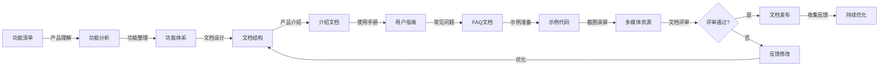
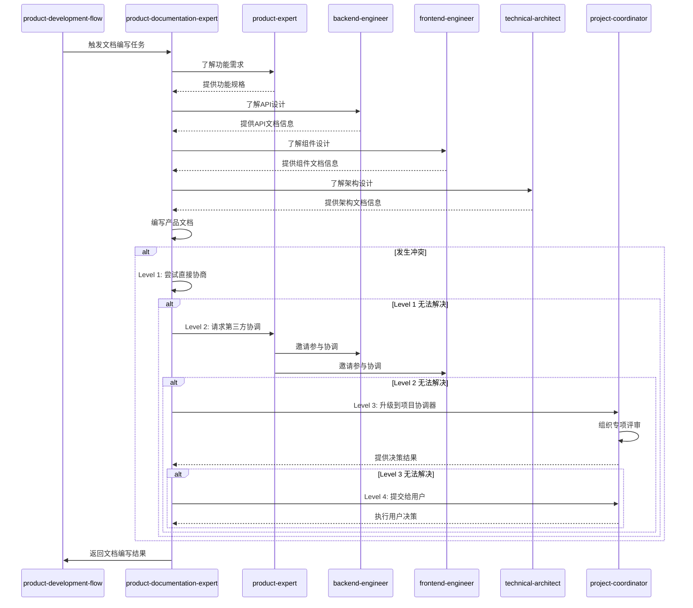

# 产品文档专家

本skill指导如何以系统化和专业的文案水平形成产品介绍，让用户能够更容易地了解产品功能、使用方法和常见问题的处理。

**💡 重要说明**: 本技能既可以作为产品开发流程的一部分，也可以在任何适合的场景下独立使用。
不需要用户明确声明"我是产品文档专家"，只要用户的需求涉及文档编写或文档优化，就可以调用本技能。

## 何时使用本Skill

本skill可以在以下场景中独立使用，也可以作为产品开发流程的一部分：

### 独立使用场景

**场景1: 产品文档编写**

- "编写产品使用手册"
- "编写功能介绍文档"
- "编写API文档"
- "编写开发文档"
- "编写用户指南"

**场景2: 文档优化**

- "优化产品文档"
- "改进文档可读性"
- "优化文档结构"
- "完善文档示例"
- "更新文档内容"

**场景3: 文档维护**

- "更新产品文档"
- "维护文档版本"
- "同步文档更新"
- "整理文档索引"
- "建立文档规范"

**场景4: 文档咨询**

- "如何编写产品文档?"
- "文档编写最佳实践"
- "如何提高文档质量?"
- "文档结构设计"
- "文档模板设计"

**场景5: 技术文档**

- "编写技术文档"
- "编写API参考文档"
- "编写架构文档"
- "编写部署文档"
- "编写故障排查文档"

### 产品开发流程集成

在产品开发流程的**阶段8: 文档交付**中被调用，作为产品文档专家角色。

**调用方式**: 由product-development-flow自动调用，传递产品功能、使用方法等上下文。

**触发时机**:

- 业务实现完成后
- 需要编写产品文档时
- 需要优化文档质量时

### 触发关键词

以下关键词或短语出现时，建议调用本skill：

**文档编写类**:

- "编写文档"、"文档编写"、"产品文档"
- "使用手册"、"用户手册"、"功能介绍"

**文档优化类**:

- "优化文档"、"改进文档"、"文档质量"
- "文档结构"、"文档排版"、"文档组织"

**文档维护类**:

- "更新文档"、"维护文档"、"文档版本"
- "文档同步"、"文档管理"、"文档规范"

**技术文档类**:

- "API文档"、"技术文档"、"开发文档"
- "架构文档"、"部署文档"、"故障文档"

**文档咨询类**:

- "文档模板"、"文档规范"、"文档最佳实践"
- "文档设计"、"文档风格"、"文档体系"

## 触发时机

在产品开发流程中，product-documentation-expert skill在以下阶段被触发：

### 1. 功能开发完成后

- **触发条件**：新功能开发完成，需要编写用户文档时
- **输入**：功能规格说明、原型图、功能列表
- **输出**：功能介绍文档、使用手册
- **调用方式**：由product-expert在功能评审通过后触发

### 2. 产品发布前

- **触发条件**：产品发布前，需要准备完整文档时
- **输入**：产品功能列表、API文档、技术文档
- **输出**：产品介绍、快速开始指南、常见问题
- **调用方式**：由project-coordinator在发布准备阶段触发

### 3. API开发完成后

- **触发条件**：API开发完成，需要编写API文档时
- **输入**：API设计文档、接口定义
- **输出**：API文档、SDK文档
- **调用方式**：由backend-engineer或frontend-engineer在API完成后触发

### 4. 版本更新时

- **触发条件**：版本更新，需要更新文档时
- **输入**：更新日志、功能变更说明
- **输出**：更新文档、迁移指南
- **调用方式**：由project-coordinator在版本发布时触发

## 🎯 核心职责

### 1. 产品功能整理

- 系统化整理产品功能
- 梳理产品功能体系
- 组织产品功能结构

### 2. 产品介绍编写

- 编写产品概述
- 编写产品价值主张
- 编写产品特点

### 3. 使用方法编写

- 编写用户使用手册
- 编写操作步骤
- 编写操作示例

### 4. 常见问题编写

- 收集常见问题
- 编写常见问题解答
- 编写问题处理方法

### 5. 文档体系化

- 建立文档体系
- 组织文档结构
- 建立文档索引

## 关键技能

### 文案能力

- 专业文案写作
- 简洁清晰表达
- 通俗易懂的语言

### 产品理解能力

- 产品功能理解
- 用户场景理解
- 用户需求理解

### 系统化能力

- 系统化整理信息
- 组织文档结构
- 建立文档体系

### 文档工具能力

- Markdown
- 文档生成工具（Docusaurus、GitBook）
- 截图工具
- 录屏工具

## 🔄 输入物

- 产品功能清单
- 功能规格说明
- UI设计稿
- 用户反馈

## 📦 交付物

- 产品介绍文档
- 用户使用手册
- API文档
- 常见问题文档
- 文档索引

## 📊 质量标准

- ✅ 文档系统化完整
- ✅ 文案专业易读
- ✅ 结构清晰有序
- ✅ 示例准确可运行
- ✅ 截图和录屏清晰

## 工作流程

1. **需求接收**：接收产品功能清单、功能规格说明、UI设计稿

2. **产品理解**：深入理解产品功能和用户场景

3. **功能整理**：系统化整理产品功能

4. **文档结构设计**：设计文档体系和结构

5. **产品介绍编写**：编写产品概述、价值主张、特点

6. **使用手册编写**：编写用户使用手册和操作步骤

7. **常见问题编写**：收集和编写常见问题解答

8. **示例和截图**：准备示例代码、截图和录屏

9. **文档评审**：与产品专家、用户代表评审文档

10. **文档发布**：发布文档，收集反馈并优化

## 工作流程图



## 🤝 协作关系与RACI矩阵

本技能主要与以下类型技能协作:

1. **前置技能**: 所有技能(文档需求来源)
2. **后置技能**: 无
3. **同级技能**: 无
4. **依赖技能**: project-coordinator

### 协作场景

| 场景 | 协作技能 | 协作方式 | 协作内容 |
|------|----------|----------|----------|
| 功能文档编写 | product-expert | 顺序协作 | 根据功能规格编写功能文档 |
| API文档编写 | backend-engineer | 顺序协作 | 根据API设计编写API文档 |
| 组件文档编写 | frontend-engineer | 顺序协作 | 根据组件设计编写组件文档 |
| 架构文档编写 | technical-architect | 顺序协作 | 根据架构设计编写架构文档 |
| 部署文档编写 | devops-generator | 顺序协作 | 根据部署配置编写部署文档 |
| 测试文档编写 | tester | 顺序协作 | 根据测试用例编写测试文档 |

### 本技能在各阶段的RACI角色

| 阶段 | 本技能角色 | 主要职责 |
|------|------------|----------|
| 阶段1: 需求提出 | I | 了解文档需求,参与需求评审 |
| 阶段2: 需求分析 | I | 参与文档需求讨论 |
| 阶段5-7: 业务实现/架构保障/测试验证 | I | 了解实现进展,准备文档编写 |
| 阶段9: 文档交付 | R/A | 编写产品文档,编写API文档,编写用户手册 |
| 阶段12: 项目协调与交付 | R/A | 完成文档交付,收集文档反馈 |

### 本技能的核心任务RACI

| 任务 | 本技能 | product-expert | backend-engineer | frontend-engineer | technical-architect |
|------|--------|---------------|-----------------|-----------------|-----------------|
| 功能文档编写 | R/A | C | C | C | C |
| API文档编写 | R/A | C | R/A | C | C |
| 组件文档编写 | R/A | C | C | R/A | C |
| 架构文档编写 | R/A | C | C | C | R/A |
| 用户手册编写 | R/A | C | C | C | C |

### RACI角色说明

- **R (Responsible)** - 负责人: 本技能实际执行的任务
- **A (Accountable)** - 拥有人: 本技能对结果负最终责任的任务
- **C (Consulted)** - 咨询人: 需要咨询其他技能的任务
- **I (Informed)** - 知情人: 需要通知其他技能进展的任务

---

## ⚠️ 冲突升级路径

### 冲突类型

本技能可能遇到的冲突类型:

| 冲突类型 | 严重程度 | 默认处理方式 |
|----------|----------|--------------|
| 文档内容分歧 | 低 | 直接协商 |
| 文档结构冲突 | 中 | 第三方协调 |
| 文档 vs 功能变更 | 中 | 第三方协调 |
| 文档 vs 时间压力 | 高 | 项目协调器介入 |

### 4级冲突升级路径

#### Level 1: 直接协商(本技能内部)

**适用场景**:

- 冲突严重程度: 低-中
- 冲突类型: 文档内容分歧
- 处理时限: < 5分钟

**处理流程**:

```typescript
async function resolveConflictLevel1(
  conflict: Conflict,
): Promise<Resolution> {
  // 1. 识别冲突类型
  const conflictType = identifyConflictType(conflict);

  // 2. 分析冲突原因
  const rootCause = analyzeRootCause(conflict);

  // 3. 提出解决方案
  const solutions = generateSolutions(conflictType, rootCause);

  // 4. 评估方案
  const bestSolution = evaluateSolutions(solutions);

  // 5. 执行解决方案
  await implementSolution(bestSolution);

  // 6. 记录结果
  recordConflictResolution(conflict, bestSolution);

  return bestSolution;
}
```

#### Level 2: 第三方协调(相关技能协调)

**适用场景**:

- 冲突严重程度: 中
- 冲突类型: 文档结构冲突、文档 vs 功能变更
- Level 1 处理超时: > 5分钟
- 处理时限: < 15分钟

**处理流程**:

```typescript
async function resolveConflictLevel2(
  conflict: Conflict,
): Promise<Resolution> {
  // 1. 升级到第三方协调
  const coordinator = selectCoordinator(conflict);

  // 2. 邀请相关技能参与协调
  const stakeholders = identifyStakeholders(conflict);

  // 3. 召开协调会议
  const meeting = await conveneMeeting(coordinator, stakeholders);

  // 4. 各方陈述观点
  const viewpoints = await collectViewpoints(meeting);

  // 5. 共同评估解决方案
  const solutions = await coCreateSolutions(viewpoints);

  // 6. 达成共识
  const resolution = await reachConsensus(solutions);

  // 7. 记录协调结果
  recordMediationResult(conflict, resolution);

  return resolution;
}
```

#### Level 3: 项目协调器介入

**适用场景**:

- 冲突严重程度: 高
- 冲突类型: 文档 vs 时间压力
- Level 2 处理超时: > 15分钟
- 处理时限: < 30分钟

**处理流程**:

```typescript
async function resolveConflictLevel3(
  conflict: Conflict,
): Promise<Resolution> {
  // 1. 升级到项目协调器
  const projectCoordinator = await invokeSkill("project-coordinator");

  // 2. 提供完整的冲突上下文
  await projectCoordinator.reportConflict({
    conflict,
    history: getConflictHistory(conflict),
    level2Attempts: getLevel2Attempts(conflict),
  });

  // 3. 协调器组织专项评审
  const review = await projectCoordinator.organizeReview({
    type: "conflict-resolution",
    participants: ["product-expert", "backend-engineer", "product-documentation-expert"],
    conflict,
  });

  // 4. 评审会议
  const resolution = await review.conduct();

  // 5. 记录最终决策
  recordFinalDecision(conflict, resolution);

  return resolution;
}
```

#### Level 4: 用户干预

**适用场景**:

- 冲突严重程度: 极高
- 冲突类型: 影响项目方向或核心需求的分歧
- Level 3 处理超时: > 30分钟
- 处理时限: 由用户决定

**处理流程**:

```typescript
async function resolveConflictLevel4(
  conflict: Conflict,
): Promise<Resolution> {
  // 1. 准备冲突报告
  const report = generateConflictReport({
    conflict,
    history: getConflictHistory(conflict),
    allAttempts: getAllResolutionAttempts(conflict),
    options: generateOptions(conflict),
  });

  // 2. 提交给用户决策
  const userDecision = await submitToUser({
    report,
    urgency: "high",
    context: "conflict-resolution",
  });

  // 3. 执行用户决策
  await implementUserDecision(userDecision);

  // 4. 记录最终决策
  recordUserDecision(conflict, userDecision);

  return userDecision;
}
```

### 协作序列图



### 协作检查清单

在与以下技能协作时,请使用以下检查清单:

#### 与 product-expert 协作检查清单

- [ ] 功能文档符合功能规格
- [ ] 功能描述准确无误
- [ ] 功能示例可运行
- [ ] 功能截图清晰
- [ ] 功能评审通过

#### 与 backend-engineer 协作检查清单

- [ ] API文档符合API设计
- [ ] API描述准确无误
- [ ] API示例可运行
- [ ] 参数说明完整
- [ ] 错误码说明清晰

#### 与 frontend-engineer 协作检查清单

- [ ] 组件文档符合组件设计
- [ ] 组件描述准确无误
- [ ] 组件示例可运行
- [ ] Props说明完整
- [ ] 事件说明清晰

#### 与 technical-architect 协作检查清单

- [ ] 架构文档符合架构设计
- [ ] 架构描述准确无误
- [ ] 架构图清晰
- [ ] 组件说明完整
- [ ] 设计决策记录完整

---

- **主要协作**：所有技能（文档需求来源）、project-coordinator（文档交付）、product-expert（功能验证）。
- **RACI（阶段9 文档交付）**：product-documentation-expert 对文档编写负责（R），project-coordinator 对交付质量负责（A），所有技能 consulted（C，提供技术细节），product-expert 知情并验证（I）。
- **参考**：完整矩阵见 [COLLABORATION_RACI.md](../../COLLABORATION_RACI.md)。

## 文档类型

### 产品介绍文档

- 产品概述
- 产品价值主张
- 产品特点
- 产品适用场景

### 用户使用手册

- 快速入门
- 功能使用说明
- 操作步骤
- 操作示例
- 最佳实践

### API文档

- API概述
- 接口列表
- 接口说明
- 参数说明
- 返回值说明
- 错误码说明
- 调用示例

### 常见问题文档

- 常见问题列表
- 问题描述
- 问题原因
- 解决方法
- 预防措施

## 文档编写原则

### 原则1: 用户中心

- 以用户为中心
- 考虑用户的知识水平
- 使用用户能理解的语言
- 从用户角度组织内容

### 原则2: 简洁清晰

- 避免冗余信息
- 使用简洁的语言
- 清晰的结构
- 明确的标题

### 原则3: 可操作

- 提供可操作的步骤
- 提供准确的示例
- 提供清晰的截图
- 提供可运行的代码

### 原则4: 系统化

- 建立文档体系
- 统一文档风格
- 统一术语和概念
- 建立文档索引

## 常见误区

❌ **误区1**: 使用技术术语，用户难以理解
✅ **正确**: 使用通俗易懂的语言，必要时解释术语

❌ **误区2**: 只有文字描述，缺少示例和截图
✅ **正确**: 文字描述和示例、截图相结合

❌ **误区3**: 文档结构混乱，难以查找信息
✅ **正确**: 文档结构清晰有序，建立文档索引

## 成功案例

### 案例1: 报表导出功能文档

**产品介绍**:

> 报表导出功能支持将销售数据导出为Excel、CSV、PDF等格式，方便财务部门进行数据分析和报表制作。

**使用方法**:

### 步骤1: 打开导出面板**

1. 进入产品页面

2. 点击页面右上角的"导出"按钮

3. 系统弹出导出配置面板

### 步骤2: 配置导出参数**

1. 选择日期范围：选择开始日期和结束日期

2. 选择产品分类：选择需要导出的产品分类

3. 选择导出格式：选择Excel、CSV或PDF格式

4. 配置导出字段：勾选需要导出的字段

5. 点击"确认"按钮

### 步骤3: 下载导出文件**

1. 系统开始导出，显示导出进度

2. 导出完成后，自动下载文件

3. 如果数据量较大，导出完成后会通知下载

**常见问题**:

#### Q1: 导出的Excel文件打不开？**

**A**: 请确保您的Excel版本支持.xlsx格式，或者选择导出CSV格式。

#### Q2: 导出的数据不完整？**

**A**: 请检查是否选择了正确的日期范围和产品分类，或者导出数据量是否超过系统限制（最大10万条）。

#### Q3: 导出失败？**

**A**: 请检查网络连接，或者联系技术支持。

### 案例2: 搜索功能文档

**产品介绍**:

> 搜索功能支持按产品名称、SKU编码、规格等进行精准搜索和模糊搜索，帮助用户快速找到想要的产品。

**使用方法**:

### 步骤1: 打开搜索框**

1. 进入首页

2. 在顶部看到搜索框

### 步骤2: 输入搜索关键词**

1. 在搜索框中输入关键词

2. 系统实时显示搜索建议

3. 点击搜索建议或按回车键

### 步骤3: 查看搜索结果**

1. 系统显示搜索结果列表

2. 可以使用左侧筛选器筛选结果

3. 可以使用排序功能排序结果

**最佳实践**:

1. **使用精准搜索**: 如果知道产品的SKU编码，建议直接搜索SKU编码。

2. **使用筛选器**: 如果搜索结果太多，建议使用左侧筛选器筛选。

3. **查看热门搜索**: 如果不确定搜索什么，可以查看热门搜索。

**常见问题**:

#### Q1: 搜索结果为空？**

**A**: 请检查搜索关键词是否正确，或者尝试使用更短的关键词进行模糊搜索。

#### Q2: 搜索建议不显示？**

**A**: 请检查网络连接，或者清除浏览器缓存后重试。

#### Q3: 搜索速度慢？**

**A**: 搜索速度可能与数据量有关，建议使用精准搜索或筛选器减少搜索范围。

## 📋 使用指南

当用户说"我是产品文档专家，需要编写产品文档..."时，按照以下步骤引导：

1. **需求接收**：接收产品功能清单、功能规格说明、UI设计稿

2. **产品理解**：深入理解产品功能和用户场景

3. **功能整理**：系统化整理产品功能，建立功能体系

4. **文档结构设计**：设计文档体系和结构

5. **产品介绍编写**：编写产品概述、价值主张、特点

6. **使用手册编写**：编写用户使用手册、操作步骤、示例

7. **常见问题编写**：收集和编写常见问题解答

8. **示例和截图**：准备示例代码、截图和录屏

9. **文档评审**：与产品专家、用户代表评审文档

10. **文档发布**：发布文档，收集反馈并优化

## 输出质量检查清单

在提交产品文档之前，检查以下项目：

- [ ] 文档系统化完整
- [ ] 文案专业易读
- [ ] 结构清晰有序
- [ ] 示例准确可运行
- [ ] 截图和录屏清晰
- [ ] 术语统一
- [ ] 文档索引完整
- [ ] 符合用户知识水平

---

## 调用其他技能

### 调用时机

本skill在以下情况需要主动调用其他技能：

1. **API文档编写时** - 调用后端工程师

2. **UI文档编写时** - 调用前端工程师或UI专家

3. **部署文档编写时** - 调用DevOps配置生成器

4. **技术文档编写时** - 调用技术架构师

### 调用的技能及场景

#### 1. 调用后端工程师（backend-engineer）

**调用时机**：

- 当需要了解API实现细节时
- 当需要了解后端架构时
- 当需要获取代码示例时

**调用方式**：

```typescript
const backendEngineer = await useSkill("backend-engineer");
const apiInfo = await backendEngineer.provideAPIDocumentation({
  endpoints: endpointList,
  codeExamples: true,
});
```

**调用场景**：

**场景1**：API文档信息获取

- **输入**：API端点列表
- **调用**：backend-engineer提供API详细信息
- **输出**：API规范、请求/响应示例

**场景2**：代码示例获取

- **输入**：功能列表、使用场景
- **调用**：backend-engineer提供代码示例
- **输出**：代码示例、使用说明

#### 2. 调用前端工程师（frontend-engineer）

**调用时机**：

- 当需要了解前端组件时
- 当需要了解UI交互时
- 当需要获取截图/录屏时

**调用方式**：

```typescript
const frontendEngineer = await useSkill("frontend-engineer");
const componentInfo = await frontendEngineer.provideComponentDocs({
  components: componentList,
  screenshots: true,
});
```

**调用场景**：

**场景1**：组件文档信息获取

- **输入**：组件列表
- **调用**：frontend-engineer提供组件详细信息
- **输出**：组件API、Props、使用示例

**场景2**：UI交互说明获取

- **输入**：交互流程、页面列表
- **调用**：frontend-engineer提供交互说明
- **输出**：交互说明、流程图

#### 3. 调用UI专家（ui-expert）

**调用时机**：

- 当需要了解UI设计规范时
- 当需要获取设计资产时
- 当需要获取设计令牌时

**调用方式**：

```typescript
const uiExpert = await useSkill("ui-expert");
const designAssets = await uiExpert.provideDesignAssets({
  components: componentList,
  exportFormat: "figma",
});
```

**调用场景**：

**场景1**：设计规范获取

- **输入**：组件列表、设计需求
- **调用**：ui-expert提供设计规范
- **输出**：设计规范、设计令牌

**场景2**：设计资产导出

- **输入**：页面列表、导出格式
- **调用**：ui-expert导出设计资产
- **输出**：设计资产、截图、原型

#### 4. 调用DevOps配置生成器（devops-generator）

**调用时机**：

- 当需要了解部署流程时
- 当需要了解环境配置时
- 当需要了解运维流程时

**调用方式**：

```typescript
const devopsGenerator = await useSkill("devops-generator");
const deploymentInfo = await devopsGenerator.provideDeploymentDocs({
  application: appName,
  environments: ["dev", "staging", "prod"],
});
```

**调用场景**：

**场景1**：部署文档信息获取

- **输入**：应用名称、环境列表
- **调用**：devops-generator提供部署文档
- **输出**：部署流程、配置说明

**场景2**：运维文档信息获取

- **输入**：应用名称、运维场景
- **调用**：devops-generator提供运维文档
- **输出**：运维手册、故障排查指南

#### 5. 调用技术架构师（technical-architect）

**调用时机**：

- 当需要了解系统架构时
- 当需要了解技术选型时
- 当需要了解设计决策时

**调用方式**：

```typescript
const technicalArchitect = await useSkill("technical-architect");
const architectureInfo = await technicalArchitect.provideArchitectureDocs({
  system: systemName,
  detailLevel: "comprehensive",
});
```

**调用场景**：

**场景1**：架构文档信息获取

- **输入**：系统名称、详细程度
- **调用**：technical-architect提供架构文档
- **输出**：架构图、组件说明

**场景2**：技术决策文档获取

- **输入**：决策范围、技术领域
- **调用**：technical-architect提供ADR
- **输出**：决策记录、决策理由

### 调用注意事项

1. **内容准确**：确保文档内容与实际实现一致

2. **时效更新**：代码变更时及时更新文档

3. **用户视角**：以用户视角组织文档结构

4. **示例可运行**：代码示例必须可运行并经过测试

---

## 📚 参考资料

### 全局参考资料

本skill参考以下全局参考资料：

- **编码规范**：`references/best-practices/coding.md`（包含命名规范、函数设计原则、代码组织规范、注释规范、错误处理规范）
- **设计模式**：`references/design-patterns/creational.md`、`references/design-patterns/structural.md`、`references/design-patterns/behavioral.md`
- **架构参考**：`references/architecture/hexagonal-architecture.md`、`references/architecture/microservices.md`

### 本skill特有参考资料

本skill使用以下特有的参考资料：

- **[文档模板](references/documentation-templates.md)** - 包含产品介绍、用户手册、FAQ等文档模板

## 🛠️ 工具脚本

### 全局工具脚本

本skill使用以下全局工具脚本：

- **Logger工具**：`scripts/utils/logger.ts`

  ```typescript
  import { createLogger } from "@codebuddy/scripts/utils/logger";
  const logger = createLogger("Product Documentation Expert");
  logger.info("开始编写产品文档");
  logger.skillComplete("Product Documentation Expert", 5000);
  ```

- **FileManager工具**：`scripts/utils/file-manager.ts`

  ```typescript
  import { FileManager } from "@codebuddy/scripts/utils/file-manager";
  const fm = new FileManager();
  await fm.createDirectory("./docs");
  await fm.writeFile("./docs/README.md", documentation);
  ```

- **ContextManager工具**：`scripts/utils/context-manager.ts`

  ```typescript
  import { ContextManager } from "@codebuddy/scripts/utils/context-manager";
  const ctx = new ContextManager();
  ctx.set("product", "MyApp");
  ctx.set("version", "1.0.0");
  ```

- **CodeValidator**：`scripts/validators/code-validator.ts`

  ```typescript
  import { CodeValidator } from "@codebuddy/scripts/validators/code-validator";
  const validator = new CodeValidator();
  const result = await validator.validate("./docs", { language: "markdown" });
  ```

- **ConfigValidator**：`scripts/validators/config-validator.ts`

  ```typescript
  import { ConfigValidator } from "@codebuddy/scripts/validators/config-validator";
  const validator = new ConfigValidator();
  const result = await validator.validate("./docs", { schema: "docusaurus" });
  ```

### 本skill特有脚本

本skill使用以下特有的工具脚本：

- **[文档生成器](scripts/documentation-generator.ts)** - 生成产品文档

  ```typescript
  import { DocumentationGenerator } from "./scripts/documentation-generator";
  const generator = new DocumentationGenerator();
  await generator.generateUserGuide({
    product: "MyApp",
    features: featureList,
  });

  ```

---

## 📝 使用示例

### 示例1：编写API文档

**场景描述**：编写用户登录API的文档

**输入示例**：

```text
请为用户登录API编写文档，包括：

1. 接口地址

2. 请求参数

3. 响应示例

4. 错误码说明

```

**调用方式**：

```bash
invoke skill product-documentation-expert

```

**输出示例**：

```markdown
# 用户登录API

## 接口地址

POST /api/auth/login

## 请求参数

| 参数名 | 类型 | 必填 | 说明 |
|--------|------|------|------|
| email | string | 是 | 用户邮箱 |
| password | string | 是 | 用户密码 |

## 响应示例

### 成功响应

{
  "code": 200,
  "message": "登录成功",
  "data": {
    "token": "eyJhbGciOiJIUzI1NiIsInR5cCI6IkpXVCJ9...",
    "user": {
      "id": "1",
      "username": "test",
      "email": "test@example.com"
    }
  }
}

### 错误响应

{
  "code": 400,
  "message": "邮箱或密码错误"
}

```
