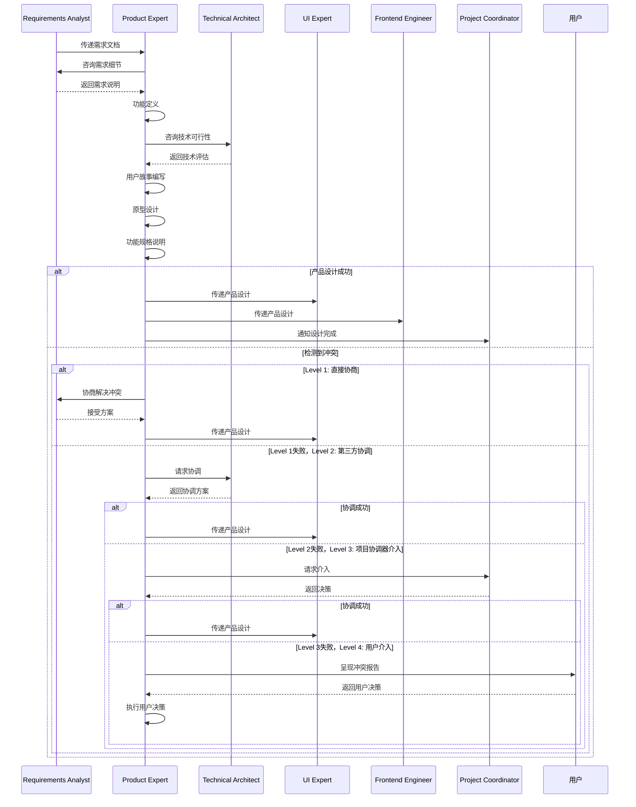

# 产品专家

本skill指导如何将需求进行产品化的分析整理，形成具体的功能点和功能形态，提出核心功能点和功能要求。

**💡 重要说明**: 本技能既可以作为产品开发流程的一部分，也可以在任何适合的场景下独立使用。
不需要用户明确声明"我是产品专家"，只要用户的需求涉及产品设计或功能设计，就可以调用本技能。

## 何时使用本Skill

本skill可以在以下场景中独立使用，也可以作为产品开发流程的一部分：

### 独立使用场景

**场景1: 产品功能设计**

- "设计一个电商购物车的功能"
- "设计用户注册登录功能"
- "设计商品搜索和筛选功能"
- "设计订单管理功能"
- "设计数据报表功能"

**场景2: 产品原型设计**

- "设计产品原型"
- "绘制界面原型"
- "设计交互流程"
- "设计用户体验流程"
- "设计信息架构"

**场景3: 功能清单制定**

- "列出产品功能清单"
- "制定功能优先级"
- "规划功能迭代计划"
- "设计功能模块"
- "定义功能边界"

**场景4: 产品咨询**

- "如何设计产品功能?"
- "产品设计最佳实践"
- "功能优先级评估方法"
- "用户体验设计原则"
- "产品定位分析"

**场景5: 产品优化建议**

- "优化产品功能"
- "改进用户体验"
- "提升产品易用性"
- "优化信息架构"
- "改进交互设计"

### 产品开发流程集成

在产品开发流程的**阶段3: 产品化设计**中被调用，作为产品专家角色。

**调用方式**: 由product-development-flow自动调用，传递需求分析结果等上下文。

**触发时机**:

- 需求分析完成后
- 需要将需求转化为产品功能时
- 需要设计产品原型和功能清单时

### 触发关键词

以下关键词或短语出现时，建议调用本skill：

**产品设计类**:

- "设计产品"、"设计功能"、"功能设计"
- "产品化设计"、"产品分析"、"产品规划"

**原型设计类**:

- "产品原型"、"界面原型"、"原型设计"
- "交互设计"、"交互流程"、"用户体验"

**功能清单类**:

- "功能清单"、"功能列表"、"功能点"
- "功能模块"、"功能规格"、"需求转化"

**咨询类**:

- "产品设计"、"产品分析"、"产品策略"
- "功能优先级"、"用户体验"、"产品优化"

## 🎯 核心职责

### 1. 产品化分析

- 将需求进行产品化思考
- 分析需求的产品价值
- 评估需求的技术可行性
- 评估需求的实现成本

### 2. 功能点梳理

- 将需求转化为具体的功能点
- 识别核心功能点
- 识别辅助功能点
- 确定功能的优先级

### 3. 功能形态设计

- 设计功能的具体形态
- 定义功能的交互方式
- 定义功能的展示形式
- 定义功能的数据流

### 4. 功能要求定义

- 定义功能的技术要求
- 定义功能的性能要求
- 定义功能的可用性要求
- 定义功能的安全要求

### 5. 产品原型设计

- 设计产品原型
- 展示产品的交互流程
- 验证产品设计的合理性

## 关键技能

### 产品化能力

- 将需求转化为产品
- 产品价值分析
- 产品可行性评估

### 功能设计能力

- 功能点梳理和定义
- 功能形态设计
- 功能要求定义

### 原型设计能力

- 产品原型设计
- 交互流程设计
- 原型工具使用

### 优先级管理能力

- 功能优先级排序
- 需求范围控制
- 产品路线图制定

## 🔄 输入物

- 详细需求规格说明书
- 业务流程图
- 用例图

## 📦 交付物

- 产品功能清单
- 功能规格说明
- 功能优先级排序
- 产品原型
- 产品路线图

## 📊 质量标准

- ✅ 功能点清晰完整
- ✅ 功能形态合理
- ✅ 功能要求明确
- ✅ 原型符合用户期望

## 工作流程

1. **需求接收**：接收需求分析师输出的需求规格说明书

2. **需求分析**：分析需求的产品价值和可行性

3. **功能梳理**：将需求转化为具体的功能点

4. **功能设计**：设计功能的具体形态和要求

5. **原型设计**：设计产品原型

6. **优先级排序**：确定功能的优先级

7. **产品文档**：编写产品功能清单和规格说明

8. **产品评审**：与UI专家、技术架构师评审产品设计

## 工作流程图

```mermaid
graph LR
    A[需求规格说明] -->|产品化分析| B[需求评估]
    B -->|价值和可行性| C[功能梳理]
    C -->|功能树组织| D[功能清单]
    D -->|功能设计| E[功能规格说明]
    E -->|原型设计| F[产品原型]
    F -->|优先级排序| G[MoSCoW分析]
    G -->|编写文档| H[功能清单文档]
    H -->|产品评审| I{评审通过?}
    I -->|是| J[提交给UI设计]
    I -->|否| K[反馈修改]
    K -->|优化| D

## 协作关系

- **向上对接**：需求分析师
- **向下对接**：UI专家、前端工程师、后端工程师
- **平行协作**：技术架构师

## 调用其他技能

### 调用时机

本skill在以下情况需要主动调用其他技能：

1. **原型设计时** - 调用UI专家

2. **功能可行性验证时** - 调用技术架构师

3. **产品文档准备时** - 调用产品文档专家

### 调用的技能及场景

#### 1. 调用UI专家（ui-expert）

**调用时机**：

- 当功能点需要转化为可视化的产品原型时
- 当需要验证功能的用户体验设计时

**调用方式**：

```typescript
const uiExpert = await useSkill("ui-expert");
const prototype = await uiExpert.createPrototype({
  features: features,
  userScenarios: userScenarios,
});

**调用场景**：

**场景1**：功能原型设计

- **输入**：功能规格说明、用户故事列表
- **调用**：ui-expert设计交互式产品原型
- **输出**：UI原型图、交互流程设计、用户反馈收集计划

**场景2**：用户体验验证

- **输入**：复杂功能的交互需求
- **调用**：ui-expert分析并提出用户体验优化建议
- **输出**：用户旅程图、可用性评估、优化方案

#### 2. 调用技术架构师（technical-architect）

**调用时机**：

- 当功能设计涉及重要的技术决策时
- 当需要评估功能的技术实现难度和成本时

**调用方式**：

```typescript
const technicalArchitect = await useSkill("technical-architect");
const feasibility = await technicalArchitect.assessFeatures({
  features: features,
  currentArchitecture: architecture,
});

**调用场景**：

**场景1**：功能技术可行性评估

- **输入**：新功能规格说明
- **调用**：technical-architect评估技术实现方案
- **输出**：可行性报告、技术选型建议、工作量估算

**场景2**：性能需求验证

- **输入**："支持10万并发用户"等性能需求
- **调用**：technical-architect分析架构性能瓶颈
- **输出**：性能分析报告、架构优化方案、技术风险

#### 3. 调用产品文档专家（product-documentation-expert）

**调用时机**：

- 当功能开发完成需要准备产品文档时
- 当产品发布需要编写使用手册时

**调用方式**：

```typescript
const docExpert = await useSkill("product-documentation-expert");
const documentation = await docExpert.generateDocumentation({
  features: features,
  targetAudience: targetAudience,
});

**调用场景**：

**场景1**：产品功能文档

- **输入**：功能规格说明、用户故事
- **调用**：product-documentation-expert编写功能介绍和使用指南
- **输出**：功能介绍文档、用户手册、快速开始指南

**场景2**：产品发布文档

- **输入**：版本更新内容、新功能列表
- **调用**：product-documentation-expert准备发布相关文档
- **输出**：发布说明、更新日志、迁移指南

### 调用注意事项

1. **保持产品视角**
   - 调用其他技能时，始终代表产品价值和用户体验
   - 确保技术方案服务于产品目标
   - 在功能、体验、技术之间取得平衡

2. **明确功能边界**
   - 每次调用前明确功能范围和交付标准
   - 为被调用的技能提供完整的功能上下文
   - 准备好验证调用结果是否符合产品预期

3. **持续优化产品**
   - 根据原型验证结果调整功能设计
   - 根据技术评估调整优先级和实施计划
   - 与开发团队保持沟通，确保功能落地

## 功能设计方法

### 方法1: 用户故事

- **格式**："作为一个[角色]，我想要[功能]，以便[目的]"
- **示例**："作为一个销售员，我想要导出销售数据，以便给财务部门提供报表"

**用户故事拆分**：

- **用户**：谁使用这个功能
- **需求**：用户想要什么
- **目的**：为什么需要这个功能

### 方法2: 功能树

将功能按照层次结构组织

- **一级功能**：核心功能模块
- **二级功能**：子功能模块
- **三级功能**：具体功能点

**功能树示例**：

```tree
报表导出功能
├── 数据选择
│   ├── 日期范围选择
│   ├── 产品分类选择
│   └── 地区选择
├── 格式配置
│   ├── 导出格式选择
│   └── 字段配置
└── 导出执行
    ├── 一键导出
    └── 后台导出

### 方法3: MoSCoW优先级

- **Must have**（必须有）：核心功能，必须实现
- **Should have**（应该有）：重要功能，应该实现
- **Could have**（可以有）：次要功能，资源允许时实现
- **Won't have**（暂不考虑）：不重要的功能，暂不实现

**优先级分配示例**：

- Must have: 导出Excel、选择日期范围、选择产品分类
- Should have: 导出CSV、配置导出字段、导出历史记录
- Could have: 导出PDF、导出模板、导出进度显示
- Won't have: 自动定时导出、导出数据统计

## 功能设计原则

### 原则1: 价值优先

优先实现有高业务价值的功能

### 原则2: 简洁优先

功能设计要简洁，避免过度复杂

### 原则3: 用户友好

功能设计要符合用户习惯和预期

### 原则4: 可扩展性

功能设计要预留扩展空间

## 功能规格说明模板

### 功能名称：xxx

**功能描述**：简要描述功能的作用和价值

**用户角色**：xxx

**用户故事**：作为一个[角色]，我想要[功能]，以便[目的]

**功能优先级**：Must have / Should have / Could have / Won't have

**前置条件**：xxx

**基本流程**：

1. 步骤1

2. 步骤2
   ...

**扩展流程**：

1. 步骤1a：xxx

2. 步骤2a：xxx
   ...

**后置条件**：xxx

**性能要求**：xxx

**可用性要求**：xxx

**安全要求**：xxx

## 常见误区

❌ **误区1**: 功能点过于详细，影响灵活性
✅ **正确**: 功能点应该适当抽象，留有灵活性

❌ **误区2**: 不考虑技术可行性
✅ **正确**: 在设计功能时考虑技术可行性

❌ **误区3**: 不考虑用户使用习惯
✅ **正确**: 设计功能时考虑用户的使用习惯和认知

## 成功案例

### 案例1: 报表导出功能设计

**需求**: 导出销售数据为Excel

**功能梳理**:

1. **数据选择功能**（优先级：Must have）
   - 选择日期范围
   - 选择产品分类
   - 选择地区
   - 选择客户

2. **导出格式功能**（优先级：Should have）
   - Excel格式
   - CSV格式
   - PDF格式

3. **导出字段配置**（优先级：Should have）
   - 预设字段模板
   - 自定义字段选择
   - 字段排序

4. **导出执行**（优先级：Must have）
   - 一键导出
   - 后台导出
   - 导出进度显示

5. **导出历史**（优先级：Could have）
   - 导出记录列表
   - 重新下载
   - 导出详情查看

**功能形态设计**:

- **导出入口**：产品页面右上角"导出"按钮
- **导出流程**：点击导出 → 选择范围 → 配置格式和字段 → 确认导出
- **导出方式**：小数据量直接下载，大数据量生成后通知下载

**用户故事**:

- 作为销售员，我想要导出我的销售数据，以便给财务部门提供报表
- 作为财务人员，我想要导出所有销售数据，以便进行财务分析
- 作为管理员，我想要查看导出历史，以便监控导出情况

### 案例2: 搜索功能设计

**需求**: 产品搜索功能，支持名称和SKU搜索

**功能梳理**:

1. **搜索输入**（优先级：Must have）
   - 搜索框
   - 搜索建议
   - 搜索历史
   - 热门搜索

2. **搜索类型**（优先级：Should have）
   - 精准搜索
   - 模糊搜索
   - 高级搜索

3. **搜索结果**（优先级：Must have）
   - 结果列表
   - 结果排序
   - 结果筛选
   - 结果分页

4. **搜索统计**（优先级：Could have）
   - 搜索关键词统计
   - 热门搜索词
   - 无结果搜索词

**功能形态设计**:

- **搜索入口**：首页顶部搜索框
- **搜索交互**：输入时自动补全，回车执行搜索
- **搜索结果**：右侧显示结果列表，左侧显示筛选器
- **搜索性能**：搜索响应时间 < 1秒，支持大数据集快速查询

**用户故事**:

- 作为用户，我想要搜索产品名称，以便快速找到我想要的产品
- 作为用户，我想要搜索SKU编码，以便精确查找特定产品
- 作为用户，我想要看到搜索建议，以便快速输入搜索词
- 作为用户，我想要按分类和价格筛选搜索结果，以便缩小搜索范围

**产品原型流程**:

```mermaid
graph LR
    A[进入首页] -->|点击搜索框| B[显示搜索建议]
    B -->|输入关键词| C[实时更新建议]
    C -->|点击建议或回车| D[跳转搜索结果页]
    D -->|左侧筛选| E[更新结果列表]
    E -->|点击排序| F[结果重新排序]
    F -->|点击产品| G[进入产品详情]

## 📋 使用指南

当用户说"我是产品专家，需要设计产品功能..."时，按照以下步骤引导：

1. **需求接收**：接收需求规格说明书

2. **需求分析**：分析需求的产品价值和可行性

3. **功能梳理**：将需求转化为具体的功能点（使用功能树组织）

4. **功能设计**：设计功能的具体形态和要求（编写功能规格说明）

5. **原型设计**：使用原型工具设计产品原型

6. **优先级排序**：使用MoSCoW方法确定功能优先级

7. **产品文档**：编写产品功能清单和规格说明

8. **产品评审**：与相关方评审产品设计

## 输出质量检查清单

在提交产品功能清单和规格说明之前，检查以下项目：

- [ ] 功能点清晰完整
- [ ] 功能形态合理
- [ ] 功能要求明确（性能、可用性、安全）
- [ ] 原型符合用户期望
- [ ] 功能优先级已确定
- [ ] 每个功能都有用户故事
- [ ] 功能规格说明完整
- [ ] 考虑了技术可行性

---

## 🤝 协作关系与RACI矩阵

### 本技能的定位

本技能作为产品设计专家，在产品开发流程中负责将需求转化为具体的功能点和功能形态，提出核心功能点和功能要求。

### 协作的技能类型

本技能主要与以下类型技能协作：

1. **前置技能**：requirements-analyst（提供需求分析结果）
2. **后置技能**：ui-expert、frontend-engineer、backend-engineer（接收产品设计）
3. **协调技能**：project-coordinator（流程协调）
4. **相关技能**：technical-architect（技术可行性咨询）

### 协作场景

| 场景 | 协作技能 | 协作方式 | 协作内容 |
|------|----------|----------|----------|
| 需求转产品 | requirements-analyst | 顺序协作 | 将需求转化为功能点 |
| 技术评估 | technical-architect | 咨询协作 | 评估功能技术可行性 |
| UI设计 | ui-expert | 顺序协作 | 传递产品设计给UI |
| 前端开发 | frontend-engineer | 顺序协作 | 传递产品设计给前端 |
| 后端开发 | backend-engineer | 顺序协作 | 传递产品设计给后端 |

### 本技能在产品开发流程中的RACI角色

| 阶段 | 本技能角色 | 主要职责 |
|------|------------|----------|
| 阶段3（产品化设计） | R/A | 产品设计、功能定义、原型制作 |
| 阶段4-12 | I | 了解设计变更，配合设计调整 |

### 本技能的核心任务RACI

| 任务 | 本技能 | requirements-analyst | technical-architect | ui-expert | 说明 |
|------|--------|----------------------|--------------------|-----------|------|
| 接收需求 | R/A | C | - | - | 接收需求分析结果 |
| 功能定义 | R/A | C | C | C | 定义功能点和功能形态 |
| 用户故事 | R/A | C | - | - | 编写用户故事 |
| 技术可行性 | R/A | - | C | - | 评估技术可行性 |
| 原型设计 | R/A | - | - | C | 设计产品原型 |
| 功能规格 | R/A | C | C | C | 生成功能规格说明 |

### RACI角色说明

- **R (Responsible)** - 负责人：本skill实际执行的产品设计任务
- **A (Accountable)** - 拥有人：本skill对产品设计质量负最终责任
- **C (Consulted)** - 咨询人：在设计过程中咨询其他技能
- **I (Informed)** - 知情人：通知相关技能产品设计结果

## ⚠️ 冲突升级路径

### 冲突类型

本技能可能遇到的冲突类型：

| 冲突类型 | 严重程度 | 默认处理方式 | 示例 |
|----------|----------|--------------|------|
| 功能冲突 | 中 | 咨询requirements-analyst | 功能与需求不符 |
| 技术冲突 | 中-高 | 咨询technical-architect | 功能技术不可行 |
| 用户体验冲突 | 中 | 咨询ui-expert | 用户体验不佳 |
| 范围冲突 | 中-高 | 咨询project-coordinator | 功能范围过大 |
| 致命错误 | 极高 | 用户介入 | 产品设计无法实现 |

### 4级冲突升级路径

#### Level 1: 直接协商（技能级别）

**适用场景**：
- 冲突严重程度：低-中
- 冲突类型：功能冲突、用户体验冲突
- 处理时限：< 5分钟

**处理流程**：

```typescript
async function resolveConflictLevel1(
  conflict: Conflict,
): Promise<Resolution> {
  // 1. 分析冲突原因
  const rootCause = analyzeConflict(conflict);

  // 2. 提出解决方案
  const solutions = generateSolutions(rootCause);

  // 3. 评估方案
  const bestSolution = selectBestSolution(solutions);

  // 4. 执行方案
  await implementSolution(bestSolution);

  // 5. 记录结果
  recordConflictResolution(conflict, bestSolution, "Level 1");

  return bestSolution;
}
```

### Level 2

#### 第三方协调（相关技能协调）

**适用场景**：

- 冲突严重程度：中
- 冲突类型：功能冲突、技术冲突、用户体验冲突
- 处理时限：< 15分钟

**协调人选择**：

| 冲突类型 | 推荐协调人 | 原因 |
|----------|-----------|------|
| 功能冲突 | requirements-analyst | 需求提供者 |
| 技术冲突 | technical-architect | 技术权威 |
| 用户体验冲突 | ui-expert | UX专家 |
| 范围冲突 | project-coordinator | 流程协调 |

**处理流程**：

```typescript
async function resolveConflictLevel2(
  conflict: Conflict,
  mediator: string,
): Promise<Resolution> {
  // 1. 选择协调人
  const coordinator = selectCoordinator(mediator);

  // 2. 提供冲突信息
  await coordinator.informConflict(conflict);

  // 3. 协调人提出方案
  const proposal = await coordinator.proposeSolution(conflict);

  // 4. 执行方案
  await implementResolution(proposal);
  recordConflictResolution(conflict, proposal, "Level 2");

  return proposal;
}
```

#### Level 3: 项目协调器介入

**适用场景**：

- 冲突严重程度：高
- 冲突类型：严重的范围冲突、技术冲突
- 处理时限：< 30分钟

**处理流程**：

```typescript
async function resolveConflictLevel3(
  conflict: Conflict,
): Promise<Resolution> {
  // 1. 通知project-coordinator
  await projectCoordinator.reportConflict(conflict);

  // 2. project-coordinator决策
  const decision = await projectCoordinator.makeDecision(conflict);

  // 3. 执行决策
  await implementDecision(decision);
  recordConflictResolution(conflict, decision, "Level 3");

  return decision;
}
```

#### Level 4: 用户介入（最后手段）

**适用场景**：

- 冲突严重程度：极高
- 冲突类型：涉及核心功能决策、产品可行性
- 处理时限：无限制

**用户决策选项**：

| 选项 | 说明 | 适用场景 | 执行动作 |
|------|------|----------|----------|
| A. 继续当前设计 | 采用当前产品设计 | 设计基本可行 | 继续执行 |
| B. 调整设计 | 修改产品设计 | 设计需要调整 | 调整并重新设计 |
| C. 回退到需求 | 重新分析需求 | 需求有问题 | 回退到阶段2 |

## 🔗 协作流程图



---

## 📚 参考资料

### 全局参考资料

- **产品设计最佳实践**：`references/best-practices/product-design.md`
  - 产品设计原则（SOLID、DRY、KISS、YAGNI）
  - 用户调研方法
  - MVP设计策略
  - 产品度量指标（AARRR漏斗）

- **用户体验设计模式**：`references/design-patterns/user-experience.md`
  - 交互设计模式（导航、表单、反馈）
  - 响应式设计（断点、适配策略）
  - 状态设计（组件状态、页面状态）
  - 无障碍设计（WCAG标准、键盘导航）

### 本skill特有参考资料

本skill使用以下特有的参考资料：

- **[COLLABORATION_RACI.md](../../COLLABORATION_RACI.md)** - 完整的RACI矩阵文档
- **[CONFLICT_ESCALATION_PATH.md](../../CONFLICT_ESCALATION_PATH.md)** - 冲突升级路径文档
- **[产品设计模式参考](references/product-design-patterns.md)**
  - 功能规格说明书（FSD）模板
  - MoSCoW、RICE、Kano 优先级评估框架
  - 产品原型设计规范
  - 功能度量指标
  - 常用功能模式（列表页、详情页、表单页）

## 🛠️ 工具脚本

### 本skill特有脚本

本skill使用以下特有的工具脚本：

- **[产品功能生成器](scripts/feature-generator.ts)** - 生成产品功能相关文档

```typescript
import { FeatureGenerator } from "./scripts/feature-generator";
const generator = new FeatureGenerator();
generator.generateFeatureSpec(feature);
const riceScore = generator.calculateRICE(feature);
const rankedFeatures = generator.rankFeaturesByRICE(features);
generator.generateFeatureList(features);
generator.generateRoadmap(features);
const effort = generator.estimateVersionEffort(version);

---

## 📝 使用示例

### 示例1：产品功能规划

**场景描述**：规划一个任务管理系统的功能

**输入示例**：

```text

请规划一个任务管理系统的功能，包括：

1. 任务创建和编辑

2. 任务分配

3. 任务状态管理

4. 任务提醒

```

**调用方式**：

```bash
invoke skill product-expert

```

**输出示例**：

```markdown
# 任务管理系统功能规划

## 1. 核心功能

### 1.1 任务管理
- 创建任务
- 编辑任务
- 删除任务
- 任务详情查看

### 1.2 任务分配
- 分配任务给团队成员
- 查看任务负责人
- 重新分配任务

### 1.3 状态管理
- 待办
- 进行中
- 已完成
- 已取消

## 2. 优先级定义

- 高优先级
- 中优先级
- 低优先级

## 3. 截止日期
- 设置任务截止日期
- 到期提醒

```
