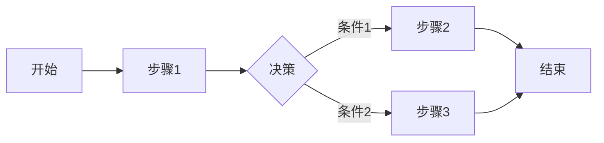
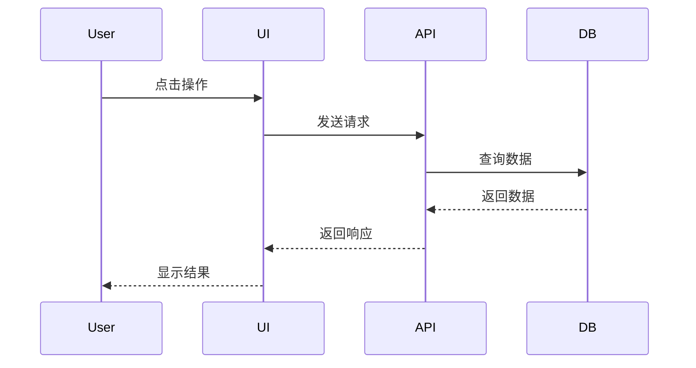
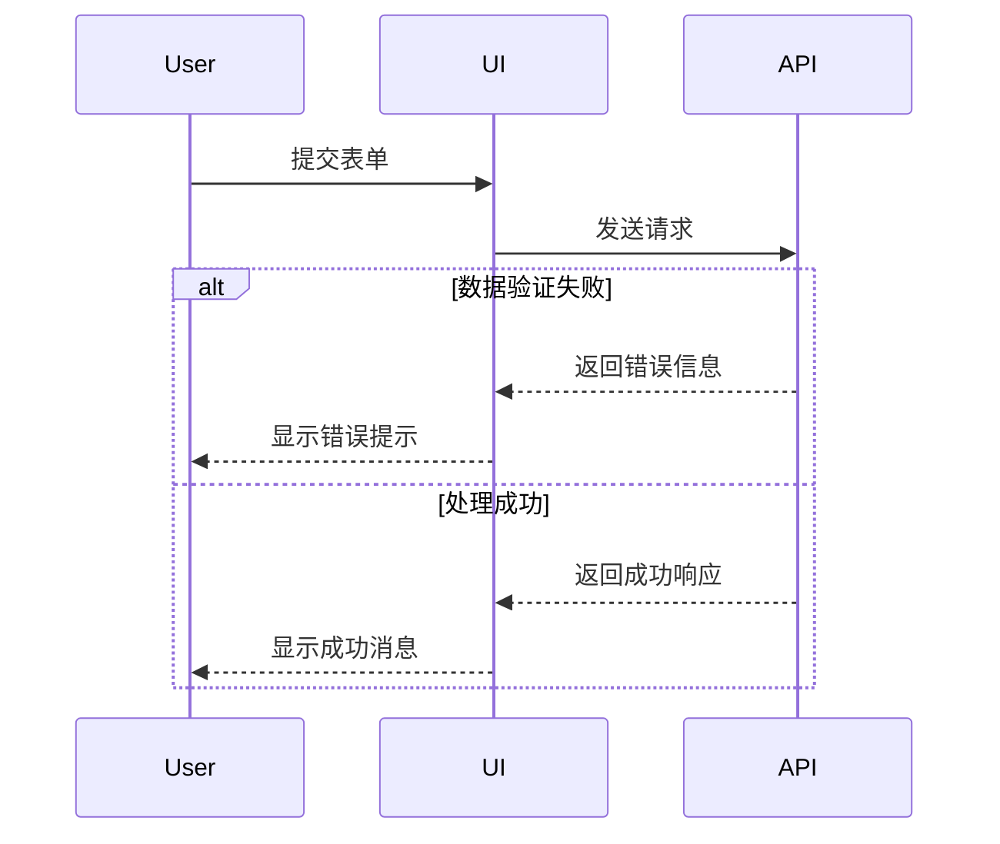
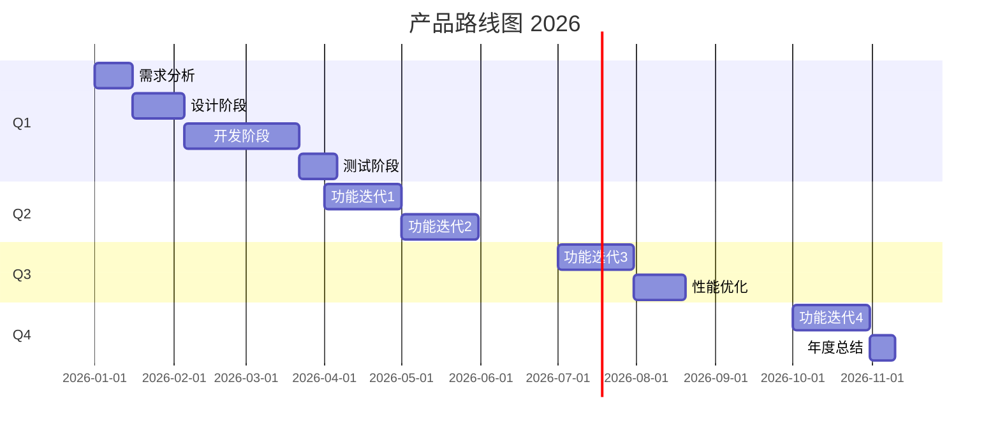

# 产品设计模板

本文档提供产品专家使用的产品设计模板。

## 功能规格说明模板

### 功能规格文档（FSD）模板

```markdown
# 功能规格说明

**功能名称**：
**功能ID**：F-XXX
**版本**：v1.0
**创建日期**：YYYY-MM-DD
**负责人**：

## 1. 功能概述

### 1.1 功能描述

[简要描述这个功能要解决的问题和达到的目标]

### 1.2 业务价值

| 维度     | 说明 |
| -------- | ---- |
| 用户价值 |      |
| 业务价值 |      |
| 商业价值 |      |

### 1.3 目标用户

| 用户角色 | 描述 | 核心需求 |
| -------- | ---- | -------- |
|          |      |          |

## 2. 功能需求

### 2.1 用户故事

**主用户故事**：
作为[角色]，我想要[功能]，以便[价值]。

**衍生用户故事**：

1. 作为[角色]，我想要[功能]，以便[价值]。

2. 作为[角色]，我想要[功能]，以便[价值]。

### 2.2 功能列表

| 序号 | 功能点 | 优先级 | 描述 |
| ---- | ------ | ------ | ---- |
| 1    |        |        |      |
| 2    |        |        |      |

### 2.3 功能详情

#### 功能1：[功能名称]

**描述**：

**优先级**：P0/P1/P2/P3

**前置条件**：

- [ ] 条件1
- [ ] 条件2

**输入**：

- 字段1：
- 字段2：

**处理**：

- 步骤1：
- 步骤2：

**输出**：

- 结果1：
- 结果2：

**验收标准**：

- **AC1**: Given [前置条件]，When [操作]，Then [结果]
- **AC2**: Given [前置条件]，When [操作]，Then [结果]

**异常处理**：

- 场景1：
- 场景2：

## 3. UI/UX需求

### 3.1 界面原型

[插入原型截图或链接]

### 3.2 交互流程



### 3.3 设计规范

- 色彩：
- 字体：
- 间距：
- 交互反馈：

## 4. 数据需求

### 4.1 数据实体

| 实体 | 属性 | 类型 | 说明 |
| ---- | ---- | ---- | ---- |
|      |      |      |      |

### 4.2 数据字典

| 字段 | 类型 | 必填 | 默认值 | 说明 |
| ---- | ---- | ---- | ------ | ---- |
|      |      |      |        |      |

## 5. 接口需求

### 5.1 API接口

| 接口名称 | 方法 | 路径 | 说明 |
| -------- | ---- | ---- | ---- |
|          |      |      |      |

### 5.2 接口详情

**接口名称**：

**请求**：

```text

方法：GET/POST/PUT/DELETE
路径：/api/xxx
Headers：...
Body：...

```

**响应**：

```json
# 成功响应：
{
  "success": true,
  "data": {...}
}

# 失败响应：
{
  "success": false,
  "error": "..."
}

```

## 6. 非功能需求

### 6.1 性能需求

- 响应时间：
- 并发用户：
- 吞吐量：

### 6.2 安全需求

- 认证要求：
- 授权要求：
- 数据保护：

### 6.3 兼容性需求

- 浏览器：
- 设备：
- 分辨率：

## 7. 依赖关系

### 7.1 前置功能

| 功能ID | 功能名称 | 状态 |
| ------ | -------- | ---- |
|        |          |      |

### 7.2 后续功能

| 功能ID | 功能名称 | 计划时间 |
| ------ | -------- | -------- |
|        |          |          |

## 8. 验收标准

### 8.1 功能验收

- [ ] 功能完整性
- [ ] 功能正确性
- [ ] 功能稳定性

### 8.2 体验验收

- [ ] UI/UX符合设计
- [ ] 交互流畅
- [ ] 响应及时

### 8.3 性能验收

- [ ] 响应时间达标
- [ ] 负载测试通过
- [ ] 稳定性测试通过

## 9. 附录

### 9.1 变更记录

| 版本 | 日期 | 变更内容 | 变更人 |
| ---- | ---- | -------- | ------ |
|      |      |          |        |

### 9.2 参考资料

- 需求文档：
- UI设计稿：
- 技术方案：

## 产品原型模板

### 线框图模板

#### 页面线框图

```text

+----------------------------------+
| Logo | 导航菜单 | 用户 |
+----------------------------------+
| |
| 页面标题 |
| |
| +--------------------------+ |
| | 内容区域 | |
| | | |
| | | |
| +--------------------------+ |
| |
| [按钮1] [按钮2] |
| |
+----------------------------------+
| Footer |
+----------------------------------+

```

#### 表单线框图

```text

+----------------------------------+
| 表单标题 |
+----------------------------------+
| |
| 字段1: [_******************] |
| |
| 字段2: [******************_] |
| |
| 选项: ( ) 选项1 ( ) 选项2 |
| |
| [ 提交 ] [ 取消 ] |
| |
+----------------------------------+

```

#### 列表页线框图

```text

+----------------------------------+
| 搜索: [_____________] [搜索] |
+----------------------------------+
| |
| [新增] [筛选] |
| |
| +------------------------------+|
| | 标题1 | 状态 | 操作 ||
| +------------------------------+|
| | 标题2 | 状态 | 操作 ||
| +------------------------------+|
| | 标题3 | 状态 | 操作 ||
| +------------------------------+|
| |
| 上一页 1 2 3 下一页 |
| |
+----------------------------------+

```

### 交互流程模板

#### 标准流程



#### 异常流程



### 高保真原型说明

#### Figma原型规范

**命名规范**：

- 页面：`页面名称 - 版本号`
- 组件：`组件名称 - 状态`
- 图层：`描述性名称`

**设计规范**：

- 颜色系统：使用主色、辅助色、中性色
- 字体系统：标题、正文、辅助文字
- 间距系统：4px网格系统
- 圆角系统：4px/8px/16px

**交互规范**：

- 按钮状态：默认/悬停/点击/禁用
- 页面转场：淡入淡出/滑动
- 加载状态：Loading动画/骨架屏

## 竞品分析模板

### 竞品对比分析表

| 对比项   | 我方产品 | 竞品A | 竞品B | 竞品C |
| -------- | -------- | ----- | ----- | ----- |
| 核心功能 |          |       |       |       |
| UI设计   |          |       |       |       |
| 用户体验 |          |       |       |       |
| 性能表现 |          |       |       |       |
| 定价策略 |          |       |       |       |
| 优势     |          |       |       |       |
| 劣势     |          |       |       |       |

### 竞品功能对比

#### 功能点对比

| 功能点 | 我方产品 | 竞品A | 竞品B | 竞品C |
| ------ | -------- | ----- | ----- | ----- |
| 功能1  |          |       |       |       |
| 功能2  |          |       |       |       |
| 功能3  |          |       |       |       |

| 图例 | 说明   |
| ---- | ------ |
| ✅   | 已实现 |
| ⏳   | 开发中 |
| ❌   | 未实现 |
| -    | 不适用 |

### 竞品优势分析

#### 竞品A优势

| 优势 | 描述 | 可借鉴点 | 实施难度 |
| ---- | ---- | -------- | -------- |
|      |      |          |          |

#### 竞品B优势

| 优势 | 描述 | 可借鉴点 | 实施难度 |
| ---- | ---- | -------- | -------- |
|      |      |          |          |

### 竞品劣势分析

| 竞品 | 劣势 | 我们的机会 |
| ---- | ---- | ---------- |
|      |      |            |

### 市场定位分析

| 维度     | 我方产品 | 竞品A | 竞品B |
| -------- | -------- | ----- | ----- |
| 目标用户 |          |       |       |
| 价格区间 |          |       |       |
| 产品定位 |          |       |       |
| 核心卖点 |          |       |       |

## 产品路线图模板

```markdown
# 产品路线图

**产品名称**：
**更新日期**：YYYY-MM-DD
**负责人**：

## 产品愿景（概要）

[描述产品的长期愿景和战略方向]

## 里程碑规划（交付）

| 里程碑 | 时间 | 关键目标 | 依赖 | 状态 |
| ------ | ---- | -------- | ---- | ---- |
| M1     |      |          |      |      |
| M2     |      |          |      |      |

## 功能路线图（季度）

### Q1 YYYY

| 功能 | 优先级 | 负责人 | 预计完成 | 状态 |
| ---- | ------ | ------ | -------- | ---- |
|      |        |        |          |      |

### Q2 YYYY

| 功能 | 优先级 | 负责人 | 预计完成 | 状态 |
|------|--------|--------|----------| |

### Q3 YYYY

| 功能 | 优先级 | 负责人 | 预计完成 | 状态 |
|------|--------|--------|----------| |

### Q4 YYYY

| 功能 | 优先级 | 负责人 | 预计完成 | 状态 |
|------|--------|--------|----------| |

## 技术路线图

| 技术升级 | 版本 | 时间 | 理由 |
| -------- | ---- | ---- | ---- |
|          |      |      |      |

## 资源规划

| 资源类型 | Q1  | Q2  | Q3  | Q4  |
| -------- | --- | --- | --- | --- |
| 人力     |     |     |     |     |
| 预算     |     |     |     |     |

## 风险与应对

| 风险 | 可能性 | 影响 | 应对措施 |
| ---- | ------ | ---- | -------- |
|      |        |      |          |

```

### 路线图可视化



## 产品设计最佳实践

### 1. 功能设计

- 始终从用户需求出发
- 保持功能简单、聚焦
- 遵循"最小可行产品"（MVP）原则
- 优先核心功能，渐进式扩展

### 2. UI/UX设计

- 遵循设计系统规范
- 保持一致性
- 注重可访问性
- 考虑响应式设计

### 3. 竞品分析

- 客观分析，不盲目复制
- 深入理解竞品的设计思路
- 结合自身产品特点
- 关注用户体验而非功能堆砌

### 4. 路线图规划

- 明确产品愿景和战略
- 合理安排功能优先级
- 考虑资源约束
- 保持灵活性，适应变化
