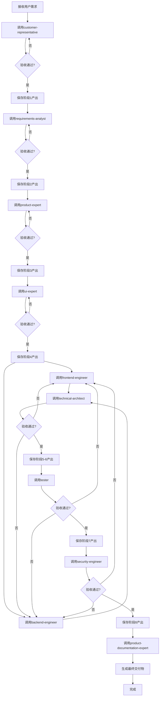
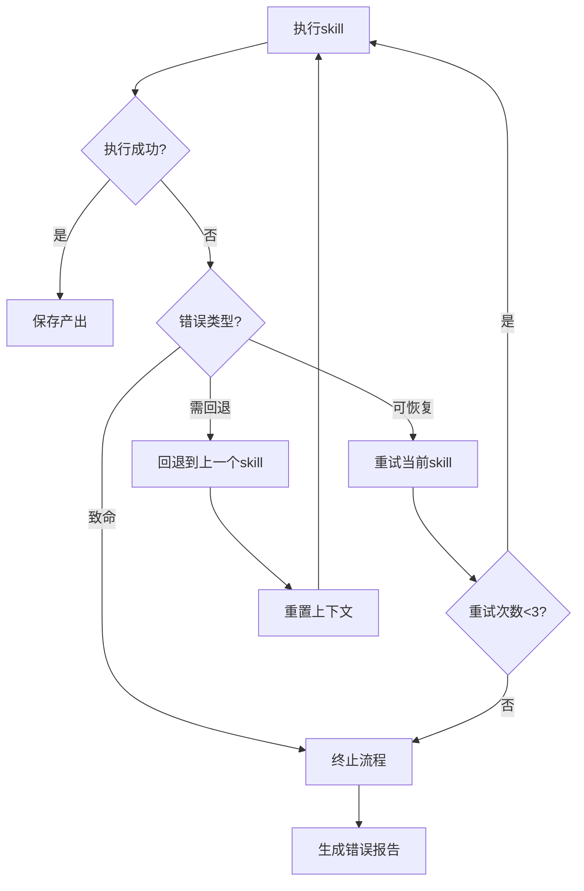
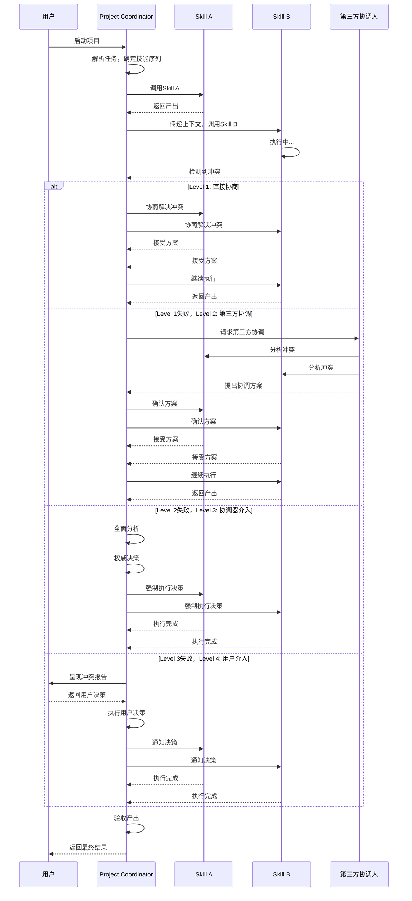

# Project Coordinator Skill

本skill负责协调虚拟AI团队的skill调用顺序、上下文传递、状态管理和错误处理，确保自动化流程顺畅执行。

**💡 重要说明**: 本技能既可以作为产品开发流程的一部分，也可以在任何适合的场景下独立使用。
不需要用户明确声明"我是项目协调员"，只要用户的需求涉及项目协调或流程管理，就可以调用本技能。

## 何时使用本Skill

本skill可以在以下场景中独立使用，也可以作为产品开发流程的一部分：

### 独立使用场景

**场景1: 项目协调**

- "协调项目开发流程"
- "管理项目进度"
- "协调团队协作"
- "协调多个skill调用"
- "协调任务分配"

**场景2: 流程管理**

- "管理开发流程"
- "管理测试流程"
- "管理发布流程"
- "管理协作流程"
- "优化工作流程"

**场景3: 状态管理**

- "管理项目状态"
- "跟踪项目进度"
- "管理任务状态"
- "管理上下文传递"
- "状态同步和通知"

**场景4: 项目规划**

- "制定项目计划"
- "规划项目里程碑"
- "规划项目时间表"
- "规划项目资源"
- "项目风险评估"

**场景5: 项目咨询**

- "如何协调多个skill?"
- "项目管理最佳实践"
- "如何优化开发流程?"
- "项目协调方法"
- "项目管理工具"

### 产品开发流程集成

在产品开发流程的**阶段12: 监控与反馈**中被调用，作为项目协调员角色。

**调用方式**: 由product-development-flow自动调用，传递项目状态、进度等上下文。

**触发时机**:

- 产品开发流程启动时
- 需要协调多个skill时
- 需要管理项目进度时

### 触发关键词

以下关键词或短语出现时，建议调用本skill：

**项目协调类**:

- "项目协调"、"团队协调"、"协调多个"
- "协调开发"、"协作管理"、"跨团队"

**流程管理类**:

- "流程管理"、"开发流程"、"测试流程"
- "发布流程"、"工作流程"、"优化流程"

**状态管理类**:

- "项目状态"、"进度跟踪"、"任务状态"
- "状态管理"、"进度管理"、"项目管理"

**项目规划类**:

- "项目计划"、"项目里程碑"、"项目规划"
- "项目时间表"、"项目资源"、"项目评估"

**咨询类**:

- "协调方法"、"项目管理"、"流程优化"
- "项目协调最佳实践"、"团队协作"

## 触发时机

在产品开发流程中，project-coordinator skill在以下阶段被触发：

### 1. 项目启动时

- **触发条件**：接收到完整的产品需求，需要启动开发流程时
- **输入**：产品需求文档、项目目标
- **输出**：项目计划、技能调用序列
- **调用方式**：由用户直接触发或product-development-flow skill触发

### 2. 阶段转换时

- **触发条件**：一个开发阶段完成，需要启动下一个阶段时
- **输入**：上一阶段的产出物、阶段状态
- **输出**：下一阶段的任务列表、上下文传递
- **调用方式**：自动触发，根据product-development-flow的流程定义

### 3. 异常处理时

- **触发条件**：某个skill执行失败，需要进行错误处理时
- **输入**：错误信息、失败状态
- **输出**：错误恢复方案、重试指令或回退指令
- **调用方式**：自动触发，根据错误类型和严重程度

### 4. 项目里程碑时

- **触发条件**：到达某个关键里程碑，需要进行评审或决策时
- **输入**：项目状态、里程碑指标
- **输出**：里程碑报告、下一步计划
- **调用方式**：自动触发或由用户主动触发

### 5. 项目完成时

- **触发条件**：所有开发阶段完成，需要进行项目收尾时
- **输入**：所有阶段的产出物、项目状态
- **输出**：项目总结报告、交付清单
- **调用方式**：自动触发

## 调用方式

### 调用project-coordinator

#### 方式1：启动完整产品开发流程

```text
请启动产品开发流程，需求是：[需求描述]

```

#### 方式2：继续某个阶段

```text
继续[阶段名称]，输入是：[上一阶段产出]

```

#### 方式3：处理错误

```text
[skill名称]执行失败，错误是：[错误信息]，请处理

```

#### 方式4：查询项目状态

```text
查询项目当前状态

```

### 接收project-coordinator的指令

**指令格式**：`@skill: [skill名称] [参数]`

**示例**：

- `@skill: requirements-analyst 需求：[需求文档]`
- `@skill: technical-architect 架构：[设计文档]`
- `@skill: backend-engineer API：[接口定义]`

**接收方式**：

1. 通过标准输出接收指令

2. 执行被调用的skill

3. 将输出返回给project-coordinator

4. 等待下一个指令

## 调用流程

```text
用户请求
    ↓
project-coordinator 启动
    ↓
解析任务 → 确定技能序列
    ↓
循环调用skill：
    ├─ 调用skill A
    ├─ 接收skill A输出
    ├─ 传递上下文给skill B
    ├─ 调用skill B
    └─ ...
    ↓
所有skill完成
    ↓
生成最终报告
    ↓
返回结果给用户
```

## 🎯 核心职责

### 1. 流程编排

- 按照产品开发流程的顺序调用各个skill
- 维护流程的执行状态
- 处理流程中的条件分支（如校对失败时的重试）
- 支持流程的暂停、恢复和终止

### 2. 上下文管理

- 自动传递上一阶段产出到下一阶段
- 维护项目全局上下文（需求、设计、实现等）
- 管理临时文件和中间产物
- 提供上下文查询和历史追溯

### 3. 错误处理

- 捕获各skill执行过程中的错误
- 根据错误类型决定处理策略：
  - 可恢复错误：重试当前skill
  - 需回退错误：回退到上一个skill重新执行
  - 致命错误：终止流程并报告
- 记录错误日志和堆栈信息

### 4. 进度跟踪

- 记录每个skill的执行时间和状态
- 计算整体进度百分比
- 生成执行报告
- 支持用户查询当前进度

## 📋 工作流程

### 标准流程



### 错误处理流程



## 🔄 上下文传递机制

### 上下文结构

```typescript
interface ProjectContext {
  // 项目元信息
  projectId: string;
  startTime: Date;
  currentStage: number;

  // 用户原始需求
  originalRequirement: string;

  // 各阶段产出
  stageOutputs: {
    stage1: CustomerRequirement;
    stage2: RequirementsAnalysis;
    stage3: ProductDesign;
    stage4: UIDesign;
    stage5: FrontendImplementation;
    stage6: BackendImplementation;
    stage7: ArchitectureReview;
    stage8: TestReport;
    stage9: SecurityReport;
    stage10: Documentation;
  };

  // 配置信息
  config: {
    maxRetries: number;
    autoFix: boolean;
    debugMode: boolean;
  };

  // 执行历史
  executionLog: ExecutionLog[];
}
```

### 上下文文件系统

```text
.codebuddy/
├── projects/
│   ├── {project-id}/
│   │   ├── context.json          # 项目上下文
│   │   ├── stage1/               # 阶段1产出
│   │   │   ├── requirements.md
│   │   │   └── artifacts/
│   │   ├── stage2/
│   │   ├── stage3/
│   │   ├── ...
│   │   ├── logs/                 # 执行日志
│   │   └── summary.json          # 执行摘要
```

### 上下文传递流程

1. **Skill执行前**
   - 加载`context.json`
   - 提取当前阶段需要的上下文
   - 传递给skill

2. **Skill执行中**
   - Skill读取上下文
   - Skill更新上下文

3. **Skill执行后**
   - 收集Skill产出
   - 保存到对应stage目录
   - 更新`context.json`
   - 记录执行日志

## 📊 进度跟踪

### 进度模型

```typescript
interface Progress {
  stage: number;
  stageName: string;
  status: "pending" | "running" | "completed" | "failed";
  progress: number; // 0-100
  startTime?: Date;
  endTime?: Date;
  duration?: number; // 毫秒
  retryCount: number;
}
```

### 进度报告

```markdown
# 项目执行进度报告

## 总体进度

- 完成度：65%
- 已完成阶段：6/10
- 当前阶段：阶段7 - 架构审查
- 预计剩余时间：约2.5小时

## 阶段详情

| 阶段 | 名称     | 状态      | 耗时    | 重试次数 |
| ---- | -------- | --------- | ------- | -------- |
| 1    | 需求提出 | ✅ 完成   | 12s     | 0        |
| 2    | 需求分析 | ✅ 完成   | 45s     | 0        |
| 3    | 产品设计 | ✅ 完成   | 38s     | 1        |
| 4    | UI设计   | ✅ 完成   | 2m 15s  | 0        |
| 5    | 前端开发 | ✅ 完成   | 8m 30s  | 0        |
| 6    | 后端开发 | ✅ 完成   | 10m 45s | 0        |
| 7    | 架构审查 | 🔄 进行中 | -       | -        |
| 8    | 测试验证 | ⏳ 待执行 | -       | -        |
| 9    | 安全审查 | ⏳ 待执行 | -       | -        |
| 10   | 文档编写 | ⏳ 待执行 | -       | -        |

## 警告

- ⚠️ 阶段3在首次执行时产出不完整，已自动重试1次

## 🔧 配置选项

### 全局配置

```json
{
  "maxRetries": 3,
  "autoFix": true,
  "stopOnError": false,
  "parallelSkills": ["frontend-engineer", "backend-engineer"],
  "outputDirectory": ".codebuddy/projects/{project-id}",
  "logLevel": "info"
}
```

### 阶段配置

```json
{
  "stage1": {
    "skill": "customer-representative",
    "timeout": 60000,
    "maxRetries": 3,
    "dependencies": []
  },
  "stage2": {
    "skill": "requirements-analyst",
    "timeout": 120000,
    "maxRetries": 3,
    "dependencies": ["stage1"]
  },
  "stage5": {
    "skills": [
      {
        "name": "frontend-engineer",
        "timeout": 600000
      },
      {
        "name": "backend-engineer",
        "timeout": 600000
      }
    ],
    "parallel": true,
    "dependencies": ["stage4"]
  }
}
```

## ⚠️ 错误处理策略

### 错误分类

| 错误类型       | 处理策略        | 示例               |
| -------------- | --------------- | ------------------ |
| **网络错误**   | 重试（最多3次） | API调用超时        |
| **临时性错误** | 重试（最多3次） | 文件被占用         |
| **输入错误**   | 回退到上一阶段  | 上一阶段产出不完整 |
| **配置错误**   | 终止流程        | 缺少必要配置       |
| **致命错误**   | 终止流程        | 系统崩溃           |
| **质量不达标** | 重试当前阶段    | 单元测试覆盖率不足 |

### 重试逻辑

```typescript
async function executeSkillWithRetry(
  skillName: string,
  context: ProjectContext,
  maxRetries: number,
): Promise<SkillOutput> {
  let retryCount = 0;

  while (retryCount < maxRetries) {
    try {
      const output = await executeSkill(skillName, context);

      // 验证输出质量
      if (validateOutput(output)) {
        return output;
      } else {
        throw new Error("Output quality not met");
      }
    } catch (error) {
      retryCount++;

      if (retryCount >= maxRetries) {
        throw new Error(
          `Skill ${skillName} failed after ${maxRetries} retries`,
        );
      }

      // 等待后重试
      await sleep(1000 * retryCount);
    }
  }
}
```

## 📝 执行日志

### 日志格式

```json
{
  "timestamp": "2026-01-22T10:30:45Z",
  "level": "info",
  "stage": 3,
  "skill": "product-expert",
  "action": "start",
  "message": "Starting skill execution"
}
```

### 日志示例

```log
2026-01-22 10:30:45 [INFO] Stage 1: Starting customer-representative
2026-01-22 10:30:57 [INFO] Stage 1: Completed customer-representative (12s)
2026-01-22 10:30:57 [INFO] Stage 2: Starting requirements-analyst
2026-01-22 10:31:42 [INFO] Stage 2: Completed requirements-analyst (45s)
2026-01-22 10:31:42 [INFO] Stage 3: Starting product-expert
2026-01-22 10:32:20 [WARN] Stage 3: Output validation failed, retrying...
2026-01-22 10:32:58 [INFO] Stage 3: Completed product-expert (1m 16s, 1 retry)
...
```

## 🎯 用户交互

### 命令示例

```bash
# 启动自动化流程
codebuddy start "我要开发一个待办事项管理应用"

# 查询进度
codebuddy status

# 暂停流程
codebuddy pause

# 恢复流程
codebuddy resume

# 终止流程
codebuddy stop

# 查看执行报告
codebuddy report

# 重新执行某个阶段
codebuddy retry stage3
```

### 进度查询响应

```json
{
  "projectId": "proj_12345",
  "status": "running",
  "progress": 65,
  "currentStage": 7,
  "currentStageName": "架构审查",
  "estimatedTimeRemaining": 900000,
  "stageBreakdown": [
    {"stage": 1, "name": "需求提出", "status": "completed", "duration": 12000},
    {"stage": 2, "name": "需求分析", "status": "completed", "duration": 45000},
    ...
  ]
}
```

## 🔄 恢复机制

### 检查点（Checkpoints）

在每个阶段完成后，自动创建检查点：

```json
{
  "checkpointId": "cp_stage3_completed",
  "stage": 3,
  "timestamp": "2026-01-22T10:32:58Z",
  "contextSnapshot": "path/to/context_snapshot.json",
  "artifacts": ["path/to/artifact1", "path/to/artifact2"]
}
```

### 恢复流程

1. 用户调用`codebuddy resume`

2. Coordinator读取最新的检查点

3. 恢复上下文

4. 从下一个阶段继续执行

## 🎨 最佳实践

### 1. 确保上下文完整性

- 每个阶段必须更新上下文
- 不要删除其他阶段的产出
- 使用版本控制管理产出文件

### 2. 合理设置超时时间

- 根据skill复杂度设置合适的超时
- 复杂skill（如开发）设置较长超时
- 简单skill（如文档）设置较短超时

### 3. 并行执行优化

- 前端和后端可以并行执行
- 测试和安全可以并行执行
- 确保并行skills之间没有数据依赖

### 4. 错误恢复策略

- 明确区分可恢复和不可恢复错误
- 为可恢复错误设置合理的重试次数
- 提供清晰的错误信息

### 5. 日志记录

- 记录所有关键操作
- 使用合理的日志级别
- 定期清理过期日志

## 🚀 扩展性

### 添加新Skill

1. 在配置文件中添加skill定义

2. 在流程中添加阶段配置

3. 定义输入输出规范

4. 添加验收标准

### 自定义流程

用户可以定义自己的流程配置：

```json
{
  "customFlow": [
    {"stage": 1, "skill": "customer-representative"},
    {"stage": 2, "skill": "requirements-analyst"},
    {"stage": 3, "skill": "custom-skill"},
    ...
  ]
}
```

## 📊 成功指标

- **流程完成率**：≥95%
- **平均重试次数**：≤1次/阶段
- **上下文传递准确率**：100%
- **错误恢复成功率**：≥90%
- **进度报告实时性**：≤1秒延迟

---

## 调用其他技能

### 调用时机

本skill作为核心协调器，在产品开发流程的各个阶段按顺序调用以下技能：

### 调用的技能及场景

本skill按照product-development-flow定义的12阶段流程，依次调用：

1. **阶段1：需求提出** - 调用客户代表（customer-representative）

2. **阶段2：需求分析** - 调用需求分析师（requirements-analyst）、项目规划师（project-planner）

3. **阶段3：产品化设计** - 调用产品专家（product-expert）

4. **阶段4：界面设计** - 调用UI专家（ui-expert）

5. **阶段5：前端开发** - 调用前端工程师（frontend-engineer）

6. **阶段6：后端开发** - 调用后端工程师（backend-engineer）、数据工程师（data-engineer）

7. **阶段7：架构保障** - 调用技术架构师（technical-architect）、数据工程师、灾备规划师（disaster-recovery-planner）

8. **阶段8：测试验证** - 调用测试人员（tester）、系统优化师（system-optimizer）、测试框架构建者（test-framework-builder）

9. **阶段9：文档交付** - 调用产品文档专家（product-documentation-expert）

10. **阶段10：安全审查** - 调用安全工程师（security-engineer）

11. **阶段11：DevOps配置生成** - 调用DevOps配置生成器（devops-generator）

12. **阶段12：项目协调与交付** - 本skill自身

### 调用注意事项

1. **顺序执行**：严格按照流程顺序调用技能

2. **上下文传递**：确保每个技能的输出正确传递给下一个技能

3. **错误处理**：处理技能执行错误，支持重试和回退

4. **进度跟踪**：实时跟踪流程进度，生成进度报告

---

## 总结

Project Coordinator Skill是虚拟AI团队的"大脑"，负责：

1. ✅ 按顺序调用各个skill

2. ✅ 自动传递上下文

3. ✅ 处理错误和重试

4. ✅ 跟踪进度和生成报告

5. ✅ 支持暂停、恢复、回退

与传统的"项目管理"不同，本skill专注于技术层面的流程协调，不涉及人力资源、沟通协调等人类管理职责。

---

## 🤝 协作关系与RACI矩阵

### 本技能的定位

本技能作为核心协调器，在产品开发流程中扮演"大脑"角色，负责协调所有技能的调用顺序、上下文传递和错误处理。

### 协作的技能类型

本技能主要与以下类型技能协作：

1. **所有技能**：本技能调用和协调所有其他技能
2. **前置技能**：提供输入给后续阶段的技能
3. **后置技能**：接收本技能传递输出的技能
4. **并行技能**：可以同时执行的技能（如前端和后端）

### 协作场景

| 场景 | 协作技能 | 协作方式 | 协作内容 |
|------|----------|----------|----------|
| 流程编排 | 所有技能 | 顺序调用 | 按照12阶段流程调用技能 |
| 上下文传递 | 阶段间技能 | 数据传递 | 将上一阶段输出传递给下一阶段 |
| 错误处理 | 失败技能 | 重试/回退 | 处理技能执行错误 |
| 并行协调 | 前端/后端 | 并行执行 | 同时执行前端和后端开发 |
| 进度跟踪 | 所有技能 | 状态同步 | 实时跟踪所有技能的执行状态 |

### 本技能在各阶段的RACI角色

| 阶段 | 本技能角色 | 主要职责 |
|------|------------|----------|
| 阶段1-12 | R/A | 协调所有技能的调用和执行 |
| 所有阶段 | R/A | 管理项目上下文和状态 |
| 所有阶段 | R/A | 处理错误和异常 |
| 所有阶段 | A | 对项目整体质量负最终责任 |

### 本技能的核心任务RACI

| 任务 | 本技能 | 其他技能 | 说明 |
|------|--------|----------|------|
| 调用技能 | R/A | - | 本技能负责调用所有其他技能 |
| 上下文管理 | R/A | - | 本技能负责维护项目上下文 |
| 错误处理 | R/A | - | 本技能负责处理所有错误 |
| 进度跟踪 | R/A | - | 本技能负责跟踪项目进度 |
| 产出验收 | R/A | - | 本技能负责验收各阶段产出 |
| 执行任务 | - | R | 其他技能负责执行具体任务 |

### RACI角色说明

- **R (Responsible)** - 负责人：本技能实际执行的协调任务
- **A (Accountable)** - 拥有人：本技能对项目整体负最终责任
- **C (Consulted)** - 咨询人：本技能在遇到复杂决策时咨询相关技能
- **I (Informed)** - 知情人：本技能将项目进展通知给所有技能

## ⚠️ 冲突升级路径

### 冲突类型

本技能可能遇到的冲突类型：

| 冲突类型 | 严重程度 | 默认处理方式 | 示例 |
|----------|----------|--------------|------|
| 技术冲突 | 低-中 | 直接协商 | 前后端API不匹配 |
| 资源冲突 | 中 | 直接协商 | 并行技能资源竞争 |
| 质量冲突 | 高 | 项目协调器介入（本技能） | 测试覆盖率不达标 |
| 流程冲突 | 中-高 | 第三方协调 | 阶段间上下文传递失败 |
| 致命错误 | 极高 | 用户介入 | 系统崩溃或严重错误 |

### 4级冲突升级路径

#### Level 1: 直接协商（技能级别）

**适用场景**：

- 冲突严重程度：低-中
- 冲突类型：技术冲突、资源冲突
- 处理时限：< 5分钟
- 处理方式：本技能协调相关技能直接协商解决

**处理流程**：

```typescript
async function resolveConflictLevel1(
  conflict: Conflict,
): Promise<Resolution> {
  // 1. 识别冲突类型
  const conflictType = identifyConflictType(conflict);

  // 2. 识别相关技能
  const involvedSkills = identifyInvolvedSkills(conflict);

  // 3. 收集冲突信息
  const conflictInfo = await gatherConflictInfo(conflict, involvedSkills);

  // 4. 协调双方协商
  const resolution = await coordinateNegotiation(
    involvedSkills,
    conflictInfo,
  );

  // 5. 执行解决方案
  await implementResolution(resolution);

  // 6. 记录结果
  recordConflictResolution(conflict, resolution, "Level 1");

  return resolution;
}
```

**输出示例**：

```markdown
# 冲突解决报告（Level 1）

## 冲突信息

- 冲突ID：conf_001
- 冲突类型：技术冲突
- 冲突级别：Level 1
- 发生时间：2026-01-25 10:30:00
- 相关技能：frontend-engineer, backend-engineer

## 冲突描述

前端工程师和后端工程师在API接口定义上存在分歧：
- 前端期望接口A返回 `{ data: [] }`
- 后端返回 `{ items: [] }`

## 解决方案

采用协商方案：后端修改接口返回格式，统一为 `{ data: [] }`

## 解决结果

✅ 冲突已解决
- 解决时间：3分钟
- 影响范围：接口A
- 相关技能已通知
```

#### Level 2: 第三方协调（相关技能协调）

**适用场景**：

- 冲突严重程度：中
- 冲突类型：技术冲突无法直接解决、流程冲突
- 处理时限：< 15分钟
- 处理方式：本技能协调第三方技能介入

**协调人选择**：

| 冲突类型 | 推荐协调人 | 原因 |
|----------|-----------|------|
| 技术冲突 | technical-architect | 技术权威，可提供权威决策 |
| 架构冲突 | technical-architect | 架构设计专家 |
| 数据冲突 | data-engineer | 数据建模专家 |
| 质量冲突 | tester | 质量把关 |
| 流程冲突 | project-planner | 流程专家 |
| UI冲突 | ui-expert | 用户体验专家 |

**处理流程**：

```typescript
async function resolveConflictLevel2(
  conflict: Conflict,
  mediator: string,
): Promise<Resolution> {
  // 1. 选择协调人
  const coordinator = selectCoordinator(mediator);

  // 2. 提供冲突信息
  await coordinator.informConflict(conflict);

  // 3. 协调人分析冲突
  const analysis = await coordinator.analyzeConflict(conflict);

  // 4. 协调人提出协调方案
  const proposal = await coordinator.proposeSolution(analysis);

  // 5. 双方确认方案
  const confirmed = await confirmProposal(conflict, proposal);

  if (confirmed) {
    // 6. 执行方案
    await implementResolution(proposal);
    recordConflictResolution(conflict, proposal, "Level 2");
  } else {
    // 升级到Level 3
    throw new ConflictEscalationError("Level 2 resolution failed");
  }

  return proposal;
}
```

**输出示例**：

```markdown
# 冲突解决报告（Level 2）

## 冲突信息

- 冲突ID：conf_002
- 冲突类型：技术冲突
- 冲突级别：Level 2
- 发生时间：2026-01-25 11:15:00
- 协调人：technical-architect
- 相关技能：frontend-engineer, backend-engineer

## 冲突描述

前后端在数据库架构设计上存在严重分歧，无法通过直接协商解决。

## 协调过程

1. technical-architect分析双方方案
2. 提出第三方协调方案
3. 双方确认并接受方案

## 协调方案

采用technical-architect提出的混合方案：
- 保留后端的性能优化设计
- 前端增加适配层

## 解决结果

✅ 冲突已解决
- 解决时间：12分钟
- 影响范围：数据库架构
- 协调人：technical-architect
```

#### Level 3: 项目协调器介入（本技能权威决策）

**适用场景**：

- 冲突严重程度：高
- 冲突类型：质量冲突、严重流程冲突、资源分配冲突
- 处理时限：< 30分钟
- 处理方式：本技能作为项目协调器进行权威决策

**本技能权限**：

- 暂停相关技能的执行
- 重新分配计算资源
- 修改项目计划
- 要求重新执行某个阶段
- 权威决策，强制执行

**处理流程**：

```typescript
async function resolveConflictLevel3(
  conflict: Conflict,
): Promise<Resolution> {
  // 1. 作为项目协调器介入
  logger.info("Project Coordinator intervening (Level 3)");

  // 2. 全面收集冲突信息
  const fullContext = await gatherFullContext(conflict);

  // 3. 深度分析冲突
  const deepAnalysis = await deepAnalyzeConflict(fullContext);

  // 4. 权威决策
  const decision = await makeAuthoritativeDecision(deepAnalysis);

  // 5. 强制执行决策
  await enforceDecision(decision);

  // 6. 通知相关技能
  await notifySkills(decision);

  // 7. 记录结果
  recordConflictResolution(conflict, decision, "Level 3");

  return decision;
}
```

**输出示例**：

```markdown
# 冲突解决报告（Level 3）

## 冲突信息

- 冲突ID：conf_003
- 冲突类型：质量冲突
- 冲突级别：Level 3
- 发生时间：2026-01-25 14:20:00
- 协调人：project-coordinator（本技能）
- 相关技能：tester, backend-engineer

## 冲突描述

测试覆盖率未达到90%的标准，backend-engineer认为已经足够。

## 权威决策

项目协调器权威决策：
- 要求backend-engineer继续增加测试用例
- 暂停backend-engineer的其他任务
- 直到测试覆盖率达标才能继续

## 执行结果

✅ 冲突已解决
- 解决时间：25分钟
- 影响范围：backend-engineer的所有任务
- 决策执行：backend-engineer已接受并执行
```

#### Level 4: 用户介入（最后手段）

**适用场景**：

- 冲突严重程度：极高
- 冲突类型：涉及核心业务决策、根本性技术分歧、项目可行性问题
- 处理时限：无限制（等待用户决策）
- 处理方式：本技能准备详细报告，提交用户决策

**用户决策选项**：

| 选项 | 说明 | 适用场景 | 执行动作 |
|------|------|----------|----------|
| A. 继续当前方案 | 采用本技能提出的方案 | 方案基本可行，有小的调整 | 继续执行 |
| B. 回退到上一阶段 | 重新执行上一阶段 | 当前阶段无法继续 | 回退并重新执行 |
| C. 重新设计 | 从某个阶段重新开始 | 核心设计有问题 | 重新设计 |
| D. 终止项目 | 停止整个项目 | 项目不可行或无意义 | 终止并清理 |

**处理流程**：

```typescript
async function resolveConflictLevel4(
  conflict: Conflict,
): Promise<Resolution> {
  // 1. 准备详细的冲突报告
  const report = await prepareDetailedReport(conflict);

  // 2. 呈现给用户
  logger.warn("Conflict escalated to user (Level 4)");
  logger.info("Presenting conflict report to user");

  const userDecision = await presentToUser(report);

  // 3. 执行用户决策
  switch (userDecision.option) {
    case "A":
      await continueWithCurrentSolution(userDecision.modifications);
      break;
    case "B":
      await rollbackToPreviousStage(conflict.stage);
      break;
    case "C":
      await initiateRedesign(conflict.stage);
      break;
    case "D":
      await terminateProject(conflict.projectId);
      break;
  }

  // 4. 记录结果
  recordConflictResolution(conflict, userDecision, "Level 4");

  return userDecision;
}
```

**输出示例**：

```markdown
# 冲突解决报告（Level 4）

## 冲突信息

- 冲突ID：conf_004
- 冲突类型：核心业务决策
- 冲突级别：Level 4（最高）
- 发生时间：2026-01-25 16:45:00
- 协调人：project-coordinator（本技能）
- 决策者：用户

## 冲突描述

在产品功能设计上，客户需求和用户需求存在根本性分歧：
- 客户代表认为应该包含XX功能
- 产品专家认为XX功能与产品定位不符
- 双方都无法说服对方

## 备选方案

### 方案A：继续当前方案（客户代表方案）

- 说明：采用客户代表提出的方案
- 优点：满足客户需求
- 缺点：可能与产品定位不符
- 影响：需要调整产品定位和设计

### 方案B：回退到上一阶段

- 说明：重新进行需求分析
- 优点：可以重新梳理需求
- 缺点：增加开发时间
- 影响：回退到阶段2

### 方案C：重新设计

- 说明：从产品设计阶段重新开始
- 优点：可以根本性解决问题
- 缺点：需要大量时间
- 影响：回退到阶段3

### 方案D：终止项目

- 说明：停止项目开发
- 优点：避免资源浪费
- 缺点：无法交付产品
- 影响：项目终止

## 用户决策

用户选择：**方案A - 继续当前方案**

## 执行结果

✅ 用户决策已执行
- 决策时间：2026-01-25 16:50:00
- 执行动作：采用客户代表方案，调整产品定位
- 影响范围：产品设计、UI设计
```

## 🔗 协作流程图

### Mermaid序列图



## 📋 协作检查清单

### 协作前

- [ ] 确认所有技能的可用性
- [ ] 理解每个技能的输入输出规范
- [ ] 确认技能调用的正确顺序
- [ ] 准备好项目初始上下文
- [ ] 配置错误处理策略

### 协作中

- [ ] 使用标准化的输出格式
- [ ] 及时传递关键信息
- [ ] 监控所有技能的执行状态
- [ ] 实时跟踪项目进度
- [ ] 处理技能执行错误

### 协作后

- [ ] 验证所有技能的产出质量
- [ ] 更新项目上下文
- [ ] 生成执行报告
- [ ] 通知用户项目状态
- [ ] 清理临时文件

## 🚨 冲突预防

### 预防策略

1. **明确的RACI矩阵**
   - 在COLLABORATION_RACI.md中明确所有技能的职责
   - 避免职责重叠和冲突

2. **建立沟通机制**
   - 使用标准化的通信格式
   - 定期同步项目状态
   - 及时通知重要事件

3. **质量标准统一**
   - 所有技能遵循统一的质量标准
   - 使用统一的验证工具
   - 建立统一的验收标准

4. **上下文透明**
   - 共享项目上下文
   - 记录关键决策
   - 维护执行历史

5. **早期干预**
   - 在冲突早期发现并解决
   - 主动沟通潜在问题
   - 及时寻求第三方帮助

### 冲突检测

定期检查以下指标：

| 指标 | 正常值 | 警告值 | 危险值 | 处理方式 |
|------|--------|--------|--------|----------|
| 技能执行成功率 | > 95% | 85-95% | < 85% | 分析失败原因 |
| 冲突发生频率 | < 5% | 5-10% | > 10% | 检查流程设计 |
| Level 1解决率 | > 80% | 60-80% | < 60% | 优化协商机制 |
| 平均解决时间 | < 5分钟 | 5-15分钟 | > 15分钟 | 简化流程 |
| 技能重试次数 | < 1次 | 1-2次 | > 2次 | 检查技能质量 |

---

## 📚 参考资料

### 全局参考资料

本skill参考以下全局参考资料：

- **编码规范**：`references/best-practices/coding.md`（包含命名规范、函数设计原则、代码组织规范、注释规范、错误处理规范）
- **设计模式**：`references/design-patterns/creational.md`、`references/design-patterns/structural.md`、`references/design-patterns/behavioral.md`
- **架构参考**：`references/architecture/hexagonal-architecture.md`、`references/architecture/microservices.md`

### 本skill特有参考资料

本skill使用以下特有的参考资料：

- **[collaboration-raci.md](../../references/collaboration/collaboration-raci.md)** - 完整的RACI矩阵文档，包含12个阶段的详细协作关系
- **[conflict-escalation-path.md](../../references/collaboration/conflict-escalation-path.md)** - 完整的冲突升级路径文档
- **[integration-example.md](../../references/collaboration/integration-example.md)** - 集成使用示例
- **[verification-checklist.md](../../references/collaboration/verification-checklist.md)** - 验证检查清单
- **[交付物模板](references/delivery-templates.md)** - 包含项目交付物模板和文档结构

## 🛠️ 工具脚本

### 全局工具脚本

本skill使用以下全局工具脚本：

- **Logger工具**：`scripts/utils/logger.ts`

  ```typescript
  import { createLogger } from "@codebuddy/scripts/utils/logger";
  const logger = createLogger("Project Coordinator");
  logger.info("开始协调项目");
  logger.skillComplete("Project Coordinator", 10000);
  ```

- **FileManager工具**：`scripts/utils/file-manager.ts`

  ```typescript
  import { FileManager } from "@codebuddy/scripts/utils/file-manager";
  const fm = new FileManager();
  await fm.createDirectory("./projects");
  await fm.writeFile("./projects/summary.json", summary);
  ```

- **ContextManager工具**：`scripts/utils/context-manager.ts`

  ```typescript
  import { ContextManager } from "@codebuddy/scripts/utils/context-manager";
  const ctx = new ContextManager();
  ctx.set("currentStage", "5");
  ctx.set("projectStatus", "active");
  ```

- **CodeValidator**：`scripts/validators/code-validator.ts`

  ```typescript
  import { CodeValidator } from "@codebuddy/scripts/validators/code-validator";
  const validator = new CodeValidator();
  const result = await validator.validate("./projects", {
    language: "typescript",
  });
  ```

- **ConfigValidator**：`scripts/validators/config-validator.ts`

  ```typescript
  import { ConfigValidator } from "@codebuddy/scripts/validators/config-validator";
  const validator = new ConfigValidator();
  const result = await validator.validate("./config", { schema: "project" });
  ```

### 本skill特有脚本

本skill使用以下特有的工具脚本：

- **[协调器](scripts/coordinator.ts)** - 项目协调和流程控制

  ```typescript
  import { Coordinator } from "./scripts/coordinator";
  const coordinator = new Coordinator();
  await coordinator.executeFlow({
    skills: ["requirements-analyst", "product-expert", "ui-expert"],
    context: projectContext,
  });

  ```

---

## 📝 使用示例

### 示例1：启动产品开发流程

**场景描述**：启动一个新产品的完整开发流程

**输入示例**：

```text
请启动产品开发流程，需求是：
开发一个在线教育平台，包括：

1. 用户注册和登录

2. 课程管理

3. 在线学习

4. 作业和考试
```

**调用方式**：

```bash
invoke skill project-coordinator
```

**输出示例**：

```markdown
# 项目启动

## 项目信息

- 项目名称：在线教育平台
- 项目类型：新产品开发
- 启动时间：2026-01-25

## 阶段规划

### 阶段1：需求分析（第1周）
- 收集用户需求
- 分析竞品
- 编写需求文档

### 阶段2：产品设计（第2周）
- UI/UX设计
- 原型制作
- 设计评审

### 阶段3：开发实施（第3-5周）
- 后端开发
- 前端开发
- 接口联调

## 技能调用

已调用以下技能：
- customer-representative：需求收集
- product-expert：产品规划
- ui-expert：界面设计
- backend-engineer：后端开发
- frontend-engineer：前端开发

```
