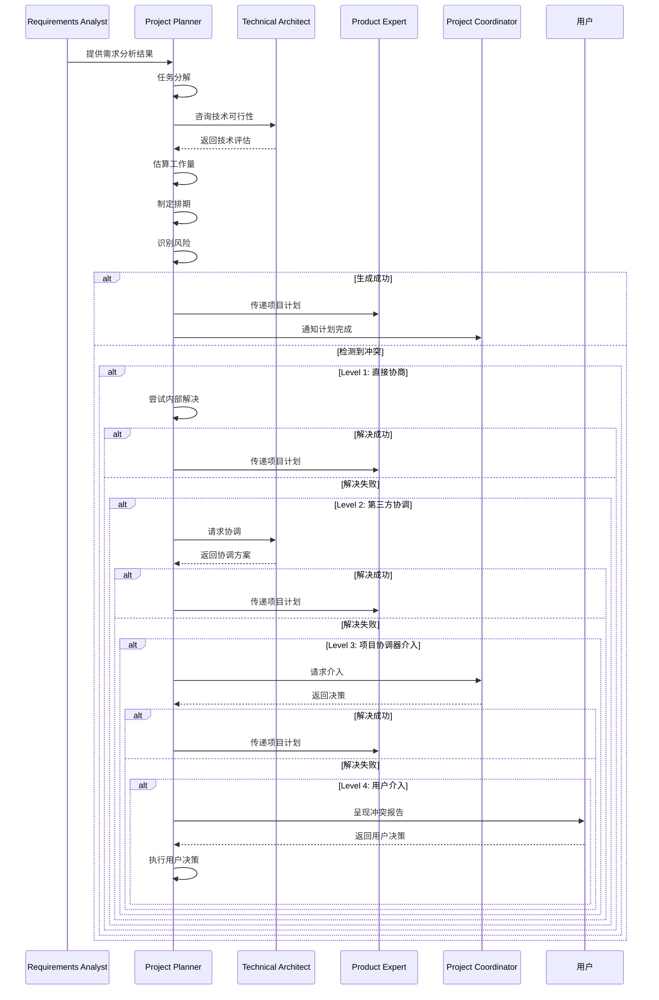

# Project Planner Skill

本skill负责项目任务分解、排期、里程碑管理和风险识别，生成可执行的项目计划。

**💡 重要说明**: 本技能既可以作为产品开发流程的一部分，也可以在任何适合的场景下独立使用。
不需要用户明确声明"我是项目规划师"，只要用户的需求涉及项目计划或任务分解，就可以调用本技能。

**重要区别**：本skill专注于项目规划和技术任务分解，不涉及人力资源分配、团队沟通协调等传统项目管理职责。

## 何时使用本Skill

本skill可以在以下场景中独立使用，也可以作为产品开发流程的一部分：

### 独立使用场景

**场景1: 项目规划**

- "制定项目计划"
- "规划开发任务"
- "规划项目里程碑"
- "规划项目时间表"
- "规划项目资源"

**场景2: 任务分解**

- "分解产品需求"
- "分解开发任务"
- "分解功能模块"
- "识别任务依赖"
- "确定任务优先级"

**场景3: 项目排期**

- "评估项目工作量"
- "制定项目排期"
- "规划开发时间表"
- "规划测试时间表"
- "规划发布时间表"

**场景4: 风险管理**

- "识别项目风险"
- "评估项目风险"
- "制定风险应对方案"
- "规划风险缓解措施"
- "风险监控计划"

**场景5: 项目咨询**

- "如何制定项目计划?"
- "项目规划最佳实践"
- "如何分解任务?"
- "如何评估工作量?"
- "项目风险管理方法"

### 产品开发流程集成

在产品开发流程的**阶段2: 需求分析**中被调用，作为项目规划师角色。

**调用方式**: 由product-development-flow自动调用，传递需求分析结果等上下文。

**触发时机**:

- 需求分析完成后
- 需要制定项目计划时
- 需要进行任务分解时

### 触发关键词

以下关键词或短语出现时，建议调用本skill：

**项目规划类**:

- "项目计划"、"项目规划"、"开发计划"
- "项目时间表"、"项目排期"、"项目资源"

**任务分解类**:

- "任务分解"、"需求分解"、"功能分解"
- "任务规划"、"任务优先级"、"任务依赖"

**排期管理类**:

- "项目排期"、"时间规划"、"进度规划"
- "工作量评估"、"时间表"、"里程碑"

**风险管理类**:

- "项目风险"、"风险管理"、"风险识别"
- "风险应对"、"风险缓解"、"风险评估"

**咨询类**:

- "规划方法"、"规划工具"、"最佳实践"
- "项目评估"、"甘特图"、"项目方案"

## 🎯 核心职责

### 1. 需求分解和任务分解

- 将产品需求分解为技术任务
- 将大任务分解为子任务
- 识别任务依赖关系
- 确定任务优先级

### 2. 工作量评估和时间排期

- 评估每个任务的工作量
- 考虑任务依赖关系
- 生成时间排期
- 识别关键路径

### 3. 里程碑定义

- 定义项目里程碑
- 定义验收标准
- 定义交付物
- 定义里程碑时间点

### 4. 风险识别和管理

- 识别技术风险
- 评估风险影响和概率
- 制定风险应对策略
- 生成风险清单

### 5. 资源需求评估

- 评估技术资源需求（服务器、存储、带宽）
- 评估工具和框架需求
- 评估第三方服务需求
- 生成资源清单

## 📋 工作流程

```mermaid
graph LR
    A[分析产品需求] --> B[分解技术任务]
    B --> C[评估工作量]
    C --> D[识别依赖关系]
    D --> E[制定时间排期]
    E --> F[定义里程碑]
    F --> G[识别风险]
    G --> H[制定风险应对]
    H --> I[生成项目计划]

## 🔄 输入要求

### 必需输入

- **产品需求**：功能需求、非功能需求
- **技术栈**：技术选型、框架、工具
- **团队规模**：可用人力（仅用于计算排期，不涉及分配）
- **时间约束**：项目截止日期

### 可选输入

- **历史数据**：类似项目的实际耗时
- **依赖系统**：外部依赖、第三方服务
- **约束条件**：预算、资源限制
- **质量要求**：性能、安全、可用性要求

## 📦 交付物

### 1. 任务分解结构（WBS）

#### WBS示例

```markdown
# 任务分解结构（WBS）

## 1. 需求分析阶段

### 1.1 需求收集

- 1.1.1 收集用户需求
  - 工作量：2人天
  - 负责角色：需求分析师
  - 交付物：用户需求文档

### 1.2 需求分析

- 1.2.1 分析功能需求
  - 工作量：3人天
  - 负责角色：需求分析师
  - 交付物：功能需求规格
- 1.2.2 分析非功能需求
  - 工作量：2人天
  - 负责角色：技术架构师
  - 交付物：非功能需求规格

### 1.3 需求评审

- 1.3.1 内部评审
  - 工作量：1人天
  - 负责角色：产品专家
  - 交付物：评审记录
- 1.3.2 客户确认
  - 工作量：0.5人天
  - 负责角色：客户代表
  - 交付物：需求确认书

**阶段总工作量**：8.5人天

## 2. 设计阶段

### 2.1 架构设计

- 2.1.1 系统架构设计
  - 工作量：3人天
  - 负责角色：技术架构师
  - 交付物：系统架构文档
- 2.1.2 数据库设计
  - 工作量：2人天
  - 负责角色：数据工程师
  - 交付物：数据库设计文档

### 2.2 UI设计

- 2.2.1 原型设计
  - 工作量：5人天
  - 负责角色：UI专家
  - 交付物：原型图
- 2.2.2 UI规范设计
  - 工作量：2人天
  - 负责角色：UI专家
  - 交付物：UI规范文档

**阶段总工作量**：12人天

## 3. 开发阶段

### 3.1 后端开发

- 3.1.1 用户模块
  - 工作量：5人天
  - 负责角色：后端工程师
  - 交付物：用户模块代码
- 3.1.2 订单模块
  - 工作量：8人天
  - 负责角色：后端工程师
  - 交付物：订单模块代码
- 3.1.3 支付模块
  - 工作量：6人天
  - 负责角色：后端工程师
  - 交付物：支付模块代码

### 3.2 前端开发

- 3.2.1 用户界面
  - 工作量：5人天
  - 负责角色：前端工程师
  - 交付物：用户界面代码
- 3.2.2 商品界面
  - 工作量：6人天
  - 负责角色：前端工程师
  - 交付物：商品界面代码
- 3.2.3 订单界面
  - 工作量：7人天
  - 负责角色：前端工程师
  - 交付物：订单界面代码

**阶段总工作量**：37人天

## 4. 测试阶段

### 4.1 单元测试

- 4.1.1 后端单元测试
  - 工作量：5人天
  - 负责角色：后端工程师
  - 交付物：单元测试代码
- 4.1.2 前端单元测试
  - 工作量：3人天
  - 负责角色：前端工程师
  - 交付物：单元测试代码

### 4.2 集成测试

- 4.2.1 API集成测试
  - 工作量：4人天
  - 负责角色：测试人员
  - 交付物：集成测试代码
- 4.2.2 E2E测试
  - 工作量：5人天
  - 负责角色：测试人员
  - 交付物：E2E测试代码

**阶段总工作量**：17人天

## 5. 部署和上线

### 5.1 部署准备

- 5.1.1 环境配置
  - 工作量：2人天
  - 负责角色：DevOps工程师
  - 交付物：环境配置文件
- 5.1.2 部署脚本
  - 工作量：1人天
  - 负责角色：DevOps工程师
  - 交付物：部署脚本

### 5.2 上线部署

- 5.2.1 灰度发布
  - 工作量：1人天
  - 负责角色：DevOps工程师
  - 交付物：部署记录
- 5.2.2 全量发布
  - 工作量：1人天
  - 负责角色：DevOps工程师
  - 交付物：发布记录

**阶段总工作量**：5人天

**项目总工作量**：79.5人天

### 2. 项目排期表

#### 甘特图示例

```markdown
# 项目排期

## 时间轴

| 日期     | 第一周 | 第二周       | 第三周                   | 第四周 | 第五周   | 第六周 |
| -------- | ------ | ------------ | ------------------------ | ------ | -------- | ------ |
| 需求分析 | ██████ |              |                          |        |          |        |
| 设计阶段 |        | ████████████ |                          |        |          |        |
| 开发阶段 |        |              | ████████████████████████ |        |          |
| 测试阶段 |        |              |                          |        | ████████ |        |
| 部署上线 |        |              |                          |        |          | ██     |

## 详细排期

### 阶段1：需求分析

- 第1-2天：需求收集（2人天）
- 第3-5天：需求分析（5人天）
- 第5天：需求评审（1.5人天）

**时间**：第1周
**依赖**：无
**里程碑**：需求确认书

### 阶段2：设计阶段

- 第6-7天：架构设计（3人天）
- 第8-9天：数据库设计（2人天）
- 第6-10天：UI设计（7人天）

**时间**：第2周
**依赖**：需求分析
**里程碑**：设计文档

### 阶段3：开发阶段

- 第11-18天：后端开发（19人天）
- 第11-19天：前端开发（18人天）

**时间**：第3-5周
**依赖**：设计阶段
**里程碑**：代码完成

### 阶段4：测试阶段

- 第19-23天：测试框架搭建（2人天）
- 第20-24天：单元测试（8人天）
- 第20-24天：集成测试（9人天）

**时间**：第5-6周
**依赖**：开发阶段
**里程碑**：测试通过

### 阶段5：部署上线

- 第25-26天：部署准备（3人天）
- 第27-28天：灰度发布（1人天）
- 第29-30天：全量发布（1人天）

**时间**：第6周
**依赖**：测试阶段
**里程碑**：正式上线

## 关键路径

需求分析 → 设计阶段 → 开发阶段 → 测试阶段 → 部署上线

**总工期**：30个日历日（约6周）
**关键路径耗时**：79.5人天

### 里程碑定义示例

```markdown
# 项目里程碑

## 里程碑1：需求确认（M1）

### 基本信息

- 里程碑名称：需求确认
- 里程碑编号：M1
- 计划日期：第5天
- 实际日期：[待定]
- 状态：未开始

### 验收标准

- [x] 用户需求文档完整
- [x] 功能需求规格完整
- [x] 非功能需求规格完整
- [x] 需求评审通过
- [x] 客户签署确认书

### 交付物

1. 用户需求文档

2. 功能需求规格

3. 非功能需求规格

4. 需求评审记录

5. 需求确认书

### 风险

- 需求变更频繁
- 客户沟通不畅

### 应对策略

- 需求变更走变更流程
- 建立定期沟通机制

---

## 里程碑2：设计完成（M2）

### 基本信息 (重复2)

- 里程碑名称：设计完成
- 里程碑编号：M2
- 计划日期：第10天
- 实际日期：[待定]
- 状态：未开始

### 验收标准 (重复2)

- [x] 系统架构设计文档完成
- [x] 数据库设计文档完成
- [x] UI原型图完成
- [x] UI规范文档完成
- [x] 设计评审通过

### 交付物 (重复2)

1. 系统架构文档

2. 数据库设计文档

3. ER图

4. UI原型图

5. UI规范文档

6. 设计评审记录

### 风险 (重复2)

- 设计不合理
- 技术选型错误

### 应对策略 (重复2)

- 设计阶段充分评审
- 技术调研和POC验证

---

## 里程碑3：代码完成（M3）

### 基本信息 (重复3)

- 里程碑名称：代码完成
- 里程碑编号：M3
- 计划日期：第19天
- 实际日期：[待定]
- 状态：未开始

### 验收标准 (重复3)

- [x] 所有功能开发完成
- [x] 代码提交到代码仓库
- [x] 代码审查通过
- [x] 单元测试覆盖率 ≥ 80%
- [x] 代码质量检查通过

### 交付物 (重复3)

1. 后端代码

2. 前端代码

3. 单元测试代码

4. 代码审查记录

### 风险 (重复3)

- 开发进度延迟
- 技术难点攻关

### 应对策略 (重复3)

- 每日站会跟踪进度
- 技术问题及时求助

---

## 里程碑4：测试通过（M4）

### 基本信息 (重复4)

- 里程碑名称：测试通过
- 里程碑编号：M4
- 计划日期：第25天
- 实际日期：[待定]
- 状态：未开始

### 验收标准 (重复4)

- [x] 单元测试通过
- [x] 集成测试通过
- [x] E2E测试通过
- [x] 测试覆盖率 ≥ 80%
- [x] 无严重缺陷
- [x] 测试报告完成

### 交付物 (重复4)

1. 单元测试报告

2. 集成测试报告

3. E2E测试报告

4. 测试覆盖率报告

5. 缺陷报告

### 风险 (重复4)

- 缺陷修复延迟
- 测试环境不稳定

### 应对策略 (重复4)

- 优先修复严重缺陷
- 建立稳定的测试环境

---

## 里程碑5：正式上线（M5）

### 基本信息 (重复5)

- 里程碑名称：正式上线
- 里程碑编号：M5
- 计划日期：第30天
- 实际日期：[待定]
- 状态：未开始

### 验收标准 (重复5)

- [x] 部署脚本执行成功
- [x] 应用运行正常
- [x] 监控配置完成
- [x] 数据迁移成功
- [x] 功能验证通过
- [x] 性能指标达标

### 交付物 (重复5)

1. 生产环境部署

2. 部署文档

3. 运维手册

4. 监控配置

5. 上线报告

### 风险 (重复5)

- 部署失败
- 线上问题

### 应对策略 (重复5)

- 灰度发布降低风险
- 建立回滚方案
- 准备应急响应团队

### 4. 风险管理计划

#### 风险清单示例

```markdown
# 项目风险管理计划

## 风险识别

### 技术风险

| 风险ID | 风险描述         | 概率 | 影响 | 风险等级 |
| ------ | ---------------- | ---- | ---- | -------- |
| R-T001 | 第三方API不稳定  | 高   | 中   | 中       |
| R-T002 | 数据库性能不达标 | 中   | 高   | 高       |
| R-T003 | 技术难点攻关困难 | 中   | 高   | 高       |
| R-T004 | 安全漏洞         | 低   | 极高 | 高       |
| R-T005 | 兼容性问题       | 中   | 中   | 中       |

### 进度风险

| 风险ID | 风险描述     | 概率 | 影响 | 风险等级 |
| ------ | ------------ | ---- | ---- | -------- |
| R-P001 | 需求变更频繁 | 高   | 高   | 高       |
| R-P002 | 开发进度延迟 | 中   | 高   | 高       |
| R-P003 | 测试时间不足 | 中   | 高   | 高       |
| R-P004 | 人员变动     | 低   | 高   | 中       |

### 资源风险

| 风险ID | 风险描述           | 概率 | 影响 | 风险等级 |
| ------ | ------------------ | ---- | ---- | -------- |
| R-R001 | 服务器资源不足     | 中   | 中   | 中       |
| R-R002 | 预算超支           | 低   | 高   | 中       |
| R-R003 | 第三方服务费用超支 | 中   | 中   | 中       |

## 风险应对策略

### R-T002: 数据库性能不达标

**风险等级**：高

**预防措施**：

- 设计阶段充分评估性能
- 使用数据库性能测试工具
- 设计合理的索引和查询

**应对措施**：

- 实施数据库优化（索引、分区、缓存）
- 考虑读写分离
- 考虑分库分表

**责任人**：技术架构师、数据工程师
**监控指标**：查询响应时间、CPU使用率、I/O吞吐量

---

### R-T003: 技术难点攻关困难

**风险等级**：高

**预防措施**：

- 技术选型充分调研
- 关键技术进行POC验证
- 提前识别技术难点

**应对措施**：

- 邀请专家协助
- 寻求外部技术支持
- 调整技术方案

**责任人**：技术架构师、开发工程师
**监控指标**：技术攻关进度、问题解决情况

---

### R-P001: 需求变更频繁

**风险等级**：高

**预防措施**：

- 需求阶段充分沟通
- 制定明确的需求变更流程
- 签署需求确认书

**应对措施**：

- 评估变更影响
- 协商调整排期和预算
- 按变更流程处理

**责任人**：需求分析师、产品专家、客户代表
**监控指标**：变更次数、变更影响范围

---

### R-P002: 开发进度延迟

**风险等级**：高

**预防措施**：

- 合理估算工作量
- 每日站会跟踪进度
- 识别关键路径

**应对措施**：

- 加班赶工（短期）
- 增加人力（长期）
- 削减非关键功能

**责任人**：技术架构师、开发工程师
**监控指标**：任务完成率、剩余工作量

---

## 风险监控

### 监控频率

- 高风险：每天
- 中风险：每周
- 低风险：每两周

### 监控方式

- 每日站会汇报
- 周会讨论
- 风险评估会议

### 风险报告

```markdown
## 风险状态报告

**报告日期**：2024-01-15

### 本周新增风险

无

### 风险状态更新

| 风险ID | 之前状态 | 当前状态 | 变更说明             |
| ------ | -------- | -------- | -------------------- |
| R-T002 | 中风险   | 高风险   | 数据库性能测试不达标 |
| R-P001 | 高风险   | 中风险   | 需求变更流程已建立   |

### 风险应对执行情况

| 风险ID | 应对措施   | 执行状态 | 效果评估 |
| ------ | ---------- | -------- | -------- |
| R-T002 | 数据库优化 | 进行中   | 等待评估 |
| R-P001 | 变更流程   | 已完成   | 效果良好 |

### 下周风险关注重点

- R-T002：数据库性能优化
- R-P002：开发进度跟踪

### 5. 资源需求评估 (重复2)

#### 技术资源清单

```markdown
# 技术资源需求

## 服务器资源

### 开发环境

- 开发服务器：2台
  - CPU：8核
  - 内存：32GB
  - 磁盘：500GB SSD
- 测试服务器：1台
  - CPU：4核
  - 内存：16GB
  - 磁盘：500GB SSD

### 生产环境

- 应用服务器：4台
  - CPU：16核
  - 内存：64GB
  - 磁盘：1TB SSD
- 数据库服务器：3台（主从）
  - CPU：32核
  - 内存：128GB
  - 磁盘：2TB NVMe SSD
- Redis服务器：3台（主从）
  - CPU：8核
  - 内存：32GB
  - 磁盘：500GB SSD
- 负载均衡服务器：2台
  - CPU：8核
  - 内存：16GB
  - 磁盘：200GB SSD

**总成本估算**：

- 开发/测试环境：$2,000/月
- 生产环境：$15,000/月

## 网络资源

- 带宽：100Mbps
- CDN：按需计费
- 预估：$2,000/月

## 第三方服务

- 对象存储（S3）：按需计费
- 预估：$1,000/月

- 短信服务：按量计费
- 预估：$500/月

- 邮件服务：按量计费
- 预估：$300/月

**第三方服务总成本**：$1,800/月

## 开发工具

- IDE：免费
- Git托管：GitHub（$20/月）
- CI/CD：GitHub Actions（免费）
- 监控：Prometheus + Grafana（免费）
- 日志：ELK Stack（自建）

**工具成本**：$20/月

## 总资源成本

| 类别       | 月成本      | 年成本       |
| ---------- | ----------- | ------------ |
| 服务器     | $17,000     | $204,000     |
| 网络       | $2,000      | $24,000      |
| 第三方服务 | $1,800      | $21,600      |
| 工具       | $20         | $240         |
| **合计**|**$20,820**|**$249,840** |

## 📊 项目计划模板

### 项目计划文档模板

```markdown
# 项目计划

## 项目概况

- 项目名称：[项目名称]
- 项目经理：[姓名]
- 开始日期：[日期]
- 计划完成日期：[日期]
- 项目预算：[金额]

## 项目目标

[项目目标和成功标准]

## 项目范围

[项目范围描述]

## 工作分解结构（WBS）

[见WBS文档]

## 项目排期

[见排期表]

## 里程碑

[见里程碑定义]

## 资源计划

[见资源需求评估]

## 风险管理计划

[见风险管理计划]

## 质量管理计划

[质量标准和验收标准]

## 沟通计划

- 每日站会：9:30 AM
- 周会：每周五 3:00 PM
- 里程碑评审会：每个里程碑完成后
- 客户汇报会：每两周一次

## 变更管理流程

[变更管理流程描述]

## 项目审批

- 项目经理：[签名]
- 技术负责人：[签名]
- 业务负责人：[签名]
- 客户：[签名]

## 附件

1. WBS详细文档

2. 排期甘特图

3. 里程碑详细定义

4. 资源需求清单

5. 风险管理计划

## 🔍 项目规划工具

### 工具推荐

| 工具类型 | 推荐工具                  | 特点               |
| -------- | ------------------------- | ------------------ |
| 项目管理 | Jira, Linear              | 任务跟踪、进度管理 |
| 甘特图   | MS Project, GanttPRO      | 甘特图可视化       |
| 协作     | Confluence, Notion        | 文档协作           |
| 代码管理 | GitHub, GitLab            | 代码版本控制       |
| CI/CD    | GitHub Actions, GitLab CI | 持续集成部署       |

### 项目跟踪指标

- 任务完成率
- 里程碑达成率
- 风险数量和等级
- 预算使用情况
- 团队工作效率

## 🔄 集成到开发流程

### 触发时机

1. **项目启动阶段**
   - 生成项目计划
   - 定义里程碑
   - 识别风险

2. **项目进行中**
   - 更新项目进度
   - 识别新风险
   - 调整排期

3. **重大变更时**
   - 重新规划项目
   - 更新里程碑
   - 重新评估风险

### 调用方式

```typescript
const projectPlanner = await useSkill("project-planner");

const projectPlan = await projectPlanner.plan({
  productRequirements: requirements,
  techStack: techStack,
  teamSize: teamSize,
  deadline: deadline,
  budget: budget,
});

await saveProjectPlan(projectPlan.plan);
await saveWBS(projectPlan.wbs);
await saveMilestones(projectPlan.milestones);
await saveRiskManagementPlan(projectPlan.riskPlan);
await saveResourceRequirements(projectPlan.resources);

## 📊 质量标准

- ✅ 任务分解完整无遗漏
- ✅ 工作量评估合理
- ✅ 排期考虑依赖关系
- ✅ 里程碑可衡量
- ✅ 风险识别全面
- ✅ 应对策略可行
- ✅ 文档清晰完整

## ⚠️ 注意事项

### 规划原则

1. **渐进细化**
   - 初期规划粗略
   - 逐步细化细节
   - 根据实际情况调整

2. **预留缓冲**
   - 工作量预留20%缓冲
   - 排期预留10%缓冲
   - 预算预留15%缓冲

3. **关注关键路径**
   - 识别关键路径
   - 优先保障关键任务
   - 监控关键路径风险

4. **定期复盘**
   - 定期回顾计划执行情况
   - 总结经验教训
   - 持续改进规划能力

### 常见错误

- ❌ 任务分解不够细致
- ❌ 工作量评估过于乐观
- ❌ 忽略任务依赖关系
- ❌ 里程碑定义不清晰
- ❌ 风险识别不充分
- ❌ 不预留缓冲时间
- ❌ 计划僵化不调整

### 与传统项目管理的区别

| 维度     | 传统项目管理 | Project Planner Skill |
| -------- | ------------ | --------------------- |
| 关注点   | 人力资源分配 | 技术任务分解          |
| 沟通协调 | 团队沟通     | 流程编排              |
| 进度跟踪 | 人工跟踪     | 自动跟踪              |
| 变更管理 | 人工协商     | 自动重新规划          |
| 适用对象 | 人类团队     | AI虚拟团队            |

---

## 调用其他技能

### 调用时机

本skill在以下情况需要主动调用其他技能：

1. **需求评估时** - 调用需求分析师

2. **技术评估时** - 调用技术架构师

3. **风险评估时** - 调用安全工程师或灾备规划师

4. **资源评估时** - 调用前端工程师或后端工程师

### 调用的技能及场景

#### 1. 调用需求分析师（requirements-analyst）

**调用时机**：

- 当需要评估需求复杂度时
- 当需要明确需求范围时
- 当需要识别需求依赖时

**调用方式**：

```typescript
const requirementsAnalyst = await useSkill("requirements-analyst");
const complexityAnalysis = await requirementsAnalyst.analyzeComplexity({
  requirements: featureList,
  context: projectContext,
});

**调用场景**：

**场景1**：需求复杂度评估

- **输入**：需求列表、项目上下文
- **调用**：requirements-analyst评估需求复杂度
- **输出**：复杂度评分、依赖关系

**场景2**：需求范围确认

- **输入**：需求描述、边界条件
- **调用**：requirements-analyst明确范围
- **输出**：范围说明、排除项

#### 2. 调用技术架构师（technical-architect）

**调用时机**：

- 当需要评估技术难度时
- 当需要评估架构复杂度时
- 当需要识别技术风险时

**调用方式**：

```typescript
const technicalArchitect = await useSkill("technical-architect");
const technicalAssessment = await technicalArchitect.assessComplexity({
  requirements: technicalRequirements,
  constraints: constraints,
});

**调用场景**：

**场景1**：技术难度评估

- **输入**：技术需求、约束条件
- **调用**：technical-architect评估难度
- **输出**：难度评分、技术建议

**场景2**：技术风险识别

- **输入**：技术方案、项目约束
- **调用**：technical-architect识别风险
- **输出**：风险清单、缓解措施

#### 3. 调用安全工程师（security-engineer）

**调用时机**：

- 当需要评估安全风险时
- 当需要识别安全依赖时
- 当需要评估安全工作量时

**调用方式**：

```typescript
const securityEngineer = await useSkill("security-engineer");
const securityAssessment = await securityEngineer.assessRequirements({
  features: featureList,
  securityContext: context,
});

**调用场景**：

**场景1**：安全需求评估

- **输入**：功能列表、安全上下文
- **调用**：security-engineer评估安全需求
- **输出**：安全需求清单、工作量估算

**场景2**：安全风险识别

- **输入**：功能范围、威胁模型
- **调用**：security-engineer识别安全风险
- **输出**：安全风险清单、应对策略

#### 4. 调用灾备规划师（disaster-recovery-planner）

**调用时机**：

- 当需要评估灾备需求时
- 当需要识别灾备依赖时
- 当需要评估灾备工作量时

**调用方式**：

```typescript
const disasterRecoveryPlanner = await useSkill("disaster-recovery-planner");
const drAssessment = await disasterRecoveryPlanner.assessRequirements({
  businessImpact: impactLevel,
  availability: availabilityRequirements,
});

**调用场景**：

**场景1**：灾备需求评估

- **输入**：业务影响、可用性要求
- **调用**：disaster-recovery-planner评估需求
- **输出**：灾备需求、工作量估算

**场景2**：灾备依赖识别

- **输入**：系统架构、灾备目标
- **调用**：disaster-recovery-planner识别依赖
- **输出**：依赖关系、依赖清单

### 调用注意事项

1. **评估前置**：规划前必须充分评估需求和难度

2. **风险优先**：优先识别和评估高风险项

3. **资源准确**：资源需求评估要基于实际工作量

4. **迭代更新**：计划要根据变化及时更新

---

## 总结

Project Planner Skill专注于：

1. ✅ 需求分解和任务分解

2. ✅ 工作量评估和时间排期

3. ✅ 里程碑定义

4. ✅ 风险识别和管理

5. ✅ 资源需求评估

6. ✅ 生成项目计划文档

**重要说明**：

- ❌ 不涉及人力资源分配
- ❌ 不涉及团队沟通协调

---

## 🤝 协作关系与RACI矩阵

### 本技能的定位

本技能作为项目规划专家，在产品开发流程中负责将需求转化为可执行的项目计划，包括任务分解、排期、里程碑管理和风险识别。

### 协作的技能类型

本技能主要与以下类型技能协作：

1. **前置技能**：requirements-analyst（提供需求分析结果）
2. **后置技能**：product-expert、ui-expert（接收项目计划）
3. **协调技能**：project-coordinator（流程协调）
4. **相关技能**：technical-architect（技术评估）

### 协作场景

| 场景 | 协作技能 | 协作方式 | 协作内容 |
|------|----------|----------|----------|
| 需求转计划 | requirements-analyst | 顺序协作 | 将需求分析转化为项目计划 |
| 技术评估 | technical-architect | 咨询协作 | 评估技术方案的可行性 |
| 计划传递 | product-expert | 顺序协作 | 传递项目计划给产品设计 |
| 流程协调 | project-coordinator | 协调协作 | 确认项目计划的执行 |

### 本技能在产品开发流程中的RACI角色

| 阶段 | 本技能角色 | 主要职责 |
|------|------------|----------|
| 阶段2（需求分析） | R/A | 生成项目计划、任务分解、排期 |
| 阶段3-12 | I | 了解项目进展，配合计划调整 |

### 本技能的核心任务RACI

| 任务 | 本技能 | requirements-analyst | technical-architect | 说明 |
|------|--------|----------------------|--------------------|------|
| 接收需求 | R/A | I | - | 接收需求分析结果 |
| 任务分解 | R/A | C | C | 分解技术任务 |
| 估算工作量 | R/A | - | C | 评估开发工作量 |
| 制定排期 | R/A | C | - | 制定时间表 |
| 识别风险 | R/A | C | C | 识别项目风险 |
| 生成计划 | R/A | C | - | 生成项目计划文档 |

### RACI角色说明

- **R (Responsible)** - 负责人：本skill实际执行的规划任务
- **A (Accountable)** - 拥有人：本skill对项目计划质量负最终责任
- **C (Consulted)** - 咨询人：在规划过程中咨询其他技能
- **I (Informed)** - 知情人：通知相关技能项目计划结果

## ⚠️ 冲突升级路径

### 冲突类型

本技能可能遇到的冲突类型：

| 冲突类型 | 严重程度 | 默认处理方式 | 示例 |
|----------|----------|--------------|------|
| 排期冲突 | 中 | 优先级调整 | 任务时间不足 |
| 资源冲突 | 中-高 | 咨询technical-architect | 技术资源不足 |
| 范围冲突 | 中 | 咨询requirements-analyst | 需求范围过大 |
| 技术冲突 | 高 | 咨询technical-architect | 技术方案不可行 |
| 致命错误 | 极高 | 用户介入 | 项目计划无法执行 |

### 4级冲突升级路径

#### Level 1: 直接协商（技能级别）

**适用场景**：
- 冲突严重程度：低-中
- 冲突类型：排期冲突、范围冲突
- 处理时限：< 5分钟

**处理流程**：

```typescript
async function resolveConflictLevel1(
  conflict: Conflict,
): Promise<Resolution> {
  // 1. 分析冲突原因
  const rootCause = analyzeConflict(conflict);

  // 2. 提出解决方案
  const solutions = generateSolutions(rootCause);

  // 3. 评估方案
  const bestSolution = selectBestSolution(solutions);

  // 4. 执行方案
  await implementSolution(bestSolution);

  // 5. 记录结果
  recordConflictResolution(conflict, bestSolution, "Level 1");

  return bestSolution;
}
```

### Level 2

#### 第三方协调（相关技能协调）

**适用场景**：

- 冲突严重程度：中
- 冲突类型：技术冲突、资源冲突
- 处理时限：< 15分钟

**协调人选择**：

| 冲突类型 | 推荐协调人 | 原因 |
|----------|-----------|------|
| 技术冲突 | technical-architect | 技术权威 |
| 范围冲突 | requirements-analyst | 需求专家 |
| 资源冲突 | project-coordinator | 资源协调 |

**处理流程**：

```typescript
async function resolveConflictLevel2(
  conflict: Conflict,
  mediator: string,
): Promise<Resolution> {
  // 1. 选择协调人
  const coordinator = selectCoordinator(mediator);

  // 2. 提供冲突信息
  await coordinator.informConflict(conflict);

  // 3. 协调人提出方案
  const proposal = await coordinator.proposeSolution(conflict);

  // 4. 执行方案
  await implementResolution(proposal);
  recordConflictResolution(conflict, proposal, "Level 2");

  return proposal;
}
```

#### Level 3: 项目协调器介入

**适用场景**：

- 冲突严重程度：高
- 冲突类型：严重的技术冲突、资源冲突
- 处理时限：< 30分钟

**处理流程**：

```typescript
async function resolveConflictLevel3(
  conflict: Conflict,
): Promise<Resolution> {
  // 1. 通知project-coordinator
  await projectCoordinator.reportConflict(conflict);

  // 2. project-coordinator决策
  const decision = await projectCoordinator.makeDecision(conflict);

  // 3. 执行决策
  await implementDecision(decision);
  recordConflictResolution(conflict, decision, "Level 3");

  return decision;
}
```

#### Level 4: 用户介入（最后手段）

**适用场景**：

- 冲突严重程度：极高
- 冲突类型：涉及核心业务决策、项目可行性
- 处理时限：无限制

**用户决策选项**：

| 选项 | 说明 | 适用场景 | 执行动作 |
|------|------|----------|----------|
| A. 继续当前计划 | 采用当前计划 | 计划基本可行 | 继续执行 |
| B. 调整计划 | 修改项目计划 | 计划需要调整 | 调整并重新规划 |
| C. 回退到需求 | 重新分析需求 | 需求有问题 | 回退到阶段2 |

## 🔗 协作流程图



---

## 📚 参考资料

### 全局参考资料

本skill参考以下全局参考资料：

- **编码规范**：`references/best-practices/coding.md`（包含命名规范、函数设计原则、代码组织规范、注释规范、错误处理规范）
- **设计模式**：`references/design-patterns/creational.md`、`references/design-patterns/structural.md`、`references/design-patterns/behavioral.md`
- **架构参考**：`references/architecture/hexagonal-architecture.md`、`references/architecture/microservices.md`

### 本skill特有参考资料

本skill使用以下特有的参考资料：

- **[COLLABORATION_RACI.md](../../COLLABORATION_RACI.md)** - 完整的RACI矩阵文档
- **[CONFLICT_ESCALATION_PATH.md](../../CONFLICT_ESCALATION_PATH.md)** - 冲突升级路径文档
- **[项目规划模板](references/project-planning-templates.md)** - 包含WBS、排期表、里程碑、风险管理等模板

## 🛠️ 工具脚本

### 全局工具脚本

本skill使用以下全局工具脚本：

- **Logger工具**：`scripts/utils/logger.ts`

  ```typescript
  import { createLogger } from "@codebuddy/scripts/utils/logger";
  const logger = createLogger("Project Planner");
  logger.info("开始制定项目计划");
  logger.skillComplete("Project Planner", 5000);

- **FileManager工具**：`scripts/utils/file-manager.ts`

  ```typescript
  import { FileManager } from "@codebuddy/scripts/utils/file-manager";
  const fm = new FileManager();
  await fm.createDirectory("./plan");
  await fm.writeFile("./plan/wbs.md", wbs);

- **ContextManager工具**：`scripts/utils/context-manager.ts`

  ```typescript
  import { ContextManager } from "@codebuddy/scripts/utils/context-manager";
  const ctx = new ContextManager();
  ctx.set("deadline", "2024-06-30");
  ctx.set("budget", 100000);

- **CodeValidator**：`scripts/validators/code-validator.ts`

  ```typescript
  import { CodeValidator } from "@codebuddy/scripts/validators/code-validator";
  const validator = new CodeValidator();
  const result = await validator.validate("./plan", { language: "markdown" });

- **ConfigValidator**：`scripts/validators/config-validator.ts`

  ```typescript
  import { ConfigValidator } from "@codebuddy/scripts/validators/config-validator";
  const validator = new ConfigValidator();
  const result = await validator.validate("./config", { schema: "project" });

### 本skill特有脚本

本skill使用以下特有的工具脚本：

- **[WBS生成器](scripts/wbs-generator.ts)** - 生成工作分解结构

```typescript
import { WBSGenerator } from "./scripts/wbs-generator";
const generator = new WBSGenerator();
await generator.generateWBS({
  requirements: productRequirements,
  teamSize: 5,
  deadline: "2024-06-30",
});
```

- ❌ 不涉及预算控制
- ✅ 专注于技术层面的项目规划
- ✅ 生成的项目计划由Project Coordinator执行

---

## 📝 使用示例

### 示例1：制定项目计划

**场景描述**：为一个电商项目制定详细的项目计划

**输入示例**：

```text

请为电商项目制定详细的项目计划，包括：

1. 项目范围：完整的电商平台

2. 团队规模：10人

3. 预算：100万

4. 工期：3个月

```

**调用方式**：

```bash
invoke skill project-planner

```

**输出示例**：

```markdown
# 电商平台项目计划

## 1. 项目概况

- 项目名称：电商平台
- 项目范围：完整的电商平台
- 团队规模：10人
- 预算：100万
- 工期：3个月

## 2. 项目范围

### 2.1 功能范围
- 用户管理
- 商品管理
- 订单管理
- 支付系统
- 物流管理

### 2.2 非功能范围
- 性能要求：支持1000并发
- 安全要求：HTTPS + 数据加密
- 可用性：99.9%

## 3. 工作分解（WBS）

### 3.1 需求分析（第1周）
- 需求收集：2人天
- 需求分析：3人天
- 需求评审：2人天

### 3.2 系统设计（第2周）
- 架构设计：3人天
- 数据库设计：2人天
- UI设计：5人天

```
