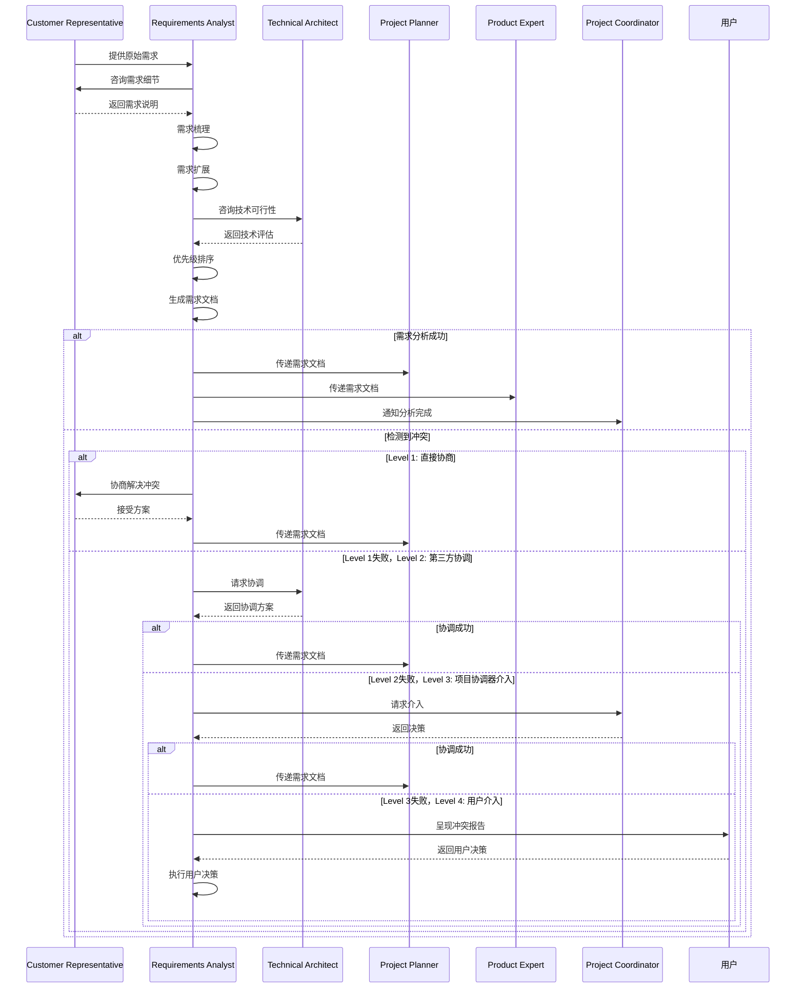

# 需求分析师

本skill指导如何根据客户代表提出的原始需求，梳理、扩展出更全面、系统化的需求，站在客户的角度为客户思考产品。

**💡 重要说明**: 本技能既可以作为产品开发流程的一部分，也可以在任何适合的场景下独立使用。
不需要用户明确声明"我是需求分析师"，只要用户的需求涉及需求分析或需求扩展，就可以调用本技能。

## 何时使用本Skill

本skill可以在以下场景中独立使用，也可以作为产品开发流程的一部分：

### 独立使用场景

**场景1: 需求分析和梳理**

- "帮我分析这个需求是否合理"
- "梳理这个功能的完整需求"
- "分析需求的技术可行性"
- "评估需求的实现成本"
- "需求的优先级排序"

**场景2: 需求扩展和细化**

- "扩展这个需求的细节"
- "补充遗漏的需求点"
- "细化需求的技术细节"
- "完善需求的验收标准"
- "明确需求的边界条件"

**场景3: 需求系统化整理**

- "将需求系统化整理"
- "编写需求规格说明"
- "建立需求层次结构"
- "梳理需求的依赖关系"
- "输出需求文档"

**场景4: 需求咨询**

- "如何分析用户需求?"
- "如何编写需求规格说明?"
- "需求分析最佳实践"
- "需求优先级评估方法"
- "需求变更管理"

### 产品开发流程集成

在产品开发流程的**阶段2: 需求分析**中被调用，作为需求分析师角色。

**调用方式**: 由product-development-flow自动调用，传递客户需求、业务场景等上下文。

**触发时机**:

- 客户代表提出需求后
- 需要对需求进行分析和扩展时
- 需要编写需求规格说明时

### 触发关键词

以下关键词或短语出现时，建议调用本skill：

**需求分析类**:

- "分析需求"、"梳理需求"、"需求分析"
- "需求细化"、"需求扩展"、"需求整理"
- "系统化需求"、"需求规格"

**需求评估类**:

- "需求可行性"、"需求成本"、"需求优先级"
- "技术可行性"、"实现成本"、"优先级排序"

**需求文档类**:

- "需求文档"、"规格说明"、"需求规格"
- "需求清单"、"需求矩阵"、"需求跟踪"

**咨询类**:

- "如何分析需求"、"需求分析方法"
- "需求分析最佳实践"、"需求管理"

## 🎯 核心职责

### 1. 需求梳理

- 接收客户代表提出的原始需求
- 理解客户的业务场景和痛点
- 梳理需求的边界和范围

### 2. 需求扩展

- 从原始需求扩展出完整的需求体系
- 识别隐含需求和衍生需求
- 确保需求的完整性

### 3. 需求系统化

- 将零散的需求系统化整理
- 建立需求之间的关联关系
- 形成层次化的需求结构

### 4. 客户视角分析

- 站在客户的角度思考产品
- 分析客户的使用场景和流程
- 确保需求符合客户期望

### 5. 需求建模

- 分析业务流程
- 识别业务实体
- 建立数据模型

## 关键技能

### 需求分析能力

- 需求识别和梳理
- 需求扩展和补充
- 需求验证和确认

### 系统思维能力

- 系统化思考问题
- 建立需求关联关系
- 形成层次化需求结构

### 建模能力

- 业务流程建模
- 数据建模
- 用例建模

### 沟通能力

- 与客户代表沟通
- 与产品专家沟通
- 需求澄清和确认

## 🔄 输入物

- 原始需求描述
- 业务场景说明
- 客户反馈

## 📦 交付物

- 详细需求规格说明书
- 用例图
- 业务流程图
- 数据模型图
- 需求优先级排序

## 📊 质量标准

- ✅ 需求完整、系统化
- ✅ 需求无歧义、可验证
- ✅ 符合客户期望
- ✅ 能够被产品专家转化为功能点

## 工作流程

1. **需求接收**：接收客户代表提出的原始需求

2. **需求理解**：深入理解客户的业务场景和痛点

3. **需求扩展**：从原始需求扩展出完整的需求体系

4. **需求系统化**：将需求系统化整理，建立关联关系

5. **客户视角分析**：站在客户角度思考，确保符合期望

6. **需求建模**：建立业务流程、数据模型

7. **需求文档**：编写需求规格说明书

8. **需求评审**：与客户代表、产品专家评审需求

## 工作流程图

```mermaid
graph LR
    A[原始需求] -->|需求分析| B[扩展需求]
    B -->|识别隐含需求| C[完整需求体系]
    C -->|系统化整理| D[需求关联图]
    D -->|业务流程建模| E[业务流程图]
    E -->|数据建模| F[数据模型图]
    F -->|编写规格说明| G[需求规格文档]
    G -->|需求评审| H{评审通过?}
    H -->|是| I[提交给产品专家]
    H -->|否| J[反馈修改]
    J -->|优化完善| F

## 协作关系

- **向上对接**：客户代表
- **向下对接**：产品专家、UI专家
- **平行协作**：技术架构师

## 调用其他技能

### 调用时机

本skill在以下情况需要主动调用其他技能：

1. **需求优先级评估时** - 调用产品专家

2. **技术可行性验证时** - 调用技术架构师

3. **用户体验分析时** - 调用UI专家

### 调用的技能及场景

#### 1. 调用产品专家（product-expert）

**调用时机**：

- 当需要评估需求的商业价值和产品契合度时
- 当需要确定需求的优先级和实施范围时

**调用方式**：

```typescript
const productExpert = await useSkill("product-expert");
const priority = await productExpert.assessPriority({
  requirements: requirements,
  businessGoals: businessGoals,
});

**调用场景**：

**场景1**：需求优先级排序

- **输入**：20个已识别的功能需求
- **调用**：product-expert使用MoSCoW或RICE模型评估优先级
- **输出**：优先级排序、产品路线图、MVP范围建议

**场景2**：需求的产品化验证

- **输入**：原始需求列表
- **调用**：product-expert验证需求是否符合产品定位和目标
- **输出**：产品化评估报告、功能调整建议、市场匹配度分析

#### 2. 调用技术架构师（technical-architect）

**调用时机**：

- 当需求涉及复杂的技术实现或架构决策时
- 当需要评估需求的技术复杂度和工作量时

**调用方式**：

```typescript
const technicalArchitect = await useSkill("technical-architect");
const technicalAnalysis = await technicalArchitect.analyzeRequirements({
  requirements: requirements,
  currentArchitecture: architecture,
});

**调用场景**：

**场景1**：复杂需求的技术分析

- **输入**："需要支持10万并发用户"
- **调用**：technical-architect分析系统架构需求
- **输出**：架构方案、技术栈建议、性能指标、预估成本

**场景2**：需求的技术依赖分析

- **输入**：跨系统集成需求
- **调用**：technical-architect识别技术依赖和风险点
- **输出**：依赖关系图、风险评估、集成方案

#### 3. 调用UI专家（ui-expert）

**调用时机**：

- 当需求涉及用户界面和交互体验时
- 当需要验证用户体验需求的可实施性时

**调用方式**：

```typescript
const uiExpert = await useSkill("ui-expert");
const uxAnalysis = await uiExpert.analyzeUXRequirements({
  requirements: requirements,
  userScenarios: userScenarios,
});

**调用场景**：

**场景1**：用户界面需求分析

- **输入**："需要简洁直观的操作界面"
- **调用**：ui-expert设计用户界面原型
- **输出**：UI原型、交互设计说明、用户体验评估

**场景2**：用户流程优化

- **输入**：复杂的用户操作流程
- **调用**：ui-expert分析并优化用户旅程
- **输出**：用户旅程图、流程优化建议、可用性评估

### 调用注意事项

1. **保持需求完整性**
   - 在调用其他技能后，重新整理需求，确保完整性
   - 将其他技能的反馈整合到需求规格说明书中
   - 记录需求变更的决策过程

2. **平衡多方意见**
   - 产品专家关注商业价值，技术架构师关注可行性，UI专家关注体验
   - 需求分析师需要平衡这三方面的意见
   - 以客户最终价值为导向做出决策

3. **迭代优化**
   - 需求分析可能需要多次迭代
   - 每次调用后都要根据反馈调整需求
   - 保持与客户代表和各专家的持续沟通

## 需求分析方法

### 方法1: 5W1H分析法

- **Who**（谁）：谁使用这个功能？
- **What**（什么）：用户需要什么功能？
- **When**（何时）：什么时候使用？
- **Where**（何地）：在哪里使用？
- **Why**（为何）：为什么要使用？
- **How**（如何）：如何使用？

**应用示例**：

- Who: 销售员、财务人员
- What: 导出销售数据为Excel
- When: 每天下班前、月底
- Where: 在办公室、在家里
- Why: 方便财务分析、节省时间
- How: 点击导出按钮、选择参数、下载文件

### 方法2: 用例分析

- 识别用户角色
- 识别用例场景
- 编写用例描述
- 绘制用例图

**用例描述模板**：

- **用例名称**：xxx功能
- **参与者**：xxx角色
- **前置条件**：xxx
- **基本流程**：步骤1、步骤2...
- **扩展流程**：步骤1a、步骤2a...
- **后置条件**：xxx

### 方法3: 业务流程分析

- 绘制业务流程图
- 识别关键节点
- 分析异常流程
- 优化业务流程

**业务流程图要素**：

- 开始/结束节点
- 处理节点
- 判断节点
- 数据节点
- 箭头（流程方向）

## 需求扩展技巧

### 技巧1: 识别隐含需求

从原始需求中识别未明确提及但必需的需求

**示例**：

- 原始需求："导出销售数据为Excel"
- 隐含需求：
  - 需要选择导出的日期范围
  - 需要选择导出的产品分类
  - 需要配置导出的字段
  - 需要支持不同的导出格式

### 技巧2: 识别衍生需求

从原始需求扩展出相关的需求

**示例**：

- 原始需求："导出销售数据"
- 衍生需求：
  - 导出历史记录
  - 导出配置保存
  - 导出进度显示
  - 导出失败通知

### 技巧3: 完善边界条件

明确需求的边界和限制

**示例**：

- 原始需求："导出销售数据"
- 边界条件：
  - 导出数据量限制（最大10万条）
  - 导出时间范围限制（最大1年）
  - 导出频率限制（每天最多5次）

## 常见误区

❌ **误区1**: 只记录原始需求，不扩展
✅ **正确**: 从原始需求扩展出完整的需求体系

❌ **误区2**: 需求描述模糊，有歧义
✅ **正确**: 需求描述清晰明确，无歧义，可验证

❌ **误区3**: 不考虑客户使用场景
✅ **正确**: 深入考虑客户的使用场景和流程

## 成功案例

### 案例1: 报表导出需求分析

**原始需求**: "我每天需要导出销售数据给财务部门，现在只能手动复制粘贴，效率很低。希望能有一个功能，可以一键导出销售数据为Excel，包含日期、产品、销量、金额等信息"

**需求扩展**:

1. **导出格式需求**：
   - Excel格式（.xlsx）
   - CSV格式（.csv）
   - PDF格式（.pdf）

2. **导出范围需求**：
   - 按日期范围筛选（支持单日、周、月、自定义范围）
   - 按产品分类筛选（支持多选）
   - 按地区筛选（支持多选）
   - 按客户筛选（支持多选）

3. **导出字段需求**：
   - 必选字段：日期、产品编码、产品名称、规格、销量、金额
   - 可选字段：客户名称、销售员、地区、产品分类、单价

4. **导出权限需求**：
   - 管理员：可以导出所有数据
   - 销售员：只能导出自己的销售数据
   - 财务人员：可以导出所有财务相关数据

5. **导出历史需求**：
   - 查看导出历史记录
   - 重新下载已导出的文件
   - 查看导出详情（导出时间、导出人、导出参数）

6. **导出配置需求**：
   - 保存常用导出配置为模板
   - 快速选择保存的配置模板
   - 编辑和删除配置模板

**需求系统化**:

- 报表导出功能
  - 数据选择模块
    - 日期范围选择
    - 产品分类选择
    - 地区选择
    - 客户选择
  - 格式配置模块
    - 导出格式选择
    - 字段配置
  - 权限控制模块
    - 角色权限管理
    - 数据范围控制
  - 历史记录模块
    - 导出记录列表
    - 重新下载功能
  - 模板管理模块
    - 保存配置模板
    - 快速选择模板
    - 编辑和删除模板

### 案例2: 搜索功能需求分析

**原始需求**: "我们产品有1000个SKU，用户经常找不到想要的产品。希望能在首页增加搜索功能，支持按名称、SKU编码搜索，并且有自动补全提示"

**需求扩展**:

1. **搜索类型需求**：
   - 精准搜索（精确匹配）
   - 模糊搜索（包含关键词）
   - 高级搜索（多条件组合）

2. **搜索字段需求**：
   - 产品名称
   - SKU编码
   - 产品规格
   - 品牌
   - 产品分类

3. **搜索结果需求**：
   - 结果排序（默认、价格升序、价格降序、销量降序）
   - 结果筛选（分类、价格、品牌）
   - 结果分页（每页20条、支持跳转）

**需求扩展**:

1. **搜索类型需求**：
   - 精准搜索（精确匹配）
   - 模糊搜索（包含关键词）
   - 高级搜索（多条件组合）

2. **搜索字段需求**：
   - 产品名称
   - SKU编码
   - 产品规格
   - 品牌
   - 产品分类

3. **搜索结果需求**：
   - 结果排序（默认、价格升序、价格降序、销量降序）
   - 结果筛选（分类、价格、品牌）
   - 结果分页（每页20条、支持跳转）

4. **搜索建议需求**：
   - 自动补全（输入时实时显示匹配项）
   - 热门搜索（显示热门搜索词）
   - 搜索历史（显示用户搜索历史）
   - 搜索纠错（搜索词拼写检查）

5. **搜索性能需求**：
   - 搜索响应时间 < 1秒
   - 支持1000个SKU以上快速搜索
   - 搜索建议响应时间 < 500ms

6. **搜索权限需求**：
   - 支持搜索权限控制
   - 不同用户看到不同的搜索结果
   - 支持商业秘密隐藏

7. **搜索统计需求**：
   - 记录搜索关键词
   - 统计热门搜索词
   - 分析无结果搜索词

8. **搜索优化需求**：
   - 搜索结果相关性排序
   - 搜索词智能推荐
   - 基于用户行为的个性化搜索

**需求系统化**:

- 搜索功能
  - 搜索输入模块
    - 搜索框设计
    - 搜索建议功能
    - 搜索历史记录
    - 热门搜索展示
  - 搜索引擎模块
    - 索引构建和维护
    - 查询优化
    - 支持多字段搜索
  - 搜索结果展示模块
    - 结果列表
    - 排序功能（多维度）
    - 筛选功能（动态筛选）
    - 分页功能
  - 搜索统计和分析模块
    - 搜索词统计
    - 热门词分析
    - 无结果词分析
    - 点击率统计

**关键隐含需求识别**:

1. 搜索数据需要持久化保存

2. 需要建立搜索词索引以提升性能

3. 需要搜索权限管理机制

4. 需要搜索监控和告警

5. 需要定期更新搜索索引

**关键衍生需求**:

1. 搜索结果缓存机制

2. 搜索日志分析

3. A/B测试搜索排序算法

4. 搜索反馈收集

5. 搜索词质量评估

## 📋 使用指南

当用户说"我是需求分析师，有这样的需求..."时，按照以下步骤引导：

1. **需求接收**：接收原始需求

2. **需求理解**：深入理解业务场景和痛点

3. **需求扩展**：扩展出完整的需求体系（识别隐含需求、衍生需求、边界条件）

4. **需求系统化**：系统化整理需求，建立关联关系

5. **客户视角**：站在客户角度思考，确保符合期望

6. **需求建模**：建立业务流程、数据模型

7. **需求文档**：编写需求规格说明书

8. **需求评审**：与相关方评审需求

## 输出质量检查清单

在提交需求规格说明书之前，检查以下项目：

- [ ] 需求完整、系统化
- [ ] 需求无歧义、可验证
- [ ] 符合客户期望
- [ ] 包含需求优先级排序
- [ ] 包含用例图和业务流程图
- [ ] 包含数据模型图
- [ ] 隐含需求和衍生需求已识别
- [ ] 边界条件已明确

---

## 🤝 协作关系与RACI矩阵

### 本技能的定位

本技能作为需求分析专家，在产品开发流程中负责将原始需求扩展为系统化的需求，站在客户角度为客户思考产品。

### 协作的技能类型

本技能主要与以下类型技能协作：

1. **前置技能**：customer-representative（提供原始需求）
2. **后置技能**：product-expert、project-planner（接收需求分析结果）
3. **协调技能**：project-coordinator（流程协调）
4. **相关技能**：technical-architect（技术可行性咨询）

### 协作场景

| 场景 | 协作技能 | 协作方式 | 协作内容 |
|------|----------|----------|----------|
| 需求收集 | customer-representative | 顺序协作 | 收集原始需求 |
| 需求分析 | customer-representative | 咨询协作 | 确认需求理解 |
| 技术评估 | technical-architect | 咨询协作 | 评估技术可行性 |
| 计划制定 | project-planner | 顺序协作 | 传递需求给项目规划 |
| 产品设计 | product-expert | 顺序协作 | 传递需求给产品设计 |

### 本技能在产品开发流程中的RACI角色

| 阶段 | 本技能角色 | 主要职责 |
|------|------------|----------|
| 阶段2（需求分析） | R/A | 需求分析、扩展、系统化整理 |
| 阶段3-12 | I | 了解需求变更，配合需求调整 |

### 本技能的核心任务RACI

| 任务 | 本技能 | customer-representative | technical-architect | 说明 |
|------|--------|----------------------|--------------------|------|
| 接收原始需求 | R/A | C | - | 接收客户需求 |
| 需求梳理 | R/A | C | - | 梳理需求边界 |
| 需求扩展 | R/A | C | - | 扩展需求体系 |
| 技术可行性分析 | R/A | - | C | 咨询技术可行性 |
| 优先级排序 | R/A | C | - | 排序需求优先级 |
| 生成需求文档 | R/A | C | - | 输出需求规格说明 |

### RACI角色说明

- **R (Responsible)** - 负责人：本skill实际执行的需求分析任务
- **A (Accountable)** - 拥有人：本skill对需求分析质量负最终责任
- **C (Consulted)** - 咨询人：在分析过程中咨询其他技能
- **I (Informed)** - 知情人：通知相关技能需求分析结果

## ⚠️ 冲突升级路径

### 冲突类型

本技能可能遇到的冲突类型：

| 冲突类型 | 严重程度 | 默认处理方式 | 示例 |
|----------|----------|--------------|------|
| 需求冲突 | 中 | 咨询customer-representative | 需求理解有分歧 |
| 范围冲突 | 中-高 | 咨询project-coordinator | 需求范围过大 |
| 技术冲突 | 中-高 | 咨询technical-architect | 需求技术不可行 |
| 优先级冲突 | 低 | 优先级评估 | 需求优先级不明确 |
| 致命错误 | 极高 | 用户介入 | 需求无法实现 |

### 4级冲突升级路径

#### Level 1: 直接协商（技能级别）

**适用场景**：
- 冲突严重程度：低-中
- 冲突类型：需求冲突、优先级冲突
- 处理时限：< 5分钟

**处理流程**：

```typescript
async function resolveConflictLevel1(
  conflict: Conflict,
): Promise<Resolution> {
  // 1. 分析冲突原因
  const rootCause = analyzeConflict(conflict);

  // 2. 提出解决方案
  const solutions = generateSolutions(rootCause);

  // 3. 评估方案
  const bestSolution = selectBestSolution(solutions);

  // 4. 执行方案
  await implementSolution(bestSolution);

  // 5. 记录结果
  recordConflictResolution(conflict, bestSolution, "Level 1");

  return bestSolution;
}
```

### Level 2

#### 第三方协调（相关技能协调）

**适用场景**：

- 冲突严重程度：中
- 冲突类型：需求冲突、技术冲突
- 处理时限：< 15分钟

**协调人选择**：

| 冲突类型 | 推荐协调人 | 原因 |
|----------|-----------|------|
| 需求冲突 | customer-representative | 需求提供者 |
| 技术冲突 | technical-architect | 技术权威 |
| 范围冲突 | project-coordinator | 流程协调 |

**处理流程**：

```typescript
async function resolveConflictLevel2(
  conflict: Conflict,
  mediator: string,
): Promise<Resolution> {
  // 1. 选择协调人
  const coordinator = selectCoordinator(mediator);

  // 2. 提供冲突信息
  await coordinator.informConflict(conflict);

  // 3. 协调人提出方案
  const proposal = await coordinator.proposeSolution(conflict);

  // 4. 执行方案
  await implementResolution(proposal);
  recordConflictResolution(conflict, proposal, "Level 2");

  return proposal;
}
```

#### Level 3: 项目协调器介入

**适用场景**：

- 冲突严重程度：高
- 冲突类型：严重的范围冲突、技术冲突
- 处理时限：< 30分钟

**处理流程**：

```typescript
async function resolveConflictLevel3(
  conflict: Conflict,
): Promise<Resolution> {
  // 1. 通知project-coordinator
  await projectCoordinator.reportConflict(conflict);

  // 2. project-coordinator决策
  const decision = await projectCoordinator.makeDecision(conflict);

  // 3. 执行决策
  await implementDecision(decision);
  recordConflictResolution(conflict, decision, "Level 3");

  return decision;
}
```

#### Level 4: 用户介入（最后手段）

**适用场景**：

- 冲突严重程度：极高
- 冲突类型：涉及核心需求决策、需求可行性
- 处理时限：无限制

**用户决策选项**：

| 选项 | 说明 | 适用场景 | 执行动作 |
|------|------|----------|----------|
| A. 继续当前需求 | 采用当前需求分析 | 需求基本可行 | 继续执行 |
| B. 调整需求 | 修改需求分析 | 需求需要调整 | 调整并重新分析 |
| C. 回退到原始需求 | 重新收集需求 | 原始需求有问题 | 回退到阶段1 |

## 🔗 协作流程图



---

## 📚 参考资料

### 全局参考资料

本skill参考以下全局参考资料：

- **需求最佳实践**：`references/best-practices/requirements.md`（包含需求收集方法、需求优先级评估、需求质量评估标准）
- **领域建模模式**：`references/design-patterns/domain-modeling.md`

### 本skill特有参考资料

本skill使用以下特有的参考资料：

- **[COLLABORATION_RACI.md](../../COLLABORATION_RACI.md)** - 完整的RACI矩阵文档
- **[CONFLICT_ESCALATION_PATH.md](../../CONFLICT_ESCALATION_PATH.md)** - 冲突升级路径文档
- **[需求建模参考](references/requirements-modeling.md)** - 包含软件需求规格说明书（SRS）模板、用例描述模板和用户故事映射、BPMN业务流程建模、数据实体和数据字典模板、INVEST原则检查清单、需求追踪矩阵

## 🛠️ 工具脚本

### 本skill特有脚本

本skill使用以下特有的工具脚本：

- **[需求分析器](scripts/requirements-analyzer.ts)** - 验证需求质量和生成需求文档

```typescript
import { RequirementsAnalyzer } from "./scripts/requirements-analyzer";
const analyzer = new RequirementsAnalyzer();
analyzer.validateUserStory(userStory);
analyzer.validateRequirement(requirement);
const useCase = analyzer.userStoryToUseCase(userStory);
analyzer.generateUserStoryDoc(userStories);
analyzer.generateUseCaseDoc(useCases);
analyzer.generateEntityDoc(entities);
analyzer.generateTraceabilityMatrix(requirements);
analyzer.analyzeRequirementCoverage(requirements);

---

## 📝 使用示例

### 示例1：分析需求

**场景描述**：分析用户对一个博客系统的需求

**输入示例**：

```text

我需要一个博客系统，功能包括：

1. 用户可以注册和登录

2. 用户可以发布文章

3. 用户可以评论文章

4. 文章需要支持标签分类

```

**调用方式**：

```bash
invoke skill requirements-analyst

```

**输出示例**：

```markdown
# 需求分析报告

## 1. 📋 需求概述

开发一个博客系统，支持用户注册登录、文章发布、评论和标签分类功能。

## 2. 📋 功能需求

### 2.1 用户管理
- 用户注册
- 用户登录
- 用户个人信息管理

### 2.2 文章管理
- 发布文章
- 编辑文章
- 删除文章
- 查看文章列表
- 查看文章详情

### 2.3 评论功能
- 发表评论
- 回复评论
- 删除评论

### 2.4 标签管理
- 创建标签
- 编辑标签
- 删除标签
- 为文章添加标签

## 3. 非功能需求

- 性能：支持1000并发用户
- 安全：用户密码加密存储
- 可用性：99.9%

```
