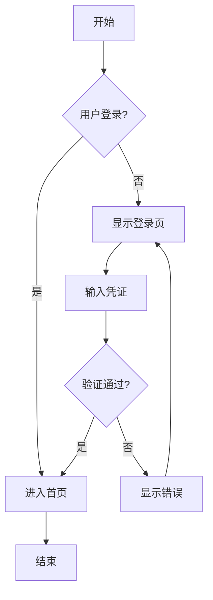

# 需求建模参考

本文档提供需求分析师在需求建模、用例分析和流程设计时的标准模板和最佳实践。

## 📋 需求规格说明书模板

### SRS（Software Requirements Specification）

```markdown
# 软件需求规格说明书

## 文档信息

- **项目名称**：[项目名称]
- **版本**：v1.0
- **编写日期**：[YYYY-MM-DD]
- **作者**：[需求分析师姓名]
- **审核人**：[审核人姓名]

---

## 1. 引言

### 1.1 目的

[说明本文档的目的和预期读者]

### 1.2 范围

[定义软件产品的范围，包括将做什么和不做什么]

### 1.3 定义和缩略语

| 术语   | 定义   |
| ------ | ------ |
| [术语] | [定义] |

### 1.4 参考文献

- [参考文档1]
- [参考文档2]

---

## 2. 总体描述

### 2.1 产品愿景

[描述产品要解决的问题和目标]

### 2.2 产品功能概述

[高层次的功能列表]

### 2.3 用户类型

| 用户类型 | 描述   | 权限级别 |
| -------- | ------ | -------- |
| [用户1]  | [描述] | [权限]   |

### 2.4 运行环境

[描述软件运行的技术环境]

### 2.5 约束条件

[技术约束、业务约束、法规约束等]

### 2.6 假设和依赖

[列出所有假设条件和外部依赖]

---

## 3. 功能需求

### 3.1 [功能模块1]

#### 3.1.1 [功能点1]

- **需求ID**：REQ-[模块]-[编号]
- **优先级**：高/中/低
- **描述**：[功能描述]
- **触发条件**：[什么情况下触发]
- **前置条件**：[执行前需要满足的条件]
- **基本流程**：

  1. [步骤1]

  2. [步骤2]
- **替代流程**：[异常情况处理]
- **后置条件**：[执行后的状态]
- **验收标准**：
  - [ ] [标准1]
  - [ ] [标准2]

---

## 4. 非功能需求

### 4.1 性能需求

| 指标     | 要求   | 度量方法 |
| -------- | ------ | -------- |
| 响应时间 | [X]秒  | [方法]   |
| 吞吐量   | [X]/秒 | [方法]   |

### 4.2 安全需求

[安全相关需求]

### 4.3 可用性需求

[可用性相关需求]

### 4.4 可维护性需求

[可维护性相关需求]

---

## 5. 接口需求

### 5.1 用户接口

[UI相关需求]

### 5.2 软件接口

[与其他系统的接口]

### 5.3 硬件接口

[硬件相关接口]

---

## 6. 数据需求

### 6.1 数据字典

[主要数据实体定义]

### 6.2 数据流图

[数据流向描述]

---

## 附录

### A. 用例图

[用例图]

### B. 业务流程图

[流程图]

### C. 数据模型

[ER图或类图]

```

## 🎯 用例建模

### 用例描述模板

```markdown
# 用例：[用例名称]

## 基本信息

- **用例ID**：UC-[编号]
- **用例名称**：[名称]
- **参与者**：[主要参与者]
- **优先级**：高/中/低
- **复杂度**：高/中/低

## 简要描述

[一句话描述用例目的]

## 前置条件

- [条件1]
- [条件2]

## 后置条件

### 成功后置条件

- [成功后的状态]

### 失败后置条件

- [失败后的状态]

## 基本流程（Main Success Scenario）

| 步骤 | 参与者动作 | 系统响应 |
| ---- | ---------- | -------- |
| 1    | [动作]     | [响应]   |
| 2    | [动作]     | [响应]   |
| 3    | [动作]     | [响应]   |

## 扩展流程（Extensions）

### 2a. [异常情况描述]

| 步骤 | 处理               |
| ---- | ------------------ |
| 2a.1 | [处理步骤]         |
| 2a.2 | [返回主流程或结束] |

## 特殊需求

- [非功能需求1]
- [非功能需求2]

## 业务规则

- BR-001: [规则描述]
- BR-002: [规则描述]

## 关联用例

- 包含：[被包含的用例]
- 扩展：[扩展的用例]
- 泛化：[父用例]

```

### 用户故事映射

```table
┌─────────────────────────────────────────────────────────────────┐
│                        用户活动（Activities）                    │
├─────────────────────────────────────────────────────────────────┤
│   浏览商品    │    下单购买    │    支付结算    │    查看订单    │
├───────────────┼────────────────┼────────────────┼────────────────┤
│               │                │                │                │
│   搜索商品    │    加入购物车  │    选择支付    │    订单列表    │
│   分类浏览    │    修改数量    │    确认支付    │    订单详情    │
│   商品详情    │    选择规格    │    支付成功    │    取消订单    │
│   收藏商品    │    提交订单    │    支付失败    │    评价订单    │
│               │                │                │                │
├───────────────┴────────────────┴────────────────┴────────────────┤
│ Release 1 ─────────────────────────────────────────────────────  │
│   搜索商品、商品详情、加入购物车、提交订单、选择支付、订单列表    │
├──────────────────────────────────────────────────────────────────┤
│ Release 2 ─────────────────────────────────────────────────────  │
│   分类浏览、收藏商品、修改数量、选择规格、订单详情                │
├──────────────────────────────────────────────────────────────────┤
│ Release 3 ─────────────────────────────────────────────────────  │
│   取消订单、评价订单                                             │
└──────────────────────────────────────────────────────────────────┘

```

## 🔄 业务流程建模

### BPMN 流程描述模板

```markdown
# 业务流程：[流程名称]

## 流程概述

- **流程ID**：BPM-[编号]
- **流程目的**：[目的描述]
- **触发事件**：[什么事件触发此流程]
- **参与角色**：[参与的角色列表]

## 流程步骤

### 阶段1：[阶段名称]

| 序号 | 活动     | 负责角色 | 输入     | 输出     | 规则/说明 |
| ---- | -------- | -------- | -------- | -------- | --------- |
| 1.1  | [活动名] | [角色]   | [输入物] | [输出物] | [规则]    |
| 1.2  | [活动名] | [角色]   | [输入物] | [输出物] | [规则]    |

### 决策点

| 条件    | 走向      |
| ------- | --------- |
| [条件1] | 转到步骤X |
| [条件2] | 转到步骤Y |
| [其他]  | 转到步骤Z |

## 异常处理

| 异常情况 | 处理方式   |
| -------- | ---------- |
| [异常1]  | [处理方式] |
| [异常2]  | [处理方式] |

## 流程图

[ASCII 或 Mermaid 流程图]

```

### 流程图示例（Mermaid）



## 📊 数据建模

### 实体关系描述

```markdown
# 实体：[实体名称]

## 实体描述

[描述这个实体代表什么]

## 属性列表

| 属性名     | 数据类型    | 必填 | 主键 | 说明     |
| ---------- | ----------- | ---- | ---- | -------- |
| id         | Long        | 是   | 是   | 唯一标识 |
| name       | String(100) | 是   | 否   | 名称     |
| created_at | DateTime    | 是   | 否   | 创建时间 |

## 关系

| 关联实体 | 关系类型 | 说明       |
| -------- | -------- | ---------- |
| [实体B]  | 1:N      | [关系说明] |
| [实体C]  | N:M      | [关系说明] |

## 业务规则 (重复2)

- [规则1]
- [规则2]

```

### 数据字典模板

```markdown
# 数据字典

## [模块名称]

### [数据表/实体名]

| 字段名     | 中文名   | 类型     | 长度 | 允许空 | 默认值            | 说明          |
| ---------- | -------- | -------- | ---- | ------ | ----------------- | ------------- |
| user_id    | 用户ID   | bigint   | 20   | 否     | -                 | 主键，自增    |
| username   | 用户名   | varchar  | 50   | 否     | -                 | 唯一索引      |
| email      | 邮箱     | varchar  | 100  | 是     | NULL              | 格式校验      |
| status     | 状态     | tinyint  | 1    | 否     | 1                 | 1:启用 0:禁用 |
| created_at | 创建时间 | datetime | -    | 否     | CURRENT_TIMESTAMP | -             |

```

## ✅ 需求验证清单

### 需求质量检查

| 检查项   | 标准                       | 通过 |
| -------- | -------------------------- | ---- |
| 完整性   | 所有功能点都有详细描述     | □    |
| 一致性   | 需求之间无矛盾             | □    |
| 可验证性 | 每个需求都可以被测试验证   | □    |
| 可追踪性 | 需求可追溯到业务目标       | □    |
| 无歧义性 | 需求描述清晰，只有一种理解 | □    |
| 必要性   | 每个需求都是必要的         | □    |
| 可行性   | 技术上可实现               | □    |
| 优先级   | 所有需求都有优先级         | □    |

### INVEST 原则检查（用户故事）

| 原则            | 含义     | 检查问题                   |
| --------------- | -------- | -------------------------- |
| **I**ndependent | 独立的   | 这个故事能独立交付价值吗？ |
| **N**egotiable  | 可协商的 | 细节是否可以讨论调整？     |
| **V**aluable    | 有价值的 | 对用户或业务有明确价值吗？ |
| **E**stimable   | 可估算的 | 能估算工作量吗？           |
| **S**mall       | 小的     | 能在一个迭代内完成吗？     |
| **T**estable    | 可测试的 | 有明确的验收标准吗？       |

## 🔗 需求追踪矩阵

```markdown
| 业务目标 | 需求ID  | 需求描述 | 用例ID | 测试用例ID | 状态   |
| -------- | ------- | -------- | ------ | ---------- | ------ |
| BG-001   | REQ-001 | [描述]   | UC-001 | TC-001,002 | 已实现 |
| BG-001   | REQ-002 | [描述]   | UC-002 | TC-003     | 开发中 |
| BG-002   | REQ-003 | [描述]   | UC-003 | -          | 待开发 |

```
