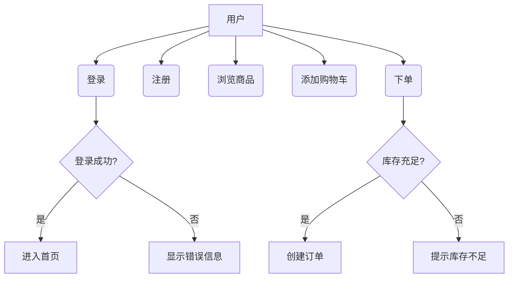
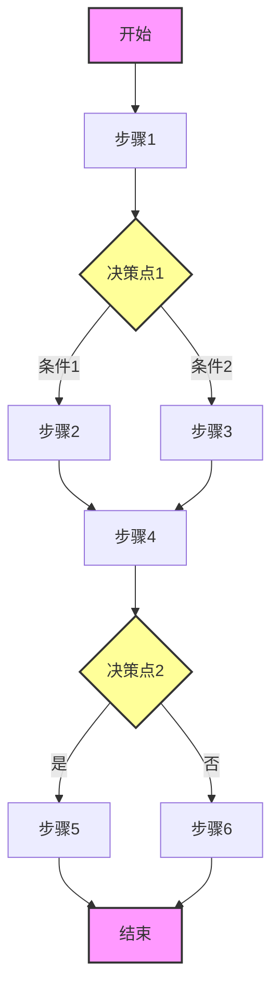
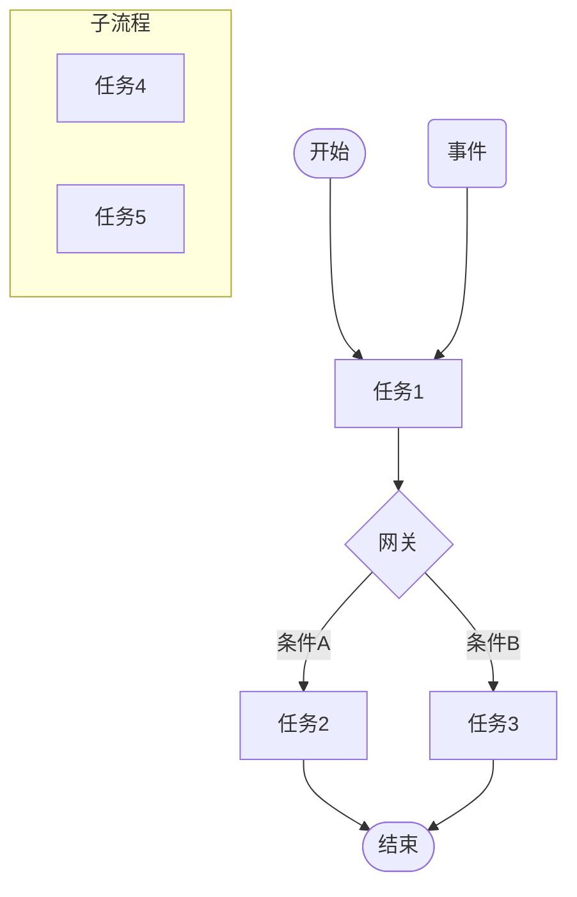

# 需求规格说明书模板

本文档提供需求分析师使用的需求规格说明书模板。

## 需求规格说明书（SRS）模板

### 文档信息

```markdown
# 需求规格说明书

**项目名称**：
**文档版本**：v1.0
**编写日期**：YYYY-MM-DD
**编写人**：
**审核人**：
**批准人**：

```

### 1. 引言

#### 1.1 编写目的

说明编写本文档的目的、预期读者和使用场景。

#### 1.2 项目背景

说明项目的起源、背景和目标。

- 业务背景
- 现状分析
- 项目目标
- 项目范围

#### 1.3 术语和缩略语

| 术语/缩略语 | 全称 | 说明 |
|------------|------|------|
|            |      |      |

#### 1.4 参考资料

| 文档名称 | 版本 | 来源 |
|----------|------|------|
|          |      |      |

### 2. 总体描述

#### 2.1 产品概述

#### 2.2 用户特征

| 用户角色 | 描述 | 使用频率 | 关键需求 |
|----------|------|----------|----------|
|          |      |          |          |

#### 2.3 业务流程

### 3. 功能需求

#### 3.1 功能模块1

**功能描述**：

**用户故事**：
作为[角色]，我想要[功能]，以便[价值]。

**功能优先级**：P0/P1/P2/P3

**前置条件**：

- [ ] 条件1
- [ ] 条件2

**输入**：

- 字段1：
- 字段2：

**处理**：

- 步骤1：
- 步骤2：

**输出**：

- 结果1：
- 结果2：

**验收标准**：

- **AC1**: Given [前置条件]，When [操作]，Then [结果]
- **AC2**: Given [前置条件]，When [操作]，Then [结果]
- **AC3**: Given [前置条件]，When [操作]，Then [结果]

**异常处理**：

- 场景1：
- 场景2：

#### 3.2 功能模块2

（重复上述结构）

### 4. 非功能需求

#### 4.1 性能需求

- 响应时间：
- 吞吐量：
- 并发用户数：
- 可用性：

#### 4.2 安全需求

- 认证：
- 授权：
- 数据加密：
- 审计日志：

#### 4.3 可用性需求

- 界面友好性：
- 操作简便性：
- 错误提示：

#### 4.4 可靠性需求

- 系统稳定性：
- 故障恢复：
- 数据备份：

#### 4.5 兼容性需求

- 浏览器兼容性：
- 操作系统兼容性：
- 设备兼容性：

#### 4.6 可维护性需求

- 代码可读性：
- 模块化设计：
- 文档完整性：

#### 4.7 可扩展性需求

- 功能扩展性：
- 性能扩展性：
- 集成扩展性：

### 5. 数据需求

#### 5.1 数据实体

| 实体 | 属性 | 类型 | 说明 |
|------|------|------|------|
|      |      |      |      |

#### 5.2 数据字典

| 字段名 | 类型 | 长度 | 是否必填 | 说明 |
|--------|------|------|----------|------|
|        |      |      |          |      |

#### 5.3 数据流

### 6. 界面需求

#### 6.1 界面原型

（插入界面截图或原型链接）

#### 6.2 交互流程

### 7. 接口需求

#### 7.1 系统内接口

| 接口名称 | 调用方 | 提供方 | 说明 |
|----------|--------|--------|------|
|          |        |        |      |

#### 7.2 外部接口

| 接口名称 | 供应商 | 协议 | 说明 |
|----------|--------|------|------|
|          |        |      |      |

### 8. 约束条件

#### 8.1 技术约束

- 编程语言：
- 框架：
- 数据库：
- 第三方库：

#### 8.2 业务约束

- 法规要求：
- 合规要求：
- 业务规则：

#### 8.3 时间约束

- 上线时间：
- 阶段性交付时间：

#### 8.4 资源约束

- 人力资源：
- 预算限制：
- 硬件资源：

### 9. 风险分析

| 风险 | 可能性 | 影响程度 | 应对措施 |
|------|--------|----------|----------|
|      |        |          |          |

### 10. 附录

#### 10.1 需求追溯矩阵

| 需求ID | 需求描述 | 用户故事 | 优先级 | 状态 |
|--------|----------|----------|--------|------|
|        |          |          |        |      |

#### 10.2 变更记录

| 版本 | 日期 | 变更内容 | 变更人 | 审核人 |
|------|------|----------|--------|--------|
|      |      |          |        |        |

## 用例图模板

### 用例描述模板

```markdown
## 用例名称：[用例名称]

### 基本信息

- **用例ID**：UC-XXX
- **优先级**：高/中/低
- **状态**：草稿/评审/批准
- **创建日期**：YYYY-MM-DD
- **最后更新**：YYYY-MM-DD

### 描述

[用例的简要描述，说明用户通过这个用例要达到什么目标]

### 参与者

| 参与者 | 角色 | 描述 |
|--------|------|------|
|        |      |      |

### 前置条件

- [ ] 条件1
- [ ] 条件2

### 后置条件

- [ ] 条件1
- [ ] 条件2

### 主流程（Happy Path）

| 步骤 | 动作 | 系统响应 |
|------|------|----------|
| 1 | [用户动作] | [系统响应] |
| 2 | [用户动作] | [系统响应] |
| 3 | [用户动作] | [系统响应] |

### 替代流程

**场景1**：[场景描述]

| 步骤 | 动作 | 系统响应 |
|------|------|----------|
| 1 | [用户动作] | [系统响应] |
| 2 | [用户动作] | [系统响应] |

**场景2**：[场景描述]

[重复上述表格]

### 异常流程

**异常1**：[异常描述]

| 步骤 | 动作 | 系统响应 |
|------|------|----------|
| 1 | [用户动作] | [系统响应] |
| 2 | [用户动作] | [系统响应] |

### 业务规则

- [ ] 规则1
- [ ] 规则2

### UI需求

[界面截图或描述]

### 需求追溯

| 相关需求 | 说明 |
|----------|------|
|          |      |

### 备注

[其他说明]

```

### 用例图绘制指南

#### Mermaid示例



#### 绘制要点

1. **参与者（Actor）**
   - 用人形图标表示
   - 放在图的左侧或右侧
   - 可以是用户、外部系统等

2. **用例（Use Case）**
   - 用椭圆表示
   - 用动宾短语命名（如"登录用户"）
   - 中心对齐

3. **关系**
   - **关联（Association）**：参与者与用例之间的连接
   - **包含（Include）**：用虚线箭头，标注`<<include>>`
   - **扩展（Extend）**：用虚线箭头，标注`<<extend>>`
   - **泛化（Generalization）**：用实线箭头，空心三角

## 业务流程图模板

### 业务流程描述模板

```markdown
## 业务流程名称：[流程名称]

### 基本信息

- **流程ID**：BP-XXX
- **负责人**：
- **创建日期**：YYYY-MM-DD
- **最后更新**：YYYY-MM-DD

### 流程目标

[描述流程要达成的目标]

### 流程范围

- **起点**：
- **终点**：
- **涉及部门/角色**：

### 流程图

[Mermaid流程图或截图]

### 流程步骤

| 步骤 | 角色 | 动作 | 系统响应 | 输出 |
|------|------|------|----------|------|
| 1 |     |      |          |      |
| 2 |     |      |          |      |
| 3 |     |      |          |      |

### 决策点

| 决策点 | 条件 | 分支 |
|--------|------|------|
|        |      |      |

### 异常处理

| 异常场景 | 处理方式 | 责任人 |
|----------|----------|--------|
|          |          |        |

### 业务规则

- [ ] 规则1
- [ ] 规则2

### 相关文档

- 需求文档：
- 用例文档：
- 接口文档：

### 备注

[其他说明]

```

### 流程图Mermaid模板



### BPMN模板



## 需求验证清单

### 完整性检查

- [ ] 所有用户角色都已识别
- [ ] 所有功能需求都已描述
- [ ] 所有非功能需求都已定义
- [ ] 所有数据需求都已明确
- [ ] 所有接口需求都已说明
- [ ] 所有约束条件都已列出

### 正确性检查

- [ ] 需求描述清晰无歧义
- [ ] 业务流程逻辑正确
- [ ] 数据流正确无误
- [ ] 用例场景完整

### 一致性检查

- [ ] 需求之间没有冲突
- [ ] 需求与业务目标一致
- [ ] 用例与需求对应
- [ ] 数据字典与数据实体一致

### 可验证性检查

- [ ] 每个需求都有验收标准
- [ ] 验收标准明确可测试
- [ ] 需求可以量化或可观察

### 可追踪性检查

- [ ] 需求ID唯一
- [ ] 需求追溯到用户故事
- [ ] 需求追溯到用例
- [ ] 需求追溯到测试用例

### 优先级检查

- [ ] 所有需求都有优先级
- [ ] 优先级评估合理
- [ ] P0需求数量合理

## 需求分析最佳实践

### 1. 需求收集

- 从多个渠道收集需求
- 区分显性需求和隐性需求
- 关注业务价值而非技术实现
- 保持开放心态

### 2. 需求分析

- 使用结构化方法（用例、流程图）
- 识别需求之间的依赖关系
- 评估需求的可行性和风险
- 优先级评估

### 3. 需求文档

- 使用清晰、简洁的语言
- 提供具体示例
- 使用图表辅助说明
- 保持文档更新

### 4. 需求验证

- 与用户确认需求理解
- 通过原型验证需求
- 审查需求的完整性和一致性
- 确保需求可测试
