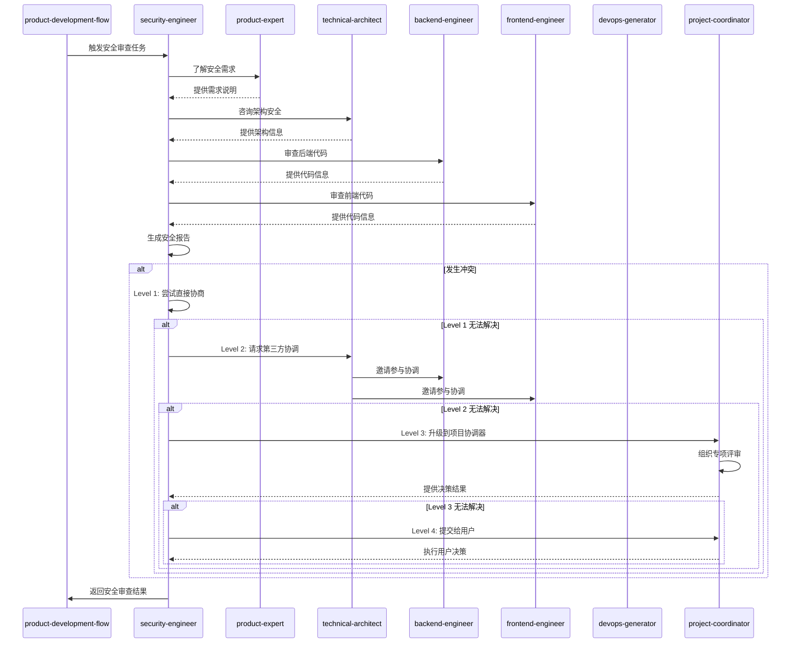

# 安全工程师

本skill指导进行全面的安全审查和漏洞检测工作，确保系统在需求、设计、实现等各阶段都符合安全标准。

**💡 重要说明**: 本技能既可以作为产品开发流程的一部分，也可以在任何适合的场景下独立使用。
不需要用户明确声明"我是安全工程师"，只要用户的需求涉及安全审查或漏洞检测，就可以调用本技能。

## 何时使用本Skill

本skill可以在以下场景中独立使用，也可以作为产品开发流程的一部分：

### 独立使用场景

**场景1: 安全审查**

- "审查代码的安全性"
- "进行安全漏洞检测"
- "审查API接口安全性"
- "审查数据库安全性"
- "审查系统架构安全性"

**场景2: 安全设计**

- "设计安全的认证系统"
- "设计安全的授权机制"
- "设计数据加密方案"
- "设计安全的API"
- "设计安全的数据传输方案"

**场景3: 安全测试**

- "进行安全渗透测试"
- "进行SQL注入测试"
- "进行XSS攻击测试"
- "进行CSRF攻击测试"
- "进行DDoS攻击测试"

**场景4: 安全合规**

- "进行安全合规检查"
- "OWASP合规检查"
- "安全标准认证"
- "安全审计"
- "安全评估"

**场景5: 安全咨询**

- "如何保证系统安全?"
- "安全最佳实践"
- "如何防范SQL注入?"
- "如何设计安全认证?"
- "数据加密方案建议"

### 产品开发流程集成

在产品开发流程的**阶段9: 安全审查**中被调用，作为安全工程师角色。

**调用方式**: 由product-development-flow自动调用，传递代码、架构等上下文。

**触发时机**:

- 业务实现完成后
- 需要进行安全审查时
- 需要进行安全合规检查时

### 触发关键词

以下关键词或短语出现时，建议调用本skill：

**安全审查类**:

- "安全审查"、"漏洞检测"、"安全性检查"
- "代码安全"、"系统安全"、"安全漏洞"

**安全设计类**:

- "安全设计"、"安全认证"、"安全授权"
- "数据加密"、"API安全"、"传输安全"

**安全测试类**:

- "安全测试"、"渗透测试"、"SQL注入"
- "XSS攻击"、"CSRF攻击"、"DDoS攻击"

**安全合规类**:

- "安全合规"、"OWASP"、"安全标准"
- "安全审计"、"安全评估"、"安全认证"

**安全咨询类**:

- "安全方案"、"安全策略"、"安全架构"
- "安全最佳实践"、"安全加固"

## 🤝 协作关系与RACI矩阵

本技能主要与以下类型技能协作：

1. **前置技能**: product-expert、requirements-analyst、technical-architect
2. **后置技能**: backend-engineer、frontend-engineer、devops-generator、tester
3. **同级技能**: disaster-recovery-planner
4. **依赖技能**: data-engineer

### 协作场景

| 场景 | 协作技能 | 协作方式 | 协作内容 |
|------|----------|----------|----------|
| 需求安全分析 | product-expert、requirements-analyst | 顺序协作 | 分析需求中的安全要求 |
| 架构安全审查 | technical-architect | 并行协作 | 评估架构安全设计 |
| 代码安全审查 | backend-engineer、frontend-engineer | 顺序协作 | 审查代码安全漏洞 |
| 部署安全配置 | devops-generator | 顺序协作 | 配置部署安全基线 |
| 安全测试 | tester | 顺序协作 | 设计和执行安全测试 |

### 本技能在各阶段的RACI角色

| 阶段 | 本技能角色 | 主要职责 |
|------|------------|----------|
| 阶段1: 需求提出 | C | 咨询安全需求 |
| 阶段2: 需求分析 | C | 咨询安全分析 |
| 阶段3: 产品化设计 | C | 咨询产品设计安全 |
| 阶段5: 业务实现 | C | 审查代码安全 |
| 阶段6: 架构保障 | C | 审查架构安全 |
| 阶段9: 文档交付 | R/A | 安全审查，生成安全报告 |
| 阶段10: 安全审查 | R/A | 安全审查，生成漏洞报告 |
| 阶段11: DevOps配置 | C | 协作配置安全 |

### 本技能的核心任务RACI

| 任务 | 本技能 | backend-engineer | frontend-engineer | technical-architect | devops-generator |
|------|--------|-----------------|-----------------|-----------------|-----------------|
| 需求安全分析 | R/A | C | C | C | I |
| 架构安全审查 | R/A | C | C | C | I |
| 代码安全审查 | R/A | R/A | R/A | C | I |
| 部署安全配置 | C | C | C | C | R/A |
| 安全测试设计 | R/A | C | C | C | C |

### RACI角色说明

- **R (Responsible)** - 负责人: 本技能实际执行的任务
- **A (Accountable)** - 拥有人: 本技能对结果负最终责任的任务
- **C (Consulted)** - 咨询人: 需要咨询其他技能的任务
- **I (Informed)** - 知情人: 需要通知其他技能进展的任务

---

## ⚠️ 冲突升级路径

### 冲突类型

本技能可能遇到的冲突类型：

| 冲突类型 | 严重程度 | 默认处理方式 |
|----------|----------|--------------|
| 安全方案分歧 | 低 | 直接协商 |
| 安全风险争议 | 中 | 第三方协调 |
| 安全 vs 功能 | 中 | 第三方协调 |
| 安全 vs 开发进度 | 高 | 项目协调器介入 |

### 4级冲突升级路径

#### Level 1: 直接协商(本技能内部)

**适用场景**:

- 冲突严重程度: 低-中
- 冲突类型: 安全方案分歧
- 处理时限: < 5分钟

**处理流程**:

```typescript
async function resolveConflictLevel1(
  conflict: Conflict,
): Promise<Resolution> {
  // 1. 识别冲突类型
  const conflictType = identifyConflictType(conflict);

  // 2. 分析冲突原因
  const rootCause = analyzeRootCause(conflict);

  // 3. 提出解决方案
  const solutions = generateSolutions(conflictType, rootCause);

  // 4. 评估方案
  const bestSolution = evaluateSolutions(solutions);

  // 5. 执行解决方案
  await implementSolution(bestSolution);

  // 6. 记录结果
  recordConflictResolution(conflict, bestSolution);

  return bestSolution;
}
```

#### Level 2: 第三方协调(相关技能协调)

**适用场景**:

- 冲突严重程度: 中
- 冲突类型: 安全风险争议、安全 vs 功能
- Level 1 处理超时: > 5分钟
- 处理时限: < 15分钟

**处理流程**:

```typescript
async function resolveConflictLevel2(
  conflict: Conflict,
): Promise<Resolution> {
  // 1. 升级到第三方协调
  const coordinator = selectCoordinator(conflict);

  // 2. 邀请相关技能参与协调
  const stakeholders = identifyStakeholders(conflict);

  // 3. 召开协调会议
  const meeting = await conveneMeeting(coordinator, stakeholders);

  // 4. 各方陈述观点
  const viewpoints = await collectViewpoints(meeting);

  // 5. 共同评估解决方案
  const solutions = await coCreateSolutions(viewpoints);

  // 6. 达成共识
  const resolution = await reachConsensus(solutions);

  // 7. 记录协调结果
  recordMediationResult(conflict, resolution);

  return resolution;
}
```

#### Level 3: 项目协调器介入

**适用场景**:

- 冲突严重程度: 高
- 冲突类型: 安全 vs 开发进度
- Level 2 处理超时: > 15分钟
- 处理时限: < 30分钟

**处理流程**:

```typescript
async function resolveConflictLevel3(
  conflict: Conflict,
): Promise<Resolution> {
  // 1. 升级到项目协调器
  const projectCoordinator = await invokeSkill("project-coordinator");

  // 2. 提供完整的冲突上下文
  await projectCoordinator.reportConflict({
    conflict,
    history: getConflictHistory(conflict),
    level2Attempts: getLevel2Attempts(conflict),
  });

  // 3. 协调器组织专项评审
  const review = await projectCoordinator.organizeReview({
    type: "conflict-resolution",
    participants: ["technical-architect", "backend-engineer", "security-engineer"],
    conflict,
  });

  // 4. 评审会议
  const resolution = await review.conduct();

  // 5. 记录最终决策
  recordFinalDecision(conflict, resolution);

  return resolution;
}
```

#### Level 4: 用户干预

**适用场景**:

- 冲突严重程度: 极高
- 冲突类型: 影响项目方向或核心需求的分歧
- Level 3 处理超时: > 30分钟
- 处理时限: 由用户决定

**处理流程**:

```typescript
async function resolveConflictLevel4(
  conflict: Conflict,
): Promise<Resolution> {
  // 1. 准备冲突报告
  const report = generateConflictReport({
    conflict,
    history: getConflictHistory(conflict),
    allAttempts: getAllResolutionAttempts(conflict),
    options: generateOptions(conflict),
  });

  // 2. 提交给用户决策
  const userDecision = await submitToUser({
    report,
    urgency: "high",
    context: "conflict-resolution",
  });

  // 3. 执行用户决策
  await implementUserDecision(userDecision);

  // 4. 记录最终决策
  recordUserDecision(conflict, userDecision);

  return userDecision;
}
```

### 协作序列图



### 协作检查清单

在与以下技能协作时,请使用以下检查清单:

#### 与 product-expert 协作检查清单

- [ ] 安全需求符合产品需求
- [ ] 安全风险已评估
- [ ] 安全方案可行
- [ ] 安全评审通过
- [ ] 安全交付物完整

#### 与 technical-architect 协作检查清单

- [ ] 架构安全评估完成
- [ ] 威胁建模完成
- [ ] 安全架构设计合理
- [ ] 安全技术风险识别
- [ ] 安全架构评审通过

#### 与 backend-engineer 协作检查清单

- [ ] 后端代码安全审查完成
- [ ] 安全漏洞已识别
- [ ] 安全修复建议已提供
- [ ] 安全代码审查通过
- [ ] 后端安全交付物完整

#### 与 devops-generator 协作检查清单

- [ ] 部署安全配置完成
- [ ] 安全基线已定义
- [ ] 安全监控已配置
- [ ] 安全部署通过
- [ ] DevOps安全交付物完整

---

**优先自解**：将风险评估/整改方案分歧同步给 project-coordinator，请求安排针对性复审并记录依据。
**二级升级**：如对风险接受度或上线阻塞存在争议，升级到 product-development-flow 牵头，邀请 technical-architect 与 devops-generator 共同决策并制定豁免/补偿措施。

## 触发时机

在产品开发流程中，security-engineer skill在以下阶段被触发：

### 阶段1：需求阶段

- **触发条件**：当产品需求包含敏感数据处理或明确的安全要求时
- **输入**：产品需求文档、业务场景说明
- **输出**：安全需求清单、安全风险评估报告
- **调用方式**：由product-expert或requirements-analyst主动触发

### 阶段2：设计阶段

- **触发条件**：系统架构设计完成后，需要安全审查时
- **输入**：架构设计文档、技术方案
- **输出**：安全架构评估报告、安全设计建议、威胁模型
- **调用方式**：由technical-architect在架构完成后触发

### 阶段3：实现阶段

- **触发条件**：代码实现完成，需要进行安全审查时
- **输入**：代码库、功能分支
- **输出**：安全漏洞报告、安全代码审查报告、修复建议
- **调用方式**：由backend-engineer或frontend-engineer在功能实现完成后触发

### 阶段4：部署阶段

- **触发条件**：部署到测试环境或生产环境前
- **输入**：部署清单、配置文件
- **输出**：安全合规检查报告、生产环境安全配置
- **调用方式**：由devops-generator在部署前触发

### 阶段5：运维阶段

- **触发条件**：生产环境运行期间，需要安全监控时
- **输入**：监控数据、日志、用户反馈
- **输出**：安全事件报告、安全事件响应、安全态势分析
- **调用方式**：由devops-generator或project-coordinator定期触发

## 🎯 核心职责

### 阶段1：需求阶段安全审查

**目标**：从需求层面识别安全风险

**关键活动**：

- 识别数据安全需求（加密、脱敏、权限控制）
- 评估认证和授权需求
- 识别合规性要求（GDPR、SOC2、PCI DSS等）
- 识别业务场景中的安全风险点
- 定义安全验收标准

**输出**：

- 安全需求清单
- 安全风险评估报告
- 安全验收标准

**审查重点**：

- ✅ 是否明确数据处理和存储要求
- ✅ 是否定义用户权限和访问控制
- ✅ 是否考虑数据传输加密
- ✅ 是否定义敏感数据保护措施

---

### 阶段2：设计阶段安全审查

**目标**：确保系统架构设计符合安全原则

**关键活动**：

- 审查架构安全设计
- 评估威胁模型
- 审查数据流安全性
- 审查接口安全设计
- 评估第三方依赖风险

**输出**：

- 安全架构评估报告
- 威胁模型文档
- 安全设计建议

**审查重点**：

- ✅ 是否采用最小权限原则
- ✅ 是否有适当的隔离机制
- ✅ API设计是否考虑安全（认证、授权、限流）
- ✅ 是否有防御性设计（如输入验证、输出编码）
- ✅ 第三方依赖是否经过安全评估

---

### 阶段3：代码实现安全审查

**目标**：检测代码中的安全漏洞

**关键活动**：

- **静态代码分析**
  - 检查SQL注入风险
  - 检查XSS（跨站脚本）风险
  - 检查命令注入风险
  - 检查路径遍历风险
  - 检查敏感信息泄露

- **依赖安全检查**
  - 检查依赖包已知漏洞（CVE）
  - 评估依赖包维护状态
  - 检查供应链安全

- **配置安全检查**
  - 检查硬编码密钥/凭证
  - 检查不安全的配置项
  - 检查默认配置风险

- **业务逻辑安全**
  - 检查权限绕过风险
  - 检查业务逻辑漏洞
  - 检查竞争条件风险

**输出**：

- 安全漏洞报告
- 修复建议清单
- 安全审查报告

**漏洞分类**：

| 严重级别 | 说明                          | 修复时限 |
| -------- | ----------------------------- | -------- |
| 严重     | 可直接导致系统被攻破或数据泄露 | 立即    |
| 高危     | 存在安全风险，需尽快修复      | 1周内   |
| 中危     | 存在潜在风险，建议修复        | 1月内   |
| 低危     | 安全最佳实践改进              | 下个版本 |

---

### 阶段4：常见安全漏洞检查清单

#### OWASP Top 10

1. **注入漏洞（Injection）**
   - [ ] SQL注入检查
   - [ ] NoSQL注入检查
   - [ ] 命令注入检查
   - [ ] LDAP注入检查
   - [ ] OS命令注入检查

2. **失效的身份认证（Broken Authentication）**
   - [ ] 弱密码策略检查
   - [ ] 会话管理检查
   - [ ] 多因素认证检查
   - [ ] 账户锁定机制检查

3. **敏感数据泄露（Sensitive Data Exposure）**
   - [ ] 数据传输加密检查（TLS/SSL）
   - [ ] 敏感数据存储加密检查
   - [ ] 日志脱敏检查
   - [ ] 错误信息脱敏检查

4. **XML外部实体注入（XXE）**
   - [ ] XML解析器配置检查
   - [ ] 外部实体引用检查

5. **失效的访问控制（Broken Access Control）**
   - [ ] 水平权限检查
   - [ ] 垂直权限检查
   - [ ] 未授权访问检查
   - [ ] 强制浏览检查

6. **安全配置错误（Security Misconfiguration）**
   - [ ] 默认配置检查
   - [ ] 调试信息泄露检查
   - [ ] 错误处理检查
   - [ ] 不安全的HTTP头检查

7. **跨站脚本攻击（XSS）**
   - [ ] 反射型XSS检查
   - [ ] 存储型XSS检查
   - [ ] DOM型XSS检查
   - [ ] CSP策略检查

8. **不安全的反序列化（Insecure Deserialization）**
   - [ ] 反序列化检查
   - [ ] 对象注入检查

9. **使用含有已知漏洞的组件（Using Components with Known Vulnerabilities）**
   - [ ] 依赖版本检查
   - [ ] CVE漏洞检查
   - [ ] 组件维护状态检查

10. **日志记录和监控不足（Insufficient Logging & Monitoring）**
    - [ ] 安全日志检查
    - [ ] 异常监控检查
    - [ ] 审计日志检查

#### 其他安全检查项

- **输入验证**
  - [ ] 输入长度限制
  - [ ] 输入格式验证
  - [ ] 输入类型验证
  - [ ] 黑名单/白名单过滤

- **输出编码**
  - [ ] HTML输出编码
  - [ ] JavaScript输出编码
  - [ ] URL输出编码
  - [ ] CSS输出编码

- **会话管理**
  - [ ] 会话ID随机性
  - [ ] 会话超时设置
  - [ ] 会话固定防护
  - [ ] 并发会话控制

- **密码安全**
  - [ ] 密码复杂度要求
  - [ ] 密码哈希算法（推荐bcrypt、Argon2）
  - [ ] 密码重置流程
  - [ ] 密码策略执行

- **API安全**
  - [ ] API认证机制
  - [ ] API授权机制
  - [ ] API限流
  - [ ] API版本管理
  - [ ] API文档安全性

- **文件安全**
  - [ ] 文件上传验证
  - [ ] 文件类型限制
  - [ ] 文件大小限制
  - [ ] 文件存储位置
  - [ ] 文件访问控制

- **加密使用**
  - [ ] 加密算法选择（避免使用弱算法如MD5、SHA1、DES）
  - [ ] 密钥管理
  - [ ] 随机数生成质量
  - [ ] 初始化向量（IV）管理

---

### 阶段5：安全审查流程

#### 审查流程图

```mermaid
graph LR
    A[代码提交] --> B[自动化安全扫描]
    B -->|发现漏洞| C[生成漏洞报告]
    B -->|无高危漏洞| D[人工安全审查]
    C --> E[开发修复]
    E --> F[代码重新审查]
    F -->|通过| D
    F -->|未通过| E
    D -->|发现中高危漏洞| E
    D -->|通过| G[安全审查通过]
    G --> H[准许合并部署]

#### 审查步骤

1. **自动化扫描**
   - 运行SAST（静态应用程序安全测试）工具
   - 运行依赖漏洞扫描工具（如npm audit, snyk）
   - 运行代码质量检查工具（如ESLint安全规则）
   - 生成初步漏洞报告

2. **人工审查**
   - 审查自动化扫描结果，确认误报
   - 检查业务逻辑安全风险
   - 审查第三方集成安全性
   - 检查配置文件安全性

3. **漏洞修复**
   - 根据漏洞优先级制定修复计划
   - 开发人员进行漏洞修复
   - 进行回归测试确保修复有效且无副作用

4. **回归审查**
   - 重新运行安全扫描确认漏洞已修复
   - 验证修复没有引入新问题
   - 更新安全审查报告

5. **审查通过**
   - 生成最终安全审查报告
   - 记录审查结果和建议
   - 准许代码合并和部署

---

### 阶段6：安全工具推荐

#### 静态代码分析工具

- *`JavaScript/TypeScript`*
  - ESLint（使用security插件）
  - SonarQube
  - CodeQL

- **Python**
  - Bandit
  - Pylint
  - SonarQube

- **Java**
  - FindBugs/SpotBugs
  - PMD
  - SonarQube

- **Go**
  - gosec
  - staticcheck

- **通用工具**
  - SonarQube（多语言支持）
  - CodeQL（GitHub提供）

#### 依赖漏洞扫描工具

- *`JavaScript/Node.js`*
  - npm audit
  - Snyk
  - yarn audit

- **Python**
  - pip-audit
  - safety
  - Snyk

- **Java**
  - OWASP Dependency-Check
  - Snyk

- **通用工具**
  - Snyk（多语言支持）
  - OWASP Dependency-Check
  - GitHub Dependabot

#### 动态应用安全测试（DAST）工具

- OWASP ZAP
- Burp Suite
- Arachni

#### 容器安全工具

- Trivy（镜像漏洞扫描）
- Clair（容器静态分析）
- Docker Bench Security

---

### 阶段7：安全审查报告模板

```markdown
# 安全审查报告

## 项目信息
- **项目名称**：
- **审查日期**：
- **审查人员**：
- **审查范围**：

## 审查概况
- **总发现漏洞数**：X个
- **严重级别**：X个
- **高危级别**：X个
- **中危级别**：X个
- **低危级别**：X个

## 漏洞详情

### 严重级别漏洞

| 漏洞ID | 漏洞名称 | 位置 | 描述 | 修复建议 | 状态 |
|-------|---------|------|------|---------|------|
|       |         |      |      |         |      |

### 高危级别漏洞

| 漏洞ID | 漏洞名称 | 位置 | 描述 | 修复建议 | 状态 |
|-------|---------|------|------|---------|------|
|       |         |      |      |         |      |

### 中危级别漏洞

| 漏洞ID | 漏洞名称 | 位置 | 描述 | 修复建议 | 状态 |
|-------|---------|------|------|---------|------|
|       |         |      |      |         |      |

### 低危级别漏洞

| 漏洞ID | 漏洞名称 | 位置 | 描述 | 修复建议 | 状态 |
|-------|---------|------|------|---------|------|
|       |         |      |      |         |      |

## 安全建议

### 架构层面
- [ ] 建议事项1
- [ ] 建议事项2

### 实现层面
- [ ] 建议事项1
- [ ] 建议事项2

### 运维层面
- [ ] 建议事项1
- [ ] 建议事项2

## 合规性检查

| 标准/法规 | 要求 | 符合情况 |
|-----------|------|---------|
| GDPR      |      |         |
| SOC2      |      |         |
| PCI DSS   |      |         |

## 审查结论

- [ ] 通过 - 可以上线
- [ ] 有条件通过 - 修复严重/高危漏洞后可上线
- [ ] 不通过 - 需要重新审查

## 附录
- 审查工具日志
- 详细漏洞描述
- 参考资料

---

### 阶段8：安全最佳实践

#### 编码安全

- ✅ **输入验证**：所有外部输入都必须经过验证
- ✅ **参数化查询**：使用参数化查询防止SQL注入
- ✅ **输出编码**：根据上下文对输出进行适当编码
- ✅ **最小权限**：应用使用最小必要权限运行
- ✅ **错误处理**：不向用户暴露敏感的错误信息
- ✅ **安全默认值**：使用安全的默认配置

#### 密码安全

- ✅ 使用强密码哈希算法（bcrypt、Argon2、PBKDF2）
- ✅ 每个密码使用唯一的盐值
- ✅ 避免自定义加密算法
- ✅ 实施密码复杂度策略
- ✅ 提供安全密码重置流程

#### 会话管理

- ✅ 使用加密的会话Cookie
- ✅ 设置合理的会话超时
- ✅ 登录时重新生成会话ID
- ✅ 实施并发会话控制
- ✅ 提供安全的登出功能

#### API安全

- ✅ 使用HTTPS
- ✅ 实施认证和授权
- ✅ 使用API密钥或OAuth
- ✅ 实施速率限制
- ✅ 验证所有输入
- ✅ 返回适当的状态码

#### 第三方集成

- ✅ 评估第三方服务的安全性
- ✅ 使用最新版本的依赖
- ✅ 定期更新依赖包
- ✅ 监控依赖漏洞公告
- ✅ 限制第三方访问权限

---

### 阶段9：应急响应

当发现安全事件时：

1. **立即响应**
   - 确认安全事件范围
   - 评估影响严重性
   - 必要时停止受影响服务

2. **遏制措施**
   - 隔离受影响系统
   - 收集证据和日志
   - 通知相关人员

3. **根因分析**
   - 确定漏洞根源
   - 评估利用路径
   - 确定修复方案

4. **修复和恢复**
   - 修复漏洞
   - 验证修复有效性
   - 恢复服务

5. **事后总结**
   - 记录事件经过
   - 总结经验教训
   - 改进安全措施

---

## 📊 质量标准

- ✅ 漏洞检测准确率高（≥95%）
- ✅ 修复建议可操作性强
- ✅ 审查覆盖全面（代码、配置、依赖、业务逻辑）
- ✅ 响应及时（严重/高危漏洞24小时内响应）

## 调用其他技能

### 调用时机

本skill在以下情况需要主动调用其他技能：

1. **架构安全设计时** - 调用技术架构师

2. **数据安全设计时** - 调用数据工程师

3. **安全测试时** - 调用测试人员

4. **灾备安全设计时** - 调用灾备规划师

### 调用的技能及场景

#### 1. 调用技术架构师（technical-architect）

**调用时机**：

- 当需要设计整体安全架构时
- 当需要评估架构安全风险时
- 当需要设计安全分层架构时

**调用方式**：

```typescript
const technicalArchitect = await useSkill("technical-architect");
const securityArchitecture = await technicalArchitect.designSecurityLayer({
  requirements: securityRequirements,
  threats: threatModel,
});

**调用场景**：

**场景1**：安全架构设计

- **输入**：安全需求、威胁模型
- **调用**：technical-architect设计安全架构分层
- **输出**：安全架构图、防护策略

**场景2**：架构安全评估

- **输入**：系统架构、安全要求
- **调用**：technical-architect评估架构安全性
- **输出**：安全评估报告、改进建议

#### 2. 调用数据工程师（data-engineer）

**调用时机**：

- 当需要设计数据访问控制时
- 当需要设计数据加密方案时
- 当需要设计数据脱敏方案时

**调用方式**：

```typescript
const dataEngineer = await useSkill("data-engineer");
const dataSecurity = await dataEngineer.implementDataSecurity({
  schema: databaseSchema,
  securityPolicy: securityPolicy,
});

**调用场景**：

**场景1**：数据访问控制

- **输入**：权限需求、数据模型
- **调用**：data-engineer设计数据权限
- **输出**：权限模型、访问控制实现

**场景2**：数据加密方案

- **输入**：敏感数据、加密要求
- **调用**：data-engineer设计加密实现
- **输出**：加密字段、密钥管理方案

#### 3. 调用测试人员（tester）

**调用时机**：

- 当需要进行安全测试时
- 当需要设计安全测试用例时
- 当需要执行渗透测试时

**调用方式**：

```typescript
const tester = await useSkill("tester");
const securityTestPlan = await tester.createSecurityTests({
  vulnerabilities: vulnerabilityList,
  attackVectors: attackVectors,
});

**调用场景**：

**场景1**：安全测试设计

- **输入**：漏洞列表、攻击向量
- **调用**：tester设计安全测试用例
- **输出**：测试用例、测试计划

**场景2**：渗透测试执行

- **输入**：安全要求、测试范围
- **调用**：tester执行渗透测试
- **输出**：渗透测试报告、漏洞清单

#### 4. 调用灾备规划师（disaster-recovery-planner）

**调用时机**：

- 当需要设计安全灾备方案时
- 当需要设计数据备份安全策略时
- 当需要设计应急恢复方案时

**调用方式**：

```typescript
const disasterRecoveryPlanner = await useSkill("disaster-recovery-planner");
const securityBackup = await disasterRecoveryPlanner.designSecureBackup({
  dataCriticality: criticalityLevel,
  securityRequirements: securityReqs,
});

**调用场景**：

**场景1**：安全灾备方案

- **输入**：数据重要性、安全要求
- **调用**：disaster-recovery-planner设计安全灾备
- **输出**：安全灾备方案、备份加密策略

**场景2**：应急恢复设计

- **输入**：安全事件场景、恢复目标
- **调用**：disaster-recovery-planner设计恢复流程
- **输出**：应急恢复流程、安全验证机制

### 调用注意事项

1. **威胁建模优先**：调用架构师前先进行威胁建模

2. **最小权限原则**：数据权限设计遵循最小权限原则

3. **深度防御**：安全措施应分层部署

4. **定期验证**：安全措施需要定期验证和测试

## 持续改进

- 定期更新安全知识库
- 跟踪新兴安全威胁
- 参与安全社区和会议
- 持续改进安全审查流程

---

## 📚 参考资料

### 全局参考资料

本skill参考以下全局参考资料：

#### 编码最佳实践

- **编码规范**：`references/best-practices/coding.md`
  - 命名规范（变量、函数、类）
  - 函数设计原则
  - 代码组织规范
  - 注释规范
  - 错误处理规范

#### 安全参考

- **OWASP Top 10**：`references/security/owasp-top10.md`
  - 注入漏洞防护
  - 认证和授权最佳实践
  - 数据加密标准
  - 会话管理最佳实践

- **认证最佳实践**：`references/security/authentication.md`
  - JWT实现
  - OAuth流程
  - 会话管理

### 本skill特有参考资料

本skill使用以下特有的参考资料：

- **[安全检查清单](references/security-checklist.md)**
  - 认证和授权安全检查
  - 输入验证和输出编码
  - 数据安全检查
  - API安全检查
  - Web应用安全检查
  - 日志和监控检查
  - DevSecOps最佳实践

- **[安全参考资料](references/security-references.md)**
  - 密码安全最佳实践
  - 会话管理指南
  - 多因素认证（MFA）
  - 输入验证技术
  - 文件上传安全
  - 数据加密方案
  - API安全标准
  - XSS防护技术
  - CSRF防护方法
  - 日志和监控规范
  - 安全编码规范
  - DevSecOps实践

---

## 🛠️ 工具脚本

### 全局工具脚本

本skill使用以下全局工具脚本：

#### 工具函数

- **Logger工具**：`scripts/utils/logger.ts`

  ```typescript
  import { createLogger } from "@codebuddy/scripts/utils/logger";
  const logger = createLogger("security-engineer");
  logger.info("开始安全审查");
  logger.skillComplete("security-engineer", 5000);

- **FileManager工具**：`scripts/utils/file-manager.ts`

  ```typescript
  import { FileManager } from "@codebuddy/scripts/utils/file-manager";
  const fm = new FileManager();
  await fm.createDirectory("./security-reports");
  await fm.writeFile("./security-reports/vulnerability-scan.md", report);

- **ContextManager工具**：`scripts/utils/context-manager.ts`

  ```typescript
  import { ContextManager } from "@codebuddy/scripts/utils/context-manager";
  const ctx = new ContextManager();
  ctx.set("security-level", "high");
  ctx.set("compliance-standard", "SOC2");

#### 验证脚本

- **CodeValidator**：`scripts/validators/code-validator.ts`

  ```typescript
  import { CodeValidator } from "@codebuddy/scripts/validators/code-validator";
  const validator = new CodeValidator();
  const result = await validator.validate("./src", {
    language: "typescript",
    checkSecurity: true,
  });

- **ConfigValidator**：`scripts/validators/config-validator.ts`

  ```typescript
  import { ConfigValidator } from "@codebuddy/scripts/validators/config-validator";
  const validator = new ConfigValidator();
  const result = await validator.validate("./config", {
    checkSecurity: true,
  });

### 本skill特有脚本

本skill使用以下特有的工具脚本：

- **[SecurityChecker](scripts/security-checker.ts)** 用于执行全面的安全检查和漏洞扫描。

  ```typescript
  import { SecurityChecker } from "./scripts/security-checker";

  // 创建安全检查器
  const checker = new SecurityChecker({
    projectPath: "./",
    config: {
      scanDependencies: true,
      scanCode: true,
      scanConfiguration: true,
      complianceStandards: ["SOC2", "GDPR"],
      severityLevel: "medium",
    },
  });

  // 执行全面的安全扫描
  const report = await checker.performFullScan();
  console.log(report);

  // 执行依赖漏洞扫描
  const vulns = await checker.scanDependencies();
  console.log(`发现 ${vulns.length} 个漏洞`);

  // 执行代码安全审计
  const codeIssues = await checker.auditCode();
  console.log(`发现 ${codeIssues.length} 个代码安全问题`);

  // 执行配置安全检查
  const configIssues = await checker.checkConfiguration();
  console.log(`发现 ${configIssues.length} 个配置安全问题`);

  // 生成安全报告
  const reportMd = checker.generateReport(report, "markdown");
  await fs.writeFile("security-report.md", reportMd);

  **支持的功能**：

  - **依赖漏洞扫描**：扫描项目依赖中的已知安全漏洞
  - **代码安全审计**：检查代码中的安全问题和漏洞
  - **配置安全检查**：验证配置文件的安全性
  - **加密检查**：检查加密算法和密钥管理是否符合最佳实践
  - **OWASP检查**：基于OWASP Top 10进行安全检查
  - **合规性检查**：验证是否符合GDPR、SOC2、PCI DSS等标准
  - **报告生成**：生成详细的安全报告（Markdown、HTML、JSON格式）

  **使用场景**：

  - 在代码提交前进行安全检查
  - 在CI/CD流程中集成自动化安全扫描
  - 定期执行全面的安全审计
  - 响应安全事件后进行深入分析
  - 合规性审计和报告

---

## 📝 使用示例

### 示例1：安全审查

**场景描述**：对用户登录接口进行安全审查

**输入示例**：

```text

请对用户登录接口进行安全审查，接口信息：

- 地址：POST /api/auth/login
- 参数：email, password

```

**调用方式**：

```bash
invoke skill security-engineer

```

**输出示例**：

```markdown
# 安全审查报告

## 审查接口

- 接口地址：POST /api/auth/login
- 审查时间：2026-01-25

## 安全检查结果

### ✅ 检查项

1. **SQL注入检查**：通过
   - 使用参数化查询
   - 未发现SQL注入风险

2. **XSS检查**：通过
   - 输入经过过滤
   - 未发现XSS风险

3. **认证安全**：通过
   - 使用JWT Token
   - Token有效期设置合理

### ⚠️ 建议改进

1. **密码强度要求**
   - 当前：无密码强度限制
   - 建议：至少8位，包含大小写字母和数字

2. **登录限流**
   - 当前：无限流
   - 建议：每分钟最多5次尝试

## 审查结论

整体安全性良好，建议实施上述改进建议。

```
