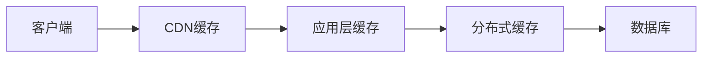
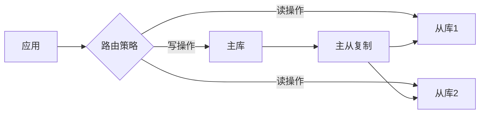
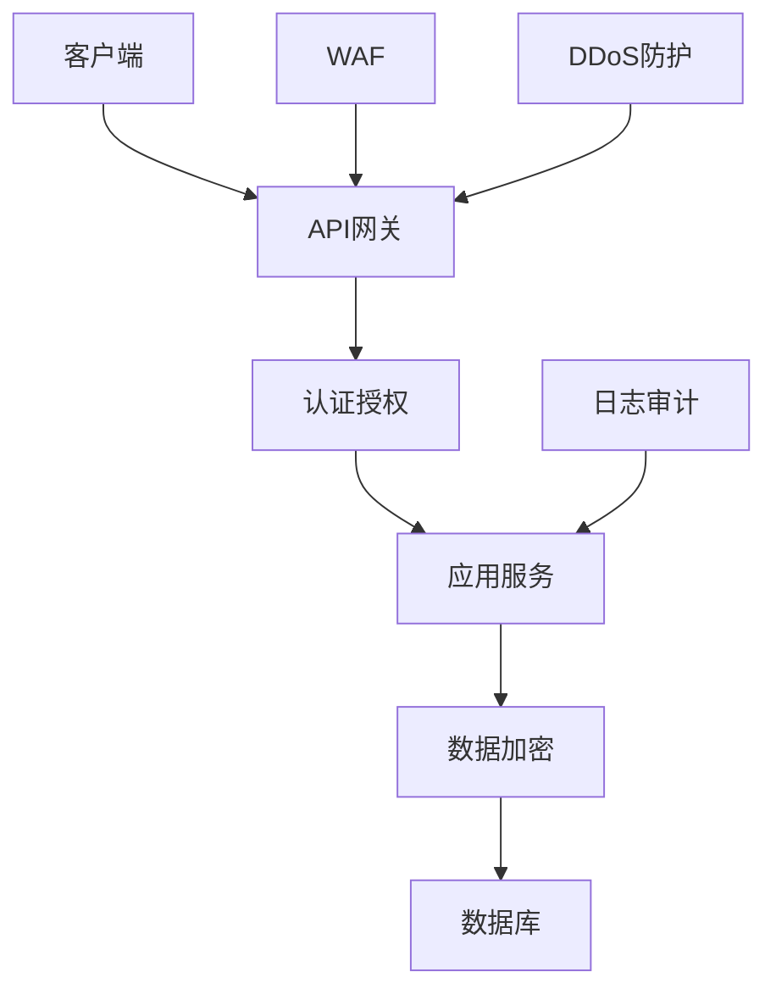

# 架构设计模式

本文档提供常见的架构设计模式和实施指南，供技术架构师参考。

## 🏗️ 分层架构模式

### 1. 三层架构

**适用场景**：传统的企业级应用

```table
┌─────────────┐
│  表现层    │  UI、API接口
├─────────────┤
│  业务逻辑层 │  业务规则、服务
├─────────────┤
│  数据访问层 │  数据库操作
└─────────────┘

```

**实施要点**：

- 表现层只负责接收请求和返回响应
- 业务逻辑层处理核心业务规则
- 数据访问层只负责CRUD操作
- 依赖方向：表现层 → 业务逻辑层 → 数据访问层

### 2. 六边形架构

**适用场景**：需要隔离领域逻辑和外部依赖的复杂系统

```table
        ┌─────────────────┐
        │   适配器层       │
        │  (Adapters)     │
        └─────────────────┘
              ▲       ▲
              │       │
        ┌─────┴───────┴─────┐
        │    应用层          │
        │  (Application)    │
        └───────────────────┘
              ▲       ▲
              │       │
        ┌─────┴───────┴─────┐
        │    领域层          │
        │   (Domain)        │
        └───────────────────┘

```

**实施要点**：

- 领域层不依赖任何外部框架
- 通过端口（Port）定义接口
- 通过适配器（Adapter）实现接口
- 所有外部依赖（数据库、消息队列等）都通过适配器注入

### 3. 整洁架构

**适用场景**：需要长期演进的核心业务系统

```table
┌─────────────────────────────────────────┐
│           框架与驱动层                    │
│  (Frameworks & Drivers)                 │
│  Web框架、数据库、设备驱动等              │
└─────────────────────────────────────────┘
              ▲
              │
┌─────────────────────────────────────────┐
│           接口适配层                    │
│  (Interface Adapters)                   │
│  Controllers、Presenters、Gateways       │
└─────────────────────────────────────────┘
              ▲
              │
┌─────────────────────────────────────────┐
│           用例层                         │
│  (Use Cases)                             │
│  应用业务规则                            │
└─────────────────────────────────────────┘
              ▲
              │
┌─────────────────────────────────────────┐
│           实体层                         │
│  (Entities)                             │
│  企业级业务规则                          │
└─────────────────────────────────────────┘

```

**实施要点**：

- 内层不依赖外层
- 外层可以依赖内层
- 业务规则位于核心层
- 框架和工具在最外层

## 🌐 微服务架构

### 1. 微服务拆分原则

**按业务边界拆分**：

- 领域驱动设计（DDD）
- 限界上下文
- 业务能力

**拆分检查清单**：

- [ ] 服务是否有独立的业务价值
- [ ] 服务是否可以独立部署
- [ ] 服务是否可以独立扩展
- [ ] 服务的数据是否可以独立存储
- [ ] 服务的团队是否可以独立开发

### 2. 服务间通信模式

**同步通信**：

- REST API
- GraphQL
- gRPC

**异步通信**：

- 消息队列（Kafka、RabbitMQ）
- 事件总线
- 发布订阅

### 3. 微服务基础设施

```yaml
# 服务注册与发现
service_discovery:
  - Consul
  - Eureka
  - etcd

# API网关
api_gateway:
  - Kong
  - Nginx
  - Spring Cloud Gateway

# 配置中心
config_center:
  - Apollo
  - Nacos
  - Spring Cloud Config

# 服务治理
service_governance:
  - 断路器：Hystrix, Resilience4j
  - 限流：Sentinel, Ratelimit
  - 负载均衡：Ribbon, LoadBalancer

# 分布式追踪
distributed_tracing:
  - Jaeger
  - Zipkin
  - SkyWalking

```

## 📊 CQRS架构

### 概念

**CQRS**（Command Query Responsibility Segregation）：

- 将命令（写操作）和查询（读操作）分离
- 读写使用不同的数据模型和数据存储
- 适合复杂查询场景

### 实施方案

```typescript
// 命令模型
interface CommandModel {
  id: string;
  name: string;
  email: string;
  // 用于写操作
}

// 查询模型
interface QueryModel {
  id: string;
  name: string;
  email: string;
  orderCount: number; // 预计算的查询字段
  lastOrderDate: Date; // 预计算的查询字段
}

// 命令端
class UserService {
  async createUser(command: CreateUserCommand) {
    // 写入命令数据库
    await commandRepository.save(user);
    // 发布领域事件
    eventBus.publish(new UserCreatedEvent(user));
  }
}

// 查询端
class UserQueryService {
  async getUserProfile(userId: string) {
    // 从查询数据库读取
    return queryRepository.findById(userId);
  }
}

// 事件处理器
class UserEventHandler {
  @handle(UserCreatedEvent)
  async handle(event: UserCreatedEvent) {
    // 更新查询数据库
    const queryModel = this.buildQueryModel(event.user);
    await queryRepository.save(queryModel);
  }
}

```

### 适用场景

✅ **适合使用CQRS的场景**：

- 读多写少的场景
- 查询逻辑非常复杂
- 需要高性能查询
- 读写数据模型差异大

❌ **不适合使用CQRS的场景**：

- 简单的CRUD应用
- 读写操作相当
- 团队规模小，维护成本高

## 🔄 事件驱动架构

### 核心概念

**事件驱动**（Event-Driven Architecture）：

- 服务间通过事件进行异步通信
- 解耦服务之间的依赖
- 支持最终一致性

### 事件类型

**领域事件**（Domain Events）：

- 表示业务领域内发生的事实
- 不可变，已发生的事件不可取消
- 例如：UserCreated、OrderPaid、InventoryReserved

**集成事件**（Integration Events）：

- 用于跨服务边界的事件
- 例如：OrderPlaced、PaymentCompleted

### 实施模式

```typescript
// 事件定义
interface DomainEvent {
  eventId: string;
  eventType: string;
  aggregateId: string;
  payload: any;
  occurredAt: Date;
}

// 事件发布
class OrderService {
  async placeOrder(command: PlaceOrderCommand) {
    const order = await this.createOrder(command);

    // 发布领域事件
    this.eventBus.publish(
      new OrderPlacedEvent({
        orderId: order.id,
        userId: order.userId,
        total: order.total,
      }),
    );

    return order;
  }
}

// 事件订阅
class InventoryService {
  @subscribe(OrderPlacedEvent)
  async handleOrderPlaced(event: OrderPlacedEvent) {
    await this.reserveInventory(event.orderId, event.items);
  }
}

class NotificationService {
  @subscribe(OrderPlacedEvent)
  async handleOrderPlaced(event: OrderPlacedEvent) {
    await this.sendOrderConfirmation(event.userId, event.orderId);
  }
}

```

### 事件存储

**事件溯源**（Event Sourcing）：

- 不存储当前状态，而是存储所有事件
- 通过重放事件来重建状态
- 提供完整的审计追踪

```typescript
// 事件存储接口
interface EventStore {
  appendEvents(aggregateId: string, events: DomainEvent[]): Promise<void>;
  getEvents(aggregateId: string): Promise<DomainEvent[]>;
}

// 聚合根
class OrderAggregate {
  private events: DomainEvent[] = [];

  static create(command: CreateOrderCommand): OrderAggregate {
    const order = new OrderAggregate();
    order.apply(new OrderCreatedEvent(command));
    return order;
  }

  private apply(event: DomainEvent) {
    this.events.push(event);
    // 应用事件改变状态
    switch (event.eventType) {
      case "OrderCreated":
        this.status = "created";
        break;
      case "OrderPaid":
        this.status = "paid";
        break;
    }
  }

  getUncommittedEvents(): DomainEvent[] {
    return this.events;
  }
}

```

## 🏛️ 架构决策记录（ADR）

### ADR模板

```markdown
# ADR-001: 选择使用微服务架构

## 状态

已接受

## 背景

当前单体应用难以满足高并发需求，需要支持独立部署和扩展。

## 决策

采用微服务架构，将系统拆分为用户服务、订单服务、支付服务等独立服务。

## 理由

- 支持独立部署，降低发布风险
- 可以根据负载独立扩展服务
- 团队可以并行开发，提高效率
- 技术栈可以灵活选择

## 后果

### 正面影响

- 提高系统的可扩展性和可用性
- 加快迭代速度

### 负面影响

- 增加运维复杂度
- 需要引入服务治理基础设施
- 分布式事务处理复杂

## 替代方案

- 改进单体应用：使用模块化设计，保持部署简单
- 使用Serverless：按需付费，但有限制

```

### ADR管理工具

**推荐工具**：

- ADR Tools：命令行工具，创建和管理ADR
- MADR（Markdown Architectural Decision Records）：ADR模板
- Architectural Decision Records网站记录

## 📈 性能优化架构

### 1. 缓存架构



**缓存策略**：

- Cache-Aside：应用程序管理缓存
- Read-Through：缓存自己加载数据
- Write-Through：写入时同步更新缓存
- Write-Behind：异步写入缓存

**缓存一致性**：

- Cache Aside Pattern
- Write-Through Cache
- Write-Behind Cache
- Refresh-Ahead Cache

### 2. 读写分离



**路由策略**：

- 读写分离中间件
- 应用层路由
- 代理层路由

### 3. 分库分表

**水平分表**：

- 按范围分片：range sharding
- 按哈希分片：hash sharding
- 按列表分片：list sharding

**垂直分库**：

- 按业务领域分库
- 按访问频率分库

## 🔒 安全架构

### 安全防护层次



**安全组件**：

- API网关：路由、限流、认证
- WAF（Web应用防火墙）：防护常见攻击
- DDoS防护：分布式拒绝服务攻击防护
- 认证授权：OAuth2、JWT、RBAC
- 数据加密：传输加密、存储加密
- 日志审计：操作日志、安全事件

## 📊 架构评估

### 评估维度

**功能性**：

- 业务需求满足度
- 功能完整性

**非功能性**：

- 性能（Performance）
- 可用性（Availability）
- 可扩展性（Scalability）
- 可靠性（Reliability）
- 安全性（Security）

**质量属性**：

- 可维护性（Maintainability）
- 可测试性（Testability）
- 可部署性（Deployability）
- 可观测性（Observability）

### 评估方法

**ATAM（Architecture Tradeoff Analysis Method）**：

- 识别架构场景
- 分析架构决策
- 评估质量属性
- 识别风险和权衡

**SAAM（Software Architecture Analysis Method）**：

- 场景开发
- 架构描述
- 场景评估
- 重构建议

## 📚 参考资料

- 《架构整洁之道》- Robert C. Martin
- 《软件架构实践》- Len Bass
- 《企业应用架构模式》- Martin Fowler
- 《实现领域驱动设计》- Vaughn Vernon
- 《微服务设计》- Sam Newman
