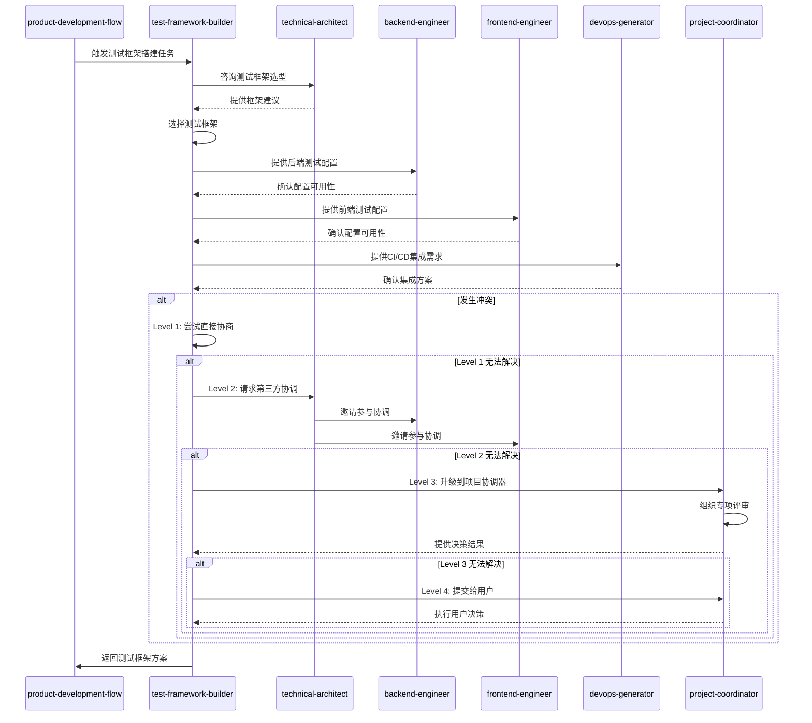

# Test Framework Builder SKILL

本skill用于在项目开发过程中搭建完整的自动化测试框架和基础设施。

**💡 重要说明**: 本技能既可以作为产品开发流程的一部分，也可以在任何适合的场景下独立使用。
不需要用户明确声明"我是测试框架构建者"，只要用户的需求涉及测试框架搭建，就可以调用本技能。

## 何时使用本Skill

本skill可以在以下场景中独立使用，也可以作为产品开发流程的一部分：

### 独立使用场景

**场景1: 测试框架初始化**

- "帮我搭建项目的单元测试框架"
- "配置Jest测试框架"
- "设置Vitest测试环境"
- "集成Mocha测试框架"

**场景2: 测试配置生成**

- "生成测试配置文件"
- "配置测试覆盖率工具"
- "设置测试环境变量"
- "配置测试报告生成"

**场景3: 测试模板生成**

- "生成组件测试模板"
- "生成API测试模板"
- "生成E2E测试模板"
- "生成测试工具函数"

**场景4: 测试基础设施搭建**

- "搭建测试数据生成工具"
- "搭建测试Mock工具"
- "搭建测试辅助工具"
- "搭建测试报告系统"

### 产品开发流程集成

在产品开发流程的**阶段10: 测试框架搭建**中被调用，作为测试框架构建者角色。

**调用方式**: 由product-development-flow自动调用，传递技术栈、项目结构等上下文。

**触发时机**:

- 业务实现完成，需要搭建测试框架时
- 需要为新功能生成测试模板时

### 触发关键词

以下关键词或短语出现时，建议调用本skill：

**测试框架类**:

- "搭建测试框架"、"测试框架配置"
- "测试框架初始化"、"测试基础架构"

**测试配置类**:

- "测试配置"、"配置测试环境"
- "测试覆盖率"、"测试报告"

**测试模板类**:

- "测试模板"、"生成测试代码"
- "测试示例"、"测试工具"

**测试工具类**:

- "测试工具"、"Mock工具"
- "测试数据生成"、"测试辅助"

## 🎯 核心职责

### 1. 单元测试框架搭建

生成单元测试配置和示例代码，包括：

- 测试框架配置（Jest, Vitest, Mocha, JUnit等）
- 测试运行配置
- Mock工具配置（sinon, jest-mock等）
- 覆盖率报告配置
- 示例测试用例

### 2. 集成测试框架搭建

生成集成测试配置和工具，包括：

- 测试容器配置（TestContainers）
- 数据库测试配置
- API测试框架配置（Supertest, axios-mock-adapter等）
- 测试数据管理（factories, fixtures）

### 3. E2E测试框架搭建

生成端到端测试配置，包括：

- E2E测试框架（Playwright, Cypress, Puppeteer）
- 测试环境配置
- 页面对象模式（POM）模板
- 测试脚本模板

### 4. 测试工具链配置

配置测试辅助工具，包括：

- 代码覆盖率工具（Istanbul, nyc）
- 测试报告工具（Mochawesome, Allure）
- 性能测试工具（k6, JMeter）
- 视觉回归测试工具（Percy, Chromatic）

### 5. 测试数据管理

生成测试数据管理工具，包括：

- 工厂函数（factory-bot, faker）
- 测试fixture模板
- 数据库种子脚本
- Mock API服务器配置

## 🤝 协作关系与RACI矩阵

本技能主要与以下类型技能协作:

1. **前置技能**: technical-architect、backend-engineer、frontend-engineer
2. **后置技能**: tester
3. **同级技能**: 无
4. **依赖技能**: devops-generator

### 协作场景

| 场景 | 协作技能 | 协作方式 | 协作内容 |
|------|----------|----------|----------|
| 测试框架选择 | technical-architect | 并行协作 | 根据技术栈选择测试框架 |
| 后端测试配置 | backend-engineer | 顺序协作 | 配置后端测试环境,生成测试模板 |
| 前端测试配置 | frontend-engineer | 顺序协作 | 配置前端测试环境,生成测试模板 |
| CI/CD集成 | devops-generator | 顺序协作 | 集成测试到CI/CD流程 |
| 测试覆盖率目标 | qa-engineer | 并行协作 | 确定测试覆盖率目标 |

### 本技能在各阶段的RACI角色

| 阶段 | 本技能角色 | 主要职责 |
|------|------------|----------|
| 阶段1: 需求提出 | I | 了解测试需求,参与需求评审 |
| 阶段2: 需求分析 | I | 参与测试策略讨论 |
| 阶段5: 业务实现 | I | 了解开发进展,准备测试框架 |
| 阶段6: 架构保障 | I | 了解架构设计,选择测试框架 |
| 阶段10: 测试框架搭建 | R/A | 搭建测试框架,生成测试配置,生成测试模板 |
| 阶段11: DevOps配置 | R/A | 配置测试CI/CD,配置测试环境 |
| 阶段12: 项目协调与交付 | I | 知晓测试框架状态,确认交付 |

### 本技能的核心任务RACI

| 任务 | 本技能 | technical-architect | backend-engineer | frontend-engineer | devops-generator |
|------|--------|-----------------|-----------------|-----------------|-----------------|
| 测试框架选择 | R/A | C | C | C | I |
| 单元测试配置 | R/A | C | C | C | I |
| 集成测试配置 | R/A | C | R/A | C | C |
| E2E测试配置 | R/A | C | C | R/A | C |
| CI/CD集成 | R/A | I | C | C | R/A |

### RACI角色说明

- **R (Responsible)** - 负责人: 本技能实际执行的任务
- **A (Accountable)** - 拥有人: 本技能对结果负最终责任的任务
- **C (Consulted)** - 咨询人: 需要咨询其他技能的任务
- **I (Informed)** - 知情人: 需要通知其他技能进展的任务

---

## ⚠️ 冲突升级路径

### 冲突类型

本技能可能遇到的冲突类型:

| 冲突类型 | 严重程度 | 默认处理方式 |
|----------|----------|--------------|
| 测试框架选型冲突 | 低 | 直接协商 |
| 覆盖率目标分歧 | 中 | 第三方协调 |
| 测试资源配置冲突 | 中 | 第三方协调 |
| 测试框架 vs 开发进度 | 高 | 项目协调器介入 |

### 4级冲突升级路径

#### Level 1: 直接协商(本技能内部)

**适用场景**:

- 冲突严重程度: 低-中
- 冲突类型: 测试框架选型冲突、覆盖率目标分歧
- 处理时限: < 5分钟

**处理流程**:

```typescript
async function resolveConflictLevel1(
  conflict: Conflict,
): Promise<Resolution> {
  // 1. 识别冲突类型
  const conflictType = identifyConflictType(conflict);

  // 2. 分析冲突原因
  const rootCause = analyzeRootCause(conflict);

  // 3. 提出解决方案
  const solutions = generateSolutions(conflictType, rootCause);

  // 4. 评估方案
  const bestSolution = evaluateSolutions(solutions);

  // 5. 执行解决方案
  await implementSolution(bestSolution);

  // 6. 记录结果
  recordConflictResolution(conflict, bestSolution);

  return bestSolution;
}
```

#### Level 2: 第三方协调(相关技能协调)

**适用场景**:

- 冲突严重程度: 中
- 冲突类型: 测试资源配置冲突
- Level 1 处理超时: > 5分钟
- 处理时限: < 15分钟

**处理流程**:

```typescript
async function resolveConflictLevel2(
  conflict: Conflict,
): Promise<Resolution> {
  // 1. 升级到第三方协调
  const coordinator = selectCoordinator(conflict);

  // 2. 邀请相关技能参与协调
  const stakeholders = identifyStakeholders(conflict);

  // 3. 召开协调会议
  const meeting = await conveneMeeting(coordinator, stakeholders);

  // 4. 各方陈述观点
  const viewpoints = await collectViewpoints(meeting);

  // 5. 共同评估解决方案
  const solutions = await coCreateSolutions(viewpoints);

  // 6. 达成共识
  const resolution = await reachConsensus(solutions);

  // 7. 记录协调结果
  recordMediationResult(conflict, resolution);

  return resolution;
}
```

#### Level 3: 项目协调器介入

**适用场景**:

- 冲突严重程度: 高
- 冲突类型: 测试框架 vs 开发进度
- Level 2 处理超时: > 15分钟
- 处理时限: < 30分钟

**处理流程**:

```typescript
async function resolveConflictLevel3(
  conflict: Conflict,
): Promise<Resolution> {
  // 1. 升级到项目协调器
  const projectCoordinator = await invokeSkill("project-coordinator");

  // 2. 提供完整的冲突上下文
  await projectCoordinator.reportConflict({
    conflict,
    history: getConflictHistory(conflict),
    level2Attempts: getLevel2Attempts(conflict),
  });

  // 3. 协调器组织专项评审
  const review = await projectCoordinator.organizeReview({
    type: "conflict-resolution",
    participants: ["technical-architect", "backend-engineer", "test-framework-builder"],
    conflict,
  });

  // 4. 评审会议
  const resolution = await review.conduct();

  // 5. 记录最终决策
  recordFinalDecision(conflict, resolution);

  return resolution;
}
```

#### Level 4: 用户干预

**适用场景**:

- 冲突严重程度: 极高
- 冲突类型: 影响项目方向或核心需求的分歧
- Level 3 处理超时: > 30分钟
- 处理时限: 由用户决定

**处理流程**:

```typescript
async function resolveConflictLevel4(
  conflict: Conflict,
): Promise<Resolution> {
  // 1. 准备冲突报告
  const report = generateConflictReport({
    conflict,
    history: getConflictHistory(conflict),
    allAttempts: getAllResolutionAttempts(conflict),
    options: generateOptions(conflict),
  });

  // 2. 提交给用户决策
  const userDecision = await submitToUser({
    report,
    urgency: "high",
    context: "conflict-resolution",
  });

  // 3. 执行用户决策
  await implementUserDecision(userDecision);

  // 4. 记录最终决策
  recordUserDecision(conflict, userDecision);

  return userDecision;
}
```

### 协作序列图



### 协作检查清单

在与以下技能协作时,请使用以下检查清单:

#### 与 technical-architect 协作检查清单

- [ ] 测试框架符合技术栈要求
- [ ] 测试架构符合系统架构
- [ ] 测试工具链配置合理
- [ ] 测试隔离策略正确
- [ ] 测试环境配置一致

#### 与 backend-engineer 协作检查清单

- [ ] 后端测试配置完整
- [ ] API测试模板可用
- [ ] 数据库测试方案可行
- [ ] Mock策略合理
- [ ] 测试数据管理清晰

#### 与 frontend-engineer 协作检查清单

- [ ] 前端测试配置完整
- [ ] 组件测试模板可用
- [ ] E2E测试方案可行
- [ ] 测试环境配置正确
- [ ] 测试工具链集成

#### 与 devops-generator 协作检查清单

- [ ] CI/CD测试配置完整
- [ ] 测试环境部署自动化
- [ ] 测试报告生成配置
- [ ] 测试资源管理合理
- [ ] 测试失败处理机制

---

- **主要协作**：project-coordinator（流程编排与上下文同步）、product-development-flow（阶段10 测试框架搭建自动触发）、backend-engineer/frontend-engineer（测试点位与接口约束）、qa-engineer（测试策略与覆盖率目标）、devops-generator（CI集成）。
- **RACI（阶段10 测试框架搭建）**：test-framework-builder 负责框架设计与脚手架交付（R），project-coordinator 负责流程与决策记录（A），qa-engineer 与 devops-generator consulted（C），产品与实现团队知情并接收产物（I）。
- **参考**：完整矩阵见 [COLLABORATION_RACI.md](../../COLLABORATION_RACI.md)。

## 📋 工作流程

```mermaid
graph LR
    A[分析项目技术栈] --> B[确定测试需求]
    B --> C[生成单元测试配置]
    C --> D[生成集成测试配置]
    D --> E[生成E2E测试配置]
    E --> F[配置测试工具链]
    F --> G[生成测试数据管理]
    G --> H[生成测试文档]
    H --> I[输出测试框架包]

## 🔄 输入要求

### 必需输入

- **项目技术栈**：
  - 前端框架（React/Vue/Angular等）
  - 后端框架（Node.js/Python/Java/Go等）
  - 构建工具（Webpack/Vite/Gradle/Maven等）
- **测试类型**：
  - 单元测试
  - 集成测试
  - E2E测试
- **测试框架偏好**（可选）：
  - 单元测试框架（Jest/Vitest/Mocha等）
  - E2E测试框架（Playwright/Cypress等）

### 可选输入

- **覆盖率目标**（例如：80%, 90%）
- *`CI/CD平台`*（GitHub/GitLab/Jenkins）
- **数据库类型**（PostgreSQL/MySQL/MongoDB）
- **API规范**（OpenAPI/Swagger）

## 📦 交付物

### 1. 单元测试框架

#### Jest配置示例

```javascript
// jest.config.js
module.exports = {
  preset: "ts-jest",
  testEnvironment: "node",
  roots: ["<rootDir>/src", "<rootDir>/tests"],
  testMatch: ["**/__tests__/*`/`.ts", "*`/?(`.)+(spec|test).ts"],
  collectCoverageFrom: [
    "src/*`/`.ts",
    "!src/*`/`.d.ts",
    "!src/**/index.ts",
    "!src/**/types.ts",
  ],
  coverageThreshold: {
    global: {
      branches: 80,
      functions: 80,
      lines: 80,
      statements: 80,
    },
  },
  moduleNameMapper: {
    "^@/(.*)$": "<rootDir>/src/$1",
  },
  setupFilesAfterEnv: ["<rootDir>/tests/setup.ts"],
};

#### 示例测试用例

```typescript
// tests/unit/utils/dateUtils.test.ts
import { formatDate, parseDate } from "@/utils/dateUtils";

describe("dateUtils", () => {
  describe("formatDate", () => {
    it("should format date correctly", () => {
      const date = new Date("2024-01-15");
      const result = formatDate(date, "YYYY-MM-DD");
      expect(result).toBe("2024-01-15");
    });

    it("should handle invalid date", () => {
      const result = formatDate(null, "YYYY-MM-DD");
      expect(result).toBe("");
    });
  });

  describe("parseDate", () => {
    it("should parse date string correctly", () => {
      const result = parseDate("2024-01-15", "YYYY-MM-DD");
      expect(result).toBeInstanceOf(Date);
      expect(result.toISOString()).toContain("2024-01-15");
    });
  });
});

#### Mock示例

```typescript
// tests/unit/api/userApi.test.ts
import { UserApi } from "@/api/userApi";
import { AxiosInstance } from "axios";

jest.mock("axios");
const mockedAxios = AxiosInstance as jest.Mocked<typeof AxiosInstance>;

describe("UserApi", () => {
  let userApi: UserApi;

  beforeEach(() => {
    userApi = new UserApi(mockedAxios);
  });

  afterEach(() => {
    jest.clearAllMocks();
  });

  describe("getUser", () => {
    it("should return user data", async () => {
      const mockUser = { id: 1, name: "John Doe" };
      mockedAxios.get.mockResolvedValue({ data: mockUser });

      const result = await userApi.getUser(1);
      expect(result).toEqual(mockUser);
      expect(mockedAxios.get).toHaveBeenCalledWith("/users/1");
    });

    it("should handle API error", async () => {
      mockedAxios.get.mockRejectedValue(new Error("Network error"));

      await expect(userApi.getUser(1)).rejects.toThrow("Network error");
    });
  });
});

### 2. 集成测试框架

#### TestContainers配置示例

```typescript
// tests/integration/setup.ts
import { PostgreSqlContainer } from "testcontainers";
import { Pool } from "pg";

let postgresContainer: PostgreSqlContainer;
let pool: Pool;

export async function setupTestDatabase() {
  postgresContainer = await new PostgreSqlContainer("postgres:15-alpine")
    .withDatabase("testdb")
    .withUsername("testuser")
    .withPassword("testpass")
    .withExposedPorts(5432)
    .start();

  pool = new Pool({
    host: postgresContainer.getHost(),
    port: postgresContainer.getMappedPort(5432),
    database: postgresContainer.getDatabase(),
    user: postgresContainer.getUsername(),
    password: postgresContainer.getPassword(),
  });

  // 运行迁移
  await runMigrations(pool);
}

export async function teardownTestDatabase() {
  await pool.end();
  await postgresContainer.stop();
}

export function getTestDbPool(): Pool {
  return pool;
}

#### API集成测试示例

```typescript
// tests/integration/api/userApi.integration.test.ts
import {
  setupTestDatabase,
  teardownTestDatabase,
  getTestDbPool,
} from "../setup";
import request from "supertest";
import { app } from "@/app";

describe("User API Integration Tests", () => {
  beforeAll(async () => {
    await setupTestDatabase();
  });

  afterAll(async () => {
    await teardownTestDatabase();
  });

  describe("POST /api/users", () => {
    it("should create a new user", async () => {
      const userData = {
        name: "John Doe",
        email: "john@example.com",
      };

      const response = await request(app)
        .post("/api/users")
        .send(userData)
        .expect(201);

      expect(response.body).toMatchObject({
        id: expect.any(Number),
        name: userData.name,
        email: userData.email,
      });

      // 验证数据库
      const pool = getTestDbPool();
      const result = await pool.query("SELECT * FROM users WHERE id = $1", [
        response.body.id,
      ]);
      expect(result.rows[0]).toMatchObject(userData);
    });

    it("should return 400 for invalid data", async () => {
      const response = await request(app)
        .post("/api/users")
        .send({})
        .expect(400);

      expect(response.body.errors).toBeDefined();
    });
  });
});

### 3. E2E测试框架

#### Playwright配置示例

```typescript
// playwright.config.ts
import { defineConfig, devices } from "@playwright/test";

export default defineConfig({
  testDir: "./tests/e2e",
  fullyParallel: true,
  forbidOnly: !!process.env.CI,
  retries: process.env.CI ? 2 : 0,
  workers: process.env.CI ? 1 : undefined,
  reporter: [["html"], ["json", { outputFile: "test-results/results.json" }]],
  use: {
    baseURL: "http://localhost:3000",
    trace: "on-first-retry",
    screenshot: "only-on-failure",
  },
  projects: [
    {
      name: "chromium",
      use: { ...devices["Desktop Chrome"] },
    },
    {
      name: "firefox",
      use: { ...devices["Desktop Firefox"] },
    },
    {
      name: "webkit",
      use: { ...devices["Desktop Safari"] },
    },
  ],
  webServer: {
    command: "npm run dev",
    url: "http://localhost:3000",
    reuseExistingServer: !process.env.CI,
  },
});

#### Page Object示例

```typescript
// tests/e2e/pages/LoginPage.ts
import { Page, expect } from "@playwright/test";

export class LoginPage {
  readonly page: Page;
  readonly emailInput: this["page"]["locator"];
  readonly passwordInput: this["page"]["locator"];
  readonly loginButton: this["page"]["locator"];
  readonly errorMessage: this["page"]["locator"];

  constructor(page: Page) {
    this.page = page;
    this.emailInput = page.locator('input[name="email"]');
    this.passwordInput = page.locator('input[name="password"]');
    this.loginButton = page.locator('button[type="submit"]');
    this.errorMessage = page.locator('[data-testid="error-message"]');
  }

  async goto() {
    await this.page.goto("/login");
  }

  async login(email: string, password: string) {
    await this.emailInput.fill(email);
    await this.passwordInput.fill(password);
    await this.loginButton.click();
  }

  async assertErrorMessage(message: string) {
    await expect(this.errorMessage).toHaveText(message);
  }
}

#### E2E测试示例

```typescript
// tests/e2e/login.spec.ts
import { test, expect } from "@playwright/test";
import { LoginPage } from "./pages/LoginPage";

test.describe("Login Flow", () => {
  let loginPage: LoginPage;

  test.beforeEach(async ({ page }) => {
    loginPage = new LoginPage(page);
  });

  test("should login with valid credentials", async ({ page }) => {
    await loginPage.goto();
    await loginPage.login("test@example.com", "password123");

    await expect(page).toHaveURL("/dashboard");
    await expect(page.locator("h1")).toContainText("Welcome");
  });

  test("should show error with invalid credentials", async ({ page }) => {
    await loginPage.goto();
    await loginPage.login("invalid@example.com", "wrongpassword");

    await loginPage.assertErrorMessage("Invalid email or password");
    await expect(page).toHaveURL("/login");
  });

  test("should validate required fields", async ({ page }) => {
    await loginPage.goto();
    await loginPage.login("", "");

    await expect(loginPage.emailInput).toHaveAttribute("required");
    await expect(loginPage.passwordInput).toHaveAttribute("required");
  });
});

### 4. 测试工具链

#### 覆盖率配置示例

```javascript
// .nycrc.json
{
  "all": true,
  "include": ["src/*`/`.ts"],
  "exclude": [
    "src/*`/`.d.ts",
    "src/*`/`.test.ts",
    "src/*`/`.spec.ts",
    "src/types/*`/`.ts"
  ],
  "reporter": [
    "text",
    "text-summary",
    "html",
    "lcov"
  ],
  "check-coverage": true,
  "lines": 80,
  "statements": 80,
  "functions": 80,
  "branches": 80
}

#### 测试报告配置示例

```javascript
// .mocharc.json
{
  "spec": "tests/*`/`.test.ts",
  "require": ["ts-node/register"],
  "timeout": 10000,
  "reporter": [
    "spec",
    ["mochawesome", {
      "reportDir": "test-results",
      "reportFilename": "mochawesome-report",
      "reportTitle": "Test Report"
    }]
  ]
}

#### 性能测试配置示例

```javascript
// tests/performance/load-test.js
import http from "k6/http";
import { check, sleep } from "k6";

export let options = {
  stages: [
    { duration: "30s", target: 100 },
    { duration: "1m", target: 100 },
    { duration: "20s", target: 0 },
  ],
  thresholds: {
    http_req_duration: ["p(95)<500"],
    http_req_failed: ["rate<0.01"],
  },
};

export default function () {
  let res = http.get("http://localhost:3000/api/users");
  check(res, {
    "status was 200": (r) => r.status == 200,
    "response time < 500ms": (r) => r.timings.duration < 500,
  });
  sleep(1);
}

### 5. 测试数据管理配置

#### Factory配置示例

```typescript
// tests/factories/user.factory.ts
import { Factory } from "fishery";
import { hashPassword } from "@/utils/auth";

export const userFactory = Factory.define(({ sequence, onCreate }) => {
  onCreate(async (user) => {
    user.password = await hashPassword(user.password);
    return user;
  });

  return {
    id: sequence,
    name: `User ${sequence}`,
    email: `user${sequence}@example.com`,
    password: "password123",
    createdAt: new Date(),
    updatedAt: new Date(),
  };
});

#### Fixture示例

```typescript
// tests/fixtures/users.fixture.ts
import { userFactory } from "../factories/user.factory";

export const usersFixture = {
  validUser: userFactory.build({
    name: "Valid User",
    email: "valid@example.com",
  }),

  adminUser: userFactory.build({
    name: "Admin User",
    email: "admin@example.com",
    role: "admin",
  }),

  invalidUser: {
    name: "",
    email: "invalid-email",
    password: "123",
  },
};

#### 数据库种子脚本示例

```typescript
// tests/seeds/database.seed.ts
import { getTestDbPool } from "../integration/setup";
import { userFactory } from "../factories/user.factory";

export async function seedUsers(count: number = 10) {
  const pool = getTestDbPool();
  const users = userFactory.buildList(count);

  for (const user of users) {
    await pool.query(
      "INSERT INTO users (name, email, password, role) VALUES ($1, $2, $3, $4)",
      [user.name, user.email, user.password, user.role || "user"],
    );
  }

  return users;
}

export async function clearUsers() {
  const pool = getTestDbPool();
  await pool.query("DELETE FROM users");
}

## 🔍 技术栈检测与配置选择

### 前端测试框架选择

```typescript
function selectTestFramework(
  framework: string,
  buildTool: string,
): TestFramework {
  const frameworkMap = {
    react: {
      vite: { unit: "vitest", e2e: "playwright" },
      webpack: { unit: "jest", e2e: "cypress" },
    },
    vue: {
      vite: { unit: "vitest", e2e: "playwright" },
      webpack: { unit: "jest", e2e: "cypress" },
    },
    angular: {
      "angular-cli": { unit: "jest", e2e: "protractor" },
    },
  };

  return (
    frameworkMap[framework]?.[buildTool] || { unit: "jest", e2e: "cypress" }
  );
}

### 后端测试框架选择

```typescript
function selectBackendTestFramework(
  language: string,
  framework: string,
): TestFramework {
  const frameworkMap = {
    typescript: {
      express: "jest",
      nest: "jest",
      fastify: "jest",
    },
    python: {
      django: "pytest",
      flask: "pytest",
      fastapi: "pytest",
    },
    java: {
      spring: "junit5",
    },
    go: {
      gin: "testing",
    },
  };

  return frameworkMap[language]?.[framework] || "jest";
}

## 📝 生成文档

### 测试文档示例

```markdown
# Testing Guide

## 测试类型

### 单元测试

单元测试用于测试独立的代码单元，如函数、类、模块。

运行单元测试：

```bash
npm run test:unit

```

查看覆盖率：

```bash
npm run test:coverage

### 集成测试

集成测试用于测试多个组件或模块之间的交互。

运行集成测试：

```bash
npm run test:integration

### E2E测试

端到端测试模拟真实用户场景，测试整个应用流程。

运行E2E测试：

```bash
npm run test:e2e

运行所有测试：

```bash
npm test

## 测试结构

```tree
tests/
├── unit/              # 单元测试
│   ├── utils/
│   ├── services/
│   └── components/
├── integration/       # 集成测试
│   ├── api/
│   ├── database/
│   └── setup.ts
├── e2e/              # E2E测试
│   ├── pages/
│   └── specs/
├── factories/        # 测试数据工厂
├── fixtures/         # 测试数据
└── seeds/           # 数据库种子

## 编写测试

### 1. 单元测试用例

```typescript
import { sum } from "@/utils/math";

describe("sum", () => {
  it("should add two numbers", () => {
    expect(sum(2, 3)).toBe(5);
  });
});

### 2. 集成测试用例

```typescript
import request from "supertest";
import { app } from "@/app";

describe("POST /api/users", () => {
  it("should create a user", async () => {
    const response = await request(app)
      .post("/api/users")
      .send({ name: "John" });

    expect(response.status).toBe(201);
  });
});

### 3. E2E测试编写实践

```typescript
import { test, expect } from "@playwright/test";

test("should login", async ({ page }) => {
  await page.goto("/login");
  await page.fill('input[name="email"]', "test@example.com");
  await page.fill('input[name="password"]', "password");
  await page.click('button[type="submit"]');
  await expect(page).toHaveURL("/dashboard");
});

## 测试覆盖率

目标覆盖率：

- 语句覆盖率：80%
- 分支覆盖率：80%
- 函数覆盖率：80%
- 行覆盖率：80%

查看覆盖率报告：

```bash
npm run test:coverage
open coverage/index.html

## 🔄 集成到开发流程

### 触发时机

1. **项目初始化后**
   - 生成测试框架基础配置
   - 创建测试目录结构
   - 添加测试脚本到package.json

2. **技术栈确定后**
   - 生成特定框架的测试配置
   - 生成示例测试用例

3. **功能开发阶段**
   - 为新功能生成测试模板
   - 生成工厂函数和fixtures

### 调用方式

```typescript
// 在product-development-flow中调用
const testFrameworkBuilder = await useSkill("test-framework-builder");

const testFramework = await testFrameworkBuilder.build({
  frontendFramework: "react",
  backendFramework: "express",
  buildTool: "vite",
  testTypes: ["unit", "integration", "e2e"],
  coverageTarget: {
    statements: 80,
    branches: 80,
    functions: 80,
    lines: 80,
  },
  cicdPlatform: "github",
});

// 保存测试配置
await saveTestFramework(testFramework);

## 📊 质量标准

- 测试配置语法正确
- 测试框架可正确运行
- 测试脚本可以执行
- 覆盖率配置合理
- 测试文档清晰完整
- 示例测试用例可运行

## 审查重点

在审查测试框架时，重点关注以下方面：

1. **框架选择适配性**
   - 测试框架是否与项目技术栈匹配
   - 是否考虑了团队技术背景和学习成本
   - 框架的社区活跃度和维护情况

2. **配置完整性**
   - 是否配置了所有必要的测试类型（单元/集成/E2E）
   - 覆盖率配置是否合理且可达成
   - CI/CD集成配置是否正确

3. **测试数据管理**
   - 工厂函数是否支持多样化的测试场景
   - fixtures是否覆盖了边界情况
   - Mock策略是否合理

4. **文档质量**
   - 测试指南是否清晰易懂
   - 示例用例是否具有代表性
   - 是否包含故障排查指引

## 校对机制

### 校对方式

采用**自动化检查 + 人工审查**的双重校对机制。

### 校对内容

1. **自动化检查**（每次生成后执行）
   - 配置文件语法验证
   - 测试脚本可执行性验证
   - 依赖包完整性检查

2. **人工审查**（首次生成时执行）
   - 框架选择合理性审查
   - 测试策略完整性审查
   - 文档准确性审查

### 校对流程

```text

生成测试框架
↓
自动化检查（必须通过）
↓
人工审查（首次）
↓
集成到项目
↓
运行示例测试
↓
校对通过

```

### 通过标准

1. 自动化检查必须全部通过

2. 人工审查无重大问题

3. 示例测试可成功运行

4. 覆盖率报告可正常生成

## 📚 参考资料

### 测试框架文档

- [Jest Documentation](https://jestjs.io/docs/getting-started)
- [Vitest Guide](https://vitest.dev/guide/)
- [Mocha Documentation](https://mochajs.org/)
- [Playwright Documentation](https://playwright.dev/docs/intro)
- [Cypress Documentation](https://docs.cypress.io/guides/overview/why-cypress)

### 测试最佳实践

- [Testing Library Best Practices](https://kentcdodds.com/blog/common-mistakes-with-react-testing-library)
- [Google Testing Blog](https://testing.googleblog.com/)
- [Martin Fowler - Unit Testing](https://martinfowler.com/bliki/UnitTest.html)

### 架构模式

- [Test Patterns](https://martinfowler.com/bliki/TestPyramid.html)
- [Page Object Model](https://www.selenium.dev/documentation/test_practices/encouraged_page_object_models/)
- [Testing Pyramid](https://martinfowler.com/articles/practical-test-pyramid.html)

## 🛠️ 工具脚本

本skill包含以下辅助脚本（位于`scripts/`目录）：

- `test-config-generator.ts` - 生成测试配置文件
- `test-structure-scaffolder.ts` - 搭建测试目录结构
- `mock-factory-builder.ts` - 生成Mock工厂函数

**注意**：当前scripts目录为空，需要根据实际需求添加。

## 最佳实践

### 框架选择

1. **前端单元测试**
   - 使用Vite：优先选择Vitest
   - 使用Webpack：选择Jest
   - Vue项目：选择Vitest（更好的Vue支持）

2. **后端单元测试**
   - Node.js：首选Jest
   - Python：选择Pytest
   - Java：使用JUnit 5
   - Go：使用标准testing包

3. **E2E测试**
   - 现代Web应用：推荐Playwright（多浏览器支持好）
   - 传统应用：可选择Cypress（调试体验好）

### 测试组织

1. **目录结构**

```tree
tests/
├── unit/ # 单元测试
├── integration/ # 集成测试
├── e2e/ # E2E测试
├── factories/ # 数据工厂
└── fixtures/ # 测试数据

1. **命名规范**

- 测试文件：`*.test.ts` 或 `*.spec.ts`
- 测试目录：`__tests__/`
- 测试描述：使用`should do something when...`格式

### 测试编写

1. **单元测试**

- 保持快速（< 100ms）
- 只测试业务逻辑，不测试框架代码
- 合理使用Mock，但不要过度

1. **集成测试**

- 使用真实依赖（数据库、消息队列等）
- 确保测试环境与生产环境一致
- 使用TestContainers进行隔离

1. **E2E测试**

- 关注用户旅程，而非技术细节
- 使用Page Object模式
- 避免测试实现细节

### 覆盖率目标

- 核心业务逻辑：90%+
- 一般业务逻辑：80%+
- 工具函数：100%
- 配置文件：可忽略

## 常见问题

### Q1: 测试运行速度慢怎么办？

**A**:

- 确保单元测试与集成测试分离
- 使用`--watch`模式进行开发测试
- 并行运行测试（Jest支持）
- 减少不必要的数据库操作

### Q2: Mock应该Mock到什么程度？

**A**:

- 只Mock外部依赖（HTTP调用、数据库等）
- 不要Mock被测试的模块
- 不要过度Mock，应该验证真实行为

### Q3: 如何处理异步测试？

**A**:

- 使用async/await语法
- 确保正确处理Promise
- 添加适当的超时设置
- 清理异步资源（timers、connections等）

### Q4: E2E测试不稳定（flaky）怎么办？

**A**:

- 添加适当的等待（使用page.waitFor\*而非固定延迟）
- 使用稳定的选择器（data-testid而非CSS选择器）
- 隔离测试数据，避免测试间相互影响
- 在CI中使用重试机制

### Q5: 如何测试私有方法？

**A**:

- 不应该直接测试私有方法
- 通过公共接口测试私有方法的行为
- 如果需要测试，考虑重构为独立模块

## 🎨 配置模板库

### 常见技术栈模板

```typescript
const templates = {
"react+vite+express": {
 unit: "vitest",
 integration: "vitest",
 e2e: "playwright",
 config: "react-vite-express.template",
},
"vue+webpack+nest": {
 unit: "jest",
 integration: "jest",
 e2e: "cypress",
 config: "vue-webpack-nest.template",
},
// ... 更多模板
};

## ⚠️ 注意事项

### 最佳实践

1. **测试命名**
- 使用描述性的测试名称
- 遵循`should do something when...`模式

2. **测试独立性**
- 每个测试应该独立运行
- 不依赖测试执行顺序
- 使用`beforeEach`/`afterEach`清理状态

3. **测试速度**
- 单元测试应该快速（< 100ms）
- 集成测试适中（< 1s）
- E2E测试较慢（< 10s）

4. **Mock使用**
- 只Mock外部依赖
- 不要Mock被测代码
- 验证Mock的调用次数和参数

5. **测试数据**
- 使用工厂函数生成数据
- 避免硬编码数据
- 使用有意义的测试数据

---

## 调用其他技能

### 调用时机

本skill在以下情况需要主动调用其他技能：

1. **框架选择时** - 调用技术架构师

2. **配置测试环境时** - 调用DevOps配置生成器

3. **集成测试设计时** - 调用后端工程师或前端工程师

4. **E2E测试设计时** - 调用后端工程师和前端工程师

### 调用的技能及场景

#### 1. 调用技术架构师（technical-architect）

**调用时机**：
- 当需要选择测试框架时
- 当需要评估测试技术栈时
- 当需要设计测试架构时

**调用方式**：

```typescript
const technicalArchitect = await useSkill("technical-architect");
const frameworkSelection = await technicalArchitect.selectTestFramework({
  requirements: testingRequirements,
  techStack: projectTechStack,
});

**调用场景**：

**场景1**：测试框架选择
- **输入**：测试需求、项目技术栈
- **调用**：technical-architect推荐测试框架
- **输出**：框架选择、对比分析

**场景2**：测试架构设计
- **输入**：测试范围、项目架构
- **调用**：technical-architect设计测试架构
- **输出**：测试架构方案、分层策略

#### 2. 调用DevOps配置生成器（devops-generator）

**调用时机**：
- 当需要配置CI/CD测试时
- 当需要配置测试环境时
- 当需要配置测试报告时

**调用方式**：

```typescript
const devopsGenerator = await useSkill("devops-generator");
const testCI = await devopsGenerator.configureTestCI({
  testFramework: framework,
  coverageTarget: target,
});

**调用场景**：

**场景1**：CI/CD测试配置
- **输入**：测试框架、测试命令
- **调用**：devops-generator生成CI配置
- **输出**：CI配置文件、流水线配置

**场景2**：测试环境配置
- **输入**：测试需求、环境要求
- **调用**：devops-generator配置测试环境
- **输出**：Docker配置、环境脚本

#### 3. 调用后端工程师（backend-engineer）

**调用时机**：
- 当需要了解后端架构时
- 当需要设计API测试时
- 当需要设计数据库测试时

**调用方式**：

```typescript
const backendEngineer = await useSkill("backend-engineer");
const apiTests = await backendEngineer.designAPITests({
  apiSpec: openAPISpec,
  endpoints: endpointList,
});

**调用场景**：

**场景1**：API测试设计
- **输入**：API规范、端点列表
- **调用**：backend-engineer设计API测试
- **输出**：API测试用例、Mock配置

**场景2**：数据库测试设计
- **输入**：Schema、测试场景
- **调用**：backend-engineer设计数据库测试
- **输出**：数据库测试用例、测试数据

#### 4. 调用前端工程师（frontend-engineer）

**调用时机**：
- 当需要了解前端架构时
- 当需要设计组件测试时
- 当需要设计E2E测试时

**调用方式**：

```typescript
const frontendEngineer = await useSkill("frontend-engineer");
const componentTests = await frontendEngineer.designComponentTests({
  components: componentList,
  interactions: interactionPatterns,
});

**调用场景**：

**场景1**：组件测试设计
- **输入**：组件列表、交互模式
- **调用**：frontend-engineer设计组件测试
- **输出**：组件测试用例、测试辅助函数

**场景2**：E2E测试场景设计
- **输入**：用户流程、功能列表
- **调用**：frontend-engineer设计E2E测试
- **输出**：E2E测试场景、测试数据

### 调用注意事项

1. **框架匹配**：测试框架必须匹配项目技术栈

2. **环境隔离**：测试环境必须与生产环境隔离

3. **数据管理**：测试数据必须独立管理

4. **持续集成**：测试必须集成到CI/CD流程

---

## 总结

Test Framework Builder Skill专注于：

1. ✅ 搭建单元测试框架（Jest, Vitest, Mocha等）

2. ✅ 搭建集成测试框架（TestContainers, Supertest等）

3. ✅ 搭建E2E测试框架（Playwright, Cypress等）

4. ✅ 配置测试工具链（覆盖率、报告、性能测试）

5. ✅ 生成测试数据管理（工厂、fixtures、种子）

6. ✅ 生成测试文档和示例

**不负责**：

- ❌ 实际执行测试用例
- ❌ 分析测试结果
- ❌ 修复测试失败
- ❌ 与测试服务集成

这些工作需要由tester skill或CI/CD系统完成。

---

## 📚 参考资料

### 全局参考资料

本skill参考以下全局参考资料：

- **编码规范**：`references/best-practices/coding.md`（包含命名规范、函数设计原则、代码组织规范、注释规范、错误处理规范）
- **设计模式**：`references/design-patterns/creational.md`、`references/design-patterns/structural.md`、`references/design-patterns/behavioral.md`
- **架构参考**：`references/architecture/hexagonal-architecture.md`、`references/architecture/microservices.md`

### 本skill特有参考资料

本skill使用以下特有的参考资料：

- **[测试框架配置](references/test-framework-config.md)** - 包含Jest、Vitest、Playwright等测试框架配置参考

## 🛠️ 工具脚本

### 全局工具脚本

本skill使用以下全局工具脚本：

- **Logger工具**：`scripts/utils/logger.ts`

  ```typescript
  import { createLogger } from "@codebuddy/scripts/utils/logger";
  const logger = createLogger("Test Framework Builder");
  logger.info("开始搭建测试框架");
  logger.skillComplete("Test Framework Builder", 5000);

- **FileManager工具**：`scripts/utils/file-manager.ts`

  ```typescript
  import { FileManager } from "@codebuddy/scripts/utils/file-manager";
  const fm = new FileManager();
  await fm.createDirectory("./tests");
  await fm.writeFile("./tests/jest.config.js", jestConfig);

- **ContextManager工具**：`scripts/utils/context-manager.ts`

  ```typescript
  import { ContextManager } from "@codebuddy/scripts/utils/context-manager";
  const ctx = new ContextManager();
  ctx.set("testFramework", "jest");
  ctx.set("coverageTarget", 80);

- **CodeValidator**：`scripts/validators/code-validator.ts`

  ```typescript
  import { CodeValidator } from "@codebuddy/scripts/validators/code-validator";
  const validator = new CodeValidator();
  const result = await validator.validate("./tests", { language: "typescript" });

- **ConfigValidator**：`scripts/validators/config-validator.ts`

  ```typescript
  import { ConfigValidator } from "@codebuddy/scripts/validators/config-validator";
  const validator = new ConfigValidator();
  const result = await validator.validate("./jest.config.js", { schema: "jest" });

### 本skill特有脚本

本skill使用以下特有的工具脚本：

- **[配置生成器](scripts/config-generator.ts)** - 生成测试框架配置文件

  ```typescript
  import { ConfigGenerator } from "./scripts/config-generator";
  const generator = new ConfigGenerator();
  await generator.generateJestConfig({
    coverageThreshold: 80,
    testMatch: ["**/*.test.ts"],
  });

  ````

---

## 📝 使用示例

### 示例1：搭建测试框架

**场景描述**：为Node.js项目搭建测试框架

**输入示例**：

```text
请为Node.js项目搭建测试框架，要求：

1. 支持单元测试

2. 支持集成测试

3. 生成测试报告

4. 测试覆盖率不低于80%

```

**调用方式**：

```bash
invoke skill test-framework-builder

```

**输出示例**：

```markdown
# 测试框架搭建方案

## 1. 技术选型

- **测试框架**：Jest
- **覆盖率工具**：Istanbul
- **断言库**：Jest内置
- **Mock库**：Jest内置

## 2. 安装依赖

```bash
npm install --save-dev jest @types/jest ts-jest

```

## 3. 配置Jest

```javascript
// jest.config.js
module.exports = {
  preset: 'ts-jest',
  testEnvironment: 'node',
  roots: ['<rootDir>/src'],
  testMatch: ['**/__tests__/**/*.test.ts'],
  collectCoverageFrom: [
    'src/**/*.ts',
    '!src/**/*.d.ts',
  ],
  coverageThreshold: {
    global: {
      branches: 80,
      functions: 80,
      lines: 80,
      statements: 80,
    },
  },
};

```

## 4. 示例测试

```typescript
// src/__tests__/user.test.ts
import { UserService } from '../services/user';

describe('UserService', () => {
  let userService: UserService;

  beforeEach(() => {
    userService = new UserService();
  });

  describe('register', () => {
    it('should register a new user', async () => {
      const user = await userService.register({
        username: 'test',
        email: 'test@example.com',
        password: 'password123',
      });

      expect(user).toHaveProperty('id');
      expect(user.username).toBe('test');
    });

    it('should throw error if email already exists', async () => {
      await expect(
        userService.register({
          username: 'test',
          email: 'existing@example.com',
          password: 'password123',
        })
      ).rejects.toThrow('Email already exists');
    });
  });
});

```

## 5. 运行测试

```bash
# 运行所有测试
npm test

# 运行测试并生成覆盖率报告
npm run test:coverage

```
