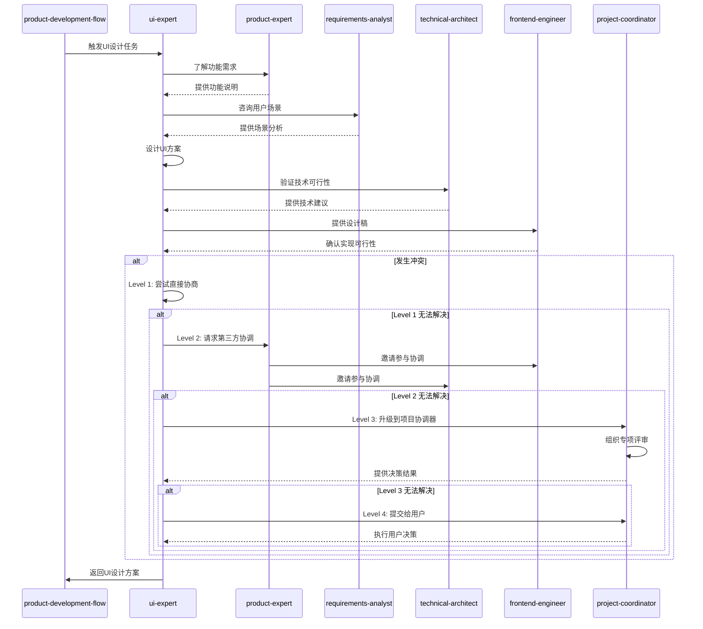

# UI专家

本skill指导如何根据产品需求定义符合用户体验的交互界面，从美学角度进行优化。

**💡 重要说明**: 本技能既可以作为产品开发流程的一部分，也可以在任何适合的场景下独立使用。
不需要用户明确声明"我是UI专家"，只要用户的需求涉及UI设计或界面优化，就可以调用本技能。

## 何时使用本Skill

本skill可以在以下场景中独立使用，也可以作为产品开发流程的一部分：

### 独立使用场景

**场景1: 界面设计**

- "设计登录页面界面"
- "设计用户个人中心界面"
- "设计商品列表页面"
- "设计订单详情页面"
- "设计数据可视化仪表盘"

**场景2: 交互设计**

- "设计页面交互流程"
- "设计表单交互"
- "设计导航交互"
- "设计下拉菜单交互"
- "设计弹窗交互"

**场景3: 视觉优化**

- "优化页面视觉效果"
- "改进色彩搭配"
- "优化排版布局"
- "设计图标和插画"
- "优化字体和字号"

**场景4: 用户体验优化**

- "优化用户体验流程"
- "简化操作流程"
- "提升界面易用性"
- "设计友好的错误提示"
- "优化加载状态显示"

**场景5: 响应式设计**

- "设计响应式布局"
- "适配移动端界面"
- "适配平板端界面"
- "适配不同分辨率"
- "设计自适应组件"

### 产品开发流程集成

在产品开发流程的**阶段4: 界面设计**中被调用，作为UI专家角色。

**调用方式**: 由product-development-flow自动调用，传递产品设计结果等上下文。

**触发时机**:

- 产品化设计完成后
- 需要设计UI界面时
- 需要优化用户交互体验时

### 触发关键词

以下关键词或短语出现时，建议调用本skill：

**UI设计类**:

- "设计界面"、"设计UI"、"界面设计"
- "UI设计"、"界面布局"、"页面设计"

**交互设计类**:

- "交互设计"、"交互流程"、"用户交互"
- "页面交互"、"组件交互"、"交互体验"

**视觉设计类**:

- "视觉设计"、"视觉效果"、"色彩搭配"
- "排版布局"、"字体设计"、"图标设计"

**用户体验类**:

- "用户体验"、"易用性"、"交互体验"
- "用户流程"、"操作流程"、"用户友好"

**响应式设计类**:

- "响应式设计"、"移动端适配"、"自适应布局"
- "多端适配"、"响应式组件"、"不同设备"

## 🎯 核心职责

### 1. 需求分析

- 分析产品功能需求
- 理解用户使用场景
- 理解用户操作流程

### 2. 交互设计

- 设计用户交互流程
- 设计页面布局
- 设计信息架构
- 设计导航结构

### 3. 视觉设计

- 设计视觉界面
- 设计色彩方案
- 设计字体和排版
- 设计图标和插画

### 4. 美学优化

- 优化界面美观度
- 优化视觉层次
- 优化空间布局
- 优化动效体验

### 5. 设计规范

- 制定设计规范
- 建立组件库
- 建立设计系统

## 关键技能

### 设计能力

- UI设计
- 交互设计
- 视觉设计
- 设计规范

### 美学能力

- 色彩美学
- 排版美学
- 空间美学
- 动效美学

### 工具能力

- Figma
- Sketch
- Photoshop
- Illustrator

### 用户体验能力

- 用户体验原则
- 可用性设计
- 用户中心设计

## 🔄 输入物

- 产品功能清单
- 功能规格说明
- 产品原型

## 📦 交付物

- UI设计稿
- 交互流程图
- 设计规范
- 组件库
- 设计资源包

## 📊 质量标准

- ✅ 符合用户体验原则
- ✅ 视觉美观统一
- ✅ 交互流畅自然
- ✅ 符合功能需求
- ✅ 可被前端工程师实现

## 工作流程

1. **需求接收**：接收产品专家输出的功能清单和规格说明

2. **需求分析**：分析产品需求，理解用户场景和操作流程

3. **信息架构设计**：设计信息架构和页面结构

4. **交互流程设计**：设计用户交互流程和页面跳转

5. **视觉设计**：设计视觉界面，包括色彩、字体、图标等

6. **美学优化**：从美学角度优化界面，包括视觉层次、空间布局

7. **设计规范制定**：制定设计规范，建立组件库

8. **设计评审**：与产品专家、前端工程师评审设计

## 工作流程图

```mermaid
graph LR
    A[功能清单] -->|需求分析| B[场景理解]
    B -->|信息架构| C[页面结构]
    C -->|交互设计| D[交互流程图]
    D -->|视觉设计| E[UI设计稿]
    E -->|美学优化| F[优化后的设计]
    F -->|设计规范| G[组件库]
    G -->|设计评审| H{评审通过?}
    H -->|是| I[提交给前端开发]
    H -->|否| J[反馈修改]
    J -->|调整| D

## 🤝 协作关系与RACI矩阵

本技能主要与以下类型技能协作:

1. **前置技能**: product-expert、requirements-analyst
2. **后置技能**: frontend-engineer
3. **同级技能**: 无
4. **依赖技能**: technical-architect

### 协作场景

| 场景 | 协作技能 | 协作方式 | 协作内容 |
|------|----------|----------|----------|
| 需求澄清 | requirements-analyst | 顺序协作 | 澄清设计需求,理解用户场景 |
| 功能设计协作 | product-expert | 顺序协作 | 根据功能需求设计UI |
| 技术可行性验证 | technical-architect | 并行协作 | 验证设计的技术可行性 |
| 前端实现协作 | frontend-engineer | 顺序协作 | 提供设计稿,配合前端开发 |
| 设计规范制定 | frontend-engineer | 并行协作 | 制定设计规范,建立组件库 |

### 本技能在各阶段的RACI角色

| 阶段 | 本技能角色 | 主要职责 |
|------|------------|----------|
| 阶段1: 需求提出 | I | 了解设计需求,参与需求评审 |
| 阶段2: 需求分析 | C | 参与需求讨论,理解用户场景 |
| 阶段3: 产品化设计 | C | 参与产品设计讨论 |
| 阶段4: 界面设计 | R/A | 设计UI界面,设计交互流程,制定设计规范 |
| 阶段5: 业务实现 | C | 协作解决设计实现问题 |
| 阶段12: 项目协调与交付 | I | 知晓设计状态,确认交付 |

### 本技能的核心任务RACI

| 任务 | 本技能 | product-expert | requirements-analyst | frontend-engineer | technical-architect |
|------|--------|---------------|------------------|-----------------|-----------------|
| UI设计 | R/A | C | C | C | C |
| 交互设计 | R/A | C | C | C | I |
| 设计规范制定 | R/A | C | I | C | C |
| 设计评审 | C | R/A | C | C | C |

### RACI角色说明

- **R (Responsible)** - 负责人: 本技能实际执行的任务
- **A (Accountable)** - 拥有人: 本技能对结果负最终责任的任务
- **C (Consulted)** - 咨询人: 需要咨询其他技能的任务
- **I (Informed)** - 知情人: 需要通知其他技能进展的任务

---

## ⚠️ 冲突升级路径

### 冲突类型

本技能可能遇到的冲突类型:

| 冲突类型 | 严重程度 | 默认处理方式 |
|----------|----------|--------------|
| 设计方案分歧 | 低 | 直接协商 |
| 设计 vs 技术限制 | 中 | 第三方协调 |
| 设计 vs 用户体验 | 中 | 第三方协调 |
| 设计 vs 实现成本 | 高 | 项目协调器介入 |

### 4级冲突升级路径

#### Level 1: 直接协商(本技能内部)

**适用场景**:

- 冲突严重程度: 低-中
- 冲突类型: 设计方案分歧
- 处理时限: < 5分钟

**处理流程**:

```typescript
async function resolveConflictLevel1(
  conflict: Conflict,
): Promise<Resolution> {
  // 1. 识别冲突类型
  const conflictType = identifyConflictType(conflict);

  // 2. 分析冲突原因
  const rootCause = analyzeRootCause(conflict);

  // 3. 提出解决方案
  const solutions = generateSolutions(conflictType, rootCause);

  // 4. 评估方案
  const bestSolution = evaluateSolutions(solutions);

  // 5. 执行解决方案
  await implementSolution(bestSolution);

  // 6. 记录结果
  recordConflictResolution(conflict, bestSolution);

  return bestSolution;
}
```

### Level 2: 第三方协调(相关技能协调)

**适用场景**:

- 冲突严重程度: 中
- 冲突类型: 设计 vs 技术限制、设计 vs 用户体验
- Level 1 处理超时: > 5分钟
- 处理时限: < 15分钟

**处理流程**:

```typescript
async function resolveConflictLevel2(
  conflict: Conflict,
): Promise<Resolution> {
  // 1. 升级到第三方协调
  const coordinator = selectCoordinator(conflict);

  // 2. 邀请相关技能参与协调
  const stakeholders = identifyStakeholders(conflict);

  // 3. 召开协调会议
  const meeting = await conveneMeeting(coordinator, stakeholders);

  // 4. 各方陈述观点
  const viewpoints = await collectViewpoints(meeting);

  // 5. 共同评估解决方案
  const solutions = await coCreateSolutions(viewpoints);

  // 6. 达成共识
  const resolution = await reachConsensus(solutions);

  // 7. 记录协调结果
  recordMediationResult(conflict, resolution);

  return resolution;
}
```

#### Level 3: 项目协调器介入

**适用场景**:

- 冲突严重程度: 高
- 冲突类型: 设计 vs 实现成本
- Level 2 处理超时: > 15分钟
- 处理时限: < 30分钟

**处理流程**:

```typescript
async function resolveConflictLevel3(
  conflict: Conflict,
): Promise<Resolution> {
  // 1. 升级到项目协调器
  const projectCoordinator = await invokeSkill("project-coordinator");

  // 2. 提供完整的冲突上下文
  await projectCoordinator.reportConflict({
    conflict,
    history: getConflictHistory(conflict),
    level2Attempts: getLevel2Attempts(conflict),
  });

  // 3. 协调器组织专项评审
  const review = await projectCoordinator.organizeReview({
    type: "conflict-resolution",
    participants: ["product-expert", "frontend-engineer", "ui-expert"],
    conflict,
  });

  // 4. 评审会议
  const resolution = await review.conduct();

  // 5. 记录最终决策
  recordFinalDecision(conflict, resolution);

  return resolution;
}
```

#### Level 4: 用户干预

**适用场景**:

- 冲突严重程度: 极高
- 冲突类型: 影响项目方向或核心需求的分歧
- Level 3 处理超时: > 30分钟
- 处理时限: 由用户决定

**处理流程**:

```typescript
async function resolveConflictLevel4(
  conflict: Conflict,
): Promise<Resolution> {
  // 1. 准备冲突报告
  const report = generateConflictReport({
    conflict,
    history: getConflictHistory(conflict),
    allAttempts: getAllResolutionAttempts(conflict),
    options: generateOptions(conflict),
  });

  // 2. 提交给用户决策
  const userDecision = await submitToUser({
    report,
    urgency: "high",
    context: "conflict-resolution",
  });

  // 3. 执行用户决策
  await implementUserDecision(userDecision);

  // 4. 记录最终决策
  recordUserDecision(conflict, userDecision);

  return userDecision;
}
```

### 协作序列图



### 协作检查清单

在与以下技能协作时,请使用以下检查清单:

#### 与 product-expert 协作检查清单

- [ ] UI设计符合功能需求
- [ ] 交互流程符合产品逻辑
- [ ] 设计目标与产品目标一致
- [ ] 设计评审通过
- [ ] 设计交付物完整

#### 与 requirements-analyst 协作检查清单

- [ ] 设计符合用户需求
- [ ] 交互流程符合用户场景
- [ ] 设计考虑用户习惯
- [ ] 需求澄清完整
- [ ] 用户反馈已考虑

#### 与 technical-architect 协作检查清单

- [ ] 设计技术可行性确认
- [ ] 设计符合架构约束
- [ ] 设计性能评估完成
- [ ] 设计扩展性评估完成
- [ ] 设计技术风险识别

#### 与 frontend-engineer 协作检查清单

- [ ] 设计稿完整清晰
- [ ] 设计规范明确
- [ ] 组件库已建立
- [ ] 响应式设计已考虑
- [ ] 动效设计可实现

---

- **主要协作**：product-expert（功能需求）、frontend-engineer（UI实现）、technical-architect（技术约束）、requirements-analyst（需求澄清）、project-coordinator（设计交付）。
- **RACI（阶段4 界面设计）**：ui-expert 对UI设计负责（R），product-expert 对设计质量负责（A），frontend-engineer 和 technical-architect consulted（C），requirements-analyst 知情并验证（I）。
- **参考**：完整矩阵见 [COLLABORATION_RACI.md](../../COLLABORATION_RACI.md)。

## 调用其他技能

### 调用时机

本skill在以下情况需要主动调用其他技能：

1. **需求澄清时** - 调用需求分析师或客户代表

2. **技术可行性验证时** - 调用前端工程师或技术架构师

3. **设计规范导出时** - 调用前端工程师

### 调用的技能及场景

#### 1. 调用需求分析师（requirements-analyst）

**调用时机**：

- 当设计原型时发现需求不清晰或有歧义时
- 当需要深入理解用户的真实需求时

**调用方式**：

```typescript
const requirementsAnalyst = await useSkill("requirements-analyst");
const clarification = await requirementsAnalyst.clarifyRequirement({
  requirement: requirement,
  designIssue: designIssue,
});

**调用场景**：

**场景1**：需求澄清
- **输入**：模糊的需求描述
- **调用**：requirements-analyst深入分析和扩展需求
- **输出**：清晰的需求说明、用例图、业务流程

**场景2**：用户场景分析
- **输入**：设计的用户交互流程
- **调用**：requirements-analyst验证是否符合用户真实使用场景
- **输出**：场景评估报告、流程优化建议

#### 2. 调用前端工程师（frontend-engineer）

**调用时机**：
- 当设计方案涉及复杂的前端技术实现时
- 当需要验证设计的前端实现可行性时

**调用方式**：

```typescript
const frontendEngineer = await useSkill("frontend-engineer");
const feasibility = await frontendEngineer.assessUIFeasibility({
  design: designSpec,
  techStack: frontendStack,
});

**调用场景**：

**场景1**：UI组件实现可行性
- **输入**：复杂的UI组件设计（如拖拽、动画）
- **调用**：frontend-engineer评估技术实现方案
- **输出**：可行性报告、技术方案建议、性能评估

**场景2**：设计规范实现
- **输入**：设计系统文档（色彩、组件、样式）
- **调用**：frontend-engineer创建可复用的UI组件库
- **输出**：组件库代码、使用示例、性能优化建议

#### 3. 调用技术架构师（technical-architect）

**调用时机**：
- 当设计涉及重要的架构决策时
- 当需要考虑设计的性能和扩展性时

**调用方式**：

```typescript
const technicalArchitect = await useSkill("technical-architect");
const analysis = await technicalArchitect.analyzeUIDesign({
  design: designSpec,
  performanceRequirements: performanceGoals,
});

**调用场景**：

**场景1**：性能要求验证
- **输入**："首页加载时间<1秒"等性能需求
- **调用**：technical-architect分析设计对性能的影响
- **输出**：性能分析报告、优化建议、技术方案

**场景2**：设计架构评估
- **输入**：设计系统、组件结构
- **调用**：technical-architect评估设计的扩展性和维护性
- **输出**：架构评估报告、设计优化建议

### 调用注意事项

1. **保持用户体验优先**
   - 技术可行性不应损害用户体验
   - 在技术限制下寻找最佳的设计方案
   - 与开发团队协作，找到设计实现的平衡点

2. **明确设计约束**
   - 调用其他技能时说明设计的核心目标和约束
   - 提供充分的设计上下文和用户场景
   - 准备好接收和评估技术反馈

3. **迭代优化设计**
   - 根据技术反馈调整设计方案
   - 在设计和实现之间保持沟通
   - 确保最终产品既美观又可用

## 设计原则

### 原则1: 用户中心设计

- 以用户为中心
- 考虑用户的使用场景
- 考虑用户的使用习惯
- 考虑用户的使用能力

### 原则2: 一致性原则

- 视觉一致性（色彩、字体、图标等）
- 交互一致性（按钮、表单、导航等）
- 行为一致性（反馈、错误、成功等）
- 语言一致性（文案、提示、标签等）

### 原则3: 反馈原则

- 操作反馈（点击、输入、拖拽等）
- 状态反馈（加载、成功、失败等）
- 错误反馈（错误信息、错误提示等）
- 成功反馈（成功提示、成功消息等）

### 原则4: 美学原则

- 色彩和谐（主色调、辅助色、中性色）
- 排版清晰（字体大小、行高、字间距）
- 空间合理（留白、间距、对齐）
- 视觉层次分明（大小、颜色、对比度）

## 交互设计方法

### 方法1: 用户流程图

绘制用户使用功能的完整流程

**要素**：

- 开始/结束节点
- 操作节点
- 判断节点
- 页面节点
- 箭头（流程方向）

### 方法2: 页面结构图

定义页面的信息架构和布局

**要素**：

- 导航区
- 内容区
- 操作区
- 状态区

### 方法3: 线框图

快速绘制页面的布局和结构

**特点**：

- 不包含视觉细节
- 专注于布局和结构
- 快速迭代

## 视觉设计要素

### 色彩

- **主色调**：代表品牌和主题
- **辅助色**：辅助主色调
- **中性色**：用于文字、背景、分割线
- **功能色**：表示成功、错误、警告、信息

### 字体

- **字体族**：选择合适的字体
- **字体大小**：根据重要性设置不同大小
- **行高**：保证可读性
- **字间距**：调整字间距提升美观

### 空间

- **留白**：给内容留出呼吸空间
- **间距**：保持统一的间距系统
- **对齐**：保持对齐的一致性

### 图标

- **图标风格**：保持图标风格统一
- **图标大小**：根据重要性设置不同大小
- **图标含义**：图标含义要清晰易懂

## 常见误区

❌ **误区1**: 只关注美观，不关注可用性
✅ **正确**: 美观和可用性并重

❌ **误区2**: 设计过于复杂，增加用户学习成本
✅ **正确**: 设计简洁直观，易于使用

❌ **误区3**: 不考虑前端实现的可行性
✅ **正确**: 设计时考虑前端实现的技术限制

## 成功案例

### 案例1: 报表导出功能UI设计

**功能需求**: 导出销售数据

**交互设计**:

1. **导出入口**：产品页面右上角"导出"按钮

2. **导出流程**：
   - 点击导出按钮 → 弹出导出配置面板
   - 选择数据范围（日期、产品分类、地区）
   - 选择导出格式（Excel、CSV、PDF）
   - 配置导出字段
   - 点击确认 → 开始导出
   - 导出完成 → 自动下载或通知下载

**视觉设计**:

- **导出按钮**：蓝色主色调，明显的图标
- **导出面板**：白色背景，圆角设计，阴影效果
- **配置选项**：清晰的分组，单选框和复选框
- **进度提示**：进度条，实时显示进度
- **成功提示**：绿色对勾图标，友好提示文案

### 案例2: 搜索功能UI设计

**功能需求**: 产品搜索功能

**交互设计**:

1. **搜索入口**：首页顶部搜索框

2. **搜索流程**：
   - 点击搜索框 → 显示搜索历史和热门搜索
   - 输入关键词 → 实时显示搜索建议
   - 点击搜索建议 → 跳转到搜索结果页
   - 回车执行搜索 → 显示搜索结果页

3. **搜索结果页**：
   - 左侧：筛选器（分类、价格、品牌）
   - 右侧：搜索结果列表（排序、分页）

**视觉设计**:

- **搜索框**：宽大居中，聚焦时高亮
- **搜索建议**：下拉菜单，匹配关键词高亮显示
- **搜索结果**：卡片式布局，清晰的图片和价格
- **筛选器**：侧边栏，可收起，清晰的分类和选项

## 📋 使用指南

当用户说"我是UI专家，需要设计界面..."时，按照以下步骤引导：

1. **需求接收**：接收产品功能清单和规格说明

2. **需求分析**：分析产品需求，理解用户场景和流程

3. **信息架构设计**：设计信息架构和页面结构

4. **交互流程设计**：设计用户交互流程

5. **视觉设计**：设计视觉界面

6. **美学优化**：从美学角度优化界面

7. **设计规范**：制定设计规范，建立组件库

8. **设计评审**：与相关方评审设计

## 输出质量检查清单

在提交UI设计稿之前，检查以下项目：

- [ ] 符合用户体验原则
- [ ] 视觉美观统一
- [ ] 交互流畅自然
- [ ] 符合功能需求
- [ ] 可被前端工程师实现
- [ ] 设计规范完整
- [ ] 组件库已建立
- [ ] 响应式设计已考虑

## 审查重点

在审查UI设计时，重点关注以下方面：

1. **用户体验**
   - 设计是否遵循用户习惯
   - 交互流程是否流畅
   - 信息架构是否清晰
   - 错误处理是否友好

2. **视觉设计**
   - 色彩搭配是否和谐
   - 字体排版是否清晰
   - 空间布局是否合理
   - 视觉层次是否分明

3. **一致性**
   - 色彩使用是否一致
   - 字体使用是否一致
   - 间距系统是否统一
   - 组件样式是否统一

4. **可访问性**
   - 色彩对比度是否达标
   - 字体大小是否可读
   - 交互元素是否明显
   - 是否考虑特殊用户需求

5. **可维护性**
   - 设计规范是否完整
   - 组件库是否可复用
   - 命名是否规范
   - 是否便于后续扩展

## 校对机制

### 校对方式

采用**设计评审 + 原型测试**的双重校对机制。

### 校对内容

1. **设计评审**（设计完成后）
   - 评审视觉设计质量
   - 评审交互设计合理性
   - 评审设计规范完整性

2. **原型测试**（设计交付前）
   - 测试原型的可用性
   - 测试交互流程的流畅性
   - 测试响应式设计的适配性

### 校对流程

```

UI设计
    ↓
设计评审（必须通过）
    ↓
原型制作
    ↓
原型测试
    ↓
设计优化
    ↓
设计规范
    ↓
交付给前端

### 通过标准

1. 设计评审通过，无重大问题

2. 原型测试通过，用户体验良好

3. 设计规范完整，组件库可用

4. 前端工程师认可，可实际开发

## 常见问题

### Q1: 如何平衡美观和可用性？

**A**: 两者并不冲突，应该：

- 遵循可用性原则（易用、可读、可理解）
- 在满足可用性的基础上进行美化
- 美观应该服务于功能，而不是妨碍功能

### Q2: 设计规范需要做到什么程度？

**A**: 根据项目规模决定：

- 小型项目：基础规范（色彩、字体、间距）
- 中型项目：完整规范（色彩、字体、组件、图标）
- 大型项目：设计系统（完整的组件库、设计token）

### Q3: 如何与前端工程师协作？

**A**: 建立良好的协作流程：

- 设计前沟通技术可行性
- 设计中保持沟通，及时调整
- 设计后提供详细的设计标注
- 交付完整的设计规范和资源

### Q4: 响应式设计如何实现？

**A**: 遵循以下原则：

- 移动优先设计
- 使用断点系统（3-4个断点）
- 流体布局（百分比、flex、grid）
- 考虑触摸交互（按钮大小、间距）

### Q5: 如何评估设计质量？

**A**: 从多个维度评估：

- 用户体验测试（可用性、满意度）
- 专家评审（专业角度）

---

## 📚 参考资料

### 全局参考资料

本skill参考以下全局参考资料：

- **编码规范**：`references/best-practices/coding.md`（包含命名规范、函数设计原则、代码组织规范、注释规范、错误处理规范）
- **设计模式**：`references/design-patterns/creational.md`、`references/design-patterns/structural.md`、`references/design-patterns/behavioral.md`
- **架构参考**：`references/architecture/hexagonal-architecture.md`、`references/architecture/microservices.md`

### 本skill特有参考资料

本skill使用以下特有的参考资料：

- **[UI设计模板](references/ui-design-templates.md)** - 包含线框图、交互流程、设计规范等模板

## 🛠️ 工具脚本

### 全局工具脚本

本skill使用以下全局工具脚本：

- **Logger工具**：`scripts/utils/logger.ts`

  ```typescript
  import { createLogger } from "@codebuddy/scripts/utils/logger";
  const logger = createLogger("UI Expert");
  logger.info("开始设计UI界面");
  logger.skillComplete("UI Expert", 5000);

- **FileManager工具**：`scripts/utils/file-manager.ts`

  ```typescript
  import { FileManager } from "@codebuddy/scripts/utils/file-manager";
  const fm = new FileManager();
  await fm.createDirectory("./ui-designs");
  await fm.writeFile("./ui-designs/wireframe.fig", wireframe);

- **ContextManager工具**：`scripts/utils/context-manager.ts`

  ```typescript
  import { ContextManager } from "@codebuddy/scripts/utils/context-manager";
  const ctx = new ContextManager();
  ctx.set("colorTheme", "light");
  ctx.set("primaryColor", "#007bff");

- **CodeValidator**：`scripts/validators/code-validator.ts`

  ```typescript
  import { CodeValidator } from "@codebuddy/scripts/validators/code-validator";
  const validator = new CodeValidator();
  const result = await validator.validate("./ui-designs", {
    language: "figma",
  });

- **ConfigValidator**：`scripts/validators/config-validator.ts`

  ```typescript
  import { ConfigValidator } from "@codebuddy/scripts/validators/config-validator";
  const validator = new ConfigValidator();
  const result = await validator.validate("./design-system", {
    schema: "figma",
  });

### 本skill特有脚本

本skill使用以下特有的工具脚本：

- **[UI设计生成器](scripts/ui-design-generator.ts)** - 生成UI设计方案

  ```typescript
  import { UIDesignGenerator } from "./scripts/ui-design-generator";
  const generator = new UIDesignGenerator();
  await generator.generateWireframe({
    feature: "product-list",
    style: "minimalist",
  });

- **[设计规范导出器](scripts/design-spec-exporter.ts)** - 导出设计规范

  ```typescript
  import { DesignSpecExporter } from "./scripts/design-spec-exporter";
  const exporter = new DesignSpecExporter();
  await exporter.export({
    colors: colorPalette,
    typography: fontSystem,
    spacing: spacingSystem,
  });

- **[原型构建器](scripts/prototype-builder.ts)** - 构建可交互原型

  ```typescript
  import { PrototypeBuilder } from "./scripts/prototype-builder";
  const builder = new PrototypeBuilder();
  await builder.build({
    screens: wireframes,
    interactions: flowChart,
  });

---

- 数据分析（点击率、转化率）

- 竞品对比（行业水平）

---

## 📝 使用示例

### 示例1：设计页面布局

**场景描述**：设计商品详情页的UI布局

**输入示例**：

```text
请设计商品详情页的UI布局，包括：

1. 商品图片

2. 商品信息

3. 价格

4. 购买按钮

5. 用户评价

```

**调用方式**：

```bash
invoke skill ui-expert

```

**输出示例**：

```typescript
import React from 'react';

function ProductDetailPage() {
  return (
    <div className="product-detail">
      <div className="product-detail__container">
        {/* 左侧：商品图片 */}
        <div className="product-detail__images">
          <div className="product-detail__main-image">
            
          </div>
          <div className="product-detail__thumbnails">
            
            
            
          </div>
        </div>

        {/* 右侧：商品信息 */}
        <div className="product-detail__info">
          <h1 className="product-detail__title">商品名称</h1>
          <div className="product-detail__price">
            <span className="product-detail__price-current">¥199</span>
            <span className="product-detail__price-original">¥299</span>
          </div>
          <p className="product-detail__description">
            商品描述内容...
          </p>
          <div className="product-detail__actions">
            <button className="product-detail__btn-buy">
              立即购买
            </button>
            <button className="product-detail__btn-cart">
              加入购物车
            </button>
          </div>
        </div>
      </div>

      {/* 底部：用户评价 */}
      <div className="product-detail__reviews">
        <h2>用户评价</h2>
        <div className="product-detail__review-list">
          {/* 评价列表 */}
        </div>
      </div>
    </div>
  );
}

export default ProductDetailPage;

```
